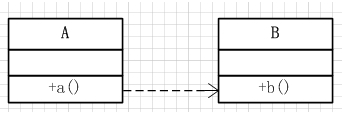

### Java调用和回调总结(2)

---
##### 调用的种类
调用有3种, **普通调用**(同步调用), **异步调用**, **异步回调**.


##### 三种调用的特点
**普通调用**:  也叫做**同步调用 **, 最常见的调用, **会造成阻塞**.


**异步调用** : 异步调用, **解决了同步调用阻塞的问题**, *但是没有返回的结果*.


**异步回调** : 异步回调, **解决了阻塞**, **还可以返回结果**.


三者递进的关系从弱到强的如`普通调用< 异步调用 < 异步回调`, 三者之间最重要的区别其实就只有两点,1:**这个调用是不是会造成主线程的阻塞**, 2: **我们调用的时候, 可不可以返回执行的结果**. 很明显,普通调用, 是会造成阻塞, 但是执行完毕之后, 我们可以立马就获得执行的结果! 但是由于有很多任务的执行时间是非常长的, 这样就会阻塞我们主线程的任务, 所以就导致**异步调用**的出现, 异步调用和同步调用区别就是, 同步调用阻塞,但是可以获得这个执行的结果, **异步调用不会阻塞, 但是无法得知这个执行的结果**! 那么如何解决无法得知任务执行结果的问题呢? 那就是需要在执行的时候, 执行完了之后, 直接通知主线程, 通知主线程, 那就是要使用主线程所在的类的对象, 然后修改其表示执行结果的字段或者属性, 或者执行某个方法让外界得知, 就表示执行的结果已经被外界得知了.


##### 同步和异步怎么解决？
同步会阻塞主线程, 因为我们执行的过程是线性, 线性是因为没有其他的执行线程,  只有一条, 因为同一个时间只有一条任务执行, 是独占的,  所以任务只能阻塞,  等这个任务执行完了才能去执行另一个任务! 
异步呢? 异步不会阻塞, 就是因为它突破了只有一个线程的限制, 所以要异步, 就要创建多个线程,  那么在java 里面, 就创建多个Thread, 这样就可以实现异步了!


##### 回调怎么理解?
不管是同步还是异步调用, 都是A调用B单线的调用, 但是这样的话, 比如我们在A线程之中调用B, 那么我们就无法知道B执行的结果, 或者是要让A等待很久, 才能让两个任务完成. 那么我们就要双向调用, 而不是单向调用, 这样的话, 可以双方调用 ,就可以知道结果了, 回调的方式, 一般是通过Interface接口来实现的, 但是也可以通过Class来实现, 但是一般还是通过Interface来实现, 我们需要面向接口来编程.


##### 三种调用实例
###### 同步调用
Teacher类
```java
public class Teacher {
    private String name;

    private Student student;

    public String getName() {
        return name;
    }

    public void setName(String name) {
        this.name = name;
    }

    public Teacher() {
    }

    public Teacher(String name) {
        this.name = name;
    }

    public Student getStudent() {
        return student;
    }

    public void setStudent(Student student) {
        this.student = student;
    }

    // 教师给学生布置作业，然后学生做作业
    // public void assignHomework(Student s) throws InterruptedException {
    public void assignHomework() throws InterruptedException {
        student.doHomework();
        // 表示普通的调用，会阻塞主线程
        System.out.println("老师" + this.getName() + "我要去逛街了!");
    }
}
```
Student类
```java
public class Student {
    private String name;
    private int id;

    public String getName() {
        return name;
    }

    public void setName(String name) {
        this.name = name;
    }

    public int getId() {
        return id;
    }

    public void setId(int id) {
        this.id = id;
    }

    public Student() {
    }

    public Student(String name, int id) {
        this.name = name;
        this.id = id;
    }

    public void doHomework() throws InterruptedException {
        System.out.println("我是" + this.getName() + ", 正在写我的家庭作业!");
        Thread.currentThread().sleep(5000);
        System.out.println("我写完了!");
    }
}
```
HomeworkTest类
```java
public class HomeworkTest {
    public static void main(String[] args) throws InterruptedException {
        Student student = new Student("张三", 1);
        Teacher teacher = new Teacher("小小仙女");
        teacher.setStudent(student);
        teacher.assignHomework();
    }
}
```

###### 异步调用
EnglishTeacher类
```java
public class EnglishTeacher {
    private String name;
    private LittleStudent student;

    public EnglishTeacher() {
    }

    public EnglishTeacher(String name) {
        this.name = name;
    }

    public String getName() {
        return name;
    }

    public void setName(String name) {
        this.name = name;
    }

    public LittleStudent getStudent() {
        return student;
    }

    public void setStudent(LittleStudent student) {
        this.student = student;
    }

    /**
     * 布置作业
     */
    public void assignHomework() {
        System.out.println(student.getName() + "你去做你的作业, 现在立刻!");
        // 异步调用
        student.doHomework();
        System.out.println("哈哈, 因为我作为一个老师, 要去逛街了!");
    }
}
```
LittleStudent类
```java
public class LittleStudent {
    private String name;
    private int age;

    public LittleStudent() {
    }

    public LittleStudent(String name, int age) {
        this.name = name;
        this.age = age;
    }

    public String getName() {
        return name;
    }

    public void setName(String name) {
        this.name = name;
    }

    public int getAge() {
        return age;
    }

    public void setAge(int age) {
        this.age = age;
    }

    // 异步调用的关键, 可以防止阻塞发生, 在需要调用的这个方法之中, 新开一个线程, 就可以防止主线程阻塞了
    public void doHomework() {
        Thread t = new Thread(new Runnable() {
            @Override
            public void run() {
                System.out.println(getName() + "我正在做我的工作");
                try {
                    Thread.currentThread().sleep(5000);
                } catch (InterruptedException e) {
                    e.printStackTrace();
                }
                // 但是此处没有说明做事情的时间, 没有回调的话, 调用者就不就知道任务到底完成了没有!
            }
        });
        t.start();
    }
}
```
EnglishHomeworkTest类
```java
public class EnglishHomeworkTest {
    public static void main(String[] args) {
        EnglishTeacher teacher = new EnglishTeacher("小仙女儿");
        LittleStudent student = new LittleStudent("王二麻子", 7);
        teacher.setStudent(student);
        // 调用
        teacher.assignHomework();
    }
}
```

###### 异步回调
1.使用类的方式实现
Boss类
```java
public class Boss {
    private String name;
    private Employee employee;

    public Boss() {
    }

    public Boss(String name) {
        this.name = name;
    }

    public String getName() {
        return name;
    }

    public void setName(String name) {
        this.name = name;
    }

    public Employee getEmployee() {
        return employee;
    }

    public void setEmployee(Employee employee) {
        this.employee = employee;
    }

    public void assignTask() {
        System.out.println(this.getName() + ", 作为老板, 我要去做个保健了, 你去干活!");
        // 让员工去干活
        employee.doTask();
        System.out.println(this.getName() + ", 作为老板, 我做保健了, 我回来了!");
    }

    public void getTaskResult() {
        System.out.println("完成了任务!");
    }
}
```
Employee类
```java
public class Employee {
    private String name;
    private Boss boss;

    public Employee() {
    }

    public Employee(String name, Boss boss) {
        this.name = name;
        this.boss = boss;
    }

    public String getName() {
        return name;
    }

    public void setName(String name) {
        this.name = name;
    }

    public Boss getBoss() {
        return boss;
    }

    public void setBoss(Boss boss) {
        this.boss = boss;
    }

    // 异步调用
    public void doTask() {
        // 开一个新的线程, 避免阻塞
        Runnable r = new Runnable() {
            @Override
            public void run() {
                // 做具体的业务
                long startTime = System.currentTimeMillis();
                try {
                    System.out.println("我是" + getName() + ", 老板啊! 我在玩命干活中!!!");
                    Thread.currentThread().sleep(5000);
                } catch (InterruptedException e) {
                    e.printStackTrace();
                }
                long endTime = System.currentTimeMillis();
                long costTime = endTime - startTime;
                System.out.println("这个结果是我自己知道的, 但是我不会给老板说! 实际上我花了" + costTime / 1000 + "ms");

                // 回调, 由此可以给出结果!
                boss.getTaskResult();
            }
        };
        new Thread(r).start();
    }
}
```
TaskTest类
```java
public class TaskTest {
    public static void main(String[] args) {
        Boss boss = new Boss("大裤衩");
        Employee employee = new Employee("王二", boss);
        boss.setEmployee(employee);
        boss.assignTask();
        // employee.doTask();
    }
}
```

2.**使用接口的方式实现, 推荐**
BossCallback事件接口
```java
interface BossCallback {
    // doEvent, 这就是一个回调通知的方法
    public void doEvent();
}
```
FoxBoss类
```java
public class FoxBoss implements BossCallback {
    private String name;
    private FoxEmployee foxEmployee;

    public FoxBoss() {
    }

    public FoxBoss(String name) {
        this.name = name;
    }

    public String getName() {
        return name;
    }

    public void setName(String name) {
        this.name = name;
    }

    public FoxEmployee getFoxEmployee() {
        return foxEmployee;
    }

    public void setFoxEmployee(FoxEmployee foxEmployee) {
        this.foxEmployee = foxEmployee;
    }

    public void assignTask() {
        System.out.println(this.getName() + ", 作为老板, 我要去做个保健了, 你去干活!");
        // 让员工去干活
        foxEmployee.doTask();
        System.out.println(this.getName() + ", 作为老板, 我做保健了, 我回来了!");
    }

    @Override
    public void doEvent() {
        System.out.println("打电话给老板，告知已经完成工作了");
    }
}
```
FoxEmployee类
```java
public class FoxEmployee {
    private String name;
    private BossCallback bossCallBack;

    public FoxEmployee() {
    }

    public FoxEmployee(String name, BossCallback bossCallBack) {
        this.name = name;
        this.bossCallBack = bossCallBack;
    }

    public String getName() {
        return name;
    }

    public void setName(String name) {
        this.name = name;
    }

    public BossCallback getBossCallback() {
        return bossCallBack;
    }

    public void setBossCallback(BossCallback bossCallBack) {
        this.bossCallBack = bossCallBack;
    }

    // 异步调用
    public void doTask() {
        Runnable r = new Runnable() {
            @Override
            public void run() {
                // 做具体的业务
                long startTime = System.currentTimeMillis();
                try {
                    System.out.println("我是" + getName() + ", 老板啊! 我在玩命干活中!!!");
                    Thread.currentThread().sleep(8000);
                } catch (InterruptedException e) {
                    e.printStackTrace();
                }
                long endTime = System.currentTimeMillis();
                long costTime = endTime - startTime;
                System.out.println("这个结果是我自己知道的, 但是我不会给老板说! 实际上我花了" + costTime / 1000 + "ms");

                // 回调, 由此可以给出结果!
                bossCallBack.doEvent();
            }
        };
        new Thread(r).start();
    }
}
```
FoxTaskTest类
```java
public class FoxTaskTest {
    public static void main(String[] args) {
        FoxBoss boss = new FoxBoss("大裤衩");
        FoxEmployee employee = new FoxEmployee("王二", boss);
        boss.setFoxEmployee(employee);
        boss.assignTask();
    }
}
```


---
ref:
1.[java回调函数，看完就懂](https://www.cnblogs.com/yangmin86/p/7090882.html),   2.[Java接口回调机制详解](https://m.imooc.com/mip/article/42031),   3.[Java回调机制解析](https://blog.csdn.net/bjyfb/article/details/10462555),   4.[异步调用的理解](https://blog.csdn.net/u014571011/article/details/83097546),   5.[Java回调机制总结](https://www.cnblogs.com/prayjourney/p/9667835.html)