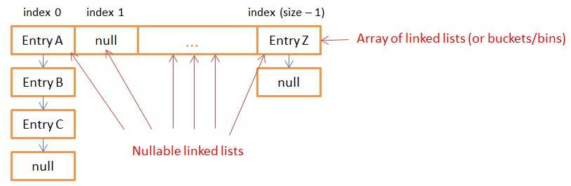
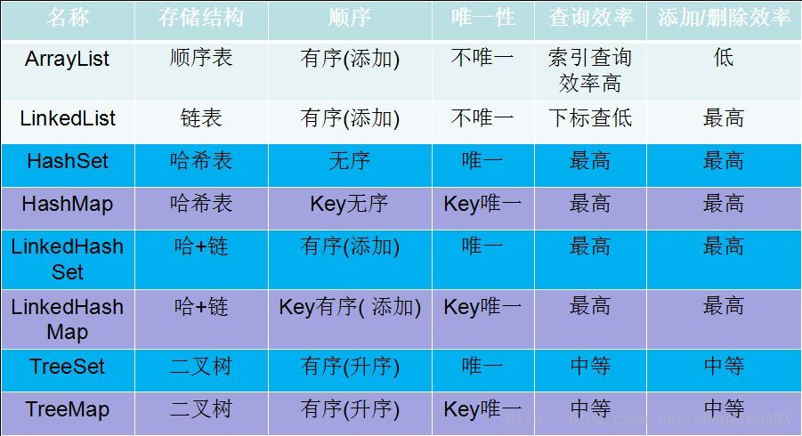

### HashMap深入解析

***

##### 什么是哈希表
在讨论哈希表之前，我们先大概了解下其他数据结构在新增，查找等基础操作执行性能
**数组**：采用一段连续的存储单元来存储数据。对于指定下标的查找，时间复杂度为O(1)；通过给定值进行查找，需要遍历数组，逐一比对给定关键字和数组元素，时间复杂度为O(n)，当然，对于有序数组，则可采用二分查找，插值查找，斐波那契查找等方式，可将查找复杂度提高为O(logn)；对于一般的插入删除操作，涉及到数组元素的移动，其平均复杂度也为O(n)
**线性链表**：对于链表的新增，删除等操作（在找到指定操作位置后），仅需处理结点间的引用即可，时间复杂度为O(1)，而查找操作需要遍历链表逐一进行比对，复杂度为O(n)
**二叉树**：对一棵相对平衡的有序二叉树，对其进行插入，查找，删除等操作，平均复杂度均为O(logn)。
**哈希表**：相比上述几种数据结构，在哈希表中进行添加，删除，查找等操作，性能十分之高，不考虑哈希冲突的情况下，仅需一次定位即可完成，时间复杂度为O(1)，接下来我们就来看看哈希表是如何实现达到惊艳的常数阶O(1)的。

我们知道，数据结构的物理存储结构只有两种：**顺序存储结构**和**链式存储结构**（像栈，队列，树，图等是从逻辑结构去抽象的，映射到内存中，也这两种物理组织形式），而在上面我们提到过，在数组中根据下标查找某个元素，一次定位就可以达到，哈希表利用了这种特性，**哈希表的主干就是数组**。比如我们要新增或查找某个元素，我们通过把当前元素的关键字 通过某个函数映射到数组中的某个位置，通过数组下标一次定位就可完成操作。
```html　　　　
　存储位置 = f(关键字)
```
其中，这个函数f一般称为**哈希函数**，这个函数的设计好坏会直接影响到哈希表的优劣。举个例子，比如我们要在哈希表中执行插入操作：
　　
查找操作同理，先通过哈希函数计算出实际存储地址，然后从数组中对应地址取出即可

**哈希冲突**
然而万事无完美，如果两个不同的元素，通过哈希函数得出的实际存储地址相同怎么办？也就是说，当我们对某个元素进行哈希运算，得到一个存储地址，然后要进行插入的时候，发现已经被其他元素占用了，其实这就是所谓的**哈希冲突**，也叫哈希碰撞。前面我们提到过，哈希函数的设计至关重要，好的哈希函数会尽可能地保证 **计算简单**和**散列地址分布均匀,**但是，我们需要清楚的是，数组是一块连续的固定长度的内存空间，再好的哈希函数也不能保证得到的存储地址绝对不发生冲突。那么哈希冲突如何解决呢？哈希冲突的解决方案有多种:开放定址法（发生冲突，继续寻找下一块未被占用的存储地址），再散列函数法，链地址法，而HashMap即是采用了链地址法，也就是**数组+链表**的方式


##### 内部存储结构

```java
public class HashMap<K,V>
    extends AbstractMap<K,V>
implements Map<K,V>, Cloneable, Serializable
```

HashMap基于哈希表的 Map 接口的实现。此实现提供所有可选的映射操作，并允许使用 null 值和 null 键。（除了非同步和允许使用 null 之外，HashMap 类与 Hashtable 大致相同。）此类不保证映射的顺序，特别是它不保证该顺序恒久不变。

此实现假定哈希函数将元素适当地分布在各个桶（数组元素）之间，可为基本操作（get 和 put）提供稳定的性能。迭代 collection 视图所需的时间与 HashMap 实例的“容量”（桶的数量）及其大小（键-值映射关系数）成比例。所以，如果迭代性能很重要，则不要将初始容量设置得太高（或将负载因子设置得太低）。

HashMap 的实例有两个参数影响其性能：初始容量和负载因子。容量是哈希表中桶的数量，初始容量只是哈希表在创建时的容量。负载因子是哈希表在其容量自动增加之前可以达到多满的一种尺度。当哈希表中的条目数超出了加载因子与当前容量的乘积时，则要对该哈希表进行 rehash 操作（即重建内部数据结构），从而哈希表将具有大约两倍的桶数。

通常，默认加载因子 (.75) 在时间和空间成本上寻求一种折衷。加载因子过高虽然减少了空间开销，但同时也增加了查询成本（在大多数HashMap 类的操作中，包括get 和put 操作，都反映了这一点）。在设置初始容量时应该考虑到映射中所需的条目数及其加载因子，以便最大限度地减少rehash 操作次数。如果初始容量大于最大条目数除以加载因子，则不会发生rehash 操作。

如果很多映射关系要存储在 HashMap 实例中，则相对于按需执行自动的 rehash 操作以增大表的容量来说，使用足够大的初始容量创建它将使得映射关系能更有效地存储。

注意，此实现不是同步的。如果多个线程同时访问一个哈希映射，而其中至少一个线程从结构上修改了该映射，则它必须保持外部同步。（结构上的修改是指添加或删除一个或多个映射关系的任何操作；仅改变与实例已经包含的键关联的值不是结构上的修改。）这一般通过对自然封装该映射的对象进行同步操作来完成。如果不存在这样的对象，则应该使用 Collections.synchronizedMap 方法来“包装”该映射。最好在创建时完成这一操作，以防止对映射进行意外的非同步访问，如下所示：

Map m = Collections.synchronizedMap(new HashMap(...));

由所有此类的“collection 视图方法”所返回的迭代器都是快速失败的：在迭代器创建之后，如果从结构上对映射进行修改，除非通过迭代器本身的remove 方法，其他任何时间任何方式的修改，迭代器都将抛出 ConcurrentModificationException。因此，面对并发的修改，迭代器很快就会完全失败，而不会在将来不确定的时间发生任意不确定行为的风险。

注意，迭代器的快速失败行为不能得到保证，一般来说，存在非同步的并发修改时，不可能作出任何坚决的保证。快速失败迭代器尽最大努力抛出 ConcurrentModificationException。因此，编写依赖于此异常的程序的做法是错误的，正确做法是：迭代器的快速失败行为应该仅用于检测程序错误。

> ```java
> public class HashMap<K,V>
>    extends AbstractMap<K,V>
> implements Map<K,V>, Cloneable, Serializable
> ```
>
> Hash table based implementation of the Map interface. This implementation provides all of the optional map operations, and permits null values and the null key. (The HashMap class is roughly equivalent to Hashtable, except that it is unsynchronized and permits nulls.) This class makes no guarantees as to the order of the map; in particular, it does not guarantee that the order will remain constant over time.
> This implementation provides constant-time performance for the basic operations (get and put), assuming the hash function disperses the elements properly among the buckets. Iteration over collection views requires time proportional to the "capacity" of the HashMap instance (the number of buckets) plus its size (the number of key-value mappings). Thus, it's very important not to set the initial capacity too high (or the load factor too low) if iteration performance is important.

> An instance of HashMap has two parameters that affect its performance: initial capacity and load factor. The capacity is the number of buckets in the hash table, and the initial capacity is simply the capacity at the time the hash table is created. The load factor is a measure of how full the hash table is allowed to get before its capacity is automatically increased. When the number of entries in the hash table exceeds the product of the load factor and the current capacity, the hash table is rehashed (that is, internal data structures are rebuilt) so that the hash table has approximately twice the number of buckets.
> As a general rule, the default load factor (.75) offers a good tradeoff between time and space costs. Higher values decrease the space overhead but increase the lookup cost (reflected in most of the operations of the HashMap class, including get and put). The expected number of entries in the map and its load factor should be taken into account when setting its initial capacity, so as to minimize the number of rehash operations. If the initial capacity is greater than the maximum number of entries divided by the load factor, no rehash operations will ever occur.
> If many mappings are to be stored in a HashMap instance, creating it with a sufficiently large capacity will allow the mappings to be stored more efficiently than letting it perform automatic rehashing as needed to grow the table. Note that using many keys with the same hashCode() is a sure way to slow down performance of any hash table. To ameliorate impact, when keys are Comparable, this class may use comparison order among keys to help break ties.
> Note that this implementation is not synchronized. If multiple threads access a hash map concurrently, and at least one of the threads modifies the map structurally, it must be synchronized externally. (A structural modification is any operation that adds or deletes one or more mappings; merely changing the value associated with a key that an instance already contains is not a structural modification.) This is typically accomplished by synchronizing on some object that naturally encapsulates the map. If no such object exists, the map should be "wrapped" using the Collections.synchronizedMap method. This is best done at creation time, to prevent accidental unsynchronized access to the map:
>   Map m = Collections.synchronizedMap(new HashMap(...));
> The iterators returned by all of this class's "collection view methods" are fail-fast: if the map is structurally modified at any time after the iterator is created, in any way except through the iterator's own remove method, the iterator will throw a ConcurrentModificationException. Thus, in the face of concurrent modification, the iterator fails quickly and cleanly, rather than risking arbitrary, non-deterministic behavior at an undetermined time in the future.
> Note that the fail-fast behavior of an iterator cannot be guaranteed as it is, generally speaking, impossible to make any hard guarantees in the presence of unsynchronized concurrent modification. Fail-fast iterators throw ConcurrentModificationException on a best-effort basis. Therefore, it would be wrong to write a program that depended on this exception for its correctness: the fail-fast behavior of iterators should be used only to detect bugs.
> This class is a member of the Java Collections Framework.

HashMap 类实现了`Map<k,v>`接口，这个接口的基本主要方法有：

- `V put(K key, V value)`
- `V get(Object key)`
- `V remove(Object key)`
- `Boolean containsKey(Object key)`

**HashMap使用了内部类`Entry<k,v>`来存储数据，这个类是一个带有两个额外数据的简单 键-值对 结构**：

- 一个是另一个`Entry<k,v>`的引用，这样HashMap可以像单独的链表一样存储数据
- 一个`hash`值，代表了key的哈希值，避免了HashMap每次需要的时候再来计算

下面是Java7里Entry的部分实现：

```java
static class Entry<K,V> implements Map.Entry<K,V> {
        final K key;
        V value;
        Entry<K,V> next;
        int hash;
…
}
```

**HashMap存储数据到多个单独的entry链表里, 所有的链表都登记到一个Entry数组里(`Entry<K,V>[] array`)**, **并且这个内部数组默认容量是16**.下面的图片展示了一个HashMap实例的内部存储, **一个可为null的Entry数组, 每一个Entry都可以链接到另一个Entry来形成一个链表**：



**所有具有相同哈希值的key都会放到同一个链表里，具有不同哈希值的key最终也有可能在同一个链表里**.

当一个使用者调用 `put(K key, V value)`或者`get(Object key)`这些方法时，会先计算这个Entry应该存放的链表在内部数组中的索引(index)，然后方法会迭代整个链表来寻找具有相同key的Entry(使用key的 `equals()`方法)

`get()`方法, 会返回这个Entry关联的value值(如果Entry存在)
`put(K key, V value)`方法, 如果Entry存在则重置value值, 如果不存在, 则以key, value参数构造一个Entry并插入到链表的头部.

获取链表在数组内的索引通过三个步骤确定: 

- 首先获取Key的哈希值
- 对哈希值再次进行哈希运算，避免出现一个很差的哈希算法，把所有的数据放到内部数组的同一个链表里
- 对再次哈希的哈希值进行数组长度(最小为1)的位掩码运算,这个运算保证生成的索引不会比数组的长度大，你可以把它当成一个优化过的取模运算

下面是Java7 和 Java8处理索引的源代码: 

```java
// the "rehash" function in JAVA 7 that takes the hashcode of the key
static int hash(int h) {
    h ^= (h >>> 20) ^ (h >>> 12);
    return h ^ (h >>> 7) ^ (h >>> 4);
}
// the "rehash" function in JAVA 8 that directly takes the key
static final int hash(Object key) {
    int h;
    return (key == null) ? 0 : (h = key.hashCode()) ^ (h >>> 16);
    }
// the function that returns the index from the rehashed hash
static int indexFor(int h, int length) {
    return h & (length-1);
}1234567891011121314
```

**为了更高效的运作, 内部数组的大小必须是2的指数大小**, 想象一下数组大小是17, 掩码值就是16(size-1), 16的二进制表示是 `0…010000`, 那么对于任何哈希值H通过位运算`H AND 16`得到的索引就只会是16或者0, 这意味着17大小的链表数组只会使用到两个: 索引为0的和索引为16的, 非常浪费. 但是, 如果你取2的指数大小例如16, 位运算是 `H AND 15`, 15的二进制表示是 `0…001111`, 那么取索引的运算就会输出0~15之间的值, 大小16的数据就能完全使用到. 举例:

- 如果`H = 952` 二进制表示为 0..0111011 **1000**, 相关的索引就是 `0…01000 = 8`
- 如果`H = 1576` 二进制表示为 0..01100010 **1000**, 相关的索引就是 `0…0 1000 = 8`
- 如果`H = 12356146` 二进制表示为 010111100100010100011 **0010**， 相关的索引就是 `0…00010 = 2`
- 如果`H = 59843` 二进制表示为 0111010011100 **0011**， 相关的索引就是 `0…00011 = 3`

这就是为什么数组的大小必须是2的指数大小, 这个机制对开发人员是透明的, 如果选择了一个37大小的HashMap, 那么Map会自动选择37之后的一个2的指数大小(64)来做为内部数组的容量.


##### HashMap实现原理
###### Entry数组
> 关于Entry数组的理解
> int数组之中的值,也全都是int. 所以Map.Entry数组之中的值, 也全都是Map.Entry类型的值, 桶用来索引(找到hashcode)这个作用是用数组来完成的,而这个进入到比如Map.Entry[1]位置的Map.Entry,他不是一个单纯的数字或者值, 而是一个可以继续索引其他值的"值+索引",是一个复合的值,可以表示值和索引,而这个值,是key+value,这在其定义之中体现了出来.

**HashMap的主干是一个Entry数组. Entry是HashMap的基本组成单元, 每一个Entry包含一个key-value键值对**.

```java
//HashMap的主干数组，可以看到就是一个Entry数组，初始值为空数组{}，主干数组的长度一定是2的次幂，至于为什么这么做，后面会有详细分析。
transient Entry<K,V>[] table = (Entry<K,V>[]) EMPTY_TABLE;
```

 Entry是HashMap中的一个静态内部类. 代码如下

```java
static class Entry<K,V> implements Map.Entry<K,V> {
    final K key;
    V value;
    Entry<K,V> next;//存储指向下一个Entry的引用，单链表结构
    int hash;//对key的hashcode值进行hash运算后得到的值，存储在Entry，避免重复计算

    /**
    * Creates new entry.
    */
    Entry(int h, K k, V v, Entry<K,V> n) {
    value = v;
    next = n;
    key = k;
    hash = h;
} 
```

 所以, HashMap的整体结构如下

　　

简单来说:**HashMap由数组+链表组成的, 数组是HashMap的主体, 链表则是主要为了解决哈希冲突而存在的, 如果定位到的数组位置不含链表(当前entry的next指向null), 那么对于查找, 添加等操作很快, 仅需一次寻址即可; 如果定位到的数组包含链表, 对于添加操作, 其时间复杂度为O(n), 首先遍历链表, 存在即覆盖, 否则新增; 对于查找操作来讲, 仍需遍历链表, 然后通过key对象的equals方法逐一比对查找. 所以, 性能考虑, HashMap中的链表出现越少, 性能才会越好**. 

###### 其他几个重要字段

```java
//实际存储的key-value键值对的个数
transient int size;
//阈值，当table == {}时，该值为初始容量（初始容量默认为16）；当table被填充了，也就是为table分配内存空间后，threshold一般为 capacity*loadFactory。HashMap在进行扩容时需要参考threshold，后面会详细谈到
int threshold;
//负载因子，代表了table的填充度有多少，默认是0.75
final float loadFactor;
//用于快速失败，由于HashMap非线程安全，在对HashMap进行迭代时，如果期间其他线程的参与导致HashMap的结构发生变化了（比如put，remove等操作），需要抛出异常ConcurrentModificationException
transient int modCount;
```

HashMap有4个构造器, 其他构造器如果用户没有传入initialCapacity 和loadFactor这两个参数, 会使用默认值. **initialCapacity默认为16, loadFactory默认为0.75**. 我们看下其中一个

```java
public HashMap(int initialCapacity, float loadFactor) {
    //此处对传入的初始容量进行校验，最大不能超过MAXIMUM_CAPACITY = 1<<30(230)
    if (initialCapacity < 0)
        throw new IllegalArgumentException("Illegal initial capacity: " +
                                           initialCapacity);
    if (initialCapacity > MAXIMUM_CAPACITY)
        initialCapacity = MAXIMUM_CAPACITY;
    if (loadFactor <= 0 || Float.isNaN(loadFactor))
        throw new IllegalArgumentException("Illegal load factor: " +
                                           loadFactor);

    this.loadFactor = loadFactor;
    threshold = initialCapacity;

    init();//init方法在HashMap中没有实际实现，不过在其子类如 linkedHashMap中就会有对应实现
}
```

从上面这段代码我们可以看出, **在常规构造器中, 没有为数组table分配内存空间(有一个入参为指定Map的构造器例外), 而是在执行put操作的时候才真正构建table数组**. OK, 接下来我们来看看put操作的实现

```java
public V put(K key, V value) {
    /*如果table数组为空数组{}，进行数组填充（为table分配实际内存空间），入参为threshold，
         *此时threshold为initialCapacity 默认是1<<4(24=16)
         */
    if (table == EMPTY_TABLE) {
        inflateTable(threshold);
    }
    //如果key为null，存储位置为table[0]或table[0]的冲突链上
    if (key == null)
        return putForNullKey(value);
    int hash = hash(key);//对key的hashcode进一步计算，确保散列均匀
    int i = indexFor(hash, table.length);//获取在table中的实际位置
    for (Entry<K,V> e = table[i]; e != null; e = e.next) {
        //如果该对应数据已存在，执行覆盖操作。用新value替换旧value，并返回旧value
        Object k;
        if (e.hash == hash && ((k = e.key) == key || key.equals(k))) {
            V oldValue = e.value;
            e.value = value;
            e.recordAccess(this);
            return oldValue;
        }
    }
    modCount++;//保证并发访问时，若HashMap内部结构发生变化，快速响应失败
    addEntry(hash, key, value, i);//新增一个entry
    return null;
}    
```

 先来看看inflateTable这个方法

```java
private void inflateTable(int toSize) {
        int capacity = roundUpToPowerOf2(toSize);//capacity一定是2的次幂
        threshold = (int) Math.min(capacity * loadFactor, MAXIMUM_CAPACITY + 1);//此处为threshold赋值，取capacity*loadFactor和MAXIMUM_CAPACITY+1的最小值，capaticy一定不会超过MAXIMUM_CAPACITY，除非loadFactor大于1
        table = new Entry[capacity];
        initHashSeedAsNeeded(capacity);
    }
```

inflateTable这个方法用于为主干数组table在内存中分配存储空间, 通过roundUpToPowerOf2(toSize)可以确保capacity为大于或等于toSize的最接近toSize的二次幂, 比如toSize=13, 则capacity=16; to_size=16, capacity=16; to_size=17, capacity=32.**需要注意的是, map的size和capacity不是同一个概念, 一般而言capacity大于等于size**. roundUpToPowerOf2中的这段处理使得数组长度一定为2的次幂，Integer.highestOneBit是用来获取最左边的bit(其他bit位为0)所代表的数值.

```java
 private static int roundUpToPowerOf2(int number) {
        // assert number >= 0 : "number must be non-negative";
        return number >= MAXIMUM_CAPACITY
                ? MAXIMUM_CAPACITY
                : (number > 1) ? Integer.highestOneBit((number - 1) << 1) : 1;
    }
```

hash函数

```java
//这是一个神奇的函数，用了很多的异或，移位等运算，对key的hashcode进一步进行计算以及二进制位的调整等来保证最终获取的存储位置尽量分布均匀
final int hash(Object k) {
        int h = hashSeed;
        if (0 != h && k instanceof String) {
            return sun.misc.Hashing.stringHash32((String) k);
        }

        h ^= k.hashCode();

        h ^= (h >>> 20) ^ (h >>> 12);
        return h ^ (h >>> 7) ^ (h >>> 4);
    }
```

以上hash函数计算出的值，通过indexFor进一步处理来获取实际的存储位置

```java
/**
 * 返回数组下标
 */
 static int indexFor(int h, int length) {
 return h & (length-1);
 }
```

h&（length-1）保证获取的index一定在数组范围内，举个例子，默认容量16，length-1=15，h=18,转换成二进制计算为

```java
        1  0  0  1  0
    &   0  1  1  1  1
    __________________
        0  0  0  1  0    = 2
```

最终计算出的index=2. 有些版本的对于此处的计算会使用 取模运算, 也能保证index一定在数组范围内, 不过位运算对计算机来说, 性能更高一些(HashMap中有大量位运算). 所以最终存储位置的确定流程是这样的:


再来看看addEntry的实现: 

```java
void addEntry(int hash, K key, V value, int bucketIndex) {
        if ((size >= threshold) && (null != table[bucketIndex])) {
            resize(2 * table.length);//当size超过临界阈值threshold，并且即将发生哈希冲突时进行扩容
            hash = (null != key) ? hash(key) : 0;
            bucketIndex = indexFor(hash, table.length);
        }
        createEntry(hash, key, value, bucketIndex);
    }
```

通过以上代码能够得知, **当发生哈希冲突并且size大于阈值的时候, 需要进行数组扩容，扩容时, 需要新建一个长度为之前数组2倍的新的数组, 然后将当前的Entry数组中的元素全部传输过去, 扩容后的新数组长度为之前的2倍**, *所以扩容相对来说是个耗资源的操作*.


##### 为何HashMap的数组长度一定是2的次幂

我们来继续看上面提到的resize方法

```java
 void resize(int newCapacity) {
        Entry[] oldTable = table;
        int oldCapacity = oldTable.length;
        if (oldCapacity == MAXIMUM_CAPACITY) {
            threshold = Integer.MAX_VALUE;
            return;
        }

        Entry[] newTable = new Entry[newCapacity];
        transfer(newTable, initHashSeedAsNeeded(newCapacity));
        table = newTable;
        threshold = (int)Math.min(newCapacity * loadFactor, MAXIMUM_CAPACITY + 1);
    }
```

如果数组进行扩容, 数组长度发生变化, 而存储位置 index = h&(length-1), index也可能会发生变化, 需要重新计算index, 我们先来看看transfer这个方法

```java
void transfer(Entry[] newTable, boolean rehash) {
        int newCapacity = newTable.length;
　　　　　//for循环中的代码，逐个遍历链表，重新计算索引位置，将老数组数据复制到新数组中去(数组不存储实际数据, 所以仅仅是拷贝引用而已)
        for (Entry<K,V> e : table) {
            while(null != e) {
                Entry<K,V> next = e.next;
                if (rehash) {
                    e.hash = null == e.key ? 0 : hash(e.key);
                }
                int i = indexFor(e.hash, newCapacity);
　　　　　　　　　 //将当前entry的next链指向新的索引位置, newTable[i]有可能为空, 有可能也是个entry链,如果是entry链, 直接在链表头部插入.
                e.next = newTable[i];
                newTable[i] = e;
                e = next;
            }
        }
    }
```

这个方法**将老数组中的数据逐个链表地遍历, 扔到新的扩容后的数组中**, 我们的数组索引位置的计算是通过对key值的hashcode进行hash扰乱运算后, 再通过和 length-1进行位运算得到最终数组索引位置. hashMap的数组长度一定保持2的次幂，比如16的二进制表示为10000, 那么length-1就是15, 二进制为01111, 同理扩容后的数组长度为32, 二进制表示为100000, length-1为31, 二进制表示为011111.*从下图可以我们也能看到这样会保证低位全为1, 而扩容后只有一位差异, 也就是多出了最左位的1, 这样在通过 h&(length-1)的时候, 只要h对应的最左边的那一个差异位为0, 就能保证得到的新的数组索引和老数组索引一致(大大减少了之前已经散列良好的老数组的数据位置重新调换), 个人理解*. **保证为capacity为2的幂次方, 使得每次在扩容的时候位运算只是进行左移, 原先的不用去修改hashcode等不用去修改, 这样的话, 可以节省很多运算, 提高效率**.


还有, 数组长度保持2的次幂, length-1的低位都为, 会使得获得的数组索引index更加均匀, 比如:


我们看到, 上面的&运算, 高位是不会对结果产生影响的(hash函数采用各种位运算可能也是为了使得低位更加散列), 我们只关注低位bit, 如果低位全部为1, 那么对于h低位部分来说, 任何一位的变化都会对结果产生影响, 也就是说, 要得到index=21这个存储位置, h的低位只有这一种组合. 这也是数组长度设计为必须为2的次幂的原因.

如果不是2的次幂, 也就是低位不是全为1此时, 要使得index=21, h的低位部分不再具有唯一性了, 哈希冲突的几率会变的更大, 同时, index对应的这个bit位无论如何不会等于1了, 而对应的那些数组位置也就被白白浪费了.

get方法

```java
 public V get(Object key) {
　　　　 //如果key为null,则直接去table[0]处去检索即可。
        if (key == null)
            return getForNullKey();
        Entry<K,V> entry = getEntry(key);
        return null == entry ? null : entry.getValue();
 }
```

get方法通过key值返回对应value, 如果key为null, 直接去table[0]处检索. 我们再看一下getEntry这个方法

```java
final Entry<K,V> getEntry(Object key) {
            
        if (size == 0) {
            return null;
        }
        //通过key的hashcode值计算hash值
        int hash = (key == null) ? 0 : hash(key);
        //indexFor (hash&length-1) 获取最终数组索引，然后遍历链表，通过equals方法比对找出对应记录
        for (Entry<K,V> e = table[indexFor(hash, table.length)];
             e != null;
             e = e.next) {
            Object k;
            if (e.hash == hash && 
                ((k = e.key) == key || (key != null && key.equals(k))))
                return e;
        }
        return null;
    }    
```

可以看出, **get方法的实现相对简单, key(hashcode)-->hash-->indexFor-->最终索引位置**, 找到对应位置table[i], 再查看是否有链表, 遍历链表, 这个判断没必要, 仅通过equals判断就可以. 其实不然, 试想一下, 如果传入的key对象重写了equals方法却没有重写hashCode, 而恰巧此对象定位到这个数组位置, 如果仅仅用equals判断可能是相等的, 但其hashCode和当前对象不一致, 这种情况, 根据Object的hashCode的约定, 不能返回当前对象, 而应该返回null, 后面的例子会做出进一步解释.


##### 重写equals方法需同时重写hashCode方法

关于HashMap的源码分析就介绍到这儿了, 最后我们再聊聊老生常谈的一个问题, 各种资料上都会提到, **重写equals时也要同时覆盖hashcode**, 我们举个小例子来看看, 如果重写了equals而不重写hashcode会发生什么样的问题

```java
/**
 * Created by chengxiao on 2016/11/15.
 */
public class MyTest {
    private static class Person{
        int idCard;
        String name;

        public Person(int idCard, String name) {
            this.idCard = idCard;
            this.name = name;
        }
        @Override
        public boolean equals(Object o) {
            if (this == o) {
                return true;
            }
            if (o == null || getClass() != o.getClass()){
                return false;
            }
            Person person = (Person) o;
            //两个对象是否等值，通过idCard来确定
            return this.idCard == person.idCard;
        }

    }
    public static void main(String []args){
        HashMap<Person,String> map = new HashMap<Person, String>();
        Person person = new Person(1234,"乔峰");
        //put到hashmap中去
        map.put(person,"天龙八部");
        //get取出，从逻辑上讲应该能输出“天龙八部”
        System.out.println("结果:"+map.get(new Person(1234,"萧峰")));
    }
}
```

实际输出结果: 

```java
结果：null
```

如果我们已经对HashMap的原理有了一定了解, 这个结果就不难理解了. 尽管我们在进行get和put操作的时候, 使用的key从逻辑上讲是等值的(通过equals比较是相等的), 但由于没有重写hashCode方法, 所以put操作时, key(hashcode1)-->hash-->indexFor-->最终索引位置 , 而通过key取出value的时候 key(hashcode1)-->hash-->indexFor-->最终索引位置, **由于hashcode1不等于hashcode2, 导致没有定位到一个数组位置而返回逻辑上错误的值null**(也有可能碰巧定位到一个数组位置, 但是也会判断其entry的hash值是否相等, 上面get方法中有提到). 所以, 在重写equals的方法的时候, 必须注意重写hashCode方法, 同时还要保证通过equals判断相等的两个对象, 调用hashCode方法要返回同样的整数值. 而如果equals判断不相等的两个对象, 其hashCode可以相同(只不过会发生哈希冲突, 应尽量避免).


##### HashMap和Hashtable的联系和区别
实现原理相同, 功能相同, 底层都是哈希表结构, 查询速度快, 在很多情况下可以互用, 早期的版本一般都是安全的.
- HashMap和Hashtable都实现了Map接口, 但决定用哪一个之前先要弄清楚它们之间的分别. 主要的区别有: 线程安全性, 同步(synchronization), 以及速度. 

- HashMap几乎可以等价于Hashtable, 除了HashMap是非synchronized的, 并可以接受null(HashMap可以接受为null的键值(key)和值(value), 而Hashtable则不行).

- HashMap是非synchronized, 而Hashtable是synchronized, 这意味着Hashtable是线程安全的, 多个线程可以共享一个Hashtable; 而如果没有正确的同步的话, 多个线程是不能共享HashMap的. Java 5提供了ConcurrentHashMap, 它是HashTable的替代, 比HashTable的扩展性更好. 

- 另一个区别是HashMap的迭代器(Iterator)是fail-fast迭代器, 而Hashtable的enumerator迭代器不是fail-fast的. 所以当有其它线程改变了HashMap的结构(增加或者移除元素), 将会抛出ConcurrentModificationException, 但迭代器本身的remove()方法移除元素则不会抛出ConcurrentModificationException异常. 但这并不是一个一定发生的行为, 要看JVM. 这条同样也是Enumeration和Iterator的区别. 

- 由于Hashtable是线程安全的也是synchronized, 所以在单线程环境下它比HashMap要慢. 如果你不需要同步, 只需要单一线程, 那么使用HashMap性能要好过Hashtable. 

**HashMap不能保证随着时间的推移Map中的元素次序是不变的**


##### HashMap的特点
HashMap是map接口的子类, 是将键映射到值的对象, 其中键和值都是对象, 不是线程安全的, HashMap用hash表来存储map的键key是无序唯一，可以有一个为null 
- value无序不唯一，可以有对个null 

LinkedHashMap使用hash表存储map中的键，并且使用linked双向链表管理顺序
- 我们用的最多的是HashMap,在Map 中插入, 删除和定位元素, HashMap 是最好的选择. 如果需要输出的顺序和输入的相同, 那么用LinkedHashMap 可以实现, 它还可以按读取顺序来排列.
- HashMap是一个最常用的Map, 它根据键的hashCode值存储数据, 根据键可以直接获取它的值, 具有很快的访问速度. HashMap最多只允许一条记录的键为NULL, 允许多条记录的值为NULL. HashMap不支持线程同步, 即任一时刻可以有多个线程同时写HashMap, 可能会导致数据的不一致性. 
- 如果需要同步, 可以用Collections的synchronizedMap方法使HashMap具有同步的能力, LinkedHashMap保存了记录的插入顺序, 在用Iterator遍历LinkedHashMap时, 先得到的记录肯定是先插入的.

HashMap可以通过下面的语句进行同步,``Map m = Collections.synchronizeMap(hashMap);``


##### 几大常用集合的效率对比
 


ref:

1.[HashMap实现原理及源码分析](https://www.cnblogs.com/chengxiao/p/6059914.html),   2.[HashMap数据结构](https://www.cnblogs.com/rogerluo1986/p/5851300.html),   3.[HashMap在Java里是怎么工作的](https://blog.csdn.net/zzt46245/article/details/59575478),   4.[深入理解HashMap上篇](https://www.cnblogs.com/softidea/p/7261111.html),   5.[深入理解HashMap上篇](http://xujin.org/java/hm01/)