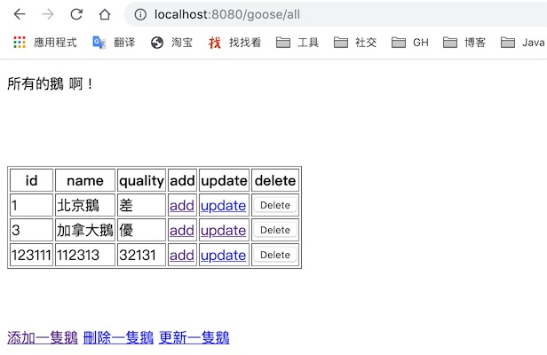

### SpringMVC的增删改查
---
首先, 我们创建一个SpringMVC的项目, 使用Maven管理整个项目, 整个依赖如下

```xml
<?xml version="1.0" encoding="UTF-8"?>
<project xmlns="http://maven.apache.org/POM/4.0.0" xmlns:xsi="http://www.w3.org/2001/XMLSchema-instance"
         xsi:schemaLocation="http://maven.apache.org/POM/4.0.0 http://maven.apache.org/xsd/maven-4.0.0.xsd">
    <parent>
        <!-- 修改直接父工程,从 improvement-java-skill 到 bucket-improvement -->
        <!--<artifactId>improvement-java-skill</artifactId>-->
        <artifactId>bucket-improvement</artifactId>
        <groupId>com.zgy.learn</groupId>
        <version>1.0-SNAPSHOT</version>
    </parent>
    <modelVersion>4.0.0</modelVersion>

    <!--<groupId>com.zgy.learn</groupId>-->
    <artifactId>mvccrud</artifactId>
    <packaging>war</packaging>

    <name>springmvc Maven Webapp</name>
    <!-- FIXME change it to the project's website -->
    <url>http://www.example.com</url>

    <properties>
        <project.build.sourceEncoding>UTF-8</project.build.sourceEncoding>
        <maven.compiler.source>1.8</maven.compiler.source>
        <maven.compiler.target>1.8</maven.compiler.target>
        <springframework.version>5.1.9.RELEASE</springframework.version>
    </properties>

    <dependencies>
        <dependency>
            <groupId>junit</groupId>
            <artifactId>junit</artifactId>
            <version>4.11</version>
            <scope>test</scope>
        </dependency>
        <!-- Spring -->
        <dependency>
            <groupId>org.springframework</groupId>
            <artifactId>spring-core</artifactId>
            <version>${springframework.version}</version>
        </dependency>
        <dependency>
            <groupId>org.springframework</groupId>
            <artifactId>spring-beans</artifactId>
            <version>${springframework.version}</version>
        </dependency>
        <dependency>
            <groupId>org.springframework</groupId>
            <artifactId>spring-context</artifactId>
            <version>${springframework.version}</version>
        </dependency>
        <dependency>
            <groupId>org.springframework</groupId>
            <artifactId>spring-web</artifactId>
            <version>${springframework.version}</version>
        </dependency>
        <dependency>
            <groupId>org.springframework</groupId>
            <artifactId>spring-webmvc</artifactId>
            <version>${springframework.version}</version>
        </dependency>
        <dependency>
            <groupId>org.springframework</groupId>
            <artifactId>spring-expression</artifactId>
            <version>${springframework.version}</version>
        </dependency>
      
        <dependency>
            <groupId>org.projectlombok</groupId>
            <artifactId>lombok</artifactId>
            <version>1.18.2</version>
        </dependency>

        <dependency>
            <groupId>org.slf4j</groupId>
            <artifactId>slf4j-api</artifactId>
            <version>1.7.10</version>
        </dependency>
        <dependency>
            <groupId>javax.servlet</groupId>
            <artifactId>servlet-api</artifactId>
            <version>2.5</version>
        <scope>provided</scope>
        </dependency>

        <!-- jstl的maven依赖, 不推荐使用 -->
        <dependency>
            <groupId>javax.servlet.jsp.jstl</groupId>
            <artifactId>jstl-api</artifactId>
            <version>1.2</version>
            <exclusions>
                <exclusion>
                    <groupId>javax.servlet</groupId>
                    <artifactId>servlet-api</artifactId>
                </exclusion>
                <exclusion>
                    <groupId>javax.servlet.jsp</groupId>
                    <artifactId>jsp-api</artifactId>
                </exclusion>
            </exclusions>
        </dependency>

        <dependency>
            <groupId>org.glassfish.web</groupId>
            <artifactId>jstl-impl</artifactId>
            <version>1.2</version>
            <exclusions>
                <exclusion>
                    <groupId>javax.servlet</groupId>
                    <artifactId>servlet-api</artifactId>
                </exclusion>
                <exclusion>
                    <groupId>javax.servlet.jsp</groupId>
                    <artifactId>jsp-api</artifactId>
                </exclusion>
                <exclusion>
                    <groupId>javax.servlet.jsp.jstl</groupId>
                    <artifactId>jstl-api</artifactId>
                </exclusion>
            </exclusions>
        </dependency>

        <!-- jackson 将pojo对象转换为json -->
        <dependency>
            <groupId>com.fasterxml.jackson.core</groupId>
            <artifactId>jackson-databind</artifactId>
            <version>2.9.5</version>
        </dependency>
        <dependency>
            <groupId>com.fasterxml.jackson.core</groupId>
            <artifactId>jackson-core</artifactId>
            <version>2.9.5</version>
        </dependency>
        <dependency>
            <groupId>com.fasterxml.jackson.core</groupId>
            <artifactId>jackson-annotations</artifactId>
            <version>2.9.5</version>
        </dependency>

        <!-- JSR303的数据校验器-->
        <dependency>
            <groupId>javax.validation</groupId>
            <artifactId>validation-api</artifactId>
            <version>2.0.1.Final</version>
        </dependency>
        <dependency>
            <groupId>org.hibernate.validator</groupId>
            <artifactId>hibernate-validator</artifactId>
            <version>6.0.14.Final</version>
        </dependency>

    </dependencies>

    <build>
        <finalName>springmvc</finalName>
        <pluginManagement><!-- lock down plugins versions to avoid using Maven defaults (may be moved to parent pom) -->
            <plugins>
                <plugin>
                    <artifactId>maven-clean-plugin</artifactId>
                    <version>3.1.0</version>
                </plugin>
                <!-- see http://maven.apache.org/ref/current/maven-core/default-bindings.html#Plugin_bindings_for_war_packaging -->
                <plugin>
                    <artifactId>maven-resources-plugin</artifactId>
                    <version>3.0.2</version>
                </plugin>
                <plugin>
                    <artifactId>maven-compiler-plugin</artifactId>
                    <version>3.8.0</version>
                </plugin>
                <plugin>
                    <artifactId>maven-surefire-plugin</artifactId>
                    <version>2.22.1</version>
                </plugin>
                <plugin>
                    <artifactId>maven-war-plugin</artifactId>
                    <version>3.2.2</version>
                </plugin>
                <plugin>
                    <artifactId>maven-install-plugin</artifactId>
                    <version>2.5.2</version>
                </plugin>
                <plugin>
                    <artifactId>maven-deploy-plugin</artifactId>
                    <version>2.8.2</version>
                </plugin>
            </plugins>
        </pluginManagement>
    </build>
</project>

```

接下来就需要配置web.xml
```xml
<?xml version="1.0" encoding="UTF-8"?>
<web-app xmlns:xsi="http://www.w3.org/2001/XMLSchema-instance" xmlns="http://java.sun.com/xml/ns/javaee"
         xsi:schemaLocation="http://java.sun.com/xml/ns/javaee http://java.sun.com/xml/ns/javaee/web-app_2_5.xsd"
         version="2.5" id="mvccrud">
    <display-name>mvccrud</display-name>
    <welcome-file-list>
        <welcome-file>index.html</welcome-file>
        <welcome-file>index.jsp</welcome-file>
    </welcome-file-list>

    <context-param>
        <param-name>appName</param-name>
        <param-value>mvccrud</param-value>
    </context-param>

    <!-- 把POST, 请求转化为DELETE, PUT请求 -->
    <!-- configure the HiddenHttpMethodFilter,convert the post method to put or delete -->
    <filter>
        <filter-name>HiddenHttpMethodFilter</filter-name>
        <filter-class>org.springframework.web.filter.HiddenHttpMethodFilter</filter-class>
    </filter>
    <filter-mapping>
        <filter-name>HiddenHttpMethodFilter</filter-name>
        <!-- 过滤所有的请求 -->
        <url-pattern>/*</url-pattern>
    </filter-mapping>

    <!-- 引入SpringMVC 的配置, 配置ispatcherServlet-->
    <servlet>
        <servlet-name>springDispatcherServlet</servlet-name>
        <servlet-class>org.springframework.web.servlet.DispatcherServlet</servlet-class>
        <!-- 配置DspatcherServlet的一个初始化参数, 配置springmvc配置文件的位置和名称-->
        <init-param>
            <param-name>contextConfigLocation</param-name>
            <param-value>classpath:mvccrud.xml</param-value>
        </init-param>
        <load-on-startup>1</load-on-startup>
    </servlet>

    <!-- Map all requests to the DispatcherServlet for handling -->
    <servlet-mapping>
        <servlet-name>springDispatcherServlet</servlet-name>
        <url-pattern>/</url-pattern>
    </servlet-mapping>

    <!-- 配置编码方式, 解决中文乱码的问题, 需要配置在所有的过滤器前面 -->
    <filter>
        <filter-name>CharsetEncodingFilter</filter-name>
        <filter-class>org.springframework.web.filter.CharacterEncodingFilter</filter-class>
        <init-param>
            <param-name>encoding</param-name>
            <param-value>utf-8</param-value>
        </init-param>
    </filter>
    <filter-mapping>
        <filter-name>CharsetEncodingFilter</filter-name>
        <url-pattern>/*</url-pattern>
    </filter-mapping>
</web-app>

```

然后我们再去创建springmvc的配置文件
```xml
<?xml version="1.0" encoding="UTF-8"?>
<beans xmlns="http://www.springframework.org/schema/beans"
       xmlns:xsi="http://www.w3.org/2001/XMLSchema-instance"
       xmlns:context="http://www.springframework.org/schema/context"
       xmlns:mvc="http://www.springframework.org/schema/mvc"
       xsi:schemaLocation="http://www.springframework.org/schema/beans http://www.springframework.org/schema/beans/spring-beans.xsd http://www.springframework.org/schema/context http://www.springframework.org/schema/context/spring-context.xsd http://www.springframework.org/schema/mvc http://www.springframework.org/schema/mvc/spring-mvc.xsd">
    <!-- 配置自动扫描的包 , 在spring mvc2之中扫描不到下面的包, 所以, 此处采用了挪动一个包的方式来完成基本的CRUD-->
    <!-- 在原来的spring mvc2之中, 准备采用java config 的方式来完成动基本的CRUD-->
    <context:component-scan base-package="com.zgy.learn"/>

    <!-- 配置视图解析器 -->
    <bean class="org.springframework.web.servlet.view.InternalResourceViewResolver">
        <property name="prefix" value="/WEB-INF/views/"/>
        <property name="suffix" value=".jsp"/>
    </bean>

    <!--
        default-servlet-handler 将在 SpringMVC 上下文中定义一个 DefaultServletHttpRequestHandler,
		它会对进入 DispatcherServlet 的请求进行筛查, 如果发现是没有经过映射的请求, 就将该请求交由 WEB 应用服务器默认的
		Servlet 处理. 如果不是静态资源的请求，才由 DispatcherServlet 继续处理

		一般 WEB 应用服务器默认的 Servlet 的名称都是 default.
		若所使用的 WEB 服务器的默认 Servlet 名称不是 default，则需要通过 default-servlet-name 属性显式指定
	-->

    <!-- 处理静态资源的请求 -->
    <!--静态资源访问  -->
    <mvc:default-servlet-handler/>
    <!--把符合/js/**匹配规则的请求,映射到目录/WEB-INF/js/下-->
    <!--
          /WEB-INF/js/是文件存放的地方,而我们的mapping,则是要把他映射到一个URL上面, 此处我们就映射到了:
          http://localhost:8080/js/jquery-1.9.1.min.js 这个URL上面, 如果/**的话, 那么就映射到
          http://localhost:8080/jquery-1.9.1.min.js 上面了
          配上mvcLresource ,方便自己使用, URL很快就可以知道!
     -->
    <mvc:resources mapping="/**" location="WEB-INF/js/"/>

    <!-- 开启注解模式, 外加数据的转化 -->
    <!-- 配置數據轉換器，配置數據校驗器, 不配置校驗器也可以，但是最好配上吧 -->
    <!--<mvc:annotation-driven conversion-service="conversionService"/>-->
    <mvc:annotation-driven conversion-service="conversionService" validator="hibernateValidator"/>

    <!-- 配置自定义类型转换器 -->
    <bean id="conversionService" class="org.springframework.context.support.ConversionServiceFactoryBean">
        <property name="converters">
            <set>
                <!--<bean class="com.zgy.util.DateConversionService"/>-->
                <ref bean="dateConversionService"/>
                <bean class="com.zgy.learn.crud.util.AnimalCoverter"/>
            </set>
        </property>
    </bean>

    <!-- 配置校验器， 使用Hibernate校驗器 -->
    <bean id="hibernateValidator" class="org.springframework.validation.beanvalidation.LocalValidatorFactoryBean">
        <property name="providerClass" value="org.hibernate.validator.HibernateValidator"/>
    </bean>

</beans>
```

准备好了我们的配置文件, 我们就开始写代码, 首先呢, 准备POJO文件, 代码如下:
```java
import lombok.AllArgsConstructor;
import lombok.Data;

@Data
@AllArgsConstructor
public class Goose {
    private Integer id;
    private String name;
    private String quality;

    public Goose() {
    }
}
```

接下来就写DAO文件, 我们此处不去直接和数据库交互, 而在里面固定写了几个数据, 直接写在代码之中.
```java
import com.zgy.learn.crud.entities.Goose;
import org.springframework.stereotype.Repository;

import java.util.Collection;
import java.util.HashMap;
import java.util.Map;

@Repository
public class GooseDao {
    static Map<Integer, Goose> gooses = new HashMap<>();
    private Integer INITID = 4;

    static {
        gooses.put(1, new Goose(1, "北京鵝", "差"));
        gooses.put(2, new Goose(2, "北海道鵝", "良"));
        gooses.put(3, new Goose(3, "加拿大鵝", "優"));
    }

    public Collection getGooses() {
        return gooses.values();
    }

    public Goose get(Integer id) {
        return gooses.get(id);
    }

    public int add(Goose goose) {
        gooses.put(INITID, goose);
        INITID++;
        return 1;
    }

    public int update(Integer id, Goose goose) {
        Goose old = gooses.get(id);
        gooses.replace(id, old, goose);
        return 1;
    }

    public int delete(Integer id) {
        gooses.remove(id);
        return 1;
    }
}
```

准备好了POJO和DAO代码, 由于我们的DEMO很小, 所以没有准备Service层, 直接在Controller之中调用即可. Controller如下
```java
import com.zgy.learn.crud.dao.GooseDao;
import com.zgy.learn.crud.entities.Goose;
import org.springframework.beans.factory.annotation.Autowired;
import org.springframework.stereotype.Controller;
import org.springframework.ui.ModelMap;
import org.springframework.web.bind.annotation.PathVariable;
import org.springframework.web.bind.annotation.RequestMapping;
import org.springframework.web.bind.annotation.RequestMethod;


@Controller
@RequestMapping(value = "goose")
public class GooseController {
    @Autowired
    GooseDao dao;

    @RequestMapping(value = "all", method = RequestMethod.GET)
    public String getAllMonkey(ModelMap modelMap) {
        modelMap.addAttribute("gooses", dao.getGooses());
        return "gooses";
    }

    /**
     * 跳轉到表單
     *
     * @return
     */
    @RequestMapping("add")
    public String addGoose() {
        return "addgoose";
    }

    /**
     * 真正添加一個鵝
     *
     * @param goose
     * @return
     */
    @RequestMapping(value = "add", method = RequestMethod.POST)
    public String addMonkey(Goose goose) {
        dao.add(goose);
        return "redirect:/goose/all";
    }

    /**
     * 删除一只鹅
     *
     * @param id
     * @return
     */
    @RequestMapping(value = "delete/{id}", method = RequestMethod.DELETE)
    public String deleteGoose(@PathVariable Integer id) {
        // id 不能修改
        dao.delete(id);
        return "redirect:/goose/all";
    }

    /**
     * 跳轉到更新頁面
     *
     * @param id
     * @param mp
     * @return
     */
    @RequestMapping(value = "update/{id}", method = RequestMethod.GET)
    public String updateGoose(@PathVariable Integer id, ModelMap mp) {
        // 為了回顯數據
        Goose goose = dao.get(id);
        mp.addAttribute("oldgoose", goose);
        return "updategoose";
    }


    /**
     * 真正更新數據
     *
     * @param id
     * @param goose
     * @return
     */
    @RequestMapping(value = "update", method = RequestMethod.PUT)
    public String updateGoose(Integer id, Goose goose) {
        // id 不能修改
        dao.update(id, goose);
        return "redirect:/goose/all";
    }

}
```

完成了我们的后端的代码, 这样的话, 前端的代码就需要推出来了, 我们在此处使用的是JSP作为我们的表现层技术, 其中使用了jstl, el表达式, 而没有使用Spring form等, 这样我们的前端页面, 就可以直接在浏览器之中展示, 往后面而讲, 比如我们使用themleaf的话, 就直接可以把模板在浏览器之中展示, 另外而言, **当我们去实现SpringMVC的增删改查的时候, 要搞清楚, 增加是需要两个页面, 一个是增加的链接, 一个是添加提交的form表单页面, 删除的话是不需要两个页面, 只需要一个页面即可,  修改的话也是需要两个页面, 点击修改的页面, 然后跳转到提交的form表单页面, 查询的话只是展示即可, 点击查询链接, 然后展示一个页面即可.**
下面就展示我们的前端展示页面, 首页呢? 如下
```jsp
<%@ page language="java" contentType="text/html;charset=UTF-8"%>
<head>
    <!-- Bootstrap CSS -->
    <link rel="stylesheet" href="https://stackpath.bootstrapcdn.com/bootstrap/4.3.1/css/bootstrap.min.css"
          integrity="sha384-ggOyR0iXCbMQv3Xipma34MD+dH/1fQ784/j6cY/iJTQUOhcWr7x9JvoRxT2MZw1T" crossorigin="anonymous">
    <!-- Optional JavaScript -->
    <title> 首页啊, Crud </title>
</head>
    <body>
        <h2 class="text-primary">H首页啊, Crud !</h2>
        <a href="emps" class="text-info">List all emps!</a>
        <br>

        <!-- 首頁鏈接 -->
        <a href="/goose/all" class="text-success">查看鹅!</a>
    </body>
</html>

```

我们点击以上的链接, 然后就进入了页面, 上面的链接是如下的:
```jsp
<%@page language="java" contentType="text/html; charset=UTF-8"
        pageEncoding="UTF-8" %>
<!-- 讓el表達式起作用 -->
<%@page isELIgnored="false" %>
<!-- 引入jsp标签库 -->
<%@taglib uri="http://java.sun.com/jsp/jstl/core" prefix="c" %>
<!DOCTYPE html PUBLIC "-//W3C//DTD HTML 4.01 Transitional//EN" "http://www.w3.org/TR/html4/loose.dtd">
<html>
    <head>
        <meta http-equiv="Content-Type" content="text/html; charset=UTF-8">
        <title>hello monkey</title>
    </head>
    <body>
        <%--https://jingyan.baidu.com/article/f0e83a257ccee422e5910101.html--%>
        <%--http://www.divcss5.com/wenji/w503.shtml --%>
        <p>所有的鵝 啊！</p>
        <br>
        <table class="goose" border="1">
            <c:if test="${gooses.size() ==0 }">
                沒有鹅!
            </c:if>
            <th>id</th>
            <th>name</th>
            <th>quality</th>
            <th>add</th>
            <th>update</th>
            <th>delete</th>
            <c:forEach var="goose" items="${gooses}">
                <tr>
                    <td>${goose.id}</td>
                    <td>${goose.name}</td>
                    <td>${goose.quality}</td>
                        <%--<td><a href="${pageContext.request.contextPath}/goose/add">add</a></td>--%>
                    <td><a href="${pageContext.request.contextPath}/goose/add">add</a></td>
                        <%--<td><a href="${pageContext.request.contextPath}/goose/update/${goose.id}">update</a></td>--%>
                    <td><a href="${pageContext.request.contextPath}/goose/update/${goose.id}">update</a></td>
                    <!-- 下面這種提供的是get方法，所以不行 -->
                        <%--<td><a href="${pageContext.request.contextPath}/goose/delete?id=${goose.id}">delete</a></td>--%>
                    <td>
                            <%--<form action="${pageContext.request.contextPath}/goose/delete/${goose.id}" method="post">--%>
                        <form action="${pageContext.request.contextPath}/goose/delete/${goose.id}" method="post">
                            <input type="hidden" name="_method" value="DELETE">
                            <input type="submit" value="Delete">
                        </form>
                    </td>
                </tr>
            </c:forEach>
        </table>
        <a href="/goose/add">添加一隻鵝</a>
        <!-- 這種方式需要使用ajax, 來首先取到我們點擊行的id, 然後拼接id, 後面再去執行-->
        <a href="/goose/delete?id=1" class="delete">刪除一隻鵝</a>
        <!-- 這種方式需要使用ajax, 來首先取到我們點擊行的id, 然後拼接id, 後面再去執行-->
        <a href="/goose/update?id=2" class="update">更新一隻鵝</a>
    </body>

</html>
```


从上述我们点击表格里面的add, 就跳转到了一个提交的页面, 页面的代码如下:

```jsp
<%@page language="java" contentType="text/html; charset=UTF-8"
        pageEncoding="UTF-8" %>
<!-- 讓el表達式起作用 -->
<%@page isELIgnored="false" %>
<!-- 引入jsp标签库 -->
<%@taglib uri="http://java.sun.com/jsp/jstl/core" prefix="c" %>
<!DOCTYPE html PUBLIC "-//W3C//DTD HTML 4.01 Transitional//EN" "http://www.w3.org/TR/html4/loose.dtd">
<html>
<head>
    <meta http-equiv="Content-Type" content="text/html; charset=UTF-8">
    <title>hello monkey</title>
</head>
<body>

<p>添加鵝</p>
<br>
<br>
<br>
<form action="/goose/add" method="post">
    <span>id:       </span><input type="text" name="id"><br>
    <span>name:     </span><input type="text" name="name"><br>
    <span>quality:   </span><input type="text" name="quality"><br>
    <input type="submit" value="提交創建一隻鵝">
</form>
  
</body>
</html>
```
展示如下:


添加的页面如上, 我们提交之后, 跳转到展示首页, 就会有增加到all页面之中, 展示如下


更新代码如下:
```jsp
<%@page language="java" contentType="text/html; charset=UTF-8"
        pageEncoding="UTF-8" %>
<!-- 讓el表達式起作用 -->
<%@page isELIgnored="false" %>
<!-- 引入jsp标签库 -->
<%@taglib uri="http://java.sun.com/jsp/jstl/core" prefix="c" %>
<!DOCTYPE html PUBLIC "-//W3C//DTD HTML 4.01 Transitional//EN" "http://www.w3.org/TR/html4/loose.dtd">
<html>
    <head>
        <meta http-equiv="Content-Type" content="text/html; charset=UTF-8">
        <title>hello monkey</title>
    </head>
    <body>
        <p>更新鹅</p>
        <form action="/goose/update" method="post">
            <!-- 方法的轉化 put轉換為post -->
            <input type="hidden" name="_method" value="PUT">
            <!-- 把id設置為隱藏域， 不去修改它 -->
            <input name="id" type="hidden" value="${oldgoose.id}">
            <span>name:     </span><input type="text" name="name" value="${oldgoose.name}"><br>
            <span>quality:   </span><input type="text" name="quality" value="${oldgoose.quality}"><br>
            <input type="submit" value="提交更新一隻鵝">
        </form>
    </body>

</html>
```

如下更新页面


而删除的时候, 就直接在all的页面, 点击删除就行了, 其他的不要使用


其中的重点, 有两个:

重点1: 一个是我们的使用rest风格的时候, http请求, 不支持put和delete, 所以我们就需要将其装换成post, 然后呢我们就要添加配置, 然后完成转换, 配置如下:

```html
    <!-- 把POST, 请求转化为DELETE, PUT请求 -->
    <!-- configure the HiddenHttpMethodFilter,convert the post method to put or delete -->
    <filter>
        <filter-name>HiddenHttpMethodFilter</filter-name>
        <filter-class>org.springframework.web.filter.HiddenHttpMethodFilter</filter-class>
    </filter>
    <filter-mapping>
        <filter-name>HiddenHttpMethodFilter</filter-name>
        <!-- 过滤所有的请求 -->
        <url-pattern>/*</url-pattern>
    </filter-mapping>
```

这个时候, 我们就要将其转换成一个delete或者是put请求, 这个是需要在前端页面之中的展示的, 配置如下:

```jsp
<form action="${pageContext.request.contextPath}/goose/delete/${goose.id}" method="post">
      <input type="hidden" name="_method" value="DELETE">
      <input type="submit" value="Delete">
</form>
```

按照上述的, 我们就把delete请求转换成了post, 在我们的Controller之中, 我们就要按照实际的put, post, delete, get, 完成请求, 如下

```java
    /**
     * 删除一只鹅
     *
     * @param id
     * @return
     */
    @RequestMapping(value = "delete/{id}", method = RequestMethod.DELETE)
    public String deleteGoose(@PathVariable Integer id) {
        // id 不能修改
        dao.delete(id);
        return "redirect:/goose/all";
    }
```

重点2:就是隐藏域, 以及请求链接的书写方式, 我们采用rest风格的时候, 需要使用到id, 这时候, 如果我们把地写在了table之外, 那如果要用到我们的ID, 就要使用js的异步请求, 然后就是ajax请求, 把HTTP的URL, 组装, 但是这样的方式目前对于只会后端的人不太友好, 所以把ID和链接, 写在了table之中, 这样就可以直接拿到链接, 如下:

```js
<%@page language="java" contentType="text/html; charset=UTF-8"
        pageEncoding="UTF-8" %>
<!-- 讓el表達式起作用 -->
<%@page isELIgnored="false" %>
<!-- 引入jsp标签库 -->
<%@taglib uri="http://java.sun.com/jsp/jstl/core" prefix="c" %>
<!DOCTYPE html PUBLIC "-//W3C//DTD HTML 4.01 Transitional//EN" "http://www.w3.org/TR/html4/loose.dtd">
<html>
    <head>
        <meta http-equiv="Content-Type" content="text/html; charset=UTF-8">
        <title>hello monkey</title>
    </head>
    <body>
        <%--https://jingyan.baidu.com/article/f0e83a257ccee422e5910101.html--%>
        <%--http://www.divcss5.com/wenji/w503.shtml --%>
        <p>所有的鵝 啊！</p>
        <br>
        <table class="goose" border="1">
            <c:if test="${gooses.size() ==0 }">
                沒有鹅!
            </c:if>
            <th>id</th>
            <th>name</th>
            <th>quality</th>
            <th>add</th>
            <th>update</th>
            <th>delete</th>
            <c:forEach var="goose" items="${gooses}">
                <tr>
                    <td>${goose.id}</td>
                    <td>${goose.name}</td>
                    <td>${goose.quality}</td>
                        <%--<td><a href="${pageContext.request.contextPath}/goose/add">add</a></td>--%>
                    <td><a href="${pageContext.request.contextPath}/goose/add">add</a></td>
                        <%--<td><a href="${pageContext.request.contextPath}/goose/update/${goose.id}">update</a></td>--%>
                    <td><a href="${pageContext.request.contextPath}/goose/update/${goose.id}">update</a></td>
                    <!-- 下面這種提供的是get方法，所以不行 -->
                        <%--<td><a href="${pageContext.request.contextPath}/goose/delete?id=${goose.id}">delete</a></td>--%>
                    <td>
                            <%--<form action="${pageContext.request.contextPath}/goose/delete/${goose.id}" method="post">--%>
                        <form action="${pageContext.request.contextPath}/goose/delete/${goose.id}" method="post">
                            <input type="hidden" name="_method" value="DELETE">
                            <input type="submit" value="Delete">
                        </form>
                    </td>
                </tr>

            </c:forEach>
        </table>
				<br>
        <a href="/goose/add">添加一隻鵝</a>
        <!-- 這種方式需要使用ajax, 來首先取到我們點擊行的id, 然後拼接id, 後面再去執行-->
        <a href="/goose/delete?id=1" class="delete">刪除一隻鵝</a>
        <!-- 這種方式需要使用ajax, 來首先取到我們點擊行的id, 然後拼接id, 後面再去執行-->
        <a href="/goose/update?id=2" class="update">更新一隻鵝</a>

    </body>

</html>
```

而隐藏域呢, 为了在更新的时候, 能够顺利**回显**, 这样就需要先拿到旧的数据, 但是我们的ID又不能去改变, 这样的话, 我们就要使用到隐藏域, 上述是给delete使用了隐藏域, 意义不大, 最应该的是update, 代码如下:

```java
<%@page language="java" contentType="text/html; charset=UTF-8"
        pageEncoding="UTF-8" %>
<!-- 讓el表達式起作用 -->
<%@page isELIgnored="false" %>
<!-- 引入jsp标签库 -->
<%@taglib uri="http://java.sun.com/jsp/jstl/core" prefix="c" %>
<!DOCTYPE html PUBLIC "-//W3C//DTD HTML 4.01 Transitional//EN" "http://www.w3.org/TR/html4/loose.dtd">
<html>
    <head>
        <meta http-equiv="Content-Type" content="text/html; charset=UTF-8">
        <title>hello monkey</title>
    </head>
    <body>

        <p>更新鹅</p>
        <br>
        <form action="/goose/update" method="post">
            <!-- 方法的轉化 put轉換為post -->
            <input type="hidden" name="_method" value="PUT">
            <!-- 把id設置為隱藏域， 不去修改它 -->
            <input name="id" type="hidden" value="${oldgoose.id}">
            <span>name:     </span><input type="text" name="name" value="${oldgoose.name}"><br>
            <span>quality:   </span><input type="text" name="quality" value="${oldgoose.quality}"><br>
            <input type="submit" value="提交更新一隻鵝">

        </form>
        <br>
    </body>

</html>
```

其他要注意的地方就是我们的table , form标签的使用, 隐藏域的使用, 这是要重点关注的, 此外也没有使用到Spring modelAttribute, 以及Spring form表单, 这样其实更加有利于表单的展示, 不依赖于相关的表现技术, 更加通用.

---
ref:
https://www.cnblogs.com/sonng/archive/2017/04/02/6658825.html
https://www.jianshu.com/p/b52db905f020
https://www.cnblogs.com/lvbinbin2yujie/p/10459303.html
https://blog.csdn.net/qq_44543508/article/details/100997134
https://blog.csdn.net/a67474506/article/details/46363795
https://www.cnblogs.com/sueyyyy/p/9630625.html
https://www.cnblogs.com/winner-0715/p/7440058.html
https://www.cnblogs.com/sunniest/p/4555801.html
https://blog.csdn.net/qq_40933428/article/details/86010194
https://www.cnblogs.com/passedbylove/p/10930665.html
https://www.cnblogs.com/han-1034683568/p/7569870.html
https://www.jianshu.com/p/9f00cf73cd8e
http://www.monkey1024.com/framework/1315
https://blog.csdn.net/zdp072/article/details/38691049
https://www.cnblogs.com/kebibuluan/p/8855057.html
https://blog.csdn.net/abc997995674/article/details/80437479
https://blog.csdn.net/u011489887/article/details/77498775
https://www.jb51.net/article/112733.htm
https://www.cnblogs.com/hellowhy/p/9752217.html
https://www.cnblogs.com/lone5wolf/p/10943869.html
https://www.cnblogs.com/sunniest/p/4555801.html
https://www.cnblogs.com/kebibuluan/p/8855057.html
https://www.jianshu.com/p/7e70e0b10d2f
https://www.jianshu.com/p/9f00cf73cd8e
http://www.monkey1024.com/framework/1315
https://blog.csdn.net/zdp072/article/details/38691049
https://www.cnblogs.com/JavaBlackHole/p/7381909.html
https://www.cnblogs.com/ggz19/p/5432346.html
https://www.cnblogs.com/lj95801/p/4951255.html
http://www.soong.site/drf/C01-IntroduceToDRF/IntroduceToREST.html
https://www.cnblogs.com/han-1034683568/p/7569870.html