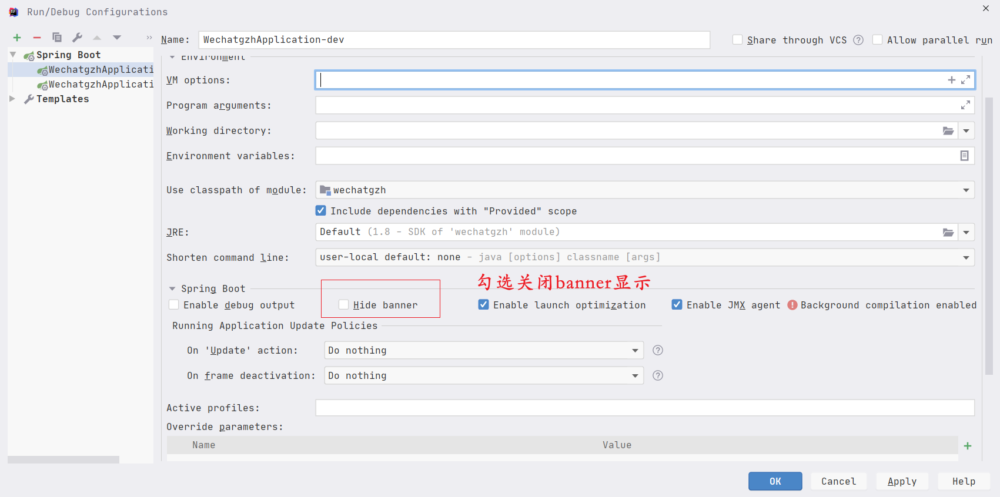

### SpringBoot的Banner设置

在SpringBoot之中，如果不去设置，就是默认的Banner，我们可以自己去设置Banner，需要先去生成Banner，然后再去填充相应的信息，最后改变设置它的颜色即可。


#### 生成步骤
1.生成Banner或者获取Banner
[http://patorjk.com/software/taag/#p=display&f=Graffiti&t=Type%20Something%20](http://patorjk.com/software/taag/#p=display&f=Graffiti&t=Type Something )，http://www.network-science.de/ascii/去生成，具体的字体，需要我们去选择，可以在第一个网站之中直接选择TestAll，然后就可以先看一下，然后确定你要的字体就行了。


也可以在https://www.bootschool.net/ascii-art/nature之中，选择别人画好的字符画，我们直接复制或者下载即可。


2.填充信息
我们可以看出，原生的Spring Boot是有版本号的，但是我们上述拷贝的，就没有，那么我们怎么获取呢，其实就注入即可。`:: Spring Boot :: (v${spring-boot.version})`，当Spring boot启动之后，我们就直到了版本的信息，然后通过`spring-boot.version`，使用字符串注入的方式就可以获取。值得一说的是，所有`applicaton.properties`里面的配置信息，我们都可以通过字符串注入的方式获取，可以根据我们的需要，来注入到banner之中，以供显示。下面的就自定义了一个url，还加入了端口信息。


```xml
                                   /\
                              /\  //\\
                       /\    //\\///\\\        /\
                      //\\  ///\////\\\\  /\  //\\
         /\          /  ^ \/^ ^/^  ^  ^ \/^ \/  ^ \
        / ^\    /\  / ^   /  ^/ ^ ^ ^   ^\ ^/  ^^  \
       /^   \  / ^\/ ^ ^   ^ / ^  ^    ^  \/ ^   ^  \       *
      /  ^ ^ \/^  ^\ ^ ^ ^   ^  ^   ^   ____  ^   ^  \     /|\
     / ^ ^  ^ \ ^  _\___________________|  |_____^ ^  \   /||o\
    / ^^  ^ ^ ^\  /______________________________\ ^ ^ \ /|o|||\
   /  ^  ^^ ^ ^  /________________________________\  ^  /|||||o|\
  /^ ^  ^ ^^  ^    ||___|___||||||||||||___|__|||      /||o||||||\       |
 / ^   ^   ^    ^  ||___|___||||||||||||___|__|||          | |           |
/ ^ ^ ^  ^  ^  ^   ||||||||||||||||||||||||||||||oooooooooo| |ooooooo    |
ooooooooooooooooooooooooooooooooooooooooooooooooooooooooooooooooooooooooo|
:: Spring Boot :: (v${spring-boot.version})
:: http://localhost:${server.port} ::
```


3.字体颜色设置
我们可以看出，上述的spring boot是绿色，但是我们自己的却是黑色的，我们可以设置一下，${AnsiColor.颜色值}就可以设置，我们归根结底次数就是给字符设置颜色。此处可以设置的颜色有如下的一些，可以按照需要自行设置。

- DEFAULT：默认颜色
- BLACK：黑色
- RED：红色
- GREEN：绿色
- YELLOW：黄色
- BLUE：蓝色
- MAGENTA：洋红色
- CYAN：蓝绿色
- WHITE：白色
- BRIGHT_BLACK：亮黑色
- BRIGHT_RED：亮红色
- BRIGHT_GREEN：亮绿色
- BRIGHT_YELLOW：亮黄色
- BRIGHT_BLUE：亮蓝色
- BRIGHT_MAGENTA：亮洋红色
- BRIGHT_CYAN：亮蓝绿色
- BRIGHT_WHITE：亮白色

```xml
${AnsiColor.CYAN}
                                   /\
                              /\  //\\
                       /\    //\\///\\\        /\
                      //\\  ///\////\\\\  /\  //\\
         /\          /  ^ \/^ ^/^  ^  ^ \/^ \/  ^ \
        / ^\    /\  / ^   /  ^/ ^ ^ ^   ^\ ^/  ^^  \
       /^   \  / ^\/ ^ ^   ^ / ^  ^    ^  \/ ^   ^  \       *
      /  ^ ^ \/^  ^\ ^ ^ ^   ^  ^   ^   ____  ^   ^  \     /|\
     / ^ ^  ^ \ ^  _\___________________|  |_____^ ^  \   /||o\
    / ^^  ^ ^ ^\  /______________________________\ ^ ^ \ /|o|||\
   /  ^  ^^ ^ ^  /________________________________\  ^  /|||||o|\
  /^ ^  ^ ^^  ^    ||___|___||||||||||||___|__|||      /||o||||||\       |
 / ^   ^   ^    ^  ||___|___||||||||||||___|__|||          | |           |
/ ^ ^ ^  ^  ^  ^   ||||||||||||||||||||||||||||||oooooooooo| |ooooooo    |
ooooooooooooooooooooooooooooooooooooooooooooooooooooooooooooooooooooooooo|
${AnsiColor.GREEN}
:: Spring Boot :: (v${spring-boot.version})
:: http://localhost:${server.port} ::
```


4.banner的开关
Banner的开关，我们也可以自行设置，如果是开发环境我们可以在debug处设置，如下：



我们也可以在代码之中控制，设置`Banner.Mode.OFF`即可。

```java
@SpringBootApplication
public class WechatgzhApplication {

    public static void main(String[] args) {
        SpringApplication springApplication = new SpringApplication(WechatgzhApplication.class);
        //Banner.Mode.OFF 关闭
        springApplication.setBannerMode(Banner.Mode.OFF);
        springApplication.run(args);
    }

}
```

也可以在application.properties之中设置关闭。

```yaml
# banner设置
spring:
  main:
    banner-mode: off
```

5.通过图片加载

可以通过spring.banner.image下面的选项，设置图片，宽高等信息。


#### 好看的banner

```asciiarmor
${AnsiColor.CYAN}
                                   /\
                              /\  //\\
                       /\    //\\///\\\        /\
                      //\\  ///\////\\\\  /\  //\\
         /\          /  ^ \/^ ^/^  ^  ^ \/^ \/  ^ \
        / ^\    /\  / ^   /  ^/ ^ ^ ^   ^\ ^/  ^^  \
       /^   \  / ^\/ ^ ^   ^ / ^  ^    ^  \/ ^   ^  \       *
      /  ^ ^ \/^  ^\ ^ ^ ^   ^  ^   ^   ____  ^   ^  \     /|\
     / ^ ^  ^ \ ^  _\___________________|  |_____^ ^  \   /||o\
    / ^^  ^ ^ ^\  /______________________________\ ^ ^ \ /|o|||\
   /  ^  ^^ ^ ^  /________________________________\  ^  /|||||o|\
  /^ ^  ^ ^^  ^    ||___|___||||||||||||___|__|||      /||o||||||\       |
 / ^   ^   ^    ^  ||___|___||||||||||||___|__|||          | |           |
/ ^ ^ ^  ^  ^  ^   ||||||||||||||||||||||||||||||oooooooooo| |ooooooo    |
ooooooooooooooooooooooooooooooooooooooooooooooooooooooooooooooooooooooooo|
${AnsiColor.GREEN}
:: Spring Boot :: (v${spring-boot.version})
:: http://localhost:${server.port} ::


=======================================================================================================
${AnsiColor.CYAN}
   180   150W  120W  90W   60W   30W   000   30E   60E   90E   120E  150E  180
    |     |     |     |     |     |     |     |     |     |     |     |     |    
90N-+-----+-----+-----+-----+-----+-----+-----+-----+-----+-----+-----+-----+-90N
    |           . _..::__:  ,-"-"._        |7       ,     _,.__             |    
    |   _.___ _ _<_>`!(._`.`-.    /         _._     `_ ,_/  '  '-._.---.-.__|    
    |>.{     " " `-==,',._\{  \  / {)      / _ ">_,-' `                mt-2_|    
60N-+  \_.:--.       `._ )`^-. "'       , [_/(                       __,/-' +-60N
    | '"'     \         "    _L        oD_,--'                )     /. (|   |    
    |          |           ,'          _)_.\\._<> 6              _,' /  '   |    
    |          `.         /           [_/_'` `"(                <'}  )      |    
30N-+           \\    .-. )           /   `-'"..' `:._          _)  '       +-30N
    |    `        \  (  `(           /         `:\  > \  ,-^.  /' '         |    
    |              `._,   ""         |           \`'   \|   ?_)  {\         |    
    |                 `=.---.        `._._       ,'     "`  |' ,- '.        |    
000-+                   |    `-._         |     /          `:`<_|h--._      +-000
    |                   (        >        .     | ,          `=.__.`-'\     |    
    |                    `.     /         |     |{|              ,-.,\     .|    
    |                     |   ,'           \   / `'            ,"     \     |    
30S-+                     |  /              |_'                |  __  /     +-30S
    |                     | |                                  '-'  `-'   \.|    
    |                     |/                                         "    / |    
    |                     \.                                             '  |    
60S-+                                                                       +-60S
    |                      ,/            ______._.--._ _..---.---------._   |    
    |     ,-----"-..?----_/ )      __,-'"             "                  (  |    
    |-.._(                  `-----'                                       `-|    
90S-+-----+-----+-----+-----+-----+-----+-----+-----+-----+-----+-----+-----+-90S
    Map 1998 Matthew Thomas.|Freely usable as long as this|line is included.|    
    |     |     |     |     |     |     |     |     |     |     |     |     |    
   180   150W  120W  90W   60W   30W   000   30E   60E   90E   120E  150E  180   
     -----+-----+-----+-----+-----+-----+-----+-----+-----+-----+-----+-----
${AnsiColor.GREEN}
:: Spring Boot :: (v${spring-boot.version})
:: http://localhost:${server.port} ::


=======================================================================================================
${AnsiColor.CYAN}
            *      .         .                   .
    .                                      *         .         *  
                      *            *           .-.                
        *        *         .                  ( (       *         
                    .                   *      '-'                
  ,\//,.\//\/.         ,\/,   ,\/.//,                       .     
  //o\\/o//o\\ ,.,.,   //o\   /o\\o\\         *     .             
    |   |  |  /###/#\    |     |  |      .                 *      
    |   |  |  |' '|:|    |`=.='|  |                               
jgs^^^^^^^^^^^^^^^^^^^^^^^^^^^^^^^^^^^""""""""""~~~~~~~~~~~~~~~~~~
${AnsiColor.GREEN}
:: Spring Boot :: (v${spring-boot.version})
:: http://localhost:${server.port} ::


=======================================================================================================
${AnsiColor.CYAN}
                                                   _..----.._
                                                    ]_.--._____[
                                                  ___|'--'__..|--._
                              __               """    ;            :
                            ()_ """"---...__.'""!":  /    ___       :
                               """---...__\]..__] | /    [ 0 ]      :
                                          """!--./ /      """        :
                                   __  ...._____;""'.__________..--..:_
                                  /  !"''''''!''''''''''|''''/' ' ' ' \"--..__  __..
                                 /  /.--.    |          |  .'          \' ' '.""--.{'.
             _...__            >=7 //.-.:    |          |.'             \ ._.__  ' '""'.
          .-' /    """"----..../ "">==7-.....:______    |                \| |  "";.;-"> \
          """";           __.."   .--"/"""""----...."""""----.....H_______\_!....'----""""]
        _..---|._ __..--""       _!.-=_.            """""""""""""""                   ;"""
       /   .-";-.'--...___     ." .-""; ';""-""-...^..__...-v.^___,  ,__v.__..--^"--""-v.^v,
      ;   ;   |'.         """-/ ./;  ;   ;\P.        ;   ;        """"____;  ;.--""""// '""<,
      ;   ;   | 1            ;  ;  '.: .'  ;<   ___.-'._.'------""""""____'..'.--""";;'  o ';
      '.   \__:/__           ;  ;--""()_   ;'  /___ .-" ____---""""""" __.._ __._   '>.,  ,/;
        \   \    /"""<--...__;  '_.-'/; ""; ;.'.'  "-..'    "-.      /"/    `__. '.   "---";
         '.  'v ; ;     ;;    \  \ .'  \ ; ////    _.-" "-._   ;    : ;   .-'__ '. ;   .^".'
           '.  '; '.   .'/     '. `-.__.' /;;;   .o__.---.__o. ;    : ;   '"";;""' ;v^" .^
             '-. '-.___.'<__v.^,v'.  '-.-' ;|:   '    :      ` ;v^v^'.'.    .;'.__/_..-'
                '-...__.___...---""'-.   '-'.;\     'WW\     .'_____..>."^"-""""""""    fsc
                                      '--..__ '"._..'  '"-;;"""
                                             """---'""""""
${AnsiColor.GREEN}
:: Spring Boot :: (v${spring-boot.version})
:: http://localhost:${server.port} ::

////////////////////////////////////////////////////////////////////
//                          _ooOoo_                               //
//                         o8888888o                              //
//                         88" . "88                              //
//                         (| ^_^ |)                              //
//                         O\  =  /O                              //
//                      ____/`---'\____                           //
//                    .'  \\|     |//  `.                         //
//                   /  \\|||  :  |||//  \                        //
//                  /  _||||| -:- |||||-  \                       //
//                  |   | \\\  -  /// |   |                       //
//                  | \_|  ''\---/''  |   |                       //
//                  \  .-\__  `-`  ___/-. /                       //
//                ___`. .'  /--.--\  `. . ___                     //
//              ."" '<  `.___\_<|>_/___.'  >'"".                  //
//            | | :  `- \`.;`\ _ /`;.`/ - ` : | |                 //
//            \  \ `-.   \_ __\ /__ _/   .-` /  /                 //
//      ========`-.____`-.___\_____/___.-`____.-'========         //
//                           `=---='                              //
//      ^^^^^^^^^^^^^^^^^^^^^^^^^^^^^^^^^^^^^^^^^^^^^^^^^^        //
//            佛祖保佑       永不宕机     永无BUG                     //
////////////////////////////////////////////////////////////////////
```