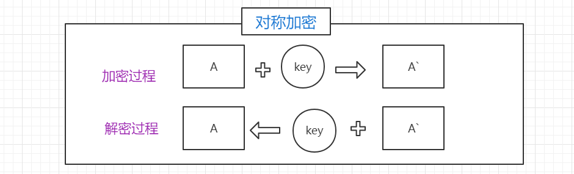
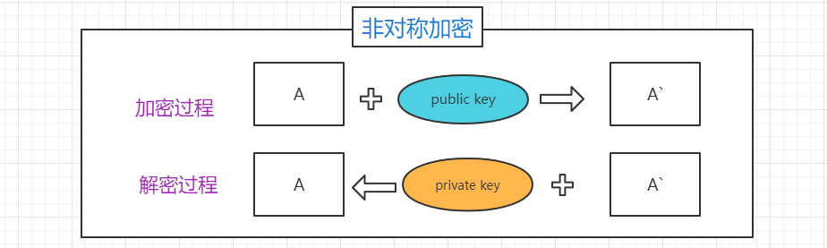
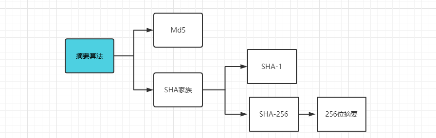
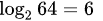

# 常见加密算法的介绍

常见的加密算法分为**对称加密**和**非对称加密**，此外我们在开发之中还经常遇见**摘要算法**，另外我们经常会使用到**BASE64编码**以及**UrlEncode编码**，接下来给大家做一个介绍，让大家不在概念的层面混淆这些算法。

### 加密算法

**对称加密：**指的就是加、解密使用的同是一串密钥，所以被称做对称加密。对称加密只有一个密钥作为私钥。常见的对称加密算法：DES，3DES，AES等。

**非对称加密：**指的是加、解密使用不同的密钥，一把作为公开的公钥，另一把作为私钥。公钥加密的信息，只有私钥才能解密。反之，私钥加密的信息，只有公钥才能解密。常见的加密算法有RSA，DSA，ECC，我们使用最多的就是RSA。 

### 摘要算法

摘要算法，这种算法 主要是用来做一些签名校验的，严格的说不算是加密算法。摘要算法一般是不可逆的，常见的有Md5，SHA-1，SHA-256，通常，我们比如使用的时候，会把一些文件的MD5值作为它的一个唯一的记录或者是key，保存在数据库之中。这是一个常见的使用场景。MD5现在已经被认为是不安全的，代替它的就是SHA2，SHA是一个算法族，最常用的是SHA-256。SHA-256之中的256，是指的它的生成的摘要长度，也就是256位。一般我们会转化成16进制会得到一个64位的字符串。

### BASE64

**Base64**是一种基于64个可打印字符来表示二进制数据的表示方法。由于所以每6个比特为一个单元，对应某个可打印字符。3个字节相当于24个比特，对应于4个Base64单元，即3个字节可由4个可打印字符来表示。在Base64中的可打印字符包括字母`A-Z`、`a-z`、数字`0-9`，这样共有62个字符，此外写多两个可打印符号在不同的系统中而不同。

Base64常用于在通常处理文本数据的场合，表示、传输、存储一些二进制数据，包括MIME的电子邮件及XML的一些复杂数据。

我们平时在互联网之中比如要保存或者获取某个图片的时候，网站方有的时候为了防止盗图，就会把图片编码成BASE64的格式，这样我们保存就没有那么方便了，或者是比如我们写markdown文档，需要放置一张图片，但是没有图床，那么我们就可以把对应的图片转成BASE64的格式，这样就不用上传到某个图床之中了，但这样会导致原始格式的内容非常大。

### urlencode

urlencode，也称作百分号编码(Percent-encoding)， 是特定上下文的统一资源定位符(URL)的编码机制。适用于统一资源标识符(URI)的编码，也用于为`"application/x-www-form-urlencoded"` MIME准备数据， 因为它用于通过HTTP的请求操作(request)提交HTML表单数据。

上面是百度百科之中的介绍，其实简单理解，就是我们在提交表单或者是访问某个链接的时候，把URL之中的特殊字符或者是中文，转换成对应的ASCII来表示，非常规的字符都使用%+对应的十六进制编码来表示的一个方法，就叫做urlencode，当然还有对应的urldecode。

