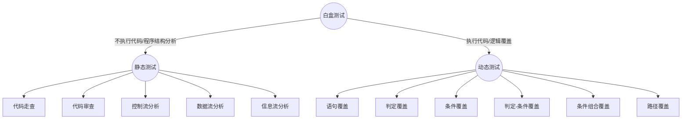

#### 白盒测试
***

1.**白盒测试**:也称结构测试或逻辑驱动测试，基于应用代码的内部逻辑，它从程序的控制结构导出测试用例,++对程序的逻辑路径进行测试++，测试是基于覆盖++*全部代码*、*分支*、*路径*、*条件*++。

2.**测试要求**：
   - 保证一个模块中的所有独立路径至少被使用一次。
   - 对所有逻辑值均需测试 true 和 false。
   - 在上下边界及可操作范围内运行所有循环。
   - 检查内部数据结构以确保其有效性。

3.**测试方法**：

4.**判断标准强弱**
  从弱到强依次如下，语句覆盖最弱，路径覆盖最强。
  1. 语句覆盖每条语句至少执行一次。
  2. 判定覆盖每个判定的每个分支至少执行一次。
  3. 条件覆盖每个判定的每个条件应取到各种可能的值。
  4. 判定/条件覆盖同时满足判定覆盖条件覆盖。
  5. 条件组合覆盖每个判定中各条件的每一种组合至少出现一次。
  6. 路径覆盖使程序中每一条可能的路径至少执行一次。

5.**代码覆盖率**：是白盒测试中的一个重要指标，虽然穷举不可能实现，但是**要尽可能提高覆盖程度**。==白盒测试实质是穷举路径测试==，++逻辑覆盖是白盒测试的主要测试方法++，白盒测试的不足正是黑盒测试的内容。

6.**静态测试**

| 名称 | 含义 |
|--------|--------|
|    代码走查   |   代码走查是由一组程序和错误检查技术组成，并以代码审查组方式进行，重点探讨代码编写思路：比如算法，基于对象的编程，类设计。   |
|    代码审查   | 检查代码和设计的一致性，结构的合理性，标准的遵循情况，代码可读性等。主要是对代码的检查，不涉及测试用例。|
|    控制流分析 | 非结构化程序会给测试、排错、和程序的维护带来许多困难,因此，检查程序的控制结构很重要|
| **程序流程图** | 又称为框图，是一种程序控制结构的图形表示。在图上的框内标明了处理要求或条件，**通常使用简化了的程序流程图作为控制流图**，对程序进行分析。|
|    控制流分析   | 控制流图中只有两种符号，==*节点*==：*++以标有编号的圆圈表示++，有两种含义，1程序流程图中矩形框所表示的处理；2程序流程图中菱形表示的两个甚至多个出口判断以及多条流线相交的汇合点*。==*控制流线或弧*==：*以箭头表示与程序流程图中的流线是一致的，表明了控制的顺序，控制流线通常标有名字*，==同时也可以用控制流矩阵表示==。|
|    数据流分析 | 用来查找对以前未曾使用的变量再次赋值等数据流异常的情况。通常表现为，如错拼名字、名字混淆或语句丢失等错误。|
|    信息流分析 | 通过对输入数据、输出数据、语句之间的关系的分析来检查程序错误，信息流分析用来分析，是否存在无用的语句。 |

7.**动态测试**

| 名称 | 含义 |
|--------|--------|
|语句覆盖|==如果语句中有错误，仅靠观察不执行可能发现不了==，设计的测试用例**使程序中的每个可执行语句至少执行一次**。要求：*用例尽量少，覆盖尽量高*，优点：*容易实现自动测试，代码覆盖率高*，缺点：*无法检测出，条件错误，逻辑错误，循环错误。*|
|判定覆盖|==又称为分支覆盖，设计若干测试用例，运行被测程序，**使得程序中每个判断的真假分支至少经历一次**==。衡量指标：分支覆盖率，常用于：*while语句、switch语句、异常处理、跳转语句等情况*，查错能力稍强于语句覆盖，但是同样++*无法检测出，条件错误，逻辑错误，循环错误*++。|
|条件覆盖|==设计若干测试用例，要使测试程序中**每个判断中的每个条件的可能取值至少满足一次**==，执行条件覆盖并不能实现分支覆盖，优点：*能够检查所有的条件错误*，缺点：*不能实现对每个分支的检查，用例数量的增加*。|
|判定条件覆盖|==设计足够的测试用例，**使得判断中每个条件的所有可能至少出现一次，并且每个判断本身的判定结果也至少出现一次**==,优点：*同时考虑了每一个条件和每一个分支，发现错误能力强于分支覆盖和条件覆盖*，缺点：*并不能全面覆盖所有路径，用例数量的增加*。|
|条件组合覆盖|==设计足够多的测试用例，**使得每个判定中条件的各种可能组合都至少出现一次**==。与判定条件覆盖相比而言，其重点在于每个判定中的各种可能组合，这也导致了测试用例的增加。|
|路径覆盖|==设计足够多的测试用例，**要求覆盖程序中所有可能的路径**==，优点：*实现了所有路径的测试，发现错误能力强*，缺点：*有时无法覆盖所有路径，用例数量的增加*。|

8.**基本路径测试方法**
- 实际情况
   - 路径测试就是从一个程序的入口开始，执行所经历的各个语句的完整过程。从广义的角度讲，任何有关路径分析的测试都可以被称为路径测试。
   - 完成路径测试的理想情况是做到路径覆盖，但对于复杂性大的程序要做到所有路径覆盖（测试所有可执行路径）是不可能的。
   - ==在不能做到所有路径覆盖的前提下==，如果某一程序的每一个++**独立路径[^1]**++都被测试过，那么可以认为程序中的每个语句都已经检验过了，即达到了语句覆盖。这种测试方法就是通常所说的基本路径测试方法。

- 方法：
  *在控制流图的基础上*，通过**分析控制结构的环形复杂度**，导出执行路径的基本集，再从该基本集设计测试用例。
>  - 环形复杂度：也称为圈复杂度，它是一种为程序逻辑复杂度提供定量尺度的软件度量。将环形复杂度用于基本路径方法，++可以确定程序基本集的独立路径数量++；确保所有语句至少执行一次的测试数量的上界。
  - 控制流图中区域的数量对应于环形复杂度[^2]。
    - 给定控制流图G的环形复杂度—V(G)，定义为
      $$$
          V(G) = E-N+2
      $$$
     其中，E是控制流图中边的数量，N是控制流图中的节点数量。
    - 给定控制流图G的环形复杂度—V(G)，也可定义为
      $$$
             V(G) = P+1
      $$$
    其中，P是控制流图G中判定节点的数量。判定节点是输出边至少2条以上的节点。

- 步骤：
（1）画出程序的控制流图。
（2）计算程序的环形复杂度，导出程序基本路径集中的独立路径条数，这是确定程序中每个可执行语句至少执行一次所必须的测试用例数目的上界。
（3）导出基本路径集，确定程序的独立路径。
（4）根据（3）中的独立路径，设计测试用例的输入数据和预期输出。

9.**白盒测试工具**
- 软件：
> DevPartner（Compuware）（C\++、VC\++、.net、java）
  IBM Rational Purify（C，C\++ ）

- 框架:
> NUnit（.net）
  JUnit（java）
  CppUnit（C\++）

[^1]: 独立路径是指程序中至少引入了一个新的处理语句集合或一个新条件的程序通路。采用流图的术语，即独立路径必须至少包含一条在本次定义路径之前不曾用过的边
[^2]: [软考软件设计师McCabe环路复杂度计算方法](http://blog.csdn.net/u012965373/article/details/49662133)
