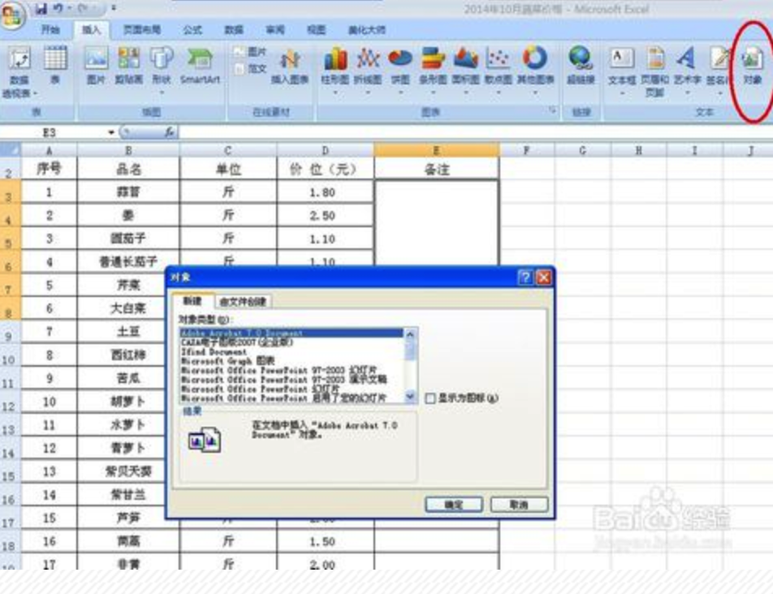
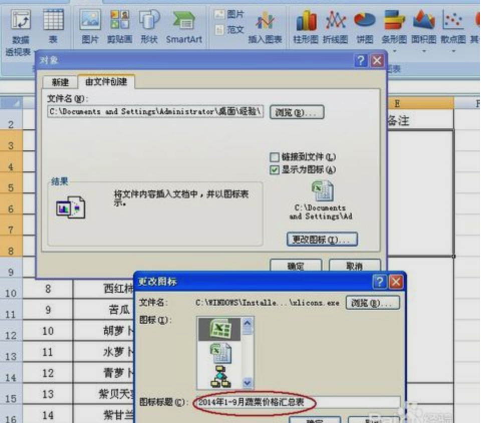
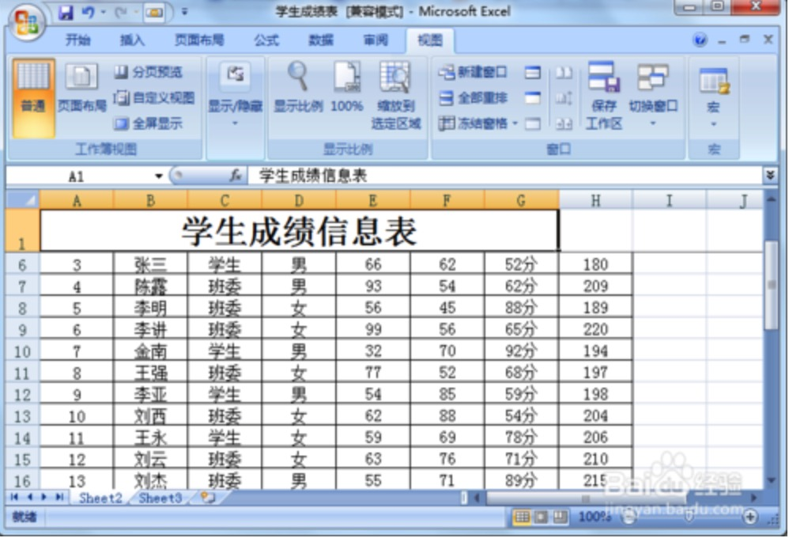
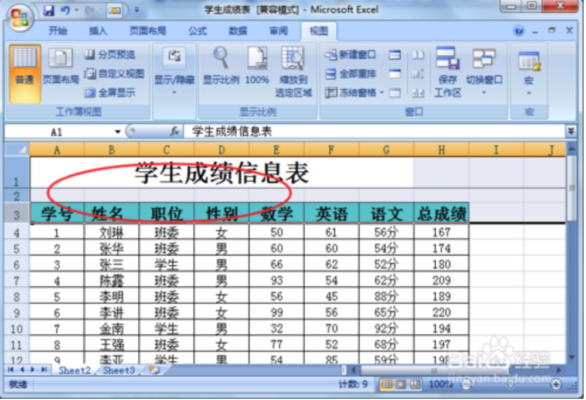
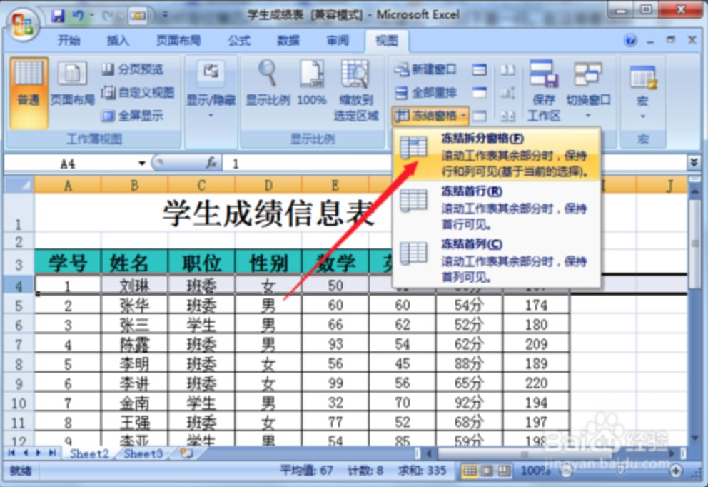

### 办公软件使用技巧

##### 1.共享文件

win系统之中在你想要设置共享的文件夹上**右击**，然后点击**属性**，在弹出的对话框中点击”**共享**"选项卡。

接着
点击“高级高享”，选中“共享此文件”单选框。

点击确定后在回到了上一个界面，再选中“共享”，在弹出的对话框中点击下拉列表选择“Everyone”，也可以在局域网之中选择用户,然后点击添加——确定, 就可以开起共享。

一般而言需要把主机名称改成电脑的IP才可以访问, 这点需要注意一下。

##### 2. excel之中插入文档

1.打开需要插入对象文件的Excel表格，如下图所示。

2.用鼠标单击要插入对象文件单元格，然后依次点击"插入"菜单--"对象"，窗口会自动弹出"对象"对话框，如下图所示。

3.在"对象"对话框中选择"由文件创建"选项卡，单击"浏览"，选择需要插入的对象文件，此处我们先选择一个Excel文件插入。

4.选择"对象"对话框中的"显示图标"，点击"更改图标"，窗口会自动弹出"更改图标"对话框。如下图所示。

5.将"图标标题"中的文件路径及文件扩展名删掉，只保留文件名称，如下图所示。然后点击"确定"按钮。

6.在"对象"对话框中点击"确定"按钮，Excel文件就插入完毕了。在阅读时，只需双击这个Excel文件，就可以将之打开了。

7.按照同样的方法，我们还可以在Excel表格中插入Word或PPT等文件。

##### 3. excel表格设置表头不动或者列不动
excel表格应用过程中，经常需要冻结表头保持不动，以更好的查看数据。在excel表格中有冻结首行、首列的设置，那么如果想要冻结多行的话要怎么设置呢。
1.打开一个excel表格，在视图菜单栏下可以找到冻结窗口，可以看到冻结窗口下拉菜单上直接就有冻结首行和首列的设置。

2.设置了冻结首行以后可以在表格中看到第一行是保持不动，一直显示在表格最上方。

3.那如果想要多行不动的话要怎么设置呢。在这里就设置一下前三行冻结保持不动。

4.首先用鼠标定位第四行，也就是要冻结行数最后一行的下面一行。在这里要冻结三行，那么就选第四行，如果您要冻结五行，那您需要选择第六行。

5.选择第四行一行，点击视图菜单栏下，在冻结窗口下拉菜单中选择“冻结拆分窗口”选项。

6.返回到excel表格中就可以看到成功设置为前三行冻结，保持不动，上下滚动鼠标也会一直都在表格最上方。

7.如果想要取消冻结窗口的话也是在视图菜单栏下，冻结窗口下拉菜单中会出现一个取消冻结窗口选项，直接点击选择就可以。

ref:
1.[实验一：win7下实现文件共享和访问](https://www.cnblogs.com/dzh-stuff/archive/2013/04/07/Network3.html),   2.[如何在Excel表格中插入其它对象文件](https://jingyan.baidu.com/article/4e5b3e19588d8891901e24eb.html),   3.[怎么设置excel表格中多行表头保持不动](https://jingyan.baidu.com/article/5d368d1ec534c43f60c0579d.html)

