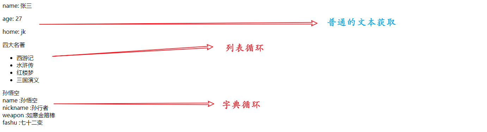
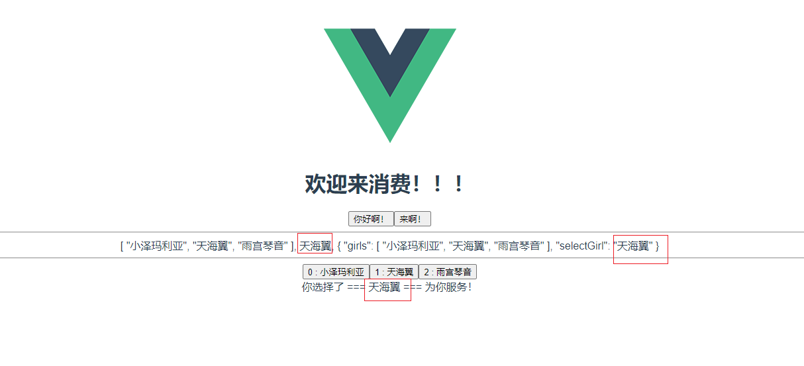
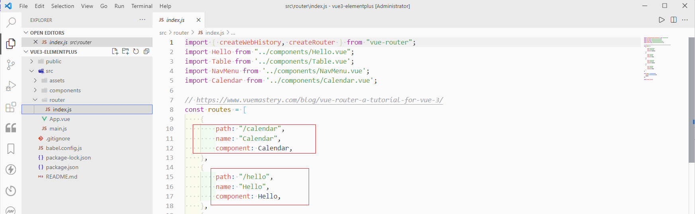

### 前言

在开发的时候，慢慢感觉到`Vue`其实本质上也是一种模版技术，怎么说呢？听我细细分解。就是比如Java使用的`jsp`，`Thymeleaf`，还是Python使用的`Django`, 或者是`jinja2`, 这些都是模版技术，本质上就是后端返回模板对应的html，也就是找到这个模板对应的html文件，而这个html之中需要展示我们想要的内容，比如样式，布局，当然更重要的是数据。所以在HTML的标签之中，我们就可以直接使用后端方法返回给这个html页面模板页面的数据，然后在相应的地方展示出来。

### Java与Thymeleaf

以Java为例，我们在开发Java Web项目的时候，我们需要的数据，就放在`ModelAndView`之中，我们就可以在前端的页面之中使用了。

```java
@RequestMapping("thymeleaf")
public ModelAndView thymeleaf() {
    ModelAndView modelAndView = new ModelAndView();
    // 设置视图
    modelAndView.setViewName("thymeleaf");
    String message = "hello world! 模板技术!";
    modelAndView.addObject("message", message);
    // 返回模型
    return modelAndView;
}
```

在Thymeleaf之中使用，首先是引用命名空间`<html xmlns:th="http://www.thymeleaf.org">`

```html
<!DOCTYPE html>
<html lang="en" xmlns:th="http://www.thymeleaf.org">
    <head>
        <meta charset="UTF-8">
        <title>Title</title>
    </head>
    <body>
        <div>
            <p th:text="${message}"></p>
        </div>
    </body>

</html>
```

通过上述的代码，我们的前端模板页面，就拿到了后端返回的message数据，并且在页面之中展示了出来。

### Python与Jinja2

对于Jinja2来说，也是这个道理，我们使用关键字参数，使用render_template()，然后把模版名称和需要返回的数据都返回给了前端的页面，那这个时候模版页面就可以直接使用我们前端页面里面的数据了。

```python
@app.route('/')
def index():
    # 往模板中传入的数据
    my_str = 'Hello Word'
    my_int = 10
    my_array = [3, 4, 2, 1, 7, 9]
    my_dict = {
        'name': 'xiaoming',
        'age': 18
    }
    return render_template('temp_demo1.html',
                           my_str=my_str,
                           my_int=my_int,
                           my_array=my_array,
                           my_dict=my_dict
                           )
```

模版之中的代码，就可直接获取后端方法传过来的数据，使用`{{}}`取数据，有逻辑判断操作的话，就要使用使用``表达式，这个是和模板语法特性相关的。

```html
<!DOCTYPE html>
<html lang="en">
<head>
    <meta charset="UTF-8">
    <title>about</title>
</head>
<body>
    {# 直接获取数据 #}
    <p>name: {{ name }}</p>
    <p> age: {{ age }}</p>
    <p>home: {{ home }}</p>

</body>
</html>
```

更明显的循环，这个非常类似于`Vue`之中数据的填充，展示的部分几乎是异曲同工。下面把前端和后端的代码放在了一起便于展示

```python
# 使用模板
@app.route("/about")
def about():
    context = {
        "name": "张三",
        "age": 27,
        "home": "jk",
        # 列表
        "books": ["西游记", "水浒传", "红楼梦", "三国演义"],
        # 字典
        "monkey": {"name": "孙悟空", "nickname": "孙行者", "weapon": "如意金箍棒", "fashu": "七十二变"}
    }

    # 返回about.html模板, context作为关键字参数, 在模板之中就可以使用了
    return render_template("about.html", **context);


<!DOCTYPE html>
<html lang="en">
<head>
    <meta charset="UTF-8">
    <title>about</title>
</head>
<body>
    {# 直接获取数据 #}
    <p>name: {{ name }}</p>
    <p> age: {{ age }}</p>
    <p>home: {{ home }}</p>


    <div>四大名著</div>
    <ul>
        {# for循环列表 #}
        
            <li> {{ book }} </li>
        
    </ul>

    <div>孙悟空</div>
    {# for循环字典 #}
    
        <div> {{ key }} :{{ value }}</div>
    

</body>
</html>
```



### Vue”模板技术“

下面是vue的组件，在template之中就是专门为了展示而出现的，而在下面的script部分，我们定义的data，girls，selectGirl就是我们的需要的数据，正好是为了template之中展示而准备的。在Vue之中，由于他的双向绑定和虚拟Dom的特性，我们不需要像是jQuery一样去操作Dom而更新页面，而这些数据，其实也是像是jQuery一样，使用ajax请求从后端获取的，只不过在Vue之中请求的方式换成了axios，本质上是没有区别的。下面的图片就是展示状况。

```vue
<template>
    
    <HelloWorld msg="欢迎来消费！！！" />
    <div>
        <button @click="data.hi()"> 你好啊！ </button>
        <button @click="alertFun()"> 来啊！ </button>
        <hr>
        {{data.girls}}, {{data.selectGirl}}, {{data}}
        <hr>
        <button v-for="(item, index) in data.girls" v-bind:key="index" @click="selectGirlFun(index)">
            {{index}} : {{item}}
        </button>
    </div>
    <div>
        你选择了 === {{data.selectGirl}} === 为你服务！
    </div>
</template>

<script>
import { reactive, onBeforeMount, onMounted, onBeforeUpdate, onUpdated } from "vue"

export default {
    name: "App",
    setup() {
        console.log("1-开始创建组件-----setup()")
        let data = reactive({
            girls: ["小泽玛利亚", "天海翼", "雨宫琴音"],
            selectGirl: "",
            // reactive函数之中定义函数
            hi() {
                console.log("hello world!")
            },
        })
        function selectGirlFun(index) {
            data.selectGirl = data.girls[index]
        }
        function alertFun() {
            console.log("123")
        }
        return {
            data,
            selectGirlFun,
            alertFun,
        }
    },
}
</script>

<style>
#app {
    font-family: Avenir, Helvetica, Arial, sans-serif;
    -webkit-font-smoothing: antialiased;
    -moz-osx-font-smoothing: grayscale;
    text-align: center;
    color: #2c3e50;
    margin-top: 60px;
}
</style>
```



### 总结

从Vue来看，把thymeleaf和jinja2与vue相比，他们获取数据的方式，在展示这个层面上是非常相似的，尤其是字典循环列表的循环，和vue的赋值方式很像，对于更加普通的文本，一般都是直接使用{{xx}}的方式获取。

当我们没有进行前后端分离的时候，也就是直接由后端的方法，在返回视图的同时，返回给我们视图里面需要的数据，所以我们直接填充即可，但是如果是前后端分离的时候，那我们就需要去单独请求数据，要么使用jQuery的ajax，要么使用Vue的axios请求数据。

- 如果是使用jQuery，我们一般就可以使用这种方法，进行局部更新，甚至如果你不想去使用模版，那么配合后端返回的Json数据，然后前端进行ajax请求，再去进行dom元素的更新和赋值，就得到了我们在不使用模版技术的时候，同样能达到的效果。
- 对于Vue，展现的部分是模版技术，而数据部分使用的其实也是异步请求，由于他的特性双向绑定+虚拟dom，所以不需要直接去像jquery一样，更新操作Dom元素，而只是进行数据的请求，然后在展示部分使用到的元素，自动就更新了。

当然了，如果仅仅把Vue看成是一个模板技术，那就有点大材小用了，至少从功能上来说，Vue最少还有一个这些模板技术没有的，那就是`路由管理`，在Vue之中有专门的router/index.js来配置路由，而后端配合的模板技术，这块是由后端去管理的。




