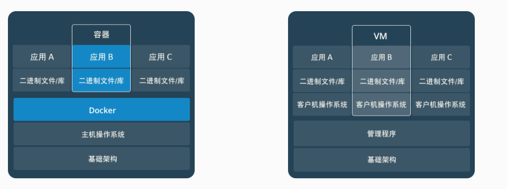

Docker的一些问题

1. docker是想干啥?
  A: **Docker的是一个轻量级的操作系统虚拟化解决方案**。 主要目标，用官网的概括来说就是“Build，Ship and Run Any App,Anywhere”：编译，装载任何App,在任何地方都可以运行，我们大概理解就是一个容器，实现了对应用的封装，部署，运行等生命周期管理，只要在glibc的环境下，到处都可以运行。Docker的是基于Linux自带的（Linux。 Containers,LXC）技术，在LXC上，Docker进行了近一步封装。
2. docker和虚拟机有什么不同和相同?
  A: 虚拟机重量级的虚拟化, docker是轻量级的虚拟化.二者都是虚拟化技术, 但是理念是不一样,docker是容器虚拟化, 虚拟机是硬件虚拟化.一个容器中运行原生Linux和共享主机与其它容器的内核, 它运行一个独立的进程, 不占用任何其它可执行文件的内存, 使其轻量化.相比之下, 虚拟机(VM)运行一个完整的“客户”操作系统，通过虚拟机管理程序虚拟访问主机资源. 一般来说. 虚拟机提供的环境比大多数应用程序需要的资源多.
  
  
  
3. sudo docker run -i -t ubuntu /bin/bash 后面的 bin/bash 是什么意思?
  A: 这是表示载入容器后运行bash, docker中必须要保持一个进程的运行, 要不然整个容器就会退出, 这个就表示启动容器后启动bash, 其实, 换成/bin/sh 也是可以的, 我的理解是应该任何一个可以产生持续进程的软件或者命令行就都可以, 当然此处提供的是他的存储的路径.
4. docker之中容器是什么?
  A:**容器(Container)——镜像运行时的实体**
  镜像(Image)和容器(Container)的关系，就像是面向对象程序设计中的类和实例一样，镜像是静态的定义，**容器是镜像运行时的实体**。容器可以被创建、启动、停止、删除、暂停等 。
  **容器的实质是进程，但与直接在宿主执行的进程不同，容器进程运行于属于自己的独立的命名空间。前面讲过镜像使用的是分层存储，容器也是如此**。
  容器存储层的生存周期和容器一样，容器消亡时，容器存储层也随之消亡。因此，任何保存于容器存储层的信息都会随容器删除而丢失。
  按照Docker最佳实践的要求，容器不应该向其存储层内写入任何数据 ，容器存储层要保持无状态化。所有的文件写入操作，都应该使用数据卷（Volume）、或者绑定宿主目录，在这些位置的读写会跳过容器存储层，直接对宿主（或网络存储）发生读写，其性能和稳定性更高。数据卷的生存周期独立于容器，容器消亡，数据卷不会消亡。因此， 使用数据卷后，容器可以随意删除、重新run，数据却不会丢失。
5. docker之中镜像是什么?和容器有什么关系,又有什么差别?
  A:**镜像(Image)——一个特殊的文件系统**
  操作系统分为内核和用户空间。对于Linux而言，内核启动后，会挂载root文件系统为其提供用户空间支持。而Docker镜像(Image)，就相当于是一个root文件系统。
  Docker镜像是一个特殊的文件系统，除了提供容器运行时所需的程序、库、资源、配置等文件外，还包含了一些为运行时准备的一些配置参数（如匿名卷、环境变量、用户等）。 镜像不包含任何动态数据，其内容在构建之后也不会被改变。
  Docker设计时，就充分利用Union FS的技术，将其设计为分层存储的架构。 镜像实际是由多层文件系统联合组成。
  镜像构建时，会一层层构建，前一层是后一层的基础。每一层构建完就不会再发生改变，后一层上的任何改变只发生在自己这一层。比如，删除前一层文件的操作，实际不是真的删除前一层的文件，而是仅在当前层标记为该文件已删除。在最终容器运行的时候，虽然不会看到这个文件，但是实际上该文件会一直跟随镜像。因此，在构建镜像的时候，需要额外小心，每一层尽量只包含该层需要添加的东西，任何额外的东西应该在该层构建结束前清理掉。
  分层存储的特征还使得镜像的复用、定制变的更为容易。甚至可以用之前构建好的镜像作为基础层，然后进一步添加新的层，以定制自己所需的内容，构建新的镜像。
  **我们构建的是镜像, 运行的是容器!!!**
>Image & Container
>
>在docker中，我们重点关注的就是镜像和容器了。因为在实际应用中，我们封装好镜像，然后通过镜像来创建容器，在容器运行我们的应用就好了。而server端掌控网络和磁盘，我们不用去关心，启动docker sever 和 docker client都是一条命令的事情。后面会详细讲docker的启动过程。
>
>Image:
>
> 一个只读的镜像模板。可以自己创建一个镜像也可以从网站上下载镜像供自己使用。镜像包含了一个RFS.一个镜像可以创建很多容器。
>
>Container:
>
>由docker client通过镜像创建的实例，用户在容器中运行应用，一旦创建后就可以看做是一个简单的RFS，每个应用运行在隔离的容器中，享用独自的权限，用户，网络。确保安全与互相干扰
>
>两者在创建后，都是一堆layer的统一视角，唯一的却别是镜像最上面那一层是只读的，不可以修改，但是容器最上面一层是rw的，提供给用户操作
>
>repository:
>
>仓库，这个东西没有单独介绍不是因为它不重要，而是因为之前做个比较多的Android源码编译，所以这里就没有仔细往下看，大概就是一个镜像库，最大的是docker hub，类似于google 的aosp，当然也可以本地搭，比如mig事业群就有自己的repo。

6. commit和Dockerfile有什么差别?
  A: 两种都可以创建镜像, 但是现在官方推荐的是Dockerfile,  因为**Dockerfile更具备可重复性, 透明性以及幂等性(官方说法)**.

7. Dockerfile文件之中的FROM 后面的base, 可以是自己的一个操作系统吗?
  A:

8. 使用Docker的命令行和使用UI工具(如kitematic), 下载和创建的容器, 分别都放在了哪儿?
  A:

9. 构建Docker镜像时候, 所说的构建上下文是什么?
  A: **构建镜像**的时候, Dockerfile存放在一个文件夹之下, 把这个文件夹之中的所有内容, 就称作是"构建上下文"(我自己的理解).

10. docker的registry是什么?
  A: **Registry**是指注册服务器, 用于管理镜像仓库, 起到的是服务器的作用. **Repository**是指的镜像仓库, 用于存储具体的docker镜像, 起到的是仓库存储作用.
  

ref:
1.[sudo docker run -i -t ubuntu /bin/bash 后面的 bin/bash 是什么意思](https://www.cnblogs.com/codeaaa/p/7722404.html),   2.[Docker中的Registry和Repository](https://www.jianshu.com/p/5b499ee4d5af),   3.[可能是把Docker的概念讲的最清楚的一篇文章](http://dockone.io/article/6051),   4.[从零开始学习 Docker](https://www.jianshu.com/p/cf6e7248b6c7),   5.[Docker简介](https://www.cnblogs.com/hwlong/p/9158982.html),   6.[Docker 学习笔记 ( 一 )： 简介以及构架剖析](http://dockone.io/article/2804),   7.[Docker学习(一)-----Docker全面介绍](https://blog.csdn.net/zzq900503/article/details/80230415)