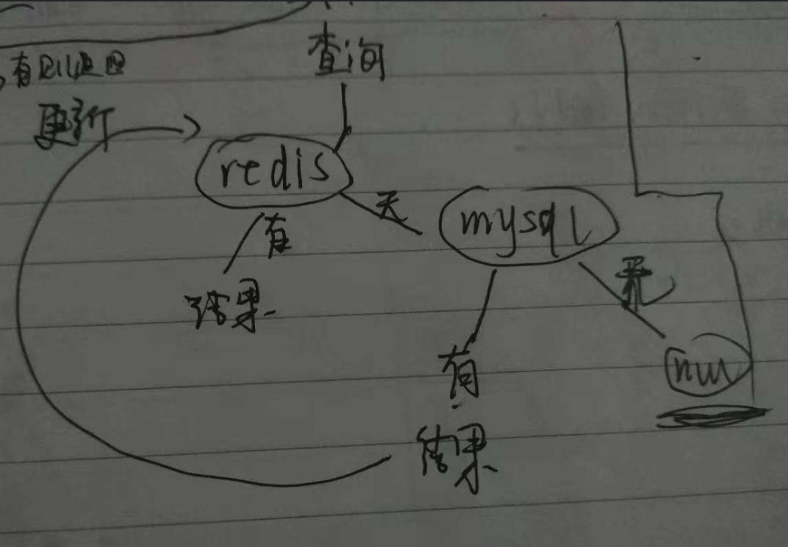
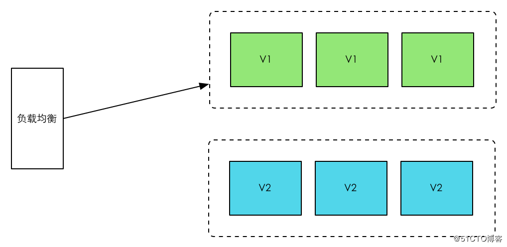
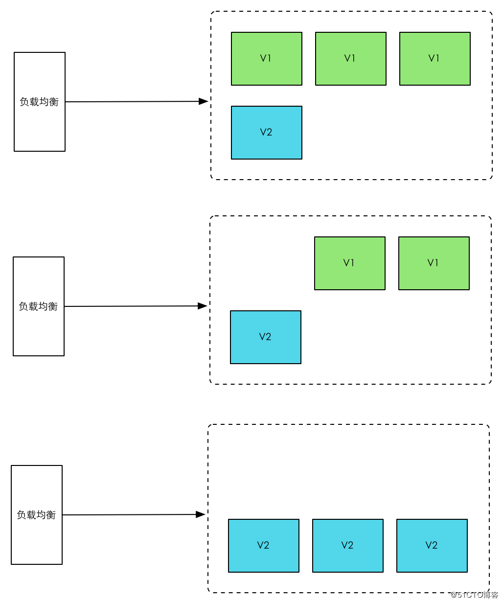
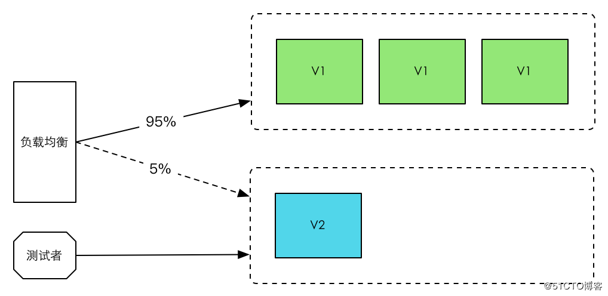
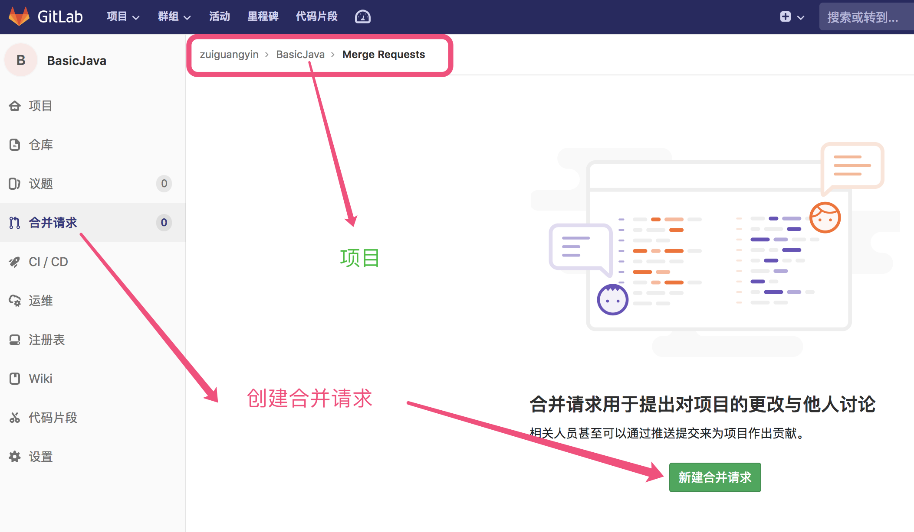
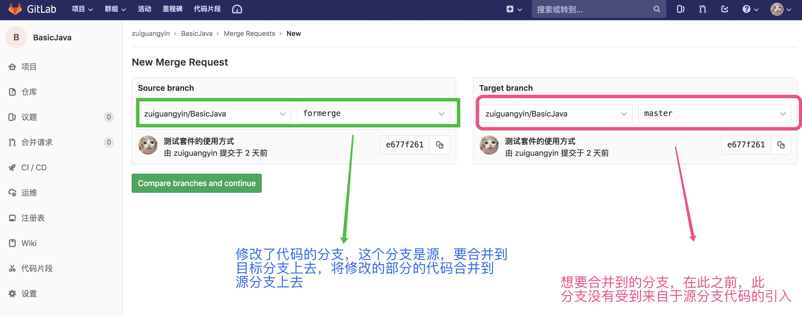
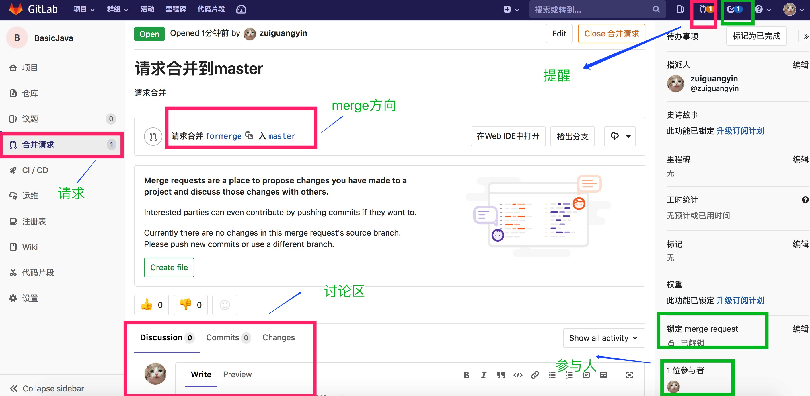

### 后端框架学习笔记5
***

[TOC]

##### 124 : RTTI和反射(reflect)的区别
A : **RTTI和"反射"之间唯一的区别就是, 对RTTI来说, 编译器会在编译期打开和检查.class文件. 但对"反射"来说,.class文件在编译期间是不可使用的, 而是由运行时环境打开和检查.class文件**. 

**RTTI**: 运行时类型识别(Run-Time Type Identification), 在运行时识别一个对象的类型, 其对应的类是Class对象, 每个java里面的类都对应一个Class对象(在编写并且编译后), 这个对象被保存在这个类的同名class文件里.

**反射**: 可以认为是一种高级的RTTI. **传统RTTI的功能主要通过Class文件来实现, 而反射机制通过使用`java.lang.reflect`包提供给我们的类和方法**. 反射是一种高级的RTTI, 一般把普通的RTTI叫做传统的RTTI, **传统的RTTI帮助实现了多态和继承**.

RTTI的形式包括三种: 
1.传统的类型转换. 如`(Apple)Fruit`, 由RTTI确保类型转换的正确性, 如果执行了一个错误的类型转换, 就会抛出一个ClassCastException异常. 
2.通过Class对象来获取对象的类型. 如`Class c = Class.forName("Apple"); Object o = c.newInstance();`
3.通过关键字`instanceof`或`Class.isInstance()`方法来确定对象是否属于某个特定类型的实例.


##### 125 : RTTI和反射(reflect)的应用例子
A : `UseTranditionalRTTI`和`UseReflect`分别是RTTI和反射的使用例子
`UseTranditionalRTTI`

```java
/*使用传统的RTTI*/
/**
 * RTTI的形式包括三种:
 * 1.传统的类型转换. 如(Apple)Fruit, 由RTTI确保类型转换的正确性, 如果执行了一个错误的类型转换, 就会抛出一个ClassCastException异常.
 * 2.通过Class对象来获取对象的类型. 如Class c = Class.forName("Apple"); Object o = c.newInstance();
 * 3.通过关键字instanceof或Class.isInstance()方法来确定对象是否属于某个特定类型的实例.
 **/
@Slf4j
public class UseTranditionalRTTI {
    public static void main(String[] args) {
        System.out.println("RTTI类型转换功能例子:");
        Fruit f1 = new Cherry();
        Fruit f2 = new Pineapple();
        Fruit f3 = new Pineapple();
        ((Cherry) f1).setPrice(129.8f);//1. 类型转换
        (f1).setName("巴西樱桃");//上面一句已经转换过了, 所以此处可以不用转换
        System.out.println(f1.toString() + ", 类型是: " + f1.getClass());
        // 每个类的类型是确定的, 只有一种直接class类型, 但是由于有继承关系, 可以upcast或者downcast,
        // Fruit f2 = new Pineapple(); 虽然使用Fruit来定义类型, 但是实际上其直接类型是Pineapple, 而非Fruit
        System.out.println("f2的类型是: " + f2.getClass());

        System.out.println("\nRTTI通过Class对象来获取对象的类型:");
        try {
            Class<?> cls = Class.forName("com.cqu.rjx.syntax.reflect.Cherry");//获取对象类型
            Cherry cherry = (Cherry) cls.newInstance();//创建无参对象
            cherry.setName("美国樱桃");
            cherry.setPrice(88.9f);
            System.out.println(cherry.toString());
        } catch (ClassNotFoundException e) {
            e.printStackTrace();
        } catch (IllegalAccessException e) {
            e.printStackTrace();
        } catch (InstantiationException e) {
            e.printStackTrace();
        }

        System.out.println("\nRTTI使用instanceof或Class.isInstance():");
        Class<?> cls2 = Pineapple.class;//获取对象类型
        if (f3 instanceof Fruit) {
            System.out.println("f3 is Fruit类的对象");
        }
        if (!cls2.isInstance(f1)) {
            System.out.println("f1 is not " + cls2.getCanonicalName() + "类 的对象");
        }
    }
}

@Data
class Fruit {
    String name;
}

@Data
class Pineapple extends Fruit {
    String name;
    String area;

    Pineapple() {
        super();
    }

    Pineapple(String name, String area) {
        super();
        this.area = area;
        this.name = name;
    }
}

@Data
class Cherry extends Fruit {
    String name;
    float price;

    Cherry() {
        super();
    }

    Cherry(String name, float price) {
        super();
        this.name = name;
        this.price = price;
    }
}
```

`UseReflect`
```java
/*使用反射*/
//RTTI的核心是Class类, 反射的核心是操作Class类对象, 所以反射比RTTI更深入
public class UseReflect {
    public static List<String> getTeamList() {
        List<String> team = new ArrayList<>();
        team.add("中国象棋社");
        team.add("动漫社");
        team.add("插花茶艺社");
        team.add("飞天诗社");
        team.add("友爱互助社");
        team.add("道教文化研究社");
        team.add("海贼王研究社");
        team.add("挑战数学社");
        team.add("有机化学学习社");
        team.add("万有引力社");
        team.add("日本动作片鉴赏中心");
        return team;
    }

    public static List<String> getCourseList() {
        List<String> course = new ArrayList<>();
        course.add("高等数学");
        course.add("电路理论");
        course.add("java");
        course.add("计算机组成原理");
        course.add("大学物理");
        course.add("设计模式");
        course.add("先秦文学理论研究");
        course.add("初级日语");
        course.add("经济学原理");
        course.add("专业日语");
        return course;
    }

    public static List<String> getRandomList(List<String> list, int num) throws MyParamException {
        if (num <= 0) {
            throw new MyParamException("参数不符合规范!", "第2个参数必须大于0!!!");
        }
        if (num > list.size()) {
            int size = list.size();
            throw new MyParamException("第二个参数参数发生错误!", "参数list的长度为" + size + "小于要求的长度" + num);
        }
        List<String> ls = new ArrayList<>(num);
        Random random = new Random(System.currentTimeMillis());
        while (ls.size() < num) {
            int n = random.nextInt(list.size());
            ls.add(list.get(n));
        }
        return ls;
    }

    /**
     * getXXX和getDeclaredXXX之间有什么关系? 什么区别?
     **/
    public static void main(String[] args) throws ClassNotFoundException, NoSuchMethodException,
            IllegalAccessException, InstantiationException, InvocationTargetException, MyParamException,
            NoSuchFieldException {
        System.out.println("获取信息阶段...");
        /*获取了类对象*/
        Class<?> teacherClsObj = Class.forName("com.cqu.rjx.syntax.reflect.Teacher");
        //Class<?> studentClsObj = Student.class;
        Class<?> studentClsObj = Class.forName("com.cqu.rjx.syntax.reflect.Student");
        Class<?> departmentClsObj = Department.class;

        /*获取构造器*/
        // 基本类型换也直接使用xxx.class, 如float.class
        Constructor teacherCon = teacherClsObj.getDeclaredConstructor(String.class, String.class, float.class);
        Constructor[] teacherConArray = teacherClsObj.getDeclaredConstructors();

        /*getConstructor导致失败, getDeclaredConstructor却是成功的? 这是为何? */
        //Constructor studentCon = studentClsObj.getConstructor(String.class, List.class, List.class);// error
        //Constructor[] studentConArray = studentClsObj.getConstructors(); //这样数组里面是null的?

        // 后面两个参数类型 ArrayList.class, List.class, 定义处是List<String> team, 如此模式不可以, 必须是和原定义相同的!
        Constructor studentCon = studentClsObj.getDeclaredConstructor(String.class, List.class, List.class);
        Constructor[] studentConArray = studentClsObj.getDeclaredConstructors();

        /*获取方法*/
        // 按照名字获取方法
        Method teacherMethod = teacherClsObj.getDeclaredMethod("setTeacherSalary", float.class);
        // 所有的方法
        Method[] teacherMethodArray = teacherClsObj.getMethods();
        Method studentCourseMethod = studentClsObj.getDeclaredMethod("getCourseStr");//无参函数
        Method studentInfoMethod = studentClsObj.getDeclaredMethod("getStudentInfo");
        Method[] studentMethodArray = studentClsObj.getDeclaredMethods();

        /*获取字段*/
        Field teacherFieldSalary = teacherClsObj.getDeclaredField("salary");
        Field[] teacherFiledArray = teacherClsObj.getDeclaredFields();
        Field DepartmentField = departmentClsObj.getDeclaredField("name");
        Field[] DepartmentFieldArray = departmentClsObj.getDeclaredFields();


        System.out.println("\n使用提取的信息阶段...");
        /*创建对象*/
        // 创建无参数对象
        Teacher teacherZhang = (Teacher) teacherClsObj.newInstance();//未对参数进行初始化
        Student studentZhang = (Student) studentClsObj.newInstance();
        // 创建有参对象
        Teacher teacherLee = (Teacher) teacherCon.newInstance("李海洋", "化学", 7894.5f);
        List<String> stuCourseList = getRandomList(getCourseList(), 5);
        List<String> stuTeamList = getRandomList(getTeamList(), 3);
        Student studentLee = (Student) studentCon.newInstance("李阳", stuCourseList, stuTeamList);

        /*输出父类*/
        System.out.println("\n展示Teacher类的父类:");
        System.out.println("Teacher类的父类:" + teacherClsObj.getSuperclass());
        System.out.println("teacherLee的name: " + teacherLee.getName());

        /*展示构造器*/
        System.out.println("\n展示Student类的构造器:");
        for (Constructor s : studentConArray) {
            System.out.println(s.toGenericString());
            //System.out.println(s.toString());
        }

        /*调用方法*/
        System.out.println("\n展示使用反射调用方法:");
        System.out.println(studentLee.toString());
        System.out.print(teacherLee.getName() + "老师改变工资之前的工资数: " + teacherLee.getSalary() + "; ");
        teacherMethod.invoke(teacherLee, 12345f);// object ,arguments
        System.out.println(teacherLee.getName() + "老师改变工资之后的工资数: " + teacherLee.getSalary());
        //studentCourseMethod.invoke(studentZhang,null); //NullPointerException, 无参函数怎么调用?
        //studentCourseMethod.invoke(studentLee);

        /*展示字段*/
        System.out.println("\n展示输出Department类的字段:");
        for (Field filed : DepartmentFieldArray) {
            System.out.println(filed.getName() + "的类型为:" + filed.getType());
        }

        /*实际使用*/
        createByFiled(departmentClsObj);
    }

    /*实际的使用, 通过判断字段的多少,创建一个对象, 然后打印输出信息*/
    public static void createByFiled(Class<?> cls) throws ClassNotFoundException, IllegalAccessException, InstantiationException, InvocationTargetException {
        //获取Constructor[]
        //获取Field[]
        boolean flag = false;
        Constructor[] cons = cls.getDeclaredConstructors();
        Constructor con = null;
        Field[] fields = cls.getDeclaredFields();
        boolean[] flags = new boolean[fields.length];
        List<String> fieldTypeList = new ArrayList<>();//问题是要按照顺序
        for (Field f : fields) {//field的类型的list
            fieldTypeList.add(f.getType().toString());
        }
        int fieldNo = fields.length;
        for (int i = 0; i < cons.length; i++) {
            Parameter[] parameters = cons[i].getParameters();//参数类型
            if (parameters.length == fieldNo) {
                con = cons[i];
                for (int j = 0; j < parameters.length; j++) {
                    if (fieldTypeList.get(j).equals(parameters[j].getType().toString())) {
                        flags[j] = true;
                    } else {
                        flags[j] = false;
                    }
                }
            } else {
                continue;//跳出本次循环
            }
        }
        flag = getState(flags);
        if (flag) {
            System.out.println("有可以使用的构造器!");
            String classTypeName = cls.getTypeName();
            System.out.println(classTypeName);
            for (int i = 0; i < fields.length; i++) {
                System.out.print("第" + i + "个参数名为: " + fields[i].getName() + ", 类型为: " + fields[i].getType());
            }
            // 已知类名, 如何将其转化成对应的class类型
            String[] s = new String[]{"123", "234"};
            //cls.newInstance("a", s); 无参数的可以直接创建, 有参数的不可以直接诶创建
            Object obj = con.newInstance("日语", s);
            System.out.println(obj.getClass());

            Department d = (Department) con.newInstance("日语", s);
            System.out.println(d.getInfo());
        } else {
            System.out.println("...");
        }
    }

    public static boolean getState(boolean[] b) {
        boolean a = false;
        for (boolean l : b) {
            if (l != true) {
                a = false;
                break;//直接跳出循环
            }
            a = true;
        }
        return a;
    }
}

@Data
class School {
    String name;
    String address;

    School() {
        System.out.println("School Constructor...");
    }

}

@Data
class Department extends School {
    String name;//名称
    String[] branch;//分支

    Department() {
        super();
        System.out.println("Department Constructor...");
    }

    Department(String name, String[] branch) {
        super();
        System.out.println("Department Constructor...");
        this.name = name;
        this.branch = branch;
    }

    public String getInfo() {
        // Arrays.deepToString(branch), 讲一个array数组, 转化成一个字符串
        return "Department name is: " + this.name + ", Department branch has" + Arrays.deepToString(branch);
    }
}

@Data
class Teacher extends Department {
    String name;//姓名
    String major;//专业
    float salary;//工资

    Teacher() {
        super();
        System.out.println("Teacher Constructor...");
    }

    Teacher(String name, String major, float salary) {
        super();
        this.name = name;
        this.major = major;
        this.salary = salary;
        System.out.println("Teacher Constructor...");
    }

    public String setTeacherSalary(float salary) {
        this.salary = salary;
        return "设置Teacher" + this.getName() + "的salary为: " + salary;
    }

}

@Data
class Student extends Department {
    String name;//姓名
    List<String> course;//主课
    List<String> team;//社团

    Student() {
        super();
        System.out.println("Student Constructor...");
    }

    Student(String name, List<String> course, List<String> team) {
        super();
        this.name = name;
        this.course = course;
        this.team = team;
        System.out.println("Student Constructor...");
    }

    public String getStudentInfo() {
        return "name为 " + this.getName() + "的 student的主课是" + this.getCourseStr()
                + ", TA参加了" + this.getTeamStr() + " 等社团";
    }

    public String getCourseStr() {
        StringBuilder sb = null;
        for (String s : this.getCourse()) {
            sb.append(s + ", ");
        }
        return (sb.toString().substring(0, sb.length() - 1));
    }

    public String getTeamStr() {
        StringBuilder sb = null;
        for (String s : this.getTeam()) {
            sb.append(s);
        }
        return (sb.toString().substring(0, sb.length() - 1));
    }

}

/*自定义的异常类*/
class MyParamException extends Exception {
    @Setter
    @Getter
    String message;
    @Setter
    @Getter
    String name;

    MyParamException(String name, String message) {
        super(name);
        this.name = name;
        this.message = message;
    }
}
```


##### 126 : "已知类名, 如何将其转化成对应的class类型, 也就是创建对象"问题的思考
A: 这其实是一种思维方式上的震荡, 需要将以前的面向对象的思维, 转化一下, 从它的反面观察.
>使用了特定参数的构造器的话, 其实不必将新建的对象强转成某种类型, 但这样确实有点不方便;
坚持使用[已知类名, 将其转化成对应的class类型], 创建对象, 其实是新建对象, 调用方法思维的延续;
反射, 应该是从一个匿名的对象出发, 找出其类, 然后通过Constructor,Method 将对象作为方法的一个参数, 来使用的;
而且, 如果我们知道了类名, 可以直接使用类名去强制转化, 不用再去想怎么转了;
/*已知类名, 如何将其转化成对应的class类型, 也就是创建对象*/实际上是要把String--->Class Type;
```java
/*已知类名, 如何将其转化成对应的class类型*/
public class ClsName2ClsType {
    static String[] words = new String[]{
            "再接再厉",
            "百尺竿头更进一步",
            "继续加油",
            "勿骄勿躁",
            "继续保持良好的学习状态",
    };

    public static void main(String[] args) throws ClassNotFoundException, NoSuchMethodException,
            IllegalAccessException, InstantiationException, InvocationTargetException {
        Class c = Class.forName("com.cqu.rjx.syntax.reflect.Singleton");
        Method m = c.getMethod("print"); //Sigleton有一个方法为print
        m.invoke(c.newInstance()); //调用print方法

        Random r = new Random();
        /*已知类名, 如何将其转化成对应的class类型, 也就是创建对象*/
        Class c2 = Class.forName("com.cqu.rjx.syntax.reflect.LittleStudent");//已知类名
        Constructor con = c2.getDeclaredConstructor(String.class, int.class);
        Method method = c2.getMethod("getEvaluate", String.class);
        System.out.println("使用了特定参数的构造器的话, 其实不必将新建的对象强转成某种类型, 但这样确实有点不方便");
        System.out.println("坚持使用[已知类名, 将其转化成对应的class类型], 创建对象, 其实是新建对象, 调用方法思维的延续");
        System.out.println("反射, 应该是从一个匿名的对象出发, 找出其类, 然后通过Constructor,Method 将对象作为方法的一个参数, 来使用的");
        System.out.println("而且, 如果我们知道了类名, 可以直接使用类名去强制转化, 不用再去想怎么转了");
        System.out.println("/*已知类名, 如何将其转化成对应的class类型, 也就是创建对象*/实际上是要把String--->Class Type");
        System.out.println(c2.getTypeName());
        LittleStudent ls = (LittleStudent) con.newInstance("lili", 65);
        method.invoke(con.newInstance("张三", 85), words[r.nextInt(5)]);
        method.invoke(con.newInstance("李四", 92), words[r.nextInt(5)]);
    }
}

class Singleton {
    private static Singleton inst = null;

    public static Singleton getInstance() {
        if (inst == null) {
            inst = new Singleton();
        }
        return inst;
    }

    public void print() {
        System.out.println("i am singleton");
    }
}

@Data
class LittleStudent {
    private String name;
    private int score;

    LittleStudent() {
    }

    LittleStudent(String name, int score) {
        this.name = name;
        this.score = score;
    }

    public void getEvaluate(String words) {
        System.out.println(this.getName() + "同学, 你的成绩是: " + getScore() + ", " + words + "!");
    }
}
```


##### 127 : 反射之中getXXX和getDeclaredXXX的区别
A : 以`getDeclaredMethod()`和`getMethod()`为例, `getDeclaredMethod()`获取的是类自身声明的所有方法, 包含public, protected和private方法. `getMethod()`获取的是类的所有共有方法, 这就包括自身的所有public方法, 和从基类继承的, 从接口实现的所有public方法.
| ` Method`   | `**getDeclaredMethod**(String name, Class... parameterTypes)`            Returns a `Method` object that reflects the specified **declared** method of the class or interface represented by this `Class` object. |
| ----------- | ------------------------------------------------------------ |
| ` Method[]` | `**getDeclaredMethods**()`            Returns an array of `Method` objects reflecting all the methods **declared** by the class or interface represented by this `Class` object. |


| ` Method`   | `**getMethod**(String name, Class... parameterTypes)`            Returns a `Method` object that reflects the specified **public** member method of the class or interface represented by this `Class` object. |
| ----------- | ------------------------------------------------------------ |
| ` Method[]` | `**getMethods**()`            Returns an array containing `Method` objects reflecting all the **public** *member* methods of the class or interface represented by this `Class`object, including those declared by the class or interface and those inherited from superclasses and superinterfaces. |

```java
public class DeclaredOrNot {
    public static void main(String[] args) throws Exception {
        Class<?> cls1 = Class.forName("com.cqu.rjx.syntax.reflect.GirlSay");
        Class<?> cls2 = Class.forName("com.cqu.rjx.syntax.reflect.Say");
        Method[] methodCls1 = cls1.getDeclaredMethods();
        Method[] methodCls2 = cls1.getMethods();
        System.out.println("getDeclaredMethods... ...");
        for (Method m : methodCls1) {
            System.out.println(m.getName() + ", " + m.getDeclaringClass() + ",");
        }
        System.out.println("以上暂时没有返回方法的访问权限...");

        System.out.println("\ngetMethods... ...");
        for (Method m : methodCls2) {
            System.out.println(m.getName() + ", " + m.getDeclaringClass());
        }
    }
}

class JanpaneseGirlSay extends GirlSay {
    private void yamiedieSay() {
        System.out.println("雅蠛蝶....");
    }

}

class GirlSay extends Say {
    public void littleVoice() {
        System.out.println("little voice");
    }

    public void gentleVoice() {
        System.out.println("gentle voice");
    }
}

class Say {
    public void say(String methodStr, String name, int age) throws SecurityException, IllegalArgumentException,
            NoSuchMethodException, IllegalAccessException, InvocationTargetException {
        //  Method method = this.getClass().getMethod("say" + methodStr, new Class[]{String.class,int.class});   //1
        Method method = this.getClass().getDeclaredMethod("say" + methodStr, new Class[]{String.class, int.class}); //2
        method.invoke(this, new Object[]{name, age});
    }

    public void sayHello(String name, int age) {
        System.out.println("hello " + name + ",I know you are " + age);
    }

    protected void sayHi(String name, int age) {
        System.out.println("hi " + name + ",I know you are " + age);
    }

    private void sayBye(String name, int age) {
        System.out.println("bye " + name + ",I know you are " + age);
    }
}
```


##### 128 : Java可变参数的使用例子
```java
/*方法名称相同, 参数列表不同, 可变参数和非可变参数的方法*/
public class VarParam {
    @Getter
    @Setter
    private String girl;
    @Getter
    @Setter
    private String[] args;

    VarParam() {
    }

    VarParam(String girl) {
        this.girl = girl;
    }

    // 可变参数在构造器之中的使用
    VarParam(String girl, String... args) {
        this.girl = girl;
        this.args = args;
    }

    public static void main(String[] args) {
        //当有多个同名的函数, 其中一个是可变参数的函数, 首选固定参数的函数
        VarParam vp = new VarParam();
        vp.test("张三!");
        vp.test("李四");
        vp.test("李四", "张三!");

        //一个函数只能有一个可变参数, 而且必须放在最后一个位置
        VarParam magicQ = new VarParam("magicQ");
        magicQ.getGirlInfo(36, "35C", "174CM", "越南胡志明");

        //测试可变参数为null的情况, 返回java.lang.NullPointerException
        //VarParam testNull = new VarParam("faker beauty");
        //testNull.getGirlInfo(36, null);
        //String[] strs = null;
        //testNull.getGirlInfo(36, strs);


        //构造函数可变参数
        VarParam milkTea = new VarParam("奶茶妹妹", "20A", "165cm", "江苏南京", "京东");
        milkTea.printGirlInfo();
    }

    public void test(String name) {
        System.out.println(name);
        System.out.println("----------");
    }

    public void test(String... names) {
        StringBuilder sb = new StringBuilder();
        for (String s : names) {
            sb.append(s + ", ");
        }
        System.out.println(sb.toString().substring(0, sb.length() - 2));
    }


    public void getGirlInfo(Integer girlAge, String... args) {
        System.out.print("\ngirl' name is: " + this.getGirl() + ", ");
        System.out.print("girl' age is: " + girlAge + ", ");
        StringBuilder sb = new StringBuilder();
        for (String s : args) {
            sb.append(s + ", ");
        }
        System.out.println("girl's other info :" + sb.toString().substring(0, sb.length() - 2));
    }

    // 一个函数只能有一个可变参数, 而且必须放在最后一个位置, 如下的写法是错误的
    // public void getGirlInfo2(String girl, String... args, Integer... others) {
    //
    // }

    public void printGirlInfo() {
        System.out.println("\ngirl' name is: " + this.getGirl() + ", girl's other info :" + Arrays.deepToString(this.getArgs()));
    }
}
```


##### 129 : Spring定时任务
A : 在日常开发中, 经常会用到任务调度这类程序. 实现方法常用的有以下的三种. :one:.通过`java.util.Timer`, `TimerTask`实现.  :two:.通过Spring自带的SpringTask.  :three:. 通过Spring结合Quartz实现.  SpringTask的触发器实现方案有两种, 一种是基于Cron表达式的CronTrigger触发器, 另一种是基于接受固定周期的PeriodicTrigger触发器. 下面说一下Cron表达式的含义.
```java
*     *    *      *     *     *      * 
秒    分    时     日    月     周     年
```

| 字段                     | 允许值                                 | 允许的特殊字符               |
| ------------------------ | -------------------------------------- | ---------------------------- |
| 秒（Seconds）            | 0~59的整数                             | , - * /    四个字符          |
| 分（*Minutes*）          | 0~59的整数                             | , - * /    四个字符          |
| 小时（*Hours*）          | 0~23的整数                             | , - * /    四个字符          |
| 日期（*DayofMonth*）     | 1~31的整数（但是你需要考虑你月的天数） | ,- * ? / L W C     八个字符  |
| 月份（*Month*）          | 1~12的整数或者 JAN-DEC                 | , - * /    四个字符          |
| 星期（*DayofWeek*）      | 1~7的整数或者 SUN-SAT （1=SUN）        | , - * ? / L C #     八个字符 |
| **年(可选，留空)（*Year*）** | 1970~2099                              | , - * /    四个字符          |

每一个域都使用数字，但还可以出现如下特殊字符，它们的含义如下:
```java
1. *：表示匹配该域的任意值。假如在Minutes域使用*, 即表示每分钟都会触发事件。
2. ?：只能用在DayofMonth和DayofWeek两个域。它也匹配域的任意值，但实际不会。因为DayofMonth和DayofWeek会相互影响。例如想在每月的20日触发调度，不管20日到底是星期几，则只能使用如下写法： 13 13 15 20 * ?, 其中最后一位只能用？，而不能使用*，如果使用*表示不管星期几都会触发，实际上并不是这样。
3. -：表示范围。例如在Minutes域使用5-20，表示从5分到20分钟每分钟触发一次 
4. /：表示起始时间开始触发，然后每隔固定时间触发一次。例如在Minutes域使用5/20,则意味着5分钟触发一次，而25，45等分别触发一次. 
5. ,：表示列出枚举值。例如：在Minutes域使用5,20，则意味着在5和20分每分钟触发一次。同一个字段如果有多个值,那么多个值之间用","(逗号)来区分各个值, 不同的字段之间使用空格来区分
6. L：表示最后，只能出现在DayofWeek和DayofMonth域。如果在DayofWeek域使用5L,意味着在最后的一个星期四触发。 
7. W:表示有效工作日(周一到周五),只能出现在DayofMonth域，系统将在离指定日期的最近的有效工作日触发事件。例如：在 DayofMonth使用5W，如果5日是星期六，则将在最近的工作日：星期五，即4日触发。如果5日是星期天，则在6日(周一)触发；如果5日在星期一到星期五中的一天，则就在5日触发。另外一点，W的最近寻找不会跨过月份 。
8. LW:这两个字符可以连用，表示在某个月最后一个工作日，即最后一个星期五。 
9. #:用于确定每个月第几个星期几，只能出现在DayofMonth域。例如在4#2，表示某月的第二个星期三。
```
几个例子, 如下:
0 0 12 * * ?   每天中午12点触发 
0 15 10 ? * *    每天上午10:15触发 
0 15 10 * * ?     每天上午10:15触发 
0 15 10 * * ? *    每天上午10:15触发 
0 15 10 * * ? 2009    2009年的每天上午10:15触发 
0 * 14 * * ?     在每天下午2点到下午2:59期间的每1分钟触发 


##### 130 : Redis数据字段设计的原则
A : 由于Redis数据的形式是key-value的模式，所以，我们查询数据都是要通过key来查找，这样的话，key的设计好坏与否就是一个比较重要的问题，首先key不能重复，其次就是key不能太长或者太短，太长不利于记忆和拼写，太短的话非常容易出现很多头一样的名称，也不利于查找观察，所以既不能太长也不能太短，其次的话就是，需要有意义，有意义的key名字更利于记忆。**key-value的设置，最好是一次redis 查询就可以得到我们想要的结果**，这样的话是比较好的。


##### 131 : Redis数据和MySQL数据库之间数据的处理
A : 一般而言分成两种情况, :one:.数据已经在MySQL数据库之中, 使用定时队列处理器, 写入到Redis之中; :two:.数据直接写入到Redis之中, 直接使用即可. 一般而言, 我们是把热点数据放在Redis之中, 而一般的普通数据, 放在MySQL之中. 在Redis之中查询, 找到了的话, 就OK, 如果一次没有找到, 那么就查找SQL, 然后更新Redis. 数据插入MySQL时候, 更新Redis, 删除数据时, 更新Redis, 这是更新Redis的时机, 查询的时候, 需要Redis给出结果, 那么久先要从Redis之中查询, 如果查询没有, 那么就在MySQL之中查找. 定时任务的话, 就配置cron, 一般使用Spring的同步任务就可以了. 数据从MySQL同步到Redis的时候, 是全量或者增量同步, 需要看情况而言, 如果第一次, 一般是要全量同步, 如果是设置了时间比较久的小的一段时间内,可以使用增量同步, 如果失效了, 可以全量同步, 这个依据具体的情况具体分析. 另外, 数据也是有选择的导入, 而不是全部所有的数据导入, 一般而言, 还是要通过where语句或者having语句在MySQL之中过滤, 否则数据太多, 没啥用.至于全量还是增量, 那就要用到数据分页的内容了(在下面).



##### 132 : 数据库分页的效率的提高方法
A : 1


##### 133 : Redis在场景之中使用的一些问题
A : 1


##### 134 : 关于UUID
A : UUID是通用唯一识别码（**Universally Unique Identifier**）的缩写，是一种软件建构的标准，亦为开放软件基金会组织在分布式计算环境领域的一部分。其目的是*让分布式系统中的所有元素，都能有唯一的辨识信息，而不需要通过中央控制端来做辨识信息的指定*。如此一来，每个人都可以创建不与其它人冲突的UUID。在这样的情况下，就不需考虑数据库创建时的名称重复问题。UUID在一台机器上生成的数字，它保证对在同一时空中的所有机器都是唯一的。通常平台会提供生成的API。按照开放软件基金会(OSF)制定的标准计算，用到了以太网卡地址、纳秒级时间、芯片ID码和许多可能的数字。使用UUID的好处在分布式的软件系统中（比如：DCE/RPC, COM+,CORBA）就能体现出来，它能保证每个节点所生成的标识都不会重复，并且随着WEB服务等整合技术的发展，UUID的优势将更加明显。根据使用的特定机制，UUID不仅需要保证是彼此不相同的，或者最少也是与公元3400年之前其他任何生成的通用唯一标识符有非常大的区别。UUID最少在3000+年内不会重复。


##### 135 : “桩”的概念
A : **桩（Stub / Method Stub）是指用来替换一部分功能的程序段**。*桩程序可以用来模拟已有程序的行为*（比如一个远端机器的过程）**或是对将要开发的代码的一种临时替代**。因此，打桩技术在程序移植、分布式计算、通用软件开发和测试中用处很大。以下是桩程序的一个例子（伪码）：
```cmd
   BEGIN
       Temperature = ThermometerRead(Outside)
       IF Temperature > 40 THEN
            PRINT "It's HOT!"
       END IF
   END
   BEGIN ThermometerRead(Source insideOrOutside)
        RETURN 28
   END ThermometerRead
```
上例中的伪码调用了 `ThermometerRead`函数，其返回一个温度。由于`ThermometerRead`需要去读取硬件设备，而这个函数现在还没能开发完成，不能正常工作。`ThermometerRead`只是简单的返回了一个合理的值，这样主程序就能正常调用这个函数，并继续接下来的开发了。可以注意到，虽然它接受了一个Source类型的参数，表明需要返回的温度是内部还是外部的，实际上并没有对这个参数进行任何使用。**桩程序是一段并不执行任何实际功能的程序，只对接受的参数进行声明并返回一个合法值。这个返回值通常只是一个对于调用者来讲可接受的值即可**。~~*桩通常用在对一个已有接口的临时替换上*~~，实际的接口程序在未来再对桩程序进行替换。在远程方法调用（RMI）中将客户辅助对象称之为Stub（桩）；将服务辅助对象称之为skeleton（骨架）。RMI的过程是：客户对象一旦被调用，客户对象调用stub，stub调用网络远端的skeleton，而skeleton最终调用真正的服务对象。由此，在调用客户对象的时候，感觉上就是直接调用了真正的服务对象。


##### 136 : Jenkins打包和Maven打包的异同
A :  Jenkins是CI(持续集成)工具, 其支持多种工具打包, 如Ant, Maven等, Maven是其支持的一种打包方式, Maven打包主要是针对于Maven工程. Jenkins可以对多种项目类型进行打包. 当Jenkins对Maven项目打包的时候, 也是调用Maven打包的命令的。


##### 137 : 蓝绿部署
A : 在一般情况下，升级服务器端应用，需要将应用源码或程序包上传到服务器，然后停止掉老版本服务，再启动新版本。但是这种简单的发布方式存在两个问题，一方面，在新版本升级过程中，服务是暂时中断的，另一方面，如果新版本有BUG，升级失败，回滚起来也非常麻烦，容易造成更长时间的服务不可用。蓝绿发布是较早的这一种发布方式。**所谓蓝绿部署，是指同时运行两个版本的应用**，如图所示，蓝绿部署的时候，**并不停止掉老版本**，而是直接部署一套新版本，等新版本运行起来后，再将流量切换到新版本上。但是蓝绿部署要求在升级过程中，同时运行两套程序，对硬件的要求就是日常所需的二倍，比如日常运行时，需要10台服务器支撑业务，那么使用蓝绿部署，你就需要购置二十台服务器。



##### 138 : 滚动发布
A :  **滚动发布能够解决掉蓝绿部署时对硬件要求增倍的问题**。所谓滚动升级，就是*在升级过程中，并不一下子启动所有新版本，是先启动一台新版本，再停止一台老版本，然后再启动一台新版本，再停止一台老版本，直到升级完成*，这样的话，如果日常需要10台服务器，那么升级过程中也就只需要11台就行了。但是滚动升级有一个问题，**在开始滚动升级后，流量会直接流向已经启动起来的新版本，但是这个时候，新版本是不一定可用的，比如需要进一步的测试才能确认**。~~那么在滚动升级期间，整个系统就处于非常不稳定的状态，如果发现了问题，也比较难以确定是新版本还是老版本造成的问题~~。为了解决这个问题，我们需要为滚动升级实现流量控制能力。



##### 139 : 灰度发布和灰度发布A/B测试
A : **灰度发布也叫金丝雀发布**，起源是，矿井工人发现，金丝雀对瓦斯气体很敏感，矿工会在下井之前，先放一只金丝雀到井中，如果金丝雀不叫了，就代表瓦斯浓度高。
**在灰度发布开始后，先启动一个新版本应用，但是并不直接将流量切过来，而是测试人员对新版本进行线上测试，启动的这个新版本应用，就是我们的金丝雀**。如果没有问题，那么可以将少量的用户流量导入到新版本上，然后再对新版本做运行状态观察，收集各种运行时数据，**如果此时对新旧版本做各种数据对比，就是所谓的A/B测试**。
当确认新版本运行良好后，再逐步将更多的流量导入到新版本上，在此期间，还可以不断地调整新旧两个版本的运行的服务器副本数量，以使得新版本能够承受越来越大的流量压力。直到将100%的流量都切换到新版本上，最后关闭剩下的老版本服务，完成灰度发布。如果在灰度发布过程中（灰度期）发现了新版本有问题，就应该立即将流量切回老版本上，这样，就会将负面影响控制在最小范围内。


##### 140: GitLab之中创建Merge请求
A : 步骤如下, 一开始的状态如下

1.创建新的 Merge Request, 选择合并的分支

2.填写Merge Request相关信息并提交

3.收到Merge Request, 并处理



##### 141: Git Merge处理和Code Review
A : 1


ref:
125.[Java进阶04 RTTI](https://www.cnblogs.com/vamei/archive/2013/04/14/3013985.html),   126.[Java中的RTTI与反射](https://www.cnblogs.com/dosmile/p/6444429.html),   127.[Java反射机制(Reflect)解析](https://www.cnblogs.com/fzz9/p/7738381.html),   128.[Java系列笔记(2) - Java RTTI和反射机制](https://www.cnblogs.com/zhguang/p/3091378.html),   129.[Thinking in Java RTTI和反射机制](https://blog.csdn.net/justmantao/article/details/21180813),   130.[Java RTTI和反射的区别？](https://blog.csdn.net/u011694328/article/details/52131562),   131.[Java RTTI和反射的区别](https://zhidao.baidu.com/question/692248071273662884.html),   132.[RTTI和反射](https://blog.csdn.net/dazhong159/article/details/12284251),   133.[Java如何根据类名和方法名创建类的实例，并调用对应方法？](https://blog.csdn.net/zwc2xm/article/details/72912364),   134.[Java反射机制之权限压制](https://blog.csdn.net/milhua/article/details/75050293),   135.[java 反射(reflect)总结，附对象打印工具类](https://www.cnblogs.com/klguang/p/5013399.html),   136.[试用Java中的反射reflect之getDeclaredMethods和getMethods](https://www.cnblogs.com/jianjianjiao/articles/1853409.html), 137.[cron表达式详解](https://www.cnblogs.com/javahr/p/8318728.html),   138.[Spring 定时任务之 @Scheduled cron表达式](https://www.cnblogs.com/softidea/p/5833248.html),   139.[spring @scheduled 定时任务详解](https://blog.csdn.net/chenyiminnanjing/article/details/78491654),   140.[Spring定时任务(一)：SpringTask使用](https://www.cnblogs.com/ark-blog/p/8995243.html),   141.[UUID](https://baike.baidu.com/item/UUID/5921266?fr=aladdin),   142.[桩](https://zh.wikipedia.org/wiki/%E6%A1%A9_(%E8%AE%A1%E7%AE%97%E6%9C%BA)),   143.[单元测试艺术(2) 打破依赖，使用模拟对象，桩对象，隔离框架](https://www.cnblogs.com/neverc/p/4749197.html),   144.[使用Jenkins来自动打包和部署Maven工程【持续集成】](https://blog.csdn.net/pucao_cug/article/details/82531681),   145.[使用Jenkins实现自动化打包](https://blog.csdn.net/charon_chui/article/details/80510701),   146.[什么是灰度发布，以及灰度发布A/B测试](http://blog.51cto.com/13886290/2162766),   147.[灰度发布](https://www.cnblogs.com/jiyukai/p/9326965.html),   148.[使用Nginx实现灰度发布](https://www.cnblogs.com/weifeng1463/p/7353710.html),   149.[灰度发布系统的实现](https://blog.csdn.net/jiangeeq/article/details/80534961),   150.[灰度发布方案](https://blog.csdn.net/hueason/article/details/81054093),   151.[git学习------> 解决Gitlab 版本升级之后，发送 merge request 出现 http 500 的返回码错误](https://www.cnblogs.com/ouyangpeng/p/8537638.html),   152.[github上fork了别人的项目后，再同步更新别人的提交(转)](https://www.cnblogs.com/huanghongbo/p/8871470.html),   153.[GIT 常用命令](https://www.cnblogs.com/chenwolong/p/GIT.html),   154.[Git merge request](https://blog.csdn.net/weixin_38208401/article/details/80342122)