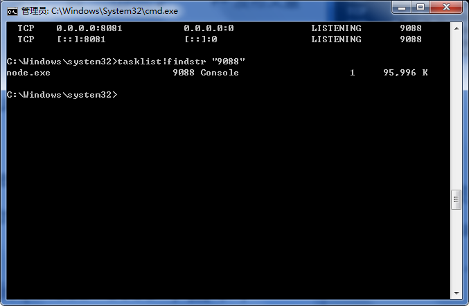

### 后端框架学习笔记6
***

[TOC]

##### 148 : Linux设置网卡信息
A : linux网卡所在的文件是`/etc/sysconfig/network-scripts/`, 配置网卡就是编辑这个文件, 步骤如下:
```shell
[root@otaku ~]# cd/etc/sysconfig/network-scripts/
[root@otakunetwork-scripts]#vim ifcfg-eth0
// 配置如下
DEVICE = eth0|eth1… //设备编号
ONBOOT=yes|no //是否随系统启动而启动
HWADDR=00:0C:29:62:30:22 // MAC地址
TYPE=Ethernet // 类型 (以太网)
BOOTPROTO=static|dhcp|none // 地址分配方式, 要绑定一个具体的网址, 可以设置为static
IPADDR=192.168.1.156 // IP地址
NETMASK=255.255.255.0/PREFIX=24 //子网掩码
GATEWAY=192.168.1.1 // 网关地址
DNS1=192.168.1.1 // DNS地址，可选多个，用编号区别
DEFROUTE=yes|no // 路由设置
IPV6ADDR=fc40::66  // ipv6地址
IPV6_DEFAULTGW=fc40::1  // ipv6网关

// 重启网络服务
[root@otaku ~] service network restart
# 注：当ONBOOT设置为NO时，系统启动不会启动上面的DEVICE。需要将ONBOOT改为YES或是手动启动服务
```


##### 149 : Linux设置SSH使用root登录
A : 很多情况下, 我们都要使用ssh登录其他地方的Linux系统, 此时我们就需要使用ssh服务, 但是通常而言, ssh服务是关闭的, 或者说使用root登录到linux系统的是被禁止的, 所以我们需要设置一下, 具体的操作如下:
```shell
vim /etc/ssh/sshd_config
```
进入编辑模式之后， 用键盘上的方向键移动光标将**PermitRootLogin** 配置项将原先的no修改为 yes, :wq保存, 然后重启ssh服务, 命令如下:
```shell
service ssh  restart
```
然后就可以使用root来登录了


##### 150 : linux系统查看端口使用情况
A : 一些相关的命令, 其实在[后端框架学习笔记2](https://github.com/prayjourney/CS-Java-LearnNotes/blob/master/Summary/Java/JavaEE%E6%A1%86%E6%9E%B6/%E5%90%8E%E7%AB%AF%E6%A1%86%E6%9E%B6%E5%AD%A6%E4%B9%A0%E7%AC%94%E8%AE%B02.md)的第72 : Java开发必会的Linux命令此条目之中有所说明了, 下面是比较详细的使用情况. 注意: **在Linux和windows之中, 两种`netstat -ano`, 没有过滤的话, 所列出的都是所有端口的情况**.
```shell
netstat -ano |grep 8000 #查看8000端口的占用情况, 会列出相关的进程;
lsof -i: 8000           #查看占用8000端口号的进程，一般就是刚未正常退出的进程;
# 查询出来的结果如下
# COMMAND PID USER FD  TYPE  DEVICE    SIZE/OFF NODE NAME
# Google  820 rjx 274u IPv4  0x462974bf13 0t0 TCP #mbp:49466->56.75.247.83:http (CLOSED)
# Google  821 rjx 2756 IPv4  0x462974bf32 0t0 TCP #mbp:49466->56.75.247.83:http (CLOSED)
sudo kill 821           #差杀掉PID为821的进程, 即可重新使用该端口
```


##### 151 : Windows系统查看端口使用情况
A : 151和150的背景其实都是一样的, 那就是当我们要使用的某一个端口被占用的时候, 那么我们就需要采用一些方式去解除这个占用, 不同的是一些命令, 而大概的思路是一样的. 在win系统下和Linux不同之处就在于过滤的方式, 使用的是`findstr`, 而非linux之中的`grep`, 以及查看那个端口被占, 使用的是`tasklist`, 而非是`lsof -i:(port)`, 查杀使用`taskkill /f /t /im "进程id或者进程名称"`, 而linux之中使用的是`kill pid`. 具体的例子如下:

```shell
netstat -aon|findstr "8081"               #查看80801端口使用的情况
tasklist|findstr "9088"                   #查看是哪个进程或者程序占用了8081端口
taskkill /f /t /im "进程id或者进程名称"      #杀掉占用端口的进程
```




##### 152 : Win系统命令行帮助
A : win系统使用 `help`指令, `help cd`就会把cd指令的相关信息打印出来. 命令 `help`可以显示所有的windows命令.


##### 153 : Linux命令行帮助
A : 此部分分为两块, 一部分是是否为内部外部命令, 第二部分是查看命令的帮助
1. **简单来说，在linux系统中有存储位置的命令为外部命令; 没有存储位置的为内部命令, 可以理解为内部命令嵌入在linux的shell中, 所以看不到. type来判断到底为内部命令还是内部命令**.
```shell
[root@localhost ~] type help    #查看help命令的内外类型
help is a shell builtin         #可以看到help为内部命令
[root@localhost ~] type passwd    #查看passwd这条命令是否在linux系统中存在
passwd is /usr/bin/passwd         #可以看到passwd的存储位置，因此存在，为外部命令
[root@localhost ~] type cd      #cd为内部命令 
cd is a shell builtin   
```

2 .获取帮助的途径
- **help**命令: 内部命令的帮助文档. 使用help的格式为: `help  命令名`就可以
```shell
[root@model Documents]# help cd
```
- **command --help**选项: 大多数外部命令都可以使用`command --help`来获取帮助，如果这个命令没有--help选项，则会显示简单的命令 格式   命令字  --help
```shell
date --help     #日期帮助
```
- **man**命令: 以全屏显示在线帮助, 按q退出上下键移动 ,  格式: `man 命令字`
1. -输入 ? 键，向前查找，如 ?-h ，将会搜索含有“-h”的行
2. -输入 / 键，向后查找，如 /-k ，将会向后搜索“-k”的行
3. 按 N或者n(下一个)来进行上一个下一个相关匹配项查看。
4. man手册存放的位置 可以通过manpath命令来查看manpage的位置
```shell
[root@model Documents] manpath manpage
/usr/local/share/man:/usr/share/man/overrides:/usr/share/man/en:/usr/share/man
```
5. man手册页入口
```shell
1 用户指令   2 系统       3 程序库   4 设备   5 文件系统
6 游戏       7 杂项       8 系统指令       9 内核指令
#一般用到的项为：1,5,8
```
使用方法是如下, 就会弹出rm命令的相关介绍和用法
```shell
man rm                 #常用写法
```
- **info**命令: 另一种在线帮助, 和man功能类似, 更加详细, 有不同主题之间的中转功能, 使用格式:`info 命令字`,  按q退出.
```shell
[root@model Documents]info rm        # rm的详细信息
[root@model Documents]info passwd    # 查看命令的详细信息
```
一般而言, 用`help command`,`command --help`, 不足够`man command`来补充, `info command`用的比较少.


##### 154 : Linux--解决ssh自动断线问题
A : 在连接远程SSH服务的时候, 经常会发生长时间后的断线, 或者无响应(无法再键盘输入), 最简单的方法, 就是通过SSH登录到Linux之后, 立即就设置 `TMOUT=0`, 即可一直在线, 如果设置的数字为不为0, 比如是1000, 那么表示1000秒后如果没有人使用, 就会掉线. 如果这种方法无法解决的话, 那就需要去另外设置.总体来说有两个方法：
1. 依赖ssh客户端定时发送心跳. putty, SecureCRT, XShell都有这个功能, 但是并不保险.
```shell
#打开
sudo vim /etc/ssh/ssh_config
# 添加
ServerAliveInterval 20
ServerAliveCountMax 999
```
即每隔20秒, 向服务器发出一次心跳. 若超过999次请求, 都没有发送成功, 则会主动断开与服务器端的连接.

2. 更一劳永逸的方法是: 更改服务器端, 即在ssh远端.
```shell
# 打开
sudo vim/etc/ssh/sshd_config
# 添加
ClientAliveInterval 30
ClientAliveCountMax 6
```
ClientAliveInterval表示每隔多少秒, 服务器端向客户端发送心跳, 是的, 你没看错.下面的ClientAliveInterval表示上述多少次心跳无响应之后, 会认为Client已经断开. 所以, 总共允许无响应的时间是60*3=180秒.


##### 155 : linux 如何改变文件属性与权限
A : 我们知道档案权限对于一个系统的安全重要性，也知道档案的权限对于使用者与群组的相关性， 那如何修改一个档案的属性与权限呢？我们这里介绍几个常用于群组、拥有者、各种身份的权限的指令。如下所示：
```powershell
chgrp :  改变档案所属群组
chown :  改变档案拥有者
chmod :  改变档案的权限, SUID, SGID, SBIT等等的特性
```

1. 改变所属群组: chgrp
```powershell
[root@www ~]# chgrp [-R] dirname/filename ... 
选项与参数：
 -R :进行递归(recursive)的持续变更，亦即连同次目录下的所有档案、目录都更新成为这个群组之意。常常用在变更某一目录内所有的档案之情况。
范例：
[root@www ~]# chgrp users install.log 
[root@www ~]# ls -l 
-rw-r--r-- 1 root users 68495 Jun 25 08:53 install.log 
[root@www ~]# chgrp testing install.log 
chgrp: invalid group name `testing' <== 发生错误信息息啰～找不到这个群组名～
```

2. 改变档案拥有者: chown
```powershell
[root@www ~]# chown [-R] 账号名称 档案或目录 
[root@www ~]# chown [-R] 账号名称:组名 档案或目录
选项与参数： 
   -R : 进行递归(recursive)的持续变更，亦即连同次目录下的所有档案都变更

# 范例：将install.log的拥有者改为bin这个账号：
[root@www ~]# chown bin install.log 
[root@www ~]# ls -l 
-rw-r--r-- 1 bin users 68495 Jun 25 08:53 install.log 

# 范例：将install.log的拥有者与群组改回为root： 
[root@www ~]# chown root:root install.log 
[root@www ~]# ls -l 
-rw-r--r-- 1 root root 68495 Jun 25 08:53 install.log
```

3. 改变权限: chmod
权限的设定方法有两种， 分别可以使用数字或者是符号来进行权限的变更。
- 数字类型改变档案权限
Linux档案的基本权限就有九个，分别是owner/group/others三种身份各有自己的read/write/execute权限
举例：档案的权限字符为 -rwxrwxrwx  这9个权限是三个三个一组的！其中，我们可以使用数字来代表各个权限，各权限的分数对照表如下：
**r:4 　　w:2　　　x:1**
每种身份(owner/group/others)各自的三个权限(r/w/x)分数是需要累加的，例如当权限为： [-rwxrwx---] 分数则是：
owner = rwx = 4+2+1 = 7
group = rwx = 4+2+1 = 7
others= --- = 0+0+0 = 0
所以我们设定权限的变更时，该档案的权限数字就是770啦！变更权限的指令chmod的语法是这样的：
```powershell
[root@www ~]# chmod [-R] xyz 档案或目录 
选项与参数： 
xyz : 就是刚刚提到的数字类型的权限属性，为 rwx 属性数值的相加。 
-R : 进行递归(recursive)的持续变更，亦即连同次目录下的所有档案都会变更
```
举例来说，如果要将.bashrc这个档案所有的权限都设定启用，那么就下达：
```powershell
[root@www ~]# ls -al .bashrc 
-rw-r--r-- 1 root root 395 Jul 4 11:45 .bashrc 
[root@www ~]# chmod 777 .bashrc 
[root@www ~]# ls -al .bashrc 
-rwxrwxrwx 1 root root 395 Jul 4 11:45 .bashrc
```
那如果要将权限变成 -rwxr-xr-- 呢？那么权限的分数就成为 [4+2+1][4+0+1][4+0+0]=754 啰！所以你需要下达：
```powershell
[root@www ~]# chmod 754 filename
```
- 符号类型改变档案权限
还有一个改变权限的方法呦！从之前的介绍中我们可以发现，基本上就九个权限分别是(1)user (2)group (3)others三种身份啦！那么我们就可以藉由u, g, o来代表三种身份的权限！此外， a 则代表 all 亦即全部的身份！那么读写的权限就可以写成r, w, x啰！也就是可以使用底下的方式来看：

来实验一下吧！假如我们要设定一个档案的权限成为『-rwxr-xr-x』时，基本上就是：
o user (u)：具有可读、可写、可执行的权限；
o group 与 others (g/o)：具有可读不执行的权限。
所以就是：
```powershell
[root@www ~]# chmod u=rwx,go=rx .bashrc 
# 注意喔！那个 u=rwx,go=rx 是连在一起的，中间并没有任何空格符！ 
[root@www ~]# ls -al .bashrc 
-rwxr-xr-x 1 root root 395 Jul 4 11:45 .bashrc
```
那么假如是『 -rwxr-xr-- 』这样的权限呢？可以使用『 chmod u=rwx,g=rx,o=r filename 』来设定。此外，如果我们知道原先的文件属性，而我只想要增加.bashrc这个档案的每个人均可写入的权限， 那么我就可以使用：
```powershell
[root@www ~]# ls -al .bashrc 
-rwxr-xr-x 1 root root 395 Jul 4 11:45 .bashrc 
[root@www ~]# chmod a+w .bashrc 
[root@www ~]# ls -al .bashrc 
-rwxrwxrwx 1 root root 395 Jul 4 11:45 .bashrc
```
而如果是要将权限去掉而不改变其他已存在的权限呢？例如要拿掉全部人的可执行权限，则：
```powershell
[root@www ~]# chmod a-x .bashrc 
[root@www ~]# ls -al .bashrc 
-rw-rw-rw- 1 root root 395 Jul 4 11:45 .bashrc
```


##### 156 : git技巧之git cherry-pick
A : **git cherry-pick**可以选择某一个分支中的一个或几个commit(s)来进行操作(操作的对象是**commit**). 当前比如有多个分支, 我们在A临时分支上修改, 但是代码最终要现在B分支上面验证, 那么我们现在已经在A临时分支上面提交了很多次, 此时我们就可以使用`git cherry-pick`指令, 就可以把我们这些在A临时分支上面的提交提交到了B分支上面. 
首先切换到你要添加commit的分支, 当前是B分支,(你要将A分支上面的commit添加到B分支上面，我们可以要先切换到B分支上面).（**注意: cherry-pick是一个本地的操作, 假如你在B分支上pull代码之后, 有人在A分支上有了新的commit, 需要你先在B分支上pull代码, 然后再进行cherry-pick**). ~~在把A分支上我们需要cherry-pick到B分支上的commit, cherry-pick到B分支之上后, 我们需要提交到B的远程分支, 在远程B分支上才会有新的提交产生.~~
```shell
git checkout B
```
将`0771a0c107dbf4c96806d22bbc6ef4c58dfe7075`这个commit合并到B分支上面.  每次cherry-pick所改变的只是commit的这一个部分改变的内容, 其他的不会修改, 有可能会产生冲突, 这种情况需要手动修改. 然后再提交和push, 修改就会在本地和远程生效.
```shell
git cherry-pick 0771a0c107dbf4c  
# 将上面的commit id为0771a0c107dbf4c96806d22bbc6ef4c58dfe7075的提交添加到B分支上面
# 每次 cherry-pick 只是影响本commit id的修改内容, 不会修改其他的内容
```


##### 157 : 如何把两个Map合成一个数据？
A : 因为Map的话,是根据key来取到value值的, 所以在将两个map合成为一个map的时候,我们可以直接合成, 而不是再去一层一层的套, 直接合成只需要将两个Map遍历, 然后将其放入一个新的Map, 这样就只有一个临时的Map产生， 如果将其再加一层key, 那么就是你比较占空间, 而且取值的时候也不方便. 在使用上面, 一般产生一个新的重叠深一个层次的map可以直接遍历, 然后加入统一的新的key即可, 一个使用旧的key的map, 直接使用`putAll()`就可以合并.


##### 158 : git merge 和git rebase的使用和异同
A : 1


##### 159 : Linux服务器如何查看CPU占用率, 内存占用, 带宽占用
A : 1


##### 160 : Java的伪随机数
A :  关键字`Math.random()`, 线性同余法, Math.random产生的随机数是伪随机数, 通过种子, 可以推算出将要产生随机数的序列, 其实意思就是, **通过random随机产生的随机数, 是可以被推断出来产生的位置的, 通过相同的种子, 每一次的随机数是相同的**, 因此是不安全的. 要产生不可预测的随机数, 就要使用`SecureRandom`, 参见[为什么说Java中的随机数都是伪随机数？](https://www.cnblogs.com/greatfish/p/5845924.html), [纯线性同余随机数生成器](https://www.cnblogs.com/xkfz007/archive/2012/03/27/2420154.html),[java Random类详解](https://isky001.iteye.com/blog/1339979), [java.util.Random深入理解](https://www.cnblogs.com/usual2013blog/p/4233136.html), [Java 随机数 Random VS SecureRandom](https://www.jianshu.com/p/2f6acd169202)


##### 161 : HTTP状态码
A : 分为常见的HTTP状态码和大致的识别规则, 具体的见[Http状态码大全](../../前端/Http状态码大全.md)
```shell
# 常见的编码
HTTP 200 - 请求成功
HTTP 400 – 请求无效
HTTP 403 – 禁止访问
HTTP 404 - 无法找到文件
HTTP 405 – 资源被禁止
HTTP 406 – 无法接受
HTTP 407 – 要求代理身份验证
HTTP 410 – 永远不可用
HTTP 414 – 请求 – URI 太长
HTTP 500 – 内部服务器错误
HTTP 501 – 未实现
HTTP 502 – 网关错误

# HTTP状态编码规则
**1xx – 信息提示**
**2xx – 成功**
**3xx – 重定向**
**4xx – 客户端错误**
**5xx – 服务器错误**
```


---
ref:
179.[配置Linux的eth0网卡设置IP地址以及启动方式](https://blog.csdn.net/otaku_den/article/details/68958309),   180.[Linux下配置IPv6地址的方法](https://www.jb51.net/LINUXjishu/206836.html),   181.[Linux网卡配置与绑定](https://www.cnblogs.com/fatt/p/4790569.html),   182.[让Linux系统允许使用root账号远程登录](https://blog.csdn.net/pucao_cug/article/details/64492550),   183.[git cherry-pick合并某个commit](https://www.cnblogs.com/0201zcr/p/5752771.html),   **184.[Git知识总览(一) 从 git clone 和 git status 谈起](https://www.cnblogs.com/ludashi/p/8052739.html),   185.[Git知识总览(二) git常用命令概览](https://www.cnblogs.com/ludashi/p/8053382.html),   186.[Git知识总览(三) 分支的创建、删除、切换、合并以及冲突解决](https://www.cnblogs.com/ludashi/p/8093145.html),   187.[Git知识总览(四) git分支管理之rebase 以及 cherry-pick相关操作](https://www.cnblogs.com/ludashi/p/8116434.html),   188.[Git知识总览(五) Git中的merge、rebase、cherry-pick以及交互式rebase](https://www.cnblogs.com/ludashi/p/8213550.html),   189.[Git知识总览(六) Git分支中的远程操作实践](https://www.cnblogs.com/ludashi/p/8323617.html)**,   190.[error:[Errno 98] Address already in use的解决](https://blog.csdn.net/SSSuperFang/article/details/80039524),   191.[Windows下如何查看某个端口被谁占用](https://blog.csdn.net/qiaomu8559968/article/details/66984822),   192.[windows系统如何查看端口被占用、杀进程](https://jingyan.baidu.com/article/fdffd1f89a0c8af3e98ca10e.html),   193.[Window 中杀死指定端口 cmd 命令行 taskkill](https://www.cnblogs.com/xwer/p/7780571.html),   194.[Windows命令行学习笔记](https://blog.csdn.net/u013472838/article/details/80519963),   195.[windows常用命令](https://blog.csdn.net/qq_32451373/article/details/77743869),   196.[Linux获得命令帮助(学习笔记五)](https://www.cnblogs.com/liunanjava/p/4296164.html),   197.[linux：帮助命令help、man、info](https://www.cnblogs.com/kumata/p/8993914.html),   198.[Linux 命令大全](http://www.runoob.com/linux/linux-command-manual.html),   199.[Linux命令大全(手册)](http://man.linuxde.net/),   200.[Linux--解决ssh自动断线问题](https://blog.csdn.net/qq_34447388/article/details/80203426),   201.[linux 如何改变文件属性与权限](https://www.cnblogs.com/yangjinjin/p/3165076.html),   201.[为什么说Java中的随机数都是伪随机数？](https://www.cnblogs.com/greatfish/p/5845924.html),   202.[纯线性同余随机数生成器](https://www.cnblogs.com/xkfz007/archive/2012/03/27/2420154.html),   203.[java.util.Random深入理解](https://www.cnblogs.com/usual2013blog/p/4233136.html),   204.[Java 随机数 Random VS SecureRandom](https://www.jianshu.com/p/2f6acd169202),   205.[Http状态码大全（404、500、505等）](https://blog.csdn.net/origination_star/article/details/54341293)

