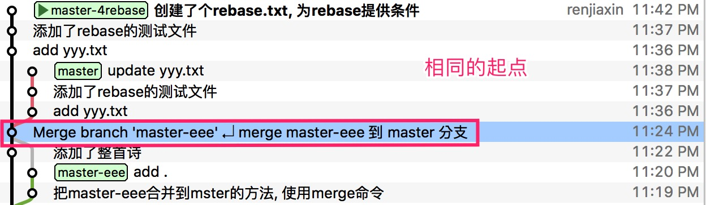
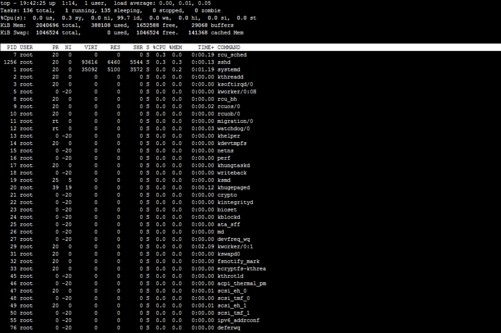
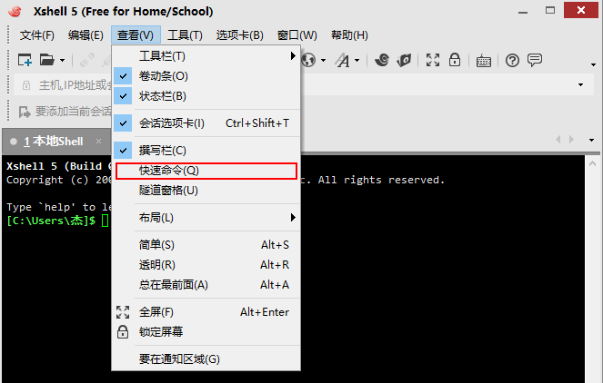
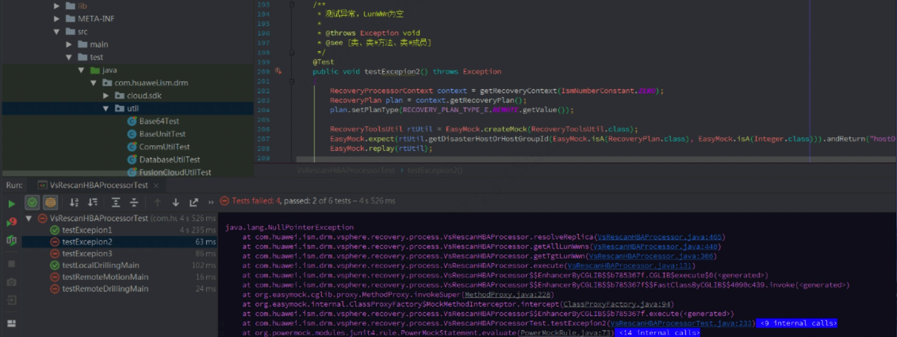
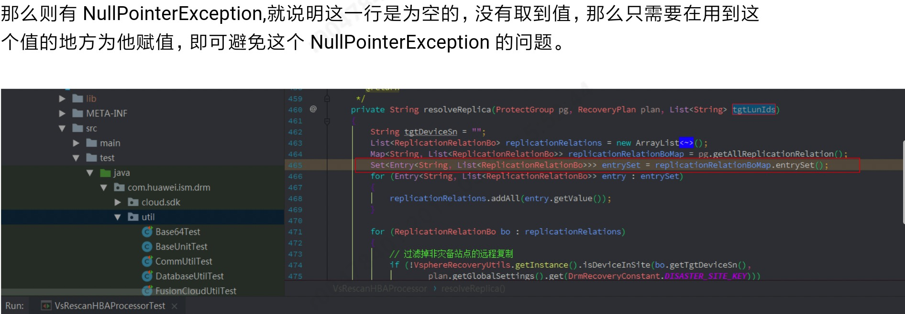

###  后端框架学习笔记6
---

[TOC]

##### 148 : Linux设置网卡信息
A : linux网卡所在的文件是`/etc/sysconfig/network-scripts/`, 配置网卡就是编辑这个文件, 步骤如下:
```shell
[root@otaku ~]# cd/etc/sysconfig/network-scripts/
[root@otakunetwork-scripts]#vim ifcfg-eth0
// 配置如下
DEVICE = eth0|eth1… //设备编号
ONBOOT=yes|no //是否随系统启动而启动
HWADDR=00:0C:29:62:30:22 // MAC地址
TYPE=Ethernet // 类型 (以太网)
BOOTPROTO=static|dhcp|none // 地址分配方式, 要绑定一个具体的网址, 可以设置为static
IPADDR=192.168.1.156 // IP地址
NETMASK=255.255.255.0/PREFIX=24 //子网掩码
GATEWAY=192.168.1.1 // 网关地址
DNS1=192.168.1.1 // DNS地址，可选多个，用编号区别
DEFROUTE=yes|no // 路由设置
IPV6ADDR=fc40::66  // ipv6地址
IPV6_DEFAULTGW=fc40::1  // ipv6网关

// 重启网络服务
[root@otaku ~] service network restart
# 注：当ONBOOT设置为NO时，系统启动不会启动上面的DEVICE。需要将ONBOOT改为YES或是手动启动服务
```


##### 149 : Linux设置SSH使用root登录
A : 很多情况下, 我们都要使用ssh登录其他地方的Linux系统, 此时我们就需要使用ssh服务, 但是通常而言, ssh服务是关闭的, 或者说使用root登录到linux系统的是被禁止的, 所以我们需要设置一下, 具体的操作如下:
```shell
vim /etc/ssh/sshd_config
```
进入编辑模式之后， 用键盘上的方向键移动光标将**PermitRootLogin** 配置项将原先的no修改为 yes, :wq保存, 然后重启ssh服务, 命令如下:
```shell
service ssh  restart
```
然后就可以使用root来登录了


##### 150 : linux系统查看端口使用情况
A : 一些相关的命令, 其实在[后端框架学习笔记2](https://github.com/prayjourney/CS-Java-LearnNotes/blob/master/Summary/Java/JavaEE%E6%A1%86%E6%9E%B6/%E5%90%8E%E7%AB%AF%E6%A1%86%E6%9E%B6%E5%AD%A6%E4%B9%A0%E7%AC%94%E8%AE%B02.md)的第72 : Java开发必会的Linux命令此条目之中有所说明了, 下面是比较详细的使用情况. 注意: **在Linux和windows之中, 两种`netstat -ano`, 没有过滤的话, 所列出的都是所有端口的情况**.
```shell
netstat -ano |grep 8000 #查看8000端口的占用情况, 会列出相关的进程;
lsof -i: 8000           #查看占用8000端口号的进程，一般就是刚未正常退出的进程;
# 查询出来的结果如下
# COMMAND PID USER FD  TYPE  DEVICE    SIZE/OFF NODE NAME
# Google  820 rjx 274u IPv4  0x462974bf13 0t0 TCP #mbp:49466->56.75.247.83:http (CLOSED)
# Google  821 rjx 2756 IPv4  0x462974bf32 0t0 TCP #mbp:49466->56.75.247.83:http (CLOSED)
sudo kill 821           #差杀掉PID为821的进程, 即可重新使用该端口
```


##### 151 : Windows系统查看端口使用情况
A : 151和150的背景其实都是一样的, 那就是当我们要使用的某一个端口被占用的时候, 那么我们就需要采用一些方式去解除这个占用, 不同的是一些命令, 而大概的思路是一样的. 在win系统下和Linux不同之处就在于过滤的方式, 使用的是`findstr`, 而非linux之中的`grep`, 以及查看那个端口被占, 使用的是`tasklist`, 而非是`lsof -i:(port)`, 查杀使用`taskkill /f /t /im "进程id或者进程名称"`, 而linux之中使用的是`kill pid`. 具体的例子如下:

```shell
netstat -aon|findstr "8081"               #查看80801端口使用的情况
tasklist|findstr "9088"                   #查看是哪个进程或者程序占用了8081端口
taskkill /f /t /im "进程id或者进程名称"      #杀掉占用端口的进程
```


##### 152 : Win系统命令行帮助
A : win系统使用 `help`指令, `help cd`就会把cd指令的相关信息打印出来. 命令 `help`可以显示所有的windows命令.


##### 153 : Linux命令行帮助
A : 此部分分为两块, 一部分是是否为内部外部命令, 第二部分是查看命令的帮助
1. **简单来说，在linux系统中有存储位置的命令为外部命令; 没有存储位置的为内部命令, 可以理解为内部命令嵌入在linux的shell中, 所以看不到. type来判断到底为内部命令还是内部命令**.
```shell
[root@localhost ~] type help    #查看help命令的内外类型
help is a shell builtin         #可以看到help为内部命令
[root@localhost ~] type passwd    #查看passwd这条命令是否在linux系统中存在
passwd is /usr/bin/passwd         #可以看到passwd的存储位置，因此存在，为外部命令
[root@localhost ~] type cd      #cd为内部命令 
cd is a shell builtin   
```

2 .获取帮助的途径
- **help**命令: 内部命令的帮助文档. 使用help的格式为: `help  命令名`就可以
```shell
[root@model Documents]# help cd
```
- **command --help**选项: 大多数外部命令都可以使用`command --help`来获取帮助，如果这个命令没有--help选项，则会显示简单的命令 格式   命令字  --help
```shell
date --help     #日期帮助
```
- **man**命令: 以全屏显示在线帮助, 按q退出上下键移动 ,  格式: `man 命令字`
1. -输入 ? 键，向前查找，如 ?-h ，将会搜索含有“-h”的行
2. -输入 / 键，向后查找，如 /-k ，将会向后搜索“-k”的行
3. 按 N或者n(下一个)来进行上一个下一个相关匹配项查看。
4. man手册存放的位置 可以通过manpath命令来查看manpage的位置
```shell
[root@model Documents] manpath manpage
/usr/local/share/man:/usr/share/man/overrides:/usr/share/man/en:/usr/share/man
```
5. man手册页入口
```shell
1 用户指令   2 系统       3 程序库   4 设备   5 文件系统
6 游戏       7 杂项       8 系统指令       9 内核指令
#一般用到的项为：1,5,8
```
使用方法是如下, 就会弹出rm命令的相关介绍和用法
```shell
man rm                 #常用写法
```
- **info**命令: 另一种在线帮助, 和man功能类似, 更加详细, 有不同主题之间的中转功能, 使用格式:`info 命令字`,  按q退出.
```shell
[root@model Documents]info rm        # rm的详细信息
[root@model Documents]info passwd    # 查看命令的详细信息
```
一般而言, 用`help command`,`command --help`, 不足够`man command`来补充, `info command`用的比较少.


##### 154 : Linux--解决ssh自动断线问题
A : 在连接远程SSH服务的时候, 经常会发生长时间后的断线, 或者无响应(无法再键盘输入), 最简单的方法, 就是通过SSH登录到Linux之后, 立即就设置 `TMOUT=0`, 即可一直在线, 如果设置的数字为不为0, 比如是1000, 那么表示1000秒后如果没有人使用, 就会掉线. 如果这种方法无法解决的话, 那就需要去另外设置.总体来说有两个方法：
1. 依赖ssh客户端定时发送心跳. putty, SecureCRT, XShell都有这个功能, 但是并不保险.
```shell
#打开
sudo vim /etc/ssh/ssh_config
# 添加
ServerAliveInterval 20
ServerAliveCountMax 999
```
即每隔20秒, 向服务器发出一次心跳. 若超过999次请求, 都没有发送成功, 则会主动断开与服务器端的连接.

2. 更一劳永逸的方法是: 更改服务器端, 即在ssh远端.
```shell
# 打开
sudo vim/etc/ssh/sshd_config
# 添加
ClientAliveInterval 30
ClientAliveCountMax 6
```
ClientAliveInterval表示每隔多少秒, 服务器端向客户端发送心跳, 是的, 你没看错.下面的ClientAliveInterval表示上述多少次心跳无响应之后, 会认为Client已经断开. 所以, 总共允许无响应的时间是60*3=180秒.


##### 155 : linux 如何改变文件属性与权限
A : 我们知道档案权限对于一个系统的安全重要性，也知道档案的权限对于使用者与群组的相关性， 那如何修改一个档案的属性与权限呢？我们这里介绍几个常用于群组、拥有者、各种身份的权限的指令。如下所示：
```powershell
chgrp :  改变档案所属群组
chown :  改变档案拥有者
chmod :  改变档案的权限, SUID, SGID, SBIT等等的特性
```

1. 改变所属群组: chgrp
```powershell
[root@www ~]# chgrp [-R] dirname/filename ... 
选项与参数：
 -R :进行递归(recursive)的持续变更，亦即连同次目录下的所有档案、目录都更新成为这个群组之意。常常用在变更某一目录内所有的档案之情况。
范例：
[root@www ~]# chgrp users install.log 
[root@www ~]# ls -l 
-rw-r--r-- 1 root users 68495 Jun 25 08:53 install.log 
[root@www ~]# chgrp testing install.log 
chgrp: invalid group name `testing' <== 发生错误信息息啰～找不到这个群组名～
```

2. 改变档案拥有者: chown
```powershell
[root@www ~]# chown [-R] 账号名称 档案或目录 
[root@www ~]# chown [-R] 账号名称:组名 档案或目录
选项与参数： 
   -R : 进行递归(recursive)的持续变更，亦即连同次目录下的所有档案都变更

# 范例：将install.log的拥有者改为bin这个账号：
[root@www ~]# chown bin install.log 
[root@www ~]# ls -l 
-rw-r--r-- 1 bin users 68495 Jun 25 08:53 install.log 

# 范例：将install.log的拥有者与群组改回为root： 
[root@www ~]# chown root:root install.log 
[root@www ~]# ls -l 
-rw-r--r-- 1 root root 68495 Jun 25 08:53 install.log
```

3. 改变权限: chmod
权限的设定方法有两种， 分别可以使用数字或者是符号来进行权限的变更。
- 数字类型改变档案权限
Linux档案的基本权限就有九个，分别是owner/group/others三种身份各有自己的read/write/execute权限
举例：档案的权限字符为 -rwxrwxrwx  这9个权限是三个三个一组的！其中，我们可以使用数字来代表各个权限，各权限的分数对照表如下：
**r:4 　　w:2　　　x:1**
每种身份(owner/group/others)各自的三个权限(r/w/x)分数是需要累加的，例如当权限为： [-rwxrwx---] 分数则是：
owner = rwx = 4+2+1 = 7
group = rwx = 4+2+1 = 7
others= --- = 0+0+0 = 0
所以我们设定权限的变更时，该档案的权限数字就是770啦！变更权限的指令chmod的语法是这样的：
```powershell
[root@www ~]# chmod [-R] xyz 档案或目录 
选项与参数： 
xyz : 就是刚刚提到的数字类型的权限属性，为 rwx 属性数值的相加。 
-R : 进行递归(recursive)的持续变更，亦即连同次目录下的所有档案都会变更
```
举例来说，如果要将.bashrc这个档案所有的权限都设定启用，那么就下达：
```powershell
[root@www ~]# ls -al .bashrc 
-rw-r--r-- 1 root root 395 Jul 4 11:45 .bashrc 
[root@www ~]# chmod 777 .bashrc 
[root@www ~]# ls -al .bashrc 
-rwxrwxrwx 1 root root 395 Jul 4 11:45 .bashrc
```
那如果要将权限变成 -rwxr-xr-- 呢？那么权限的分数就成为 [4+2+1][4+0+1][4+0+0]=754 啰！所以你需要下达：
```powershell
[root@www ~]# chmod 754 filename
```
- 符号类型改变档案权限
还有一个改变权限的方法呦！从之前的介绍中我们可以发现，基本上就九个权限分别是(1)user (2)group (3)others三种身份啦！那么我们就可以藉由u, g, o来代表三种身份的权限！此外， a 则代表 all 亦即全部的身份！那么读写的权限就可以写成r, w, x啰！也就是可以使用底下的方式来看：

来实验一下吧！假如我们要设定一个档案的权限成为『-rwxr-xr-x』时，基本上就是：
o user (u)：具有可读、可写、可执行的权限；
o group 与 others (g/o)：具有可读不执行的权限。
所以就是：
```powershell
[root@www ~]# chmod u=rwx,go=rx .bashrc 
# 注意喔！那个 u=rwx,go=rx 是连在一起的，中间并没有任何空格符！ 
[root@www ~]# ls -al .bashrc 
-rwxr-xr-x 1 root root 395 Jul 4 11:45 .bashrc
```
那么假如是『 -rwxr-xr-- 』这样的权限呢？可以使用『 chmod u=rwx,g=rx,o=r filename 』来设定。此外，如果我们知道原先的文件属性，而我只想要增加.bashrc这个档案的每个人均可写入的权限， 那么我就可以使用：
```powershell
[root@www ~]# ls -al .bashrc 
-rwxr-xr-x 1 root root 395 Jul 4 11:45 .bashrc 
[root@www ~]# chmod a+w .bashrc 
[root@www ~]# ls -al .bashrc 
-rwxrwxrwx 1 root root 395 Jul 4 11:45 .bashrc
```
而如果是要将权限去掉而不改变其他已存在的权限呢？例如要拿掉全部人的可执行权限，则：
```powershell
[root@www ~]# chmod a-x .bashrc 
[root@www ~]# ls -al .bashrc 
-rw-rw-rw- 1 root root 395 Jul 4 11:45 .bashrc
```


##### 156 : git技巧之git cherry-pick
A : **git cherry-pick**可以选择某一个分支中的一个或几个commit(s)来进行操作(操作的对象是**commit**). 当前比如有多个分支, 我们在A临时分支上修改, 但是代码最终要现在B分支上面验证, 那么我们现在已经在A临时分支上面提交了很多次, 此时我们就可以使用`git cherry-pick`指令, 就可以把我们这些在A临时分支上面的提交提交到了B分支上面. 
首先切换到你要添加commit的分支, 当前是B分支,(你要将A分支上面的commit添加到B分支上面，我们可以要先切换到B分支上面).（**注意: cherry-pick是一个本地的操作, 假如你在B分支上pull代码之后, 有人在A分支上有了新的commit, 需要你先在B分支上pull代码, 然后再进行cherry-pick**). ~~在把A分支上我们需要cherry-pick到B分支上的commit, cherry-pick到B分支之上后, 我们需要提交到B的远程分支, 在远程B分支上才会有新的提交产生.~~
```shell
git checkout B
```
将`0771a0c107dbf4c96806d22bbc6ef4c58dfe7075`这个commit合并到B分支上面.  每次cherry-pick所改变的只是commit的这一个部分改变的内容, 其他的不会修改, 有可能会产生冲突, 这种情况需要手动修改. 然后再提交和push, 修改就会在本地和远程生效.
```shell
git cherry-pick 0771a0c107dbf4c  
# 将上面的commit id为0771a0c107dbf4c96806d22bbc6ef4c58dfe7075的提交添加到B分支上面
# 每次 cherry-pick 只是影响本commit id的修改内容, 不会修改其他的内容
```


##### 157 : 如何把两个Map合成一个数据？
A : 因为Map的话,是根据key来取到value值的, 所以在将两个map合成为一个map的时候,我们可以直接合成, 而不是再去一层一层的套, 直接合成只需要将两个Map遍历, 然后将其放入一个新的Map, 这样就只有一个临时的Map产生， 如果将其再加一层key, 那么就是你比较占空间, 而且取值的时候也不方便. 在使用上面, 一般产生一个新的重叠深一个层次的map可以直接遍历, 然后加入统一的新的key即可, 一个使用旧的key的map, 直接使用`putAll()`就可以合并.


##### 158 : git merge 和git rebase的使用和异同
A : 首先git merge和git rebase都是把A分支和B分支的代码合并到一起, 方向是一样的, 比如我们要把B分支上修改的代码合并到A分支, 此时, 我们的操作情况大致相同:
```shell
# 我们需要把B分支上修改的内容合并到A分支上去,
### 操作流程如下
1. git checkout A # 切换到A分支
2. git merge B / git rebase B # 将B分支合并到现在当前的使用分支 A上面
3. 如果有冲突, 解决冲突
4. 完成合并
```
上面的操作流程是一致的 ,但是具体的效果和遗留下来的情况是不一样的, 尤其是轨迹上面差别比较大, merge的合并轨迹很清晰, 但是繁琐, rebase 的合并轨迹很简洁, 但是把一些有用的日志合并了, 轨迹日志看起来不明显, 推荐使用merge, rebase有的情况下会把rebase的这个分支删除掉, 比如上述的B分支,这个和设置有关.
**merge和rebase的原理都是找到上一个公共的根基处, 然后比较合并两分支的差异, 然后把merge和rebase的分支, 合并到当前使用的分支上面, 处理完冲突, 就完成了合并. merge提供了一次合并的日志, 而rebase会把B分支上面从共同根基处以后的提交都在A分支, 当前的提交后面再记录一次日志.所以看起来比较难看. 具体的情况如下图**.
>**git merge之前的准备**, 要将master-eee合并到master


>git merge的情况显示


>**git rebae之前的准备**, 要将master-4rebase合并到master



>git rebase的情况显示


**不管如何, 我们要将B合并到A, 那么首先要将A检出, 然后在命令之中, 操作的是B, 方向很重要, 千万不能弄混淆**
[git merge 与 git rebase的区别](https://blog.csdn.net/liuxiaoheng1992/article/details/79108233), [git rebase vs git merge详解](https://www.cnblogs.com/kidsitcn/p/5339382.html)


##### 159 : git diff 和git log的使用
A : [git diff 的用法](https://www.cnblogs.com/chenfulin5/p/8674565.html)


##### 160 : Linux服务器如何查看CPU占用率, 内存占用
A : Linux下快速查看CPU使用情况比较常用的命令是free, top和ps
- **free**: free命令是一个快速查看内存使用情况的方法，它是对 /proc/meminfo 收集到的信息的一个概述。


- **top**: top命令提供了实时的运行中的程序的资源使用统计。你可以根据内存的使用和大小来进行排序。


- **ps**: ps命令可以实时的显示各个进程的内存使用情况。Reported memory usage information includes %MEM (percent of physical memory used), VSZ (total amount of virtual memory used), and RSS (total amount of physical memory used)。你可以使用 “–sort”选项对进程进行排序，例如按RSS进行排序：ps aux --sort -rss.


- **htop**: htop命令显示了每个进程的内存实时使用率。它提供了所有进程的常驻内存大小、程序总内存大小、共享库大小等的报告。列表可以水平及垂直滚动。


- atop
  atop命令是一个终端环境的监控命令。它显示的是各种系统资源（CPU, memory, network, I/O, kernel）的综合，并且在高负载的情况下进行了彩色标注。

- smem
smem命令允许你统计基于/proc信息的不同进程和用户的内存使用情况。内存使用情况的分析可以导出图表（如条形图和饼图--图形界面窗口才提供）。

- vmstat
vmstat命令显示实时的和平均的统计，覆盖CPU、内存、I/O等内容。例如内存情况，不仅显示物理内存，也统计虚拟内存。

- nmon
nmon是一个基于ncurses的系统基准测试工具，它可以监控CPU、内存、I/O、文件系统及网络资源等的互动模式。对于内存的使用，它可以实时的显示 总/剩余内存、交换空间等信息。

- memstat
memstat是一个有效识别executable(s), process(es) and shared libraries使用虚拟内存情况的命令。给定一个进程ID，memstat可以列出这个进程相关的可执行文件、数据和共享库。

- 图形化支持GNOME System Monitor和KDE System Monitor
GNOME System Monitor 是一个显示最近一段时间内的CPU、内存、交换区及网络的使用情况的视图工具。它还提供了一种查看CPU及内存使用情况的方法。


##### 161 : Java的伪随机数
A :  关键字`Math.random()`, 线性同余法, Math.random产生的随机数是伪随机数, 通过种子, 可以推算出将要产生随机数的序列, 其实意思就是, **通过random随机产生的随机数, 是可以被推断出来产生的位置的, 通过相同的种子, 每一次的随机数是相同的**, 因此是不安全的. 要产生不可预测的随机数, 就要使用`SecureRandom`, 参见[为什么说Java中的随机数都是伪随机数？](https://www.cnblogs.com/greatfish/p/5845924.html), [纯线性同余随机数生成器](https://www.cnblogs.com/xkfz007/archive/2012/03/27/2420154.html),[java Random类详解](https://isky001.iteye.com/blog/1339979), [java.util.Random深入理解](https://www.cnblogs.com/usual2013blog/p/4233136.html), [Java 随机数 Random VS SecureRandom](https://www.jianshu.com/p/2f6acd169202)


##### 162 : HTTP状态码
A : 分为常见的HTTP状态码和大致的识别规则, 具体的见[Http状态码大全](../../前端/Http状态码大全.md)
```shell
# 常见的编码
HTTP 200 - 请求成功
HTTP 400 – 请求无效
HTTP 403 – 禁止访问
HTTP 404 - 无法找到文件
HTTP 405 – 资源被禁止
HTTP 406 – 无法接受
HTTP 407 – 要求代理身份验证
HTTP 410 – 永远不可用
HTTP 414 – 请求 – URI 太长
HTTP 500 – 内部服务器错误
HTTP 501 – 未实现
HTTP 502 – 网关错误

# HTTP状态编码规则
**1xx – 信息提示**
**2xx – 成功**
**3xx – 重定向**
**4xx – 客户端错误**
**5xx – 服务器错误**
```


##### 163 : git stash的使用
A : **git stash用于将当前工作区的修改暂存起来，就像堆栈一样，可以随时将某一次缓存的修改再重新应用到当前工作区**。一旦用好了这个命令，会极大提高工作效率。比如有两个分支, 当我们在A分支上做了很多修改, 但是B分支有一个问题要我们修改, 那么此时怎么办呢? 把A提交一下吗? 这样A的功能还没有开发完成, 也不好, 于是就有git stash的用武之地了。
>- 发现有一个类是多余的，想删掉它又担心以后需要查看它的代码，想保存它但又不想增加一个脏的提交。这时就可以考虑`git stash`。
>- 使用git的时候，我们往往使用分支（branch）解决任务切换问题，例如，我们往往会建一个自己的分支去修改和调试代码, 如果别人或者自己发现原有的分支上有个不得不修改的bug，我们往往会把完成一半的代码`commit`提交到本地仓库，然后切换分支去修改bug，改好之后再切换回来。这样的话往往log上会有大量不必要的记录。其实如果我们不想提交完成一半或者不完善的代码，但是却不得不去修改一个紧急Bug，那么使用`git stash`就可以将你当前未提交到本地（和服务器）的代码推入到Git的栈中，这时候你的工作区间和上一次提交的内容是完全一样的，所以你可以放心的修Bug，等到修完Bug，提交到服务器上后，再使用`git stash apply`将以前一半的工作应用回来。

以上就是两种常见的使用git stash的场景。git stash用法如下:
1.**stash当前修改**: `git stash`会把所有未提交的修改（包括暂存的和非暂存的）都保存起来，用于后续恢复当前工作目录。 比如下面的中间状态，**通过git stash命令推送一个新的储藏，当前的工作目录就干净了**。

```shell
$ git status
On branch master
Changes to be committed:
new file:   style.css
Changes not staged for commit:
modified:   index.html

$ git stash
Saved working directory and index state WIP on master: 5002d47 our new homepage
HEAD is now at 5002d47 our new homepage

$ git status
On branch master
nothing to commit, working tree clean
```
**需要说明一点，stash是本地的，不会通过git push命令上传到git server上。**实际应用中推荐给每个stash加一个message，用于记录版本，使用git stash save取代git stash命令。示例如下：

```shell
$ git stash save "test-cmd-stash"
Saved working directory and index state On autoswitch: test-cmd-stash
HEAD 现在位于 296e8d4 remove unnecessary postion reset in onResume function
$ git stash list
stash@{0}: On autoswitch: test-cmd-stash
```
2.重新应用缓存的stash: 可以通过`git stash pop`命令恢复之前缓存的工作目录，输出如下：

```shell
$ git status
On branch master
nothing to commit, working tree clean
$ git stash pop
On branch master
Changes to be committed:
    new file:   style.css
Changes not staged for commit:
    modified:   index.html
Dropped refs/stash@{0} (32b3aa1d185dfe6d57b3c3cc3b32cbf3e380cc6a)
```
**这个指令将缓存堆栈中的第一个stash删除，并将对应修改应用到当前的工作目录下**。
你也可以使用`git stash apply`命令，将缓存堆栈中的stash多次应用到工作目录中，但并不删除stash拷贝。命令输出如下：

```shell
$ git stash apply
On branch master
Changes to be committed:
    new file:   style.css
Changes not staged for commit:
    modified:   index.html
```
3.查看现有stash: 可以使用`git stash list`命令，一个典型的输出如下：

```shell
$ git stash list
stash@{0}: WIP on master: 049d078 added the index file
stash@{1}: WIP on master: c264051 Revert "added file_size"
stash@{2}: WIP on master: 21d80a5 added number to log
在使用git stash apply命令时可以通过名字指定使用哪个stash，默认使用最近的stash（即stash@{0}）。
```
4.移除stash: 可以使用`git stash drop`命令，后面可以跟着stash名字，或者使用git stash clear命令，删除所有缓存的stash。下面是一个示例：

```shell
$ git stash list
stash@{0}: WIP on master: 049d078 added the index file
stash@{1}: WIP on master: c264051 Revert "added file_size"
stash@{2}: WIP on master: 21d80a5 added number to log
$ git stash drop stash@{0}
Dropped stash@{0} (364e91f3f268f0900bc3ee613f9f733e82aaed43)
```
git stash 真的是一个非常强大的命令, 当我们有提交答操作, 但是又有新的代码不想提交, 或者新的功能不想提交, 就可以先暂存起来, 然后再去操作比如commit, push, merge都可以操作, 然后把这些操作做完之后, 就可以将其提取出来, 输入git stash pop即可.


##### 164 : java.lang.String#split方法 以点分割字符串无法正常拆分字符串
A : 有如下两种做法, 第一种错误, 无法直接拆分, 需要转义符协助
```java
//错误的做法
String ip="192.168.11.23";
String[] spstr_IP=ip.split(".");//这种方式无法拆分在ip字符串
```
```java
//可以正确拆分的做法
String ip="192.168.11.23";
String[] spstr_IP=ip.split("\\.");
```


##### 165 : Linux scp命令的使用
A : Linux scp命令用于Linux之间复制文件和目录。scp是 secure copy的缩写, scp是linux系统下基于ssh登陆进行安全的远程文件拷贝命令。语法如下：
```powershell
scp [-1246BCpqrv] [-c cipher] [-F ssh_config] [-i identity_file]
[-l limit] [-o ssh_option] [-P port] [-S program]
[[user@]host1:]file1 [...] [[user@]host2:]file2
# 简易写法:
scp [可选参数] file_source file_target 
```

参数说明：
> -1： 强制scp命令使用协议ssh1
> -2： 强制scp命令使用协议ssh2
> -4： 强制scp命令只使用IPv4寻址
> -6： 强制scp命令只使用IPv6寻址
> -B： 使用批处理模式（传输过程中不询问传输口令或短语）
> -C： 允许压缩。（将-C标志传递给ssh，从而打开压缩功能）
> -p：保留原文件的修改时间，访问时间和访问权限。
> -q： 不显示传输进度条。
> -r： 递归复制整个目录。
> -v：详细方式显示输出。scp和ssh(1)会显示出整个过程的调试信息。这些信息用于调试连接，验证和配置问题。
> -c cipher： 以cipher将数据传输进行加密，这个选项将直接传递给ssh。
> -F ssh_config： 指定一个替代的ssh配置文件，此参数直接传递给ssh。
> -i identity_file： 从指定文件中读取传输时使用的密钥文件，此参数直接传递给ssh。
> -l limit： 限定用户所能使用的带宽，以Kbit/s为单位。
> -o ssh_option： 如果习惯于使用ssh_config(5)中的参数传递方式，
> -P port：注意是大写的P, port是指定数据传输用到的端口号
> -S program： 指定加密传输时所使用的程序。此程序必须能够理解ssh(1)的选项。

1.从本地复制到远程
```shell
命令格式：
scp local_file remote_username@remote_ip:remote_folder 
或者 
scp local_file remote_username@remote_ip:remote_file 
或者 
scp local_file remote_ip:remote_folder 
或者 
scp local_file remote_ip:remote_file 
第1,2个指定了用户名，命令执行后需要再输入密码，第1个仅指定了远程的目录，文件名字不变，第2个指定了文件名；
第3,4个没有指定用户名，命令执行后需要输入用户名和密码，第3个仅指定了远程的目录，文件名字不变，第4个指定了文件名；
```
应用实例：
```shell
scp /home/space/music/1.mp3 root@www.runoob.com:/home/root/others/music 
scp /home/space/music/1.mp3 root@www.runoob.com:/home/root/others/music/001.mp3 
scp /home/space/music/1.mp3 www.runoob.com:/home/root/others/music 
scp /home/space/music/1.mp3 www.runoob.com:/home/root/others/music/001.mp3 
```
复制目录命令格式：
```shell
scp -r local_folder remote_username@remote_ip:remote_folder 
# 或者 
scp -r local_folder remote_ip:remote_folder 
第1个指定了用户名，命令执行后需要再输入密码；
第2个没有指定用户名，命令执行后需要输入用户名和密码；
# 应用实例：
scp -r /home/space/music/ root@www.runoob.com:/home/root/others/ 
scp -r /home/space/music/ www.runoob.com:/home/root/others/ 
上面命令将本地 music 目录复制到远程 others 目录下。
```
2.从远程复制到本地
从远程复制到本地, 只要将从本地复制到远程的命令的后2个参数调换顺序即可, 例子如下:
应用实例:
```shell
scp root@www.runoob.com:/home/root/others/music /home/space/music/1.mp3 
scp -r www.runoob.com:/home/root/others/ /home/space/music/
```
3.防火墙的关注
1. 如果远程服务器防火墙有为scp命令设置了指定的端口，我们需要使用 -P 参数来设置命令的端口号，命令格式和实际例子如下：
```shell
scp 命令使用端口号 4588
scp -P 4588 remote@www.runoob.com:/usr/local/sin.sh /home/administrator
```
2. 使用scp命令要确保使用的用户具有可读取远程服务器相应文件的权限，否则scp命令是无法起作用的。


##### 166 : Git远程仓库地址变更本地修改/本地仓库上传到gitlab
A: 方法如下:
公司搬移, 作为git仓库的服务器IP地址变了, 本地代码挺多, 重新检出太占时间, 可以修改一个什么配置让我本地仓库和新的远程仓库建立关联吗, 答案是肯定的! **这个问题的问法有两种, 一种是git远程仓库的IP修改了, 然后修改本地的远程仓库IP就可以了, 第二种问法是比如我们获取了一个仓库, 然后想上传到gitlab, 我们该怎么做(这种情况下首先需要在gitlab创建新的仓库,然后操作)**, 下面就是公共的方法去修改仓库地址.

方法有很多，这里简单介绍几种, 以下均以项目git_test为例： 
老地址：http://192.168.1.12:9797/john/git_test.git 
新地址：http://192.168.100.235:9797/john/git_test.git 
远程仓库名称： origin

方法1: **通过命令直接修改远程地址**(推荐的方式)
```shell
进入git_test根目录
git remote 查看所有远程仓库， git remote xxx 查看指定远程仓库地址
git remote set-url origin http://192.168.100.235:9797/john/git_test.git
```

方法2: 通过命令先删除再添加远程仓库
```shell
进入git_test根目录
git remote 查看所有远程仓库， git remote xxx 查看指定远程仓库地址
git remote rm origin
git remote add origin http://192.168.100.235:9797/john/git_test.git
```

方法3: 直接修改配置文件
```shell
进入git_test/.git
vim config 

[core] 
repositoryformatversion = 0 
filemode = true 
logallrefupdates = true 
precomposeunicode = true 
[remote "origin"] 
url = http://192.168.100.235:9797/shimanqiang/assistant.git 
fetch = +refs/heads/*:refs/remotes/origin/* 
[branch "master"] 
remote = origin 
merge = refs/heads/master

修改 [remote “origin”]下面的url即可
```

方法4: 通过第三方git客户端修改。
```shell
以SourceTree为例，点击 仓库 -> 仓库配置 -> 远程仓库 即可管理此项目中配置的所有远程仓库， 而且这个界面最下方还可以点击编辑配置文件，同样可以完成方法3。
```


##### 167 : Linux下如何实时查看日志
A: 我们查看日志，可以使用watch, vim, tail, cat等命令, 但是试试查看, 一般使用的是tail, 现在将tail的使用方法做一个介绍, 如下:
tail -f app.log
**命令格式** :**tail[必要参数][选择参数][文件]**
**命令功能** :**用于显示指定文件末尾内容，不指定文件时，处理输入信息。常用作查看日志文件**。
**命令参数** : 如下, 重点使用的是-f 和-n参数, 分别是循环读取和 行数显示, 一般要配合grep同时使用
>**-f 循环读取**
-q 不显示处理信息
-v 显示详细的处理信息
-c<数目> 显示的字节数
**-n<行数> 显示行数**
–pid=PID 与-f合用,表示在进程ID,PID死掉之后结束.
-q, –quiet, –silent 从不输出给出文件名的首部
-s, –sleep-interval=S 与-f合用,表示在每次反复的间隔休眠S秒

**搜寻过滤字符串**: grep 搜寻字符串 filename
**退出**: 按ctrl+c 退出
```java
tail -f -n 100 catalina.out | grep java  
循环查看catalina.out文件之中,后一百行的日志内容, 突出显示java关键字.
```
与之对应的是head命令, 用来查看最初的文件内容, 常用的相关的指令有如下, vim, tail, head, watch,  cat, more, less等指令.


##### 168 : xShell添加快捷键
A: 我们在操作xShell的时候, 往往有一些常用的命令, 需要反复输入一条语句, 但是如何加入呢? 下面就介绍方法. 方法路径**菜单栏-->查看-->快速命令-->添加快速命令**



##### 169 : 查看问题发生的调用堆栈
A: 我们在解决问题的时候, 要查看错误堆栈信息, 主要有两个, **一个是错误发生的最开始出现的地方**, 也就是调用的时候,第一次出错的地方, 第二个就是我们所调用的方法之中其调用方法之中的最根本的出错的地方. 举个例子就是你用微信支付,支付失败,  第一个出错的地方就是我们看到的微信支付失败这儿, 支付的时候, 肯定要调用零钱或者银行卡, 零钱没了, 那就调用银行卡, 发现银行卡也没钱, 所以才报错, 那么它的堆栈信息就是 ,最顶层是银行卡没钱的提示, 最底层就是支付失败的提示, 我们解决问题还是要从银行卡没钱这个方面去解决.,通过下面的图片示例说明:






##### 170 : git log查看提交日志记录乱码
A: 运行Git Bash窗口, 在该窗口导航条(即最上面)右键, 选择Options−>Text, 找到下面两处
Locale: 选择 `zh_CN`, Charector set:选择 `UTF-8` ,重启bash, 即可查看中文log


##### 171 : git bash查看文件名称是数字乱码
A: 在bash之中输入`git config --global core.quotepath false`即可.


##### 172 : chrome清理缓存
A: 选中URL, 组合按键**CTRL+SHIFT+DEL**, 弹出选项, 即可清理缓存, 还有就是在设置--->更多工具--->清理缓存, 直接点击按钮即可清理缓存.


##### 173 : 什么是IDEA里面的 artifact?
A: artifact是IDEA里面的对于Java Web项目的一种组织形式, 可以理解为是一个存档发布的形式.


我们知道Java web发布的形式是通过war包的形式放在tomcat等容器之中的, 所以我们正式要运行的项目肯定也是一个war包的形式, 但是在运行的时候会解压, 当我们在写代码, 并且调试的时候, 我们也需要将其放在tomcat容器之中, 这时候, 我们**在IDEA之中实际的项目组织方式**, 就是通过把项目关联到一个artifcat, 然后其实代表了一个要输出的目录结构.


在IDEA之中有两种组织类型, 类型和具体别去如下:
> war模式：将WEB工程以包的形式上传到服务器 ；
> war exploded模式：将WEB工程以当前文件夹的位置关系上传到服务器；

两种模式的区别
>1.war模式这种可以称之为是发布模式, 看名字也知道, 这是先打成war包, 再发布; 
>2.war exploded模式是直接把文件夹, jsp页面 , classes等等移到Tomcat 部署文件夹里面, 进行加载部署. 因此这种方式支持热部署, 一般在开发的时候也是用这种方式.
>3.在平时开发的时候, 使用热部署的话, 应该对Tomcat进行相应的设置, 这样的话修改的jsp界面什么的东西才可以及时的显示出来.


---
ref:
179.[配置Linux的eth0网卡设置IP地址以及启动方式](https://blog.csdn.net/otaku_den/article/details/68958309),   180.[Linux下配置IPv6地址的方法](https://www.jb51.net/LINUXjishu/206836.html),   181.[Linux网卡配置与绑定](https://www.cnblogs.com/fatt/p/4790569.html),   182.[让Linux系统允许使用root账号远程登录](https://blog.csdn.net/pucao_cug/article/details/64492550),   183.[git cherry-pick合并某个commit](https://www.cnblogs.com/0201zcr/p/5752771.html),   **184.[Git知识总览(一) 从 git clone 和 git status 谈起](https://www.cnblogs.com/ludashi/p/8052739.html),   185.[Git知识总览(二) git常用命令概览](https://www.cnblogs.com/ludashi/p/8053382.html),   186.[Git知识总览(三) 分支的创建、删除、切换、合并以及冲突解决](https://www.cnblogs.com/ludashi/p/8093145.html),   187.[Git知识总览(四) git分支管理之rebase 以及 cherry-pick相关操作](https://www.cnblogs.com/ludashi/p/8116434.html),   188.[Git知识总览(五) Git中的merge、rebase、cherry-pick以及交互式rebase](https://www.cnblogs.com/ludashi/p/8213550.html),   189.[Git知识总览(六) Git分支中的远程操作实践](https://www.cnblogs.com/ludashi/p/8323617.html)**,   190.[error:[Errno 98] Address already in use的解决](https://blog.csdn.net/SSSuperFang/article/details/80039524),   191.[Windows下如何查看某个端口被谁占用](https://blog.csdn.net/qiaomu8559968/article/details/66984822),   192.[windows系统如何查看端口被占用、杀进程](https://jingyan.baidu.com/article/fdffd1f89a0c8af3e98ca10e.html),   193.[Window 中杀死指定端口 cmd 命令行 taskkill](https://www.cnblogs.com/xwer/p/7780571.html),   194.[Windows命令行学习笔记](https://blog.csdn.net/u013472838/article/details/80519963),   195.[windows常用命令](https://blog.csdn.net/qq_32451373/article/details/77743869),   196.[Linux获得命令帮助(学习笔记五)](https://www.cnblogs.com/liunanjava/p/4296164.html),   197.[linux：帮助命令help、man、info](https://www.cnblogs.com/kumata/p/8993914.html),   198.[Linux 命令大全](http://www.runoob.com/linux/linux-command-manual.html),   199.[Linux命令大全(手册)](http://man.linuxde.net/),   200.[Linux--解决ssh自动断线问题](https://blog.csdn.net/qq_34447388/article/details/80203426),   201.[linux 如何改变文件属性与权限](https://www.cnblogs.com/yangjinjin/p/3165076.html),   201.[为什么说Java中的随机数都是伪随机数？](https://www.cnblogs.com/greatfish/p/5845924.html),   202.[纯线性同余随机数生成器](https://www.cnblogs.com/xkfz007/archive/2012/03/27/2420154.html),   203.[java.util.Random深入理解](https://www.cnblogs.com/usual2013blog/p/4233136.html),   204.[Java 随机数 Random VS SecureRandom](https://www.jianshu.com/p/2f6acd169202),   205.[Http状态码大全（404、500、505等）](https://blog.csdn.net/origination_star/article/details/54341293),   206.[Linux下快速查看CPU使用情况的相关命令](https://blog.csdn.net/boonya/article/details/68922919),   207.[Linux系统查看CPU使用率命令](https://www.cnblogs.com/gongchixin/articles/7998054.html),   208.[git merge 与 git rebase的区别](https://blog.csdn.net/liuxiaoheng1992/article/details/79108233),   209.[git rebase vs git merge详解](https://www.cnblogs.com/kidsitcn/p/5339382.html),   210.[git-stash用法小结](https://www.cnblogs.com/tocy/p/git-stash-reference.html),   211.[git stash 用法](https://www.cnblogs.com/yanghaizhou/p/5269899.html),   212.[java.lang.string split 以点分割字符串无法正常拆分字符串](https://www.cnblogs.com/liaojie970/p/4828425.html),   213.[linux的scp命令](http://www.runoob.com/linux/linux-comm-scp.html),   214.[scp命令详解](https://www.cnblogs.com/likui360/p/6011769.html),   215.[Git远程仓库地址变更本地如何修改](https://blog.csdn.net/asdfsfsdgdfgh/article/details/54981823 ),   216.[将本地项目上传到gitlab下](https://blog.csdn.net/litianxiang_kaola/article/details/74075151),   217.[Linux中cat、more、less、tail、head命令的区别](https://www.cnblogs.com/losbyday/p/5856106.html),   218.[Linux下如何实时查看日志](https://blog.csdn.net/wf787283810/article/details/77049849),   219.[tail -f 实时查看日志文件 linux查看日志后100行](https://blog.csdn.net/qq_16280911/article/details/83177672),   220.[linux实时查看更新日志命令](https://blog.csdn.net/understandaa/article/details/78869873),   221.[Xshell如何添加快捷命令](http://www.xshellcn.com/xsh_column/kuaijie-mingling.html),   222.[GIT使用log命令显示中文乱码](https://www.cnblogs.com/yanzige/p/9810333.html),   223.[git bash中 中文显示为数字](https://blog.csdn.net/zhujiangtaotaise/article/details/74424157),   224.[谷歌Chrome浏览器清理缓存的两种方式](https://blog.csdn.net/iehadoop/article/details/83033083),   225.[Tomcat部署时war和war exploded区别以及平时踩得坑](https://blog.csdn.net/xlgen157387/article/details/56498938),   226.[idea 使用Tomcat 部署war 和 war exploded的区别](https://www.cnblogs.com/oukele/p/10064565.html),   227.[IDEA里面的Artifact到底是什么？](https://blog.csdn.net/qq_41933149/article/details/95041460)