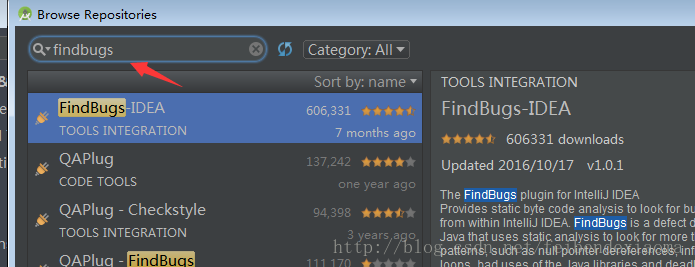
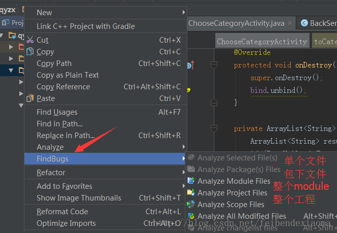

### FindBugs-IDEA插件的使用

***

#### 前言

Findbugs很多人都并不陌生，Eclipse中有插件可以帮助查找代码中隐藏的bug，IDEA中也有这款插件。这个插件可以帮助我们查找隐藏的bug，**比较重要的功能就是查找潜在的null指针**。 
在编写代码的过程中,我们可能不会一直记得检查空的引用,在我们测试时可能很难发现问题,但是应用上线之后，面对大量的用户，很多问题就会浮现出来。所以在编码时，使用findbugs检查一下很有必要。

#### 安装

安装完之后，重启studio,会发现左下角会出现findbugs的图标 

可以分析单个文件，包下面的所有文件，整个module下的文件，整个project下的文件，右键想要分析的文件名/包名/module名/project

分析完之后就会出现结果面板

点击对应的item在右边会定位到具体的代码

根据需要可以进行更改，其中**Correctness这个错误使我们重点关注的对象，这里大多是空指针的错误，根据提示进行处理**。

#### 一些常见的错误信息 

##### Bad practice 代码中的一些坏习惯
Class names should start with an upper case letter 主要包括类名的命名，以大写字母开头 
Method names should start with a lower case letter 方法名以小写字母开头 
Field names should start with a lower case letter 字段名以小写字母开头 
equals()method does not check for null argument equals()方法应该检查非空 
Class defines equals() and uses Object.hashCode() 一个类覆写了equals方法，没有覆写hashCode方法，使用了Object对象的hashCode方法 
Method ignores exceptional return value 方法忽略返回值的异常信息 
Equals method should not assume anything about the type of its argument equals(Object o)方法不能对参数o的类型做任何的假设。比较此对象与指定的对象。当且仅当该参数不为 null，并且是表示与此对象相同的类型的对象时，结果才为 true。 
Comparison of String objects using == or != 用==或者！=去比较String类型的对象 
Method might ignore exception 方法可能忽略异常 
Method invokes System.exit() 在方法中调用System.exit(…)语句，考虑用RuntimeException来代替 
Method ignores result of InputStream.read() InputStream.read方法忽略返回的多个字符，如果对结果没有检查就没法正确处理用户读取少量字符请求的情况。 

##### Dodgy code 糟糕的代码
Switch statement found where default case is missing Switch没有默认情况下执行的case语句 
Switch statement found where one case falls through to the next case Switch语句中一个分支执行后又执行了下一个分支。通常case后面要跟break 或者return语句来跳出。 
Dead store to local variable 该指令为局部变量赋值，但在其后的没有对她做任何使用。通常，这表明一个错误，因为值从未使用过。 
Write to static field from instance method 在实例方法写入静态字段 
Redundant nullcheck of value known to be non-null 方法中对不为空的值进行为空的判断。 
Method uses the same code for two branches 此方法使用相同的代码，以实现两个有条件的分支。检查以确保这是不是一个编码错误 
Exception is caught when Exception is not thrown 在try/catch块中捕获异常，但是异常没有在try语句中抛出而RuntimeException又没有明确的被捕获 
Integral division result cast to double or float 整形数除法强制转换为double或者float类型。 
Possible null pointer dereference due to return value of called method 方法的返回值没有进行是否为空的检查就重新赋值，这样可能会出现空指针异常。 
Useless object created 对象创建了并没有用 
Unread public/protected field 没有用到的字段 
Internationalization 关于代码国际化相关方面的
Consider using Locale parameterized version of invoked method 
使用平台默认的编码格式对字符串进行大小写转换，这可能导致国际字符的转换不当。使用以下方式对字符进行转换 

##### Performance 关于代码性能相关方面的
Boxing/unboxing to parse a primitive 类型转换 比如字符串转换成int 应该使用Integer.parseInt(“”) 代替Integer.valueOf(“”) 
Method concatenates string using + in aloop 
每次循环里的字符串+连接，都会新产生一个string对象，在java中，新建一个对象的代价是很昂贵的，特别是在循环语句中，效率较低 
解决办法：使用StringBuffer或者StringBuilder重用对象。 
Private method is never called 私有方法没有被调用 
Explicit garbage collection;extremely dubious except in benchmarking code 
在代码中显式的调用垃圾回收命名，这样做并不能起作用。在过去，有人在关闭操作或者finalize方法中调用垃圾回收方法导致了很多的性能浪费。这样大规模回收对象时会造成处理器运行缓慢。 
Unread field:should this field be static? 没有用到的static 字段 
should be a static inner class 此内部类应该使用static修饰 

##### Experimental
Method may fail to clean up stream or resource on checked exception 
这种方法可能无法清除（关闭，处置）一个流，数据库对象，或其他资源需要一个明确的清理行动 
解决方法：流的关闭都写在finally里面 
Malicious code vulnerability 关于恶意破坏代码相关方面的
May expose internal representation by incorporating reference to mutable object 
此代码把外部可变对象引用存储到对象的内部表示。如果实例受到不信任的代码的访问和没有检查的变化危及对象和重要属性的安全。存储一个对象的副本，在很多情况下是更好的办法。 
Field isn’t final but should be 此字段前应该加final 
Field isn’t final and can’t be protected from malicious code 此字段前应该加final 
Field should be package protected 
一个静态字段是可以被恶意代码或其他的包访问修改。可以把这种类型的字段声明为final类型的以防止这种错误。 

##### Multithreaded correctness 关于代码正确性相关方面的
Static DateFormat DateFormat 在多线程中本身就是不安全的，如果在线程范围中共享一个DateFormat的实例而不使用一个同步的方法在应用中就会出现一些奇怪的行为。 
Call to static DateFormat DateFormats多线程使用本事就是不安全的,改进方法：需要创建多实例或线程同步 

##### Correctness 关于代码正确性相关方面的

**主要是没有对变量进行不为空判定,在特殊情况可能发生空指针异常**

Nullcheck of value previously dereferenced 此代码之前废弃null值检查。解决办法 进行null检查 
Possible null pointer dereference 可能为null 
Null pointer dereference 对象赋为null值后 没有被重新赋值 
Possible null pointer dereference in method on exception path 在异常null值处理分支调用的方法上，可能存在对象去除引用操作 
value is null and guaranteed to be dereferenced on exception path exception分支上，存在引用一个null对象的方法，引发空指针异常。 
Self comparison of value with itself 方法中对一个局部变量自身进行比较运算，并可说明错误或逻辑错误。请确保您是比较正确的事情。 
An apparent infinite recursive loop 明显的无限迭代循环,将导致堆栈溢出.

ref:

1.[FindBugs-IDEA插件的使用](https://blog.csdn.net/feibendexiaoma/article/details/72821781),   2.[使用FindBugs-IDEA插件找到代码中潜在的问题](https://blog.csdn.net/fancy_xty/article/details/51718687),   3.[FindBugs规则整理](https://blog.csdn.net/jdsjlzx/article/details/21472253),   4.[Findbugs 使用备忘录](https://my.oschina.net/hoodlake/blog/126735), 5.[findBug 错误修改指南](https://blog.csdn.net/jdsjlzx/article/details/34487299),   6.[findbugs 出错类型及对应解释](https://blog.csdn.net/yan8024/article/details/44218799),   7.[常用 Java 静态代码分析工具的分析与比较](https://www.ibm.com/developerworks/cn/java/j-lo-statictest-tools/index.html),   8.[编写自定义检测器](https://www.ibm.com/developerworks/cn/java/j-findbug2/index.html),   9.[详解FindBugs的各项检测器](https://blog.csdn.net/yang1982_0907/article/details/18606171),   10.[FindBugs错误修改指南](https://blog.csdn.net/u014352080/article/details/48631295)