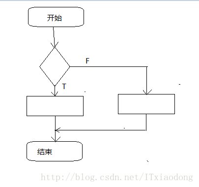

### 圈复杂度详解和优化以及工具
***
#### 现象
>代码设计不规范。

当项目规模达到一定的程度，比如达到十万行的代码量。那么项目肯定存在有些类特别大，方法特别多、特别长。以上因素会导致什么后果呢？ 
1. 一个类没有做到单一指责，后期对这个类改动会导致其他功能出现Bug。 
2. 代码阅读性较差，维护困难。
>没有一个准确的标准去衡量代码结构复杂的程度。

各个公司都会有自己的规范，但是开发中很少人能够去完全遵循规范。而且没有一个明确的标准去衡量代码的复杂程度，而且人工去检测代码的复杂程度是很繁琐的。因此我们急需一个标准去检测代码结构复杂的程度，而圈复杂度这个技术就能够很好的去衡量代码的复杂程度。


####  圈复杂度的定义
> 1. 圈复杂度是用来衡量一个模块**判定结构**的复杂程度，数量上表现为独立路径的条数。而独立路径就是在控制流程图中从起点到终点的一条回路。 
>控制流图（CFG, Control flow graph）也叫控制流程图。是一个过程或程序的抽象表现。常以数据结构链的形式表示。 常见的控制流图结构（简化版）如下：
>
> 2. 圈复杂度高在代码中的表现形式：在一段代码中含有很多的 if / else 语句或者其他的判定语句（if / else , switch / case , for , while , | | , ? , …）。


##### 采用圈复杂度去衡量代码的好处
```
指出极复杂模块或方法，这样的模块或方法也许可以进一步细化。
```
开发者可以根据圈复杂度的值来确定哪块代码需要优化。
```
限制程序逻辑过长。
```
McCabe&Associates 公司建议尽可能使 V（G） <= 10。NIST（国家标准技术研究所）认为在一些特定情形下，模块圈复杂度上限放宽到 15 会比较合适。
> 因此圈复杂度 V（G）与代码质量的关系如下： 
> V（G） ∈ [ 0 , 10 ]：代码质量不错； 
> V（G） ∈ [ 11 , 15 ]：可能存在需要拆分的代码，应当尽可能想措施重构； 
> V（G）∈ [ 16 , ∞ )：必须进行重构；
```
方便做测试计划，确定测试重点。
```
许多研究指出一模块及方法的圈复杂度和其中的缺陷个数有相关性，许多这类研究发现圈复杂度和模块或者方法的缺陷个数有正相关的关系：圈复杂度最高的模块及方法，其中的缺陷个数也最多，做测试时做重点测试。


##### 圈复杂度的计算
```
1. 手工计算：
     计算公式1：V（G）= E - N + 2
     计算公式2：V（G）= 区域数 = 判定节点数 + 1123
```
> V（G）：代表圈复杂度，有些地方会用 M 或者 CC 表示。 
> E ：代表控制流程图的路径数量。 
> N ：代表节点数量。 
> 区域数：需修改控制流图，每一个结束点都增加一个到启始点的边。找出在控制流图中构成回路的个数。 
> 判定节点数：控制流图中判定节点的个数。如if，case的个数

这里有个简单的控制流程图，大家可以参考： 

手工计算的缺点：
- 繁琐
- 低效
```
工具计算（SourceMonitor 或者 javancss) 其实有很多.
```
> 优点是： 
> ① 完美弥补手工计算的缺点。 
> ② 快速简便 。 
> ③ 能计算复杂嵌套代码的圈复杂度 。 
> ④ 能计算类和方法的圈复杂度。 
> ⑤ 能以图或者表格显示结果。 
> 缺点是： 
> ① 代码结构很复杂时，工具计算和手工计算的误差会比较大。 
> ② 打开的项目很大时，有些文件扫描不到。


##### 优化方法
针对以上问题，网络上有很多种优化方法，这里列举两个常见的代码段进行分析。（以下计算全用Sourcemonitor工具计算，人工计算和工具计算会有一点误差，可以接受）
> 1. 多个 if – else 语句

优化前V（G）= 6
```java
String getValue(String param) {
        String value ; 
        if("name".equals(param)) {
            value = mName;
        } else if("hight".equals(param)) {
            value = mHight;
        } else if("X".equals(param)) {
            value = mX;
        } else if("Y".equals(param)) {
            value = mY;
        } else {
            value = null ;
        }
        return value;
    }123456789101112131415
```
优化后V（G）= 1
```java
    private static String getName() {
        return mName;
    }
    private static String getHight() {
        return mHight;
    }
    private static String getX() {
        return mX;
    }
    private static String getY() {
        return mY;
    }123456789101112
```
> 2、多个 case 语句

优化前：V(G) = 8
```java
private static String getName(String id) {
        switch(id){
            case "0000":
                name = "小吴";
                break;
            case "0001":
                name = "小王";
                break;
            case "0002":
                name = "老赵";
                break;
            case "0003":
                name = "小李";
                break;
            case "0004":
                name = "小刘";
                break;
            case "0005":
                name = "小张";
                break;
            default:
                break;
        }
    return name;
}
```
优化后：V(G) = 5
```java
private static String getName(String id) {
        String name = null;   
        String[] idArray = new String[]{"0000", "0001", "0002", "0003", "0004", "0005"};
        String[] nameArray = new String[]{"小吴", "小王", "老赵", "小李", "小刘", "小张"};
        for(int i = 0;i < idArray.length;i++) {
            Object peopleID = idArray[i];
            if(peopleID.equals(id)) {
                name = nameArray[i];
                 break;
            }
        }
        return name;
    }
```

> 3、还有一些形式能导致圈复杂度增高，例如：if –if– else嵌套，switch —case —if—嵌套等 
> 具体的优化涉及到代码的重构方面，这里就不在赘述了，需要了解的可以去 Google ：【如何降低圈复杂度】即可得解


##### 总结
1. if else ，switch case 等判断语句会增加圈复杂度，导致代码复杂，不方便维护。
2. 以后写代码按照制定的代码规范来，同时避免写 if，for 多层嵌套的代码。
3. 写完代码可以用圈复杂度来检测代码的质量，圈复杂度高的代码需要重构。
4. 圈复杂度只是衡量代码判定结构的复杂程度，不代表圈复杂度低的代码质量就好，但是圈复杂度高的代码肯定不好。


ref:
1.[圈复杂度详解](https://blog.csdn.net/ITxiaodong/article/details/69938970),   2.[代码度量工具——SourceMonitor的学习和使用](https://www.cnblogs.com/bangerlee/archive/2011/09/18/2178172.html),   3.[使用工具Source Monitor测量您Java代码的环复杂度](http://jerrywang-sap.iteye.com/blog/2428386),   4.[圈复杂度](https://blog.csdn.net/lg707415323/article/details/7790660),   5.[JAVA 静态代码分析--圈复杂度检查-javancss](https://blog.csdn.net/happyteafriends/article/details/16880643),   6.[软件质量之道：SourceMonitor](https://blog.csdn.net/feng_ma_niu/article/details/40594799)