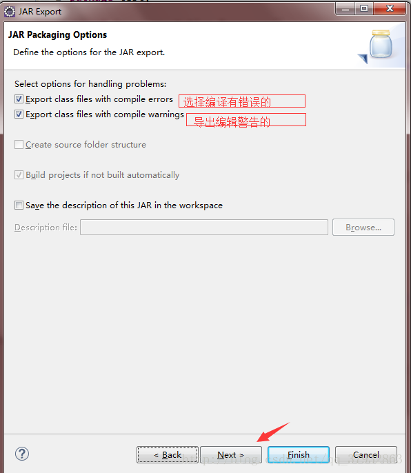
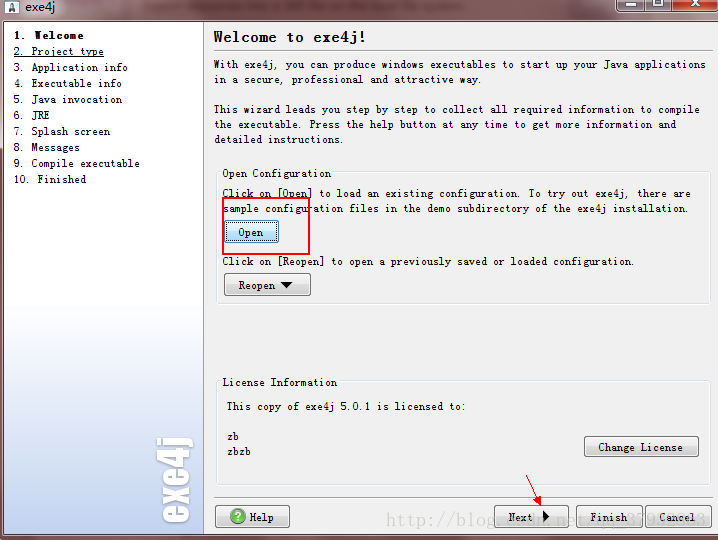
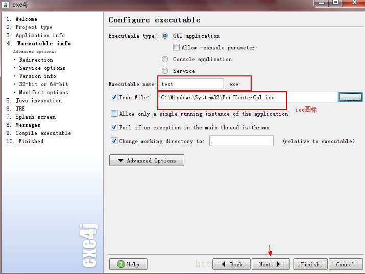
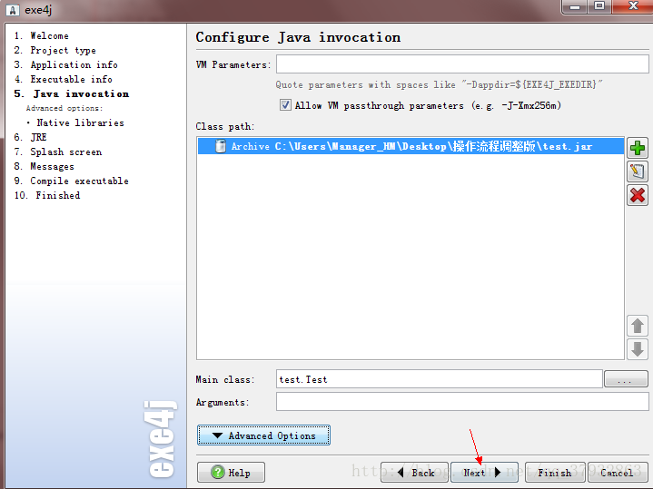
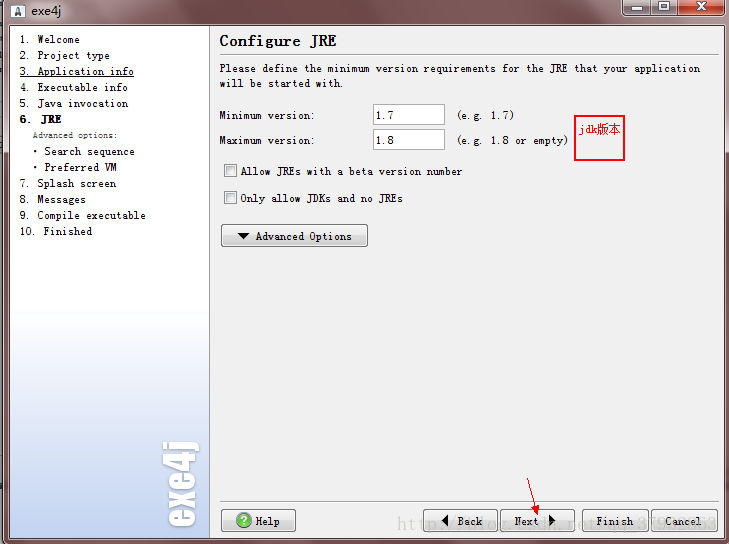
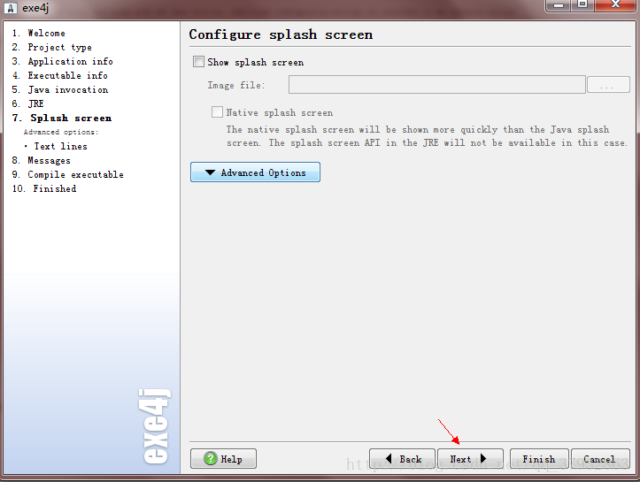
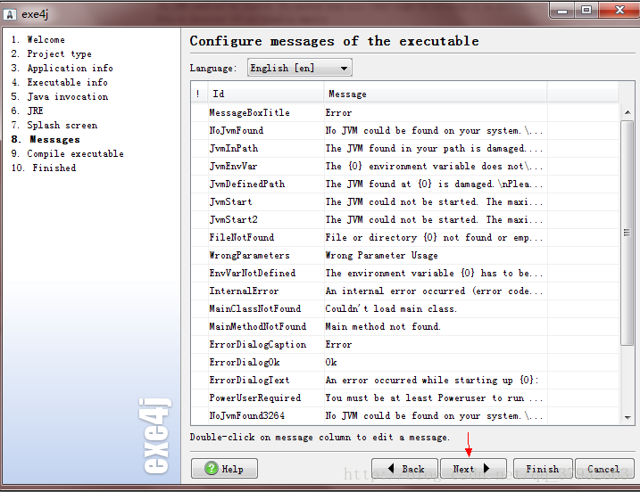
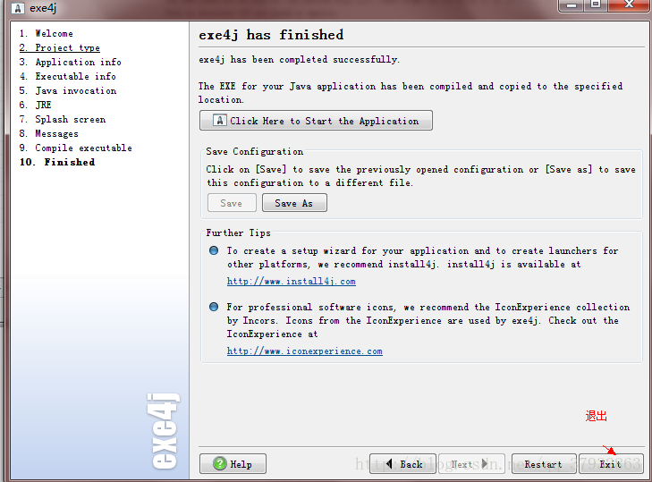

###  用Eclipse将写好的项目打包成jar包，后续再打成exe程序

***

##### 将项目打成jar包

1.首先选择要打包的文件，导出JAR file


2.next




这样在我们的存储路径里面，就可以找到刚才打成jar包的文件了


此外还有一种简便的方法，就是选择**可执行的jar包**，然后选择运行的主类，直接可以生成

注意：需要注意的是**主清单文件 “MANIFEST.MF”**问题

>由于是打包引用了第三方jar包的Java项目，故需要自定义配置文件MANIFEST.MF，在该项目下建立文件MANIFEST.MF，内容如下：
>
>```java
>Manifest-Version: 1.0
>Class-Path: lib/commons-codec.jar lib/commons-httpclient-3.1.jar lib/commons-logging-1.1.jar lib/log4j-1.2.16.jar lib/jackson-all-1.8.5.jar
>Main-Class: main.KillCheatFans
>```

> ```java
> 1、Class-Path: 和Main-Class: 后边都有一个空格，必须加上，否则会打包失败，错误提示为：Invalid header field；
>
> 2、假设我们的项目打包后为KillCheatFans.jar，那么按照上面的定义，应该在 KillCheatFans.jar的同层目录下建立一个lib文件夹（即lib文件和打包的jar文件
> 在同一个目录下），并将相关的jar包放在里面。否则将会出现“Exception in thread "main" java.lang.NoClassDefFoundError”的错误；
>
> 3、Main-Class后面是类的全地址，比如你的主文件是KillCheatFans.java，文件里打包为package com.main; 那么这里就写com.main.KillCheatFans，
> 不要加.java后缀，主文件地址写错将会出现“找不到或无法加载主类”的错误；
>
> 4、写完Main-Class后一定要回车（即最后一行是空白行），让光标到下一行，这样你生成的jar包才能找到你的主class去运行，
>
> 否则将会出现“jar中没有主清单属性”的错误。
> ```


##### 将jar包打成exe程序

此步骤我们使用的工具是exe4j，按照如下截图，基本上没有障碍



















至此打成exe结束，在我们选择的位置就可以看到了

注明：如果是java项目在一台没有安装jre的电脑上面运行，那么需要将jdk的jre包一起打进去


ref：

1.[用Eclipse将写好的项目打包成jar包，后续再打成exe程序](http://blog.csdn.net/qq_37932863/article/details/73558497),   2.[如何用Eclipse打jar包](http://www.cnblogs.com/chenxqNo01/p/6372555.html),   3.[Eclipse将引用了第三方jar包的Java项目打包成jar文件的两种方法](http://www.cnblogs.com/lanxuezaipiao/p/3291641.html),   4.[手把手教你如何把java代码，打包成jar文件以及转换为exe可执行文件](http://blog.csdn.net/sunkun2013/article/details/13167099)