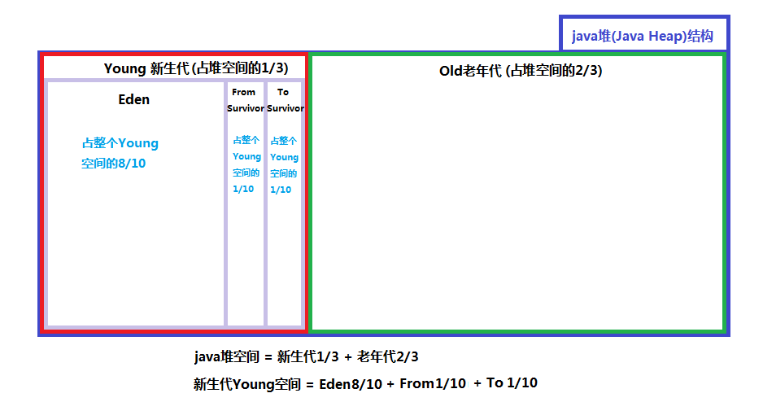

### Java虚拟机内存模型与垃圾回收
***

#### Java虚拟机内存模型
JVM内存模型可以分为两个部分, 如下图所示, **堆和方法区是所有线程共有的**, 而虚拟机栈, 本地方法栈和程序计数器则是线程私有的. 下面我们就来一一分析一下这些不同区域的作用. **以下五个部分就是Java虚拟机的内存内存空间组成**.

#### 虚拟机内存各部分作用
##### 1.程序计数器
**定义**:

- 一块较小的内存空间, **可看作当前线程正在执行的字节码的行号指示器**. 也就是说, **程序计数器里面记录的是当前线程正在执行的那一条字节码指令的地址**. *但如果当前线程正在执行的是一个本地方法, 那么此时程序计数器为空*.

**作用**:
1. 字节码解释器通过改变程序计数器来依次读取指令, 从而实现代码的流程控制, 如: 顺序执行, 选择, 循环, 异常处理.
2. 在多线程的情况下, 程序计数器用于记录当前线程执行的位置, 从而当线程被切换回来的时候能够知道该线程上次运行到哪儿了.

**特点**:
1. 是一块较小的存储空间
2. **线程私有. 每条线程都有一个程序计数器**.
3. **是唯一一个不会出现`OutOfMemoryError`的内存区域**.
4. 生命周期随着线程的创建而创建, 随着线程的结束而死亡.

##### 2. Java虚拟机栈(JVM Stack)
**定义**:
- **Java虚拟机栈是描述Java方法运行过程的内存模型**, Java虚拟机栈会为每一个即将运行的Java方法创建一块叫做“栈帧”的区域，这块区域用于存储该方法在运行过程中所需要的一些信息, 这些信息包括: 1.局部变量表(存放基本数据类型变量, 引用类型的变量, returnAddress类型的变量); 2.操作数栈; 3. 动态链接; 4. 方法出口信息等.  

**作用**:
- 当一个方法即将被运行时, Java虚拟机栈首先会在Java虚拟机栈中为该方法创建一块**“栈帧”**, 栈帧中**包含局部变量表, 操作数栈, 动态链接, 方法出口信息等**. *当方法在运行过程中需要创建局部变量时, 就将局部变量的值存入栈帧的局部变量表中, 当这个方法执行完毕后, 这个方法所对应的栈帧将会出栈, 并释放内存空间*.
>注意: 人们常说, Java的内存空间分为“栈”和“堆”, 栈中存放局部变量, 堆中存放对象.
这句话不完全正确! 这里的“堆”可以这么理解, 存放的是Java对象, 但这里的“栈”只代表了Java虚拟机栈中的局部变量表部分. 真正的Java虚拟机栈是由一个个栈帧组成, 而每个栈帧中都拥有: 局部变量表, 操作数栈, 动态链接, 方法出口信息等.

**特点**:
1. 局部变量表的创建是在方法被执行的时候, 随着栈帧的创建而创建. 而且, 局部变量表的大小在编译时期就确定下来了, 在创建的时候只需分配事先规定好的大小即可. 此外, 在方法运行的过程中局部变量表的大小是不会发生改变的.
2. Java虚拟机栈会出现两种异常: `StackOverFlowError`和`OutOfMemoryError`.
   a) `StackOverFlowError`: 
   若Java虚拟机栈的内存大小不允许动态扩展, 那么当线程请求栈的深度超过当前Java虚拟机栈的最大深度的时候, 就抛出`StackOverFlowError`异常. 
   b) `OutOfMemoryError`: 
   若Java虚拟机栈的内存大小允许动态扩展, 且当线程请求栈时内存用完了, 无法再动态扩展了, 此时抛出`OutOfMemoryError`异常.
3. **Java虚拟机栈也是线程私有的**, 每个线程都有各自的Java虚拟机栈, 而且随着线程的创建而创建, 随着线程的死亡而死亡. 
> 注意: `StackOverFlowError`和`OutOfMemoryError`的异同? 
`StackOverFlowError`表示当前线程申请的栈超过了事先定好的栈的最大深度, 但内存空间可能还有很多.  而`OutOfMemoryErro`r是指当线程申请栈时发现栈已经满了, 而且内存也全都用光了.

##### 3. 本地方法栈
**定义**:
**本地方法栈和Java虚拟机栈实现的功能类似, 只不过本地方法区是本地方法运行的内存模型**.

**作用**:
本地方法被执行的时候, 在本地方法栈也会创建一个栈帧, 用于存放**该本地方法**的局部变量表, 操作数栈, 动态链接, 出口信息. 方法执行完毕后相应的栈帧也会出栈并释放内存空间.

**特点**:
也会抛出`StackOverFlowError`和`OutOfMemoryError`异常.
>本地方法
简单地讲, 一个Native Method就是一个java调用非java代码的接口. 一个Native Method是这样一个java的方法: 该方法的实现由非java语言实现, 比如C语言, 这个特征并非java所特有, 很多其它的编程语言都有这一机制, 比如在C++中, 你可以用extern "C"告知C++编译器去调用一个C的函数.

##### 4. 堆
**定义**:
**堆是用来存放对象的内存空间, 几乎所有的对象都存储在堆中**.

**特点**:
1. **线程共享 , 整个Java虚拟机只有一个堆**, 所有的线程都访问同一个堆. 而程序计数器, Java虚拟机栈, 本地方法栈都是一个线程对应一个的.
2. 在虚拟机启动时创建
3. **垃圾回收的主要场所**, *所以此处有各种对象标记和内存回收的问题*.
4. **可以进一步细分为: 新生代, 老年代, (永久代) . 新生代又可被分为: Eden, S0(From Survior), S1(To Survior)**. 
   不同的区域存放具有不同生命周期的对象. 这样可以根据不同的区域使用不同的垃圾回收算法, 从而更具有针对性, 从而更高效.

5. 堆的大小既可以固定也可以扩展, 但主流的虚拟机堆的大小是可扩展的, 因此当线程请求分配内存, 但堆已满, 且内存已满无法再扩展时, 就抛出`OutOfMemoryError`.

##### 5. 方法区
**定义**:
Java虚拟机规范中定义方法区是堆的一个逻辑部分

**作用**:
方法区中存放已经被虚拟机加载的类信息, 常量, 静态变量, 即时编译器编译后的代码等.

**特点**:
1. **线程共享 **,方法区是堆的一个逻辑部分, 因此和堆一样, 都是线程共享的. **整个虚拟机中只有一个方法区**.
2. 永久代, 方法区中的信息一般需要长期存在,  而且它又是堆的逻辑分区, 因此用堆的划分方法, 我们把方法区称为老年代. 永久代在Java1.8中已经除去, 改而取代的是**元空间**.
3. 内存回收效率低 , 方法区中的信息一般需要长期存在, 回收一遍内存之后可能只有少量信息无效. 对方法区的内存回收的主要目标是: 对**常量池的回收**和 对**类型的卸载**.
4. Java虚拟机规范对方法区的要求比较宽松, 和堆一样, 允许固定大小, 也允许可扩展的大小, 还允许不实现垃圾回收.
>运行时常量池
>方法区中存放三种数据: 类信息, 常量, 静态变量, 即时编译器编译后的代码. **其中常量存储在运行时常量池中**.
>我们一般在一个类中通过`public static final`来声明一个常量. 这个类被编译后便生成Class文件, 这个类的所有信息都存储在这个class文件中. 当这个类被Java虚拟机加载后, class文件中的常量就存放在方法区的运行时常量池中. 而且在运行期间, 可以向常量池中添加新的常量. 如: String类的intern()方法就能在运行期间向常量池中添加字符串常量. 当运行时常量池中的某些常量没有被对象引用, 同时也没有被变量引用, 那么就需要垃圾收集器回收.

##### 6. 直接内存
**直接内存是除Java虚拟机之外的内存, 但也有可能被Java使用**.
在NIO中引入了一种基于通道和缓冲的IO方式. 它可以通过调用本地方法直接分配Java虚拟机之外的内存, 然后通过一个存储在Java堆中的`DirectByteBuffer`对象直接操作该内存, 而无需先将外面内存中的数据复制到堆中再操作, 从而提升了数据操作的效率. **直接内存的大小不受Java虚拟机控制, 但既然是内存, 当内存不足时就会抛出OOM异常**.

##### **总结**
| **名称**     | **特征**                                                     | **作用**                                                     | **配置参数**                             | **异常**                                |
| ------------ | ------------------------------------------------------------ | ------------------------------------------------------------ | ---------------------------------------- | --------------------------------------- |
| 程序计数器   | 线程私有, 占用内存小, 生命周期与线程相同                     | 大致为字节码行号指示器                                       | 无                                       | 无                                      |
| 栈区         | 线程私有, 生命周期与线程相同, 使用连续的内存空间, 分为本地方法栈和虚拟机栈 | Java 方法执行的内存模型, 存储局部变量表, 操作栈, 动态链接, 方法出口等信息 | `-Xss`                                   | `StackOverflowError` `OutOfMemoryError` |
| java堆       | 线程共享, 生命周期与虚拟机相同, 可以不使用连续的内存地址     | 保存对象实例, 所有对象实例(含数组)都要在堆上分配             | `-Xms,-Xmx,-Xmn`                         | `OutOfMemoryError`                      |
| 方法区       | 线程共享, 生命周期与虚拟机相同, 可以不使用连续的内存地址     | 存储已被虚拟机加载的类信息, 常量, 静态变量, 即时编译器编译后的代码等数据 | `-XX:PermSize:16M`  `-XX:MaxPermSize64M` | `OutOfMemoryError`                      |
| 运行时常量池 | 方法区的一部分, 具有动态性                                   | 存放字面量及符号引用                                         |                                          |                                         |

#### 堆内存
**Java中的堆是JVM所管理的最大的一块内存空间, 主要用于存放各种类的实例对象**. 在 Java 中, 堆被划分成两个不同的区域: 新生代(Young Generation), 老年代(Old Generation). 新生代又被划分为三个区域: Eden, S0(From Survivor),S1(To Survivor).这样划分的目的是为了使 JVM 能够更好的管理堆内存中的对象, 包括内存的分配以及回收. 

堆的内存模型大致为: Java堆=新生代+老年代. 堆的大小可通过参数`–Xms`(堆的初始容量), `-Xmx`(堆的最大容量)来指定, 其中, 新生代(Young)被细分为 Eden 和 两个 Survivor 区域, 这两个Survivor区域分别被命名为from和to, 以示区分, 也叫s0和s1, 二者的大小是相等的, 每一个时刻只有一个区域被使用, 另一个区域为空. 可通过`-Xmn`参数来指定新生代的大小，也可以通过`-XX:SurvivorRation`来调整Eden及Survivor Space的大小.  默认情况下, **Eden: s0  :s1 = 8 : 1 : 1**. 即: Eden = 8/10 的新生代空间大小,s0= s1 = 1/10 的新生代空间大小. JVM 每次只会使用Eden和其中的一块Survivor区域来为对象服务，所以无论什么时候, 总是有一块 Survivor 区域是空闲着的. **新生代实际可用的内存空间为 9/10 ( 即90% )的新生代空间**. ***新生代和老年代的默认比例 young: old= 1:2(还是1:3), 记不太清楚了***. 老年代用于存放经过多次新生代GC仍然存活的对象, 例如缓存对象, 新建的对象也有可能直接进入老年代(*但是新建的对象绝大多数是存放在新生代的eden区域的*), 主要有两种情况: 1.大对象, 可通过启动参数设置`-XX:PretenureSizeThreshold=1024`(单位为字节, 默认为0, 1024相当于一个阈值)来代表超过多大时就不在新生代分配, 而是直接在老年代分配. 2. 大的数组对象, 且数组中无引用外部对象. **老年代所占的内存大小为`-Xmx`对应的值减去`-Xmn`对应的值**. 如果在堆中没有内存完成实例分配, 并且堆也无法再扩展时, 将会抛出`OutOfMemoryError`异常. 老年代和新生代的比例,使用`-XX:NewRatio`来设置, 如`-XX:NewRatio= 2`,则表示新生代占堆空间的1/3, 老年代占2/3. 下面列举众多命令之中的几个常用和容易掌握的配置选项

|               指令                | 含义                                                         |
| :-------------------------------: | ------------------------------------------------------------ |
|              `-Xms`               | **初始堆大小**. 如: -Xms256m                                 |
|              `-Xmx`               | **最大堆大小**. 如:-Xmx512m                                  |
|              `-Xmn`               | **新生代大小**.通常为 Xmx 的 1/3 或 1/4.新生代 = Eden + 2 个 Survivor 空间. 实际可用空间为 = Eden + 1 个 Survivor, 即 90% |
|              `-Xss`               | JDK1.5+ 每个线程堆栈大小为 1M, 一般来说如果栈不是很深的话, 1M 是绝对够用了的. |
|          `-XX:NewRatio`           | **新生代与老年代的比例**, 如 –XX:NewRatio=2, 则新生代占整个堆空间的1/3, 老年代占2/3 |
|       `-XX:SurvivorRation`        | **新生代中 Eden 与 Survivor 的比值**. 默认值为 8. 即 Eden 占新生代空间的 8/10, 另外两个 Survivor 各占 1/10 |
|          `-XX:PermSize`           | 永久代(方法区)的初始大小                                     |
|         `-XX:MaxPermSize`         | 永久代(方法区)的最大值                                       |
|       `-XX:+PrintGCDetails`       | 打印 GC 信息                                                |
| `-XX:+HeapDumpOnOutOfMemoryError` | 让虚拟机在发生内存溢出时 Dump 出当前的内存堆转储快照, 以便分析用 |

#### 垃圾回收

#### 类加载机制

ref:
1.[JAVA本地方法详解，什么是JAVA本地方法？](https://www.cnblogs.com/chen-jack/p/7904510.html),   2.[深入理解JVM(一)——JVM内存模型](https://blog.csdn.net/qq_34173549/article/details/79612540),  3. [JVM内存模型详解](https://blog.csdn.net/genius_ge/article/details/76151179),   4.[JVM的内存区域划分](https://www.cnblogs.com/dolphin0520/p/3613043.html),   5.[程序猿的日常——JVM内存模型与垃圾回收](https://www.cnblogs.com/xing901022/p/7725961.html),   6.[JVM内存模型](https://blog.csdn.net/u012152619/article/details/46968883),   7.