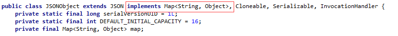
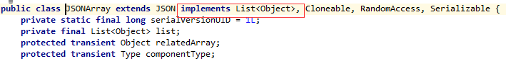
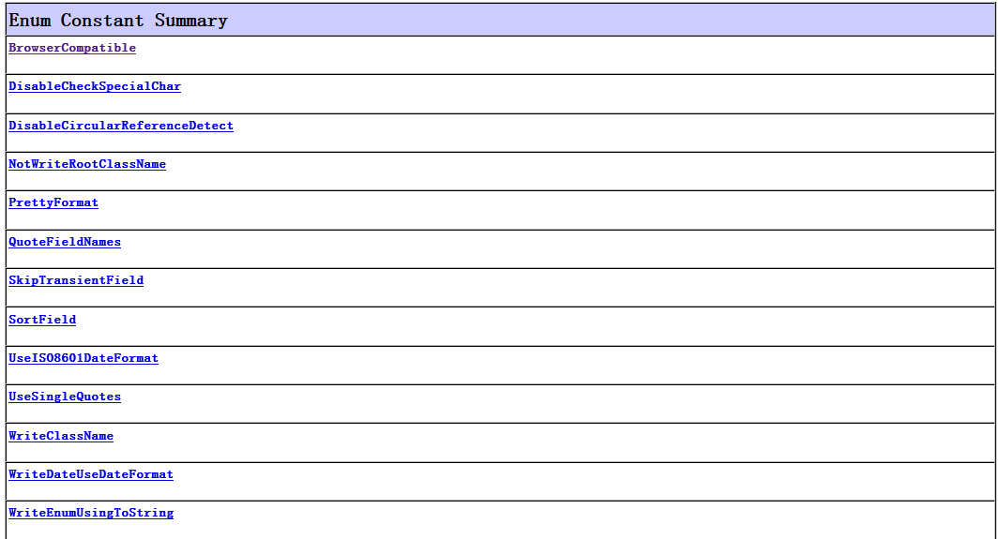

### FastJSON解析JSON

***

##### 需要用到的类的总览和一些情况
**创建JSON对象的时候, 就使用JSONObject来创建**, 即可.FasJSON对于json格式字符串的解析主要用到了`JSON`, `JSONObject`, `JSONArray`三个类:

**JSON**: fastJson的解析器, *用于**JSON格式字符串**与**JSON对象及javaBean**之间的转换*. **转换就用这个类**.

**JSONObjec**: fastJson提供的json对象.

**JSONArray**: fastJson提供json数组对象.

我们可以把**JSONObject当成一个Map<String,Object>**来看, 只是JSONObject提供了更为丰富便捷的方法, 方便我们对于对象属性的操作. 源码如下图.



同样我们可以把**JSONArray当做一个List\<Object\>**, 可以把**JSONArray看成JSONObject对象**的一个集合. 源码如下图.



此外，由于JSONObject和JSONArray继承了JSON，所以说也可以直接使用两者对JSON格式字符串与JSON对象及javaBean之间做转换, **不过为了避免混淆我们还是使用JSON**.


##### 序列化
**序列化就是指把JavaBean对象转成JSON格式的字符串**. fastjson提供了许多方法(多态)实现序列化.


###### 1.**基本的序列化(对象转化为JSON字符串)** 

传入一个对象, 将对象转成JSON字符串.

```java
String objJson = JSON.toJSONString(Object object);
```

###### Map-->JSON字符串
```java
1 Map<String, Object> map = new HashMap<String, Object>();
2 map.put("key1", "One");
3 map.put("key2", "Two");
4         
5 String mapJson = JSON.toJSONString(map);
```

输出结果: 

```java
{"key1":"One","key2":"Two"}
```

###### List\<Map\>--->JSON字符串

```java
 1 List<Map<String, Object>> list = new ArrayList<Map<String, Object>>();
 2         
 3 Map<String, Object> map1 = new HashMap<String, Object>();
 4 map1.put("key1", "One");
 5 map1.put("key2", "Two");
 6         
 7 Map<String, Object> map2 = new HashMap<String, Object>();
 8 map2.put("key1", "Three");
 9 map2.put("key2", "Four");
10         
11 list.add(map1);
12 list.add(map2);
13         
14 String listJson = JSON.toJSONString(list);
```

输出结果:

```java
[{"key1":"One","key2":"Two"},{"key3":"Three","key4":"Four"}]
```

###### JavaBean User--->JSON字符串

```java
1 User user = new User();
2 user.setUserName("李四");
3 user.setAge(24);
4         
5 String userJson = JSON.toJSONString(user);
```

输出结果:

```java
{"age":24,"userName":"李四"}
```

可以输出格式化后的 JSON 字符串

```java
String objJson = JSON.toJSONString(Object object, boolean prettyFormat);
```

传入一个对象和一个布尔类型(是否格式化), 将对象转成格式化后的JSON字符串.

```java
 1 List<Map<String, Object>> list = new ArrayList<Map<String, Object>>();
 2         
 3 Map<String, Object> map1 = new HashMap<String, Object>();
 4 map1.put("key1", "One");
 5 map1.put("key2", "Two");
 6         
 7 Map<String, Object> map2 = new HashMap<String, Object>();
 8 map2.put("key1", "Three");
 9 map2.put("key2", "Four");
10         
11 list.add(map1);
12 list.add(map2);
13
14 String listJson = JSON.toJSONString(list, true);
```

输出结果为:

```java
 1 [
 2     {
 3         "key1":"One",
 4         "key2":"Two"
 5     },
 6     {
 7         "key3":"Three",
 8         "key4":"Four"
 9     }
10 ]
```


##### 反序列化

**反序列化就是把JSON格式的字符串转化为Java Bean对象**, fastjson提供了许多方法(多态)实现反序列化.


 

###### JSON字符串--->JavaBean User

指定Class信息反序列化.

```java
1 //User user = new User();
2 //user.setUserName("李四");
3 //user.setAge(24);
4         
5 //String userJson = JSON.toJSONString(user);

1 User user1 = JSON.parseObject(userJson, User.class);
2 System.out.println(user1.getUserName());
```

输出结果：

```java
李四
```


###### JSON字符串--->List\<Map\>

集合反序列化

```java
 1 //List<Map<String, Object>> list = new ArrayList<Map<String, Object>>();
 2         
 3 //Map<String, Object> map1 = new HashMap<String, Object>();
 4 //map1.put("key1", "One");
 5 //map1.put("key2", "Two");
 6         
 7 //Map<String, Object> map2 = new HashMap<String, Object>();
 8 //map2.put("key1", "Three");
 9 //map2.put("key2", "Four");
10         
11 //list.add(map1);
12 //list.add(map2);
13         
14 //String listJson = JSON.toJSONString(list);

1 List<Map> list1 = JSON.parseArray(listJson, Map.class);
2          
3 for(Map<String, Object> map : list1){
4     System.out.println(map.get("key1"));
5     System.out.println(map.get("key2"));         
6 }
```

输出结果：

```java
1 One
2 Two
3 Three
4 Four
```


###### JSON字符串--->Map

泛型的反序列化(使用TypeReference传入类型信息)

```java
1 //Map<String, Object> map = new HashMap<String, Object>();
2 //map.put("key1", "One");
3 //map.put("key2", "Two");
4         
5 //String mapJson = JSON.toJSONString(map);

1 Map<String, Object> map1 = JSON.parseObject(mapJson, new TypeReference<Map<String, Object>>(){});
2 System.out.println(map1.get("key1"));
3 System.out.println(map1.get("key2"));
```

输出结果：

```java
1 One
2 Two
```


##### 经常使用的转换

**JSONObject, JSONArray是JSON的两个子类. JSONObject相当于Map<String, Object>，JSONArray相当于List\<Object\>**. JSON字符串就是json格式的字符串, 可以和json转换, 但是普通的string无法和json转换. JSONObject就是普通的json对象, JSONArray就是json对象的数组.

Map--->JSONObject

```java
 1 Map<String, Object> map = new HashMap<String, Object>();
 2 map.put("key1", "One");
 3 map.put("key2", "Two");
 4                            
 5 JSONObject j = new JSONObject(map);
 6                    
 7 j.put("key3", "Three");
 8           
 9 System.out.println(j.get("key1"));
10 System.out.println(j.get("key2"));
11 System.out.println(j.get("key3"));
```

输出结果:

```java
1 One
2 Two
3 Three
```


List--->JSONArray

```java
 1 List<Map<String, Object>> list = new ArrayList<Map<String, Object>>();
 2         
 3 Map<String, Object> map = new HashMap<String, Object>();
 4 map.put("key1", "One");
 5 map.put("key2", "Two");
 6         
 7 Map<String, Object> map2 = new HashMap<String, Object>();
 8 map2.put("key1", "Three");
 9 map2.put("key2", "Four");
10         
11 list.add(map);
12 list.add(map2);
13         
14 JSONArray j = JSONArray.parseArray(JSON.toJSONString(list));
15          
16 for(int i=0; i<j.size(); i++){
17     System.out.println(j.get(i));
18 }
```

输出结果:

```java
1 {"key1":"One","key2":"Two"}
2 {"key1":"Three","key2":"Four"}
```


常用情况

String --->JsonObject

```java
@Test
public void test(){
    String str = "{\"age\":\"24\",\"name\":\"cool_summer_moon\"}";  
    JSONObject  jsonObject = JSONObject.parseObject(str);
    System.out.println("json对象是：" + jsonObject);
    Object object = jsonObject.get("name");
    System.out.println("name值是："+object);
}
```

运行结果:

````java
json对象是：{"name":"cool_summer_moon","age":"24"}
name值是：cool_summer_moon123
````


JsonObject--->String

```java
@Test
public void test(){
    String str = "{\"age\":\"24\",\"name\":\"cool_summer_moon\"}";
    JSONObject  jsonObject = JSONObject.parseObject(str);
    //json对象转字符串
    String jsonString = jsonObject.toJSONString();
    System.out.println("json字符串是：" + jsonString);
}
```

运行结果：
```java
json字符串是：{"name":"cool_summer_moon","age":"24"}
```


String ---> Map
```java
@Test
public void test(){
    String str = "{\"age\":\"24\",\"name\":\"cool_summer_moon\"}";
    JSONObject  jsonObject = JSONObject.parseObject(str);
    //json对象转Map
    Map<String,Object> map = (Map<String,Object>)jsonObject;
    System.out.println("map对象是：" + map);
    Object object = map.get("age");
    System.out.println("age的值是"+object);
}
```

运行结果：
```
map对象是：{"name":"cool_summer_moon","age":"24"}
age的值是24123
```

Map---> String
```java
@Test
public void test(){
    Map<String,Object> map = new HashMap<>();
    map.put("age", 24);
    map.put("name", "cool_summer_moon");
    String jsonString = JSON.toJSONString(map);
    System.out.println("json字符串是："+jsonString);
}
```

运行结果：
```java
json字符串是：{"name":"cool_summer_moon","age":24}
```

Map ---> Json
```java
@Test
public void test(){
    Map<String,Object> map = new HashMap<>();
    map.put("age", 24);
    map.put("name", "cool_summer_moon");
    JSONObject json = new JSONObject(map);
    System.out.println("Json对象是：" + json);
}
```

运行结果：
```
Json对象是：{"name":"cool_summer_moon","age":24}
```


Json 转 Map
见示例String ---> Map


##### FastJSON特性使用
FastJSON提供了许多特性支持. 可以根据自己的情况使用这些特性.  常用的如下
```java
String objJson = JSON.toJSONString(Object object, SerializerFeature... features) 
```

传入一个对象和SerializerFeature类型的可变变量. SerializerFeature是一个枚举. `com.alibaba.fastjson.serializer.SerializerFeature`




1.日期格式化

FastJSON可以直接对日期类型格式化, 在缺省的情况下, FastJSON会将Date转成long.

1️⃣: FastJSON将`java.util.Date`转成long

```java
1 //FastJSON将java.util.Date转成long
2 String dateJson = JSON.toJSONString(new Date());
3         
4 System.out.println(dateJson);
```

输出结果:

```java
1401370199040
```

2️⃣: 使用SerializerFeature特性格式化日期

```java
1 //使用SerializerFeature特性格式化日期
2 String dateJson = JSON.toJSONString(new Date(), SerializerFeature.WriteDateUseDateFormat);
3         
4 System.out.println(dateJson);
```

输出结果:

```java
"2014-05-29 21:36:24"
```

3️⃣:​ 指定输出日期格式

```java
1 String dateJson = JSON.toJSONStringWithDateFormat(new Date(), "yyyy-MM-dd HH:mm:ss.SSS");
2         
3 System.out.println(dateJson);
```

输出结果：

```java
"2014-05-29 21:47:00.154"
```


2.使用单引号

```java
 1 List<Map<String, Object>> list = new ArrayList<Map<String, Object>>();
 2         
 3 Map<String, Object> map1 = new HashMap<String, Object>();
 4 map1.put("key1", "One");
 5 map1.put("key2", "Two");
 6         
 7 Map<String, Object> map2 = new HashMap<String, Object>();
 8 map2.put("key1", "Three");
 9 map2.put("key2", "Four");
10         
11 list.add(map1);
12 list.add(map2);
13         
14 //String listJson = JSON.toJSONString(list);//默认双引号
15 String listJson = JSON.toJSONString(list, SerializerFeature.UseSingleQuotes);//单引号
```

输出结果：

```java
[{'key1':'One','key2':'Two'},{'key3':'Three','key4':'Four'}]
```


3.JSON格式化

```java
 1 List<Map<String, Object>> list = new ArrayList<Map<String, Object>>();
 2         
 3 Map<String, Object> map1 = new HashMap<String, Object>();
 4 map1.put("key1", "One");
 5 map1.put("key2", "Two");
 6         
 7 Map<String, Object> map2 = new HashMap<String, Object>();
 8 map2.put("key1", "Three");
 9 map2.put("key2", "Four");
10         
11 list.add(map1);
12 list.add(map2);
13         
14 //String listJson = JSON.toJSONString(list);//默认
15 String listJson = JSON.toJSONString(list, SerializerFeature.PrettyFormat);//格式化
```

输出结果:

```java
 1 [
 2     {
 3         "key1":"One",
 4         "key2":"Two"
 5     },
 6     {
 7         "key3":"Three",
 8         "key4":"Four"
 9     }
10 ]
```


4.输出Null字段

 缺省情况下FastJSON不输入为值Null的字段，可以使用`SerializerFeature.WriteMapNullValue`使其输出

```java
1 Map<String, Object> map = new HashMap<String,Object>();
2         
3 String b = null;
4 Integer i = 1;
5         
6 map.put("a", b);
7 map.put("b", i);
8         
9 String listJson = JSON.toJSONString(map, SerializerFeature.WriteMapNullValue);
```

输出结果: 

```java
{"a":null,"b":1}
```


5.序列化是写入类型信息

```java
1 User user = new User();
2         
3 user.setAge(18);
4 user.setUserName("李四");
5         
6 String listJson = JSON.toJSONString(user, SerializerFeature.WriteClassName);
```

输出结果:

```java
{"@type":"User","age":18,"userName":"李四"}
```

由于序列化带了类型信息, 使得反序列化时能够自动进行类型识别. 所以, 将上例反序列化

```java
1 User user1 = (User) JSON.parse(listJson);
2         
3 System.out.println(user1.getAge());
```

输出结果:

```java
18
```

如果User序列化是没有加入类型信息(`SerializerFeature.WriteClassName`). 按上面的做法就会报错`java.lang.ClassCastException`.

更多方法使用请参考API(没有注释的API, 让我很头疼啊).


##### 转换例子

###### 序列化

```java
package com.cqu.rjx.utils.json.fastjson;

import com.alibaba.fastjson.JSON;
import com.alibaba.fastjson.JSONArray;
import com.alibaba.fastjson.JSONObject;
import lombok.Getter;
import lombok.Setter;

import java.util.ArrayList;
import java.util.HashMap;
import java.util.List;
import java.util.Map;

/**
 * @Author: renjiaxin
 * @Despcription:
 * @Date: Created in 2018/8/14 10:57
 * @Modified by:
 */

/**
 * JSON序列化
 */
public class JsonSerialization {

    public static void main(String[] args) {
        /*定义JsonObject*/
        JSONObject jsonObject = new JSONObject();
        //自己初始化
        jsonObject.put("jsonObj", "我是一个json对象");
        //使用map初始化
        Map<String, Object> map1 = new HashMap<>();
        map1.put("map-fill-json", "hello, map-fill-json");
        JSONObject jsonObjectFromMap = new JSONObject(map1);

        /*定义JsonArray*/
        JSONArray jsonArray1 = new JSONArray();
        JSONArray jsonArray2 = new JSONArray(3);
        Map<String, Object> map2 = new HashMap<>();
        map2.put("map2", "map2");
        Map<String, Object> map3 = new HashMap<>();
        map3.put("map3", "map3");
        List<Map<String, Object>> list = new ArrayList<Map<String, Object>>();
        list.add(map1);
        list.add(map2);
        list.add(map3);
        jsonArray1.add(0, 123);
        jsonArray1.add(1, "hello");
        jsonArray1.add(2, "mgk");
        jsonArray2.add(list);
        //JSONArray jsonArray3 = new JSONArray(list);//现在还不可将map直接放到jsonArray之中, 没有这种类型的构造函数
        JSONArray jsonArray3 = new JSONArray(2);
        List<Map<String, Object>> list2 = new ArrayList<Map<String, Object>>();
        Map<String, Object> map4 = new HashMap<>();
        Map<String, Object> map5 = new HashMap<>();
        map4.put("hello mpa", "helllomap");
        map5.put("zgy", "zuiguangyin");
        list2.add(map4);
        list2.add(map5);
        jsonArray3.add(0, list);
        jsonArray3.add(1, list2);

        /**序列化, 将其他的格式转换成为jsonstr(json字符串),最好统一使用JSON来转换**/
        //jsonObject--->json字符串;
        System.out.println("\njsonObject--->json字符串");
        String jsonObjectStr = JSON.toJSONString(jsonObject);
        System.out.println("jsonObject的json字符串: " + jsonObjectStr);

        //jsonArray--->json字符串;
        System.out.println("\njsonArray--->json字符串");
        String jsonArrayStr1 = JSON.toJSONString(jsonArray1);
        System.out.println("jsonArrayStr1的json字符串: " + jsonArrayStr1);
        String jsonArrayStr2 = JSON.toJSONString(jsonArray2);
        System.out.println("jsonArrayStr2的json字符串: " + jsonArrayStr2);
        String jsonArrayStr3 = JSON.toJSONString(jsonArray3);
        System.out.println("jsonArrayStr3的json字符串: " + jsonArrayStr3);


        //java对象--->json字符串
        PersonJson personJson1 = new PersonJson();
        PersonJson personJson2 = new PersonJson();
        personJson1.setName("张三");
        personJson1.setAge(24);
        personJson2.setAge(29);
        personJson2.setName("junliang lee");
        System.out.println("\njava对象--->json字符串");
        String javaObjectStr1 = JSON.toJSONString(personJson1);
        System.out.println("java对象personJson1的json字符串: " + javaObjectStr1);
        String javaObjectStr2 = JSON.toJSONString(personJson2);
        System.out.println("java对象personJson2的json字符串: " + javaObjectStr2);
    }

    static class PersonJson {
        @Getter
        @Setter
        private int age;
        @Getter
        @Setter
        private String name;
    }
}
```

###### 反序列化

```java
package com.cqu.rjx.utils.json.fastjson;

/**
 * @Author: renjiaxin
 * @Despcription:
 * @Date: Created in 2018/8/14 14:05
 * @Modified by:
 */

import com.alibaba.fastjson.JSON;
import com.alibaba.fastjson.JSONObject;
import lombok.Getter;
import lombok.Setter;

import java.util.List;
import java.util.Map;

/**
 * JSON反序列化
 */
public class JsonDeserialization {
    public static void main(String[] args) {
        /*定义json字符串的方法*/
        /*最外面需要用双引号包围, 所有的双引号都需要用'\"'来转义, ":"冒号不需要转义,
         *定义jsonarray字符串时, 内层的[,],{,}不需要转义, 只转义"双引号
         **/

        //定义一个json的字符串
        String guanyu = "{\"name\":\"关羽\", \"age\":\"24\"}";


        //定义两个jsonArray的字符串
        String starsWest = "[{\"name\":\"justin biber\", \"age\":\"22\"}, {\"name\":\"mike\", \"age\":\"17\"}, "
                + " {\"国籍\":\"美国\"}, {\"name\":\"bulanni\",\"age\": 36, ,\"nation\":\"uk\"}]";

        String starsJapan = "[{\"name\":\"大桥未久\", \"age\":\"24\"}, {\"name\":\"天海翼\", \"age\":\"24\"}, {\"国籍\":\"日本\"}]";

        String mapKeyValue = "[{\"key1\":\"One\",\"key2\":\"Two\"},{\"key3\":\"Three\",\"key4\":\"Four\"}]";


        //定义两个java对象的字符串
        String lionAl = "{\"name\":\"非洲狮\",\"territory\":\"尼日利亚\"}";
        String lionSl = "{\"name\":\"美洲狮\",\"territory\":\"巴西\"}";


        //json字符串--->jsonObject;
        /*JSONObject相当于一个Map<String , Object>*/
        System.out.println("\njson字符串--->jsonObject");
        System.out.println("原先的json字符串: " + guanyu);
        JSONObject jsonObject1 = JSON.parseObject(guanyu);
        System.out.println("转换后获取其中的name值: " + jsonObject1.get("name"));


        //json字符串--->jsonArray;
        System.out.println("\njson字符串--->jsonArray");
        System.out.println("原先的jsonArray字符串starsWest: " + starsWest);
        System.out.println("原先的jsonArray字符串starsJapan: " + starsJapan);
        System.out.println("原先的jsonArray字符串mapKeyValue: " + mapKeyValue);

        /*JSONArray相当于JsonObject的数组, 对应的是List<Map>*/
        List<Map> jsonArray1 = JSON.parseArray(starsWest, Map.class);//转换的时候, 需要用相应的类型来盛下
        List<Map> jsonArray2 = JSON.parseArray(starsJapan, Map.class);
        List<Map> jsonArray3 = JSON.parseArray(mapKeyValue, Map.class);
        System.out.println("starsWest的情况: " + jsonArray1.get(1));
        System.out.println("starsJapan的情况: " + jsonArray2.size() + jsonArray2.get(1));
        System.out.println("mapKeyValue的情况: " + jsonArray3.size() + ", " + jsonArray3.get(1));
        // 循环获取map的值
        for (Map<String, Object> map : jsonArray2) {
            System.out.println(map.get("name"));
            System.out.println(map.get("age"));
        }

        //json字符串--->java对象
        System.out.println("\njson字符串--->java对象");
        System.out.println("原先的json字符串: " + lionAl);
        System.out.println("原先的json字符串: " + lionSl);
        Lion lionA = JSON.parseObject(lionAl, Lion.class);
        Lion lionS = JSON.parseObject(lionSl, Lion.class);
        System.out.println("转换后获取其中的name和territory值: " + lionA.getName() + ", " + lionA.getTerritory());
        System.out.println("转换后获取其中的name和territory值: " + lionS.getName() + ", " + lionS.getTerritory());

    }

    static class Lion {
        @Getter
        @Setter
        private String name;
        @Getter
        @Setter
        private String territory;//领地
    }
}
```

###### 使用经验小结
> JSON的序列化和反序列化
> *JSONObject相当于一个Map\<String , Object\>*
> *JSONArray相当于JsonObject的数组, 对应的是List\<Map\>*
> 反序列化的时候, 转换的时候, 需要用相应的类型来盛下
>
> ###### 转换
>
> 1. String--->Map 和Map--->String 其实就是 json字符串str<--->json object的转换
>
> 2. String<--->JSONArray的转换(反序列化的时候, 转换的时候, 需要用相应的类型来盛下)
>
>      
>
> **转换的时候,一般使用JSON来操作**


ref:

1.[使用FastJSON 对Map/JSON/String 进行互转](https://blog.csdn.net/cool_summer_moon/article/details/78722623),    2.[fastjson 的使用总结](https://www.cnblogs.com/dmego/p/9033080.html),   3.[高性能JSON框架之FastJson的简单使用](https://segmentfault.com/a/1190000011212806),   4.[FastJSON 简单使用](https://www.cnblogs.com/Jie-Jack/p/3758046.html),   5.[使用JSONObject生成和解析json](https://www.cnblogs.com/joahyau/p/6736637.html),   6.[FastJson--阿里巴巴公司开源的速度最快的Json和对象转换工具](https://blog.csdn.net/djun100/article/details/24237371)

