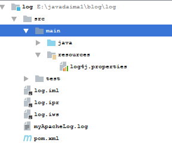
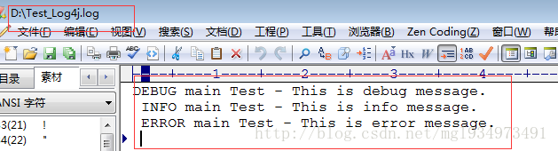

### Log4j的配置与IDEA的集成

***

#### Log4j的配置

##### log4j简介

Log4j是Apache的一个开放源代码项目，通过使用Log4j，我们可以控制日志信息输送的目的地是控制台、文件等；我们也可以控制每一条日志的输出格式；通过定义每一条日志信息的级别，我们能够更加细致地控制日志的生成过程。

##### log4j三大组件

Log4j由三个重要的组件构成：**日志信息的优先级，日志信息的输出目的地，日志信息的输出格式**。日志信息的优先级从高到低有**OFF、FATAL、ERROR、WARN、INFO、DEBUG、ALL**或者您定义的级别，分别用来指定这条**日志信息的重要程度**；日志信息的**输出目的地**指定了日志将打印到控制台还是文件中；而输出格式则**控制日志信息的显示内容的格式**。

##### log4j配置方式

Log4j支持两种配置方式，一种是在代码中进行配置，一种是使用配置文件经行配置。使用配置文件进行配置时，Log4j支持两种配置文件格式，一种是XML格式的文件，一种是properties格式的文件。 *在项目中我们一般是使用配置文件的方式进行配置，下面我们介绍一下 properties 方式配置log4j 环境的方式*。

##### log4j配置

新建配置文件 log4j.properties 文件内容如下：

**log4j.properties**

```json
#配置根目录Logger 优先级为INFO，A1 给输出的目的地起个名字方便下面的配置。
log4j.rootLogger=INFO, A1 ,FCC #A1此处只是一个输出地的名字，和INFO是不一样的，INFO是日志的输出级别，一般只有一个，而输出地点可以有多个，需要在下方一个一个配置，INFO是控制到应用程序中相应级别的日志信息的开关，此处配置了INFO，那么就无法不会打印debug的信息，如果设置了error，那么，WARN，INFO，DEBUG的信息默认就不会被打印，相当于一个级别的开关
#配置输出目的地为控制台
log4j.appender.A1=org.apache.log4j.ConsoleAppender 
#配置输出格式的布局（可以灵活地指定布局模式）
log4j.appender.A1.layout=org.apache.log4j.PatternLayout 
#配置日志信息的输出格式
log4j.appender.A1.layout.ConversionPattern=%-4r %-5p [%t] %37c %3x - %m%n 12345678
```

##### 配置解析

**1. 配置根Logger，其语法为：** 
*log4j.rootLogger = [ level ] , appenderName, appenderName, …*

其中，level 是日志记录的优先级，**从高到底分别为OFF、FATAL、ERROR、WARN、INFO、DEBUG、ALL或者您定义的级别**。*Log4j建议只使用四个级别*，**优先级从高到低分别是ERROR、WARN、INFO、DEBUG**。通过在这里定义的级别，您可以**控制到应用程序中相应级别的日志信息的开关**。比如在这里定义了INFO级别，则应用程序中所有DEBUG级别的日志信息将不被打印出来。

appenderName 就是指定日志信息输出到哪个地方。您可以同时指定多个输出目的地，用逗号进行分割。

**2. 配置日志信息输出目的地Appender，其语法为：**

> log4j.appender.appenderName1 = 输出目的地 1 
> log4j.appender.appenderName1 = 输出目的地 2 
> … 
> log4j.appender.appenderName1= 输出目的地 N
>
> log4j.appender.appenderName2 = 输出目的地 1 
> log4j.appender.appenderName2 = 输出目的地 2 
> … 
> log4j.appender.appenderName2= 输出目的地 N

一个 appenderName 可以配置多个输出目的地。(appenderName1 这里所说的 **appenderName**。 *就是上文配置 Logger 是用到的A1,FCC，但是在上面FCC未配置，而只配置了A1，这样会有提示说找不到FCC的配置情况，所以需要完全配置好，但是实际上，A1和FCC起到的作用都是为INFO服务，就是把日志输出到不同的地方去*)

**输出的目的地分别为：**

> org.apache.log4j.ConsoleAppender（控制台） 
> org.apache.log4j.FileAppender（文件） 
> org.apache.log4j.DailyRollingFileAppender（每天产生一个日志文件） 
> org.apache.log4j.RollingFileAppender（文件大小到达指定尺寸的时候产生一个新的文件） 
> org.apache.log4j.WriterAppender（将日志信息以流格式发送到任意指定的地方）

**3.配置日志信息的布局，其语法为：**

log4j.appender.appenderName.layout = 布局 1 
log4j.appender.appenderName.layout.option1 = value1

Log4j提供的layout有以下几种：

> org.apache.log4j.HTMLLayout（以HTML表格形式布局）， 
> org.apache.log4j.PatternLayout（可以灵活地指定布局模式）， 
> org.apache.log4j.SimpleLayout（包含日志信息的级别和信息字符串）， 
> org.apache.log4j.TTCCLayout（包含日志产生的时间、线程、类别等等信息）

**配置解析：**

布局 1 为以上 4 中的一个。 option1 为引用输出目的地的类名(如引用 `org.apache.log4j.ConsoleAppender` 是option 1 为ConsoleAppender )。value 1 为 输出的格式。

**4、输出格式设置**

在配置文件中可以通过log4j.appender.A1.layout.ConversionPattern设置日志输出格式。 
参数： 
%p: 输出日志信息优先级，即DEBUG，INFO，WARN，ERROR，FATAL, 
%d: 输出日志时间点的日期或时间，默认格式为ISO8601，也可以在其后指定格式，比如：%d{yyy MMM dd HH:mm:ss,SSS}，输出类似：2002年10月18日 22：10：28，921 
%r: 输出自应用启动到输出该log信息耗费的毫秒数 
%c: 输出日志信息所属的类目，通常就是所在类的全名 
%t: 输出产生该日志事件的线程名 
%l: 输出日志事件的发生位置，相当于%C.%M(%F:%L)的组合,包括类目名、发生的线程，以及在代码中的行数。举例：Testlog4.main(TestLog4.Java:10) 
%x: 输出和当前线程相关联的NDC(嵌套诊断环境),尤其用到像Java servlets这样的多客户多线程的应用中。 
%%: 输出一个”%”字符 
%F: 输出日志消息产生时所在的文件名称 
%L: 输出代码中的行号 
%m: 输出代码中指定的消息,产生的日志具体信息 
%n: 输出一个回车换行符，Windows平台为”\r\n”，Unix平台为”\n”输出日志信息换行 
可以在%与模式字符之间加上修饰符来控制其最小宽度、最大宽度、和文本的对齐方式。如： 
1)%20c：指定输出category的名称，最小的宽度是20，如果category的名称小于20的话，默认的情况下右对齐。 
2)%-20c:指定输出category的名称，最小的宽度是20，如果category的名称小于20的话，”-”号指定左对齐。 
3)%.30c:指定输出category的名称，最大的宽度是30，如果category的名称大于30的话，就会将左边多出的字符截掉，但小于30的话也不会有空格。 
4)%20.30c:如果category的名称小于20就补空格，并且右对齐，如果其名称长于30字符，就从左边交远销出的字符截掉。


#### log4j与IDEA的集成

日志是应用软件中不可缺少的部分，Apache的开源项目 log4j 是一个功能强大的日志组件,提供方便的日志记录。

##### java项目配置log4j

**1.新建maven工程** 

 
**2.导入log4j坐标**：

```xml
<dependency>
     <groupId>org.slf4j</groupId>
     <artifactId>slf4j-api</artifactId>
     <version>1.7.12</version>
</dependency>
<dependency>
     <groupId>org.slf4j</groupId>
     <artifactId>slf4j-log4j12</artifactId>
     <version>1.7.12</version>
</dependency>
<dependency>
     <groupId>log4j</groupId>
     <artifactId>log4j</artifactId>
     <version>1.2.17</version>
</dependency>
```

**3.新建 log4j.properties 放到src\main\resources目录下（log4j默认读取跟目录下名字为 log4j.properties 文件）** 

 

```json
### 设置###  
log4j.rootLogger = debug,stdout,D,E  
  
### 输出信息到控制抬 ###  
log4j.appender.stdout = org.apache.log4j.ConsoleAppender  
log4j.appender.stdout.Target = System.out  
log4j.appender.stdout.layout = org.apache.log4j.PatternLayout  
log4j.appender.stdout.layout.ConversionPattern = [%-5p] %d{yyyy-MM-dd HH:mm:ss,SSS} method:%l%n%m%n  
  
### 输出DEBUG 级别以上的日志到文件F://logs/debug.log ###  
log4j.appender.D = org.apache.log4j.FileAppender  
log4j.appender.D.File = F:/logs/debug.log  
log4j.appender.D.Append = true  
log4j.appender.D.Threshold = DEBUG  
log4j.appender.D.layout = org.apache.log4j.PatternLayout  
log4j.appender.D.layout.ConversionPattern = %d{yyyy-MM-dd HH:mm:ss}  [ %t:%r ] - [ %p ]  %m%n  
  
### 输出ERROR 级别以上的日志到文件F://logs/error.log ###  
log4j.appender.E = org.apache.log4j.FileAppender  
log4j.appender.E.File = F://logs/error.log  
log4j.appender.E.Append = true  
log4j.appender.E.Threshold = ERROR  
log4j.appender.E.layout = org.apache.log4j.PatternLayout  
log4j.appender.E.layout.ConversionPattern = %d{yyyy-MM-dd HH:mm:ss}  [ %t:%r ] - [ %p ]  %m%n  
```

4.创建测试类

```java
import org.apache.log4j.Logger;

public class Test {
    private static Logger logger = Logger.getLogger(Test.class);

    public static void main(String[] args) {
        // 记录debug级别的信息
        logger.debug("This is debug message.");
        // 记录info级别的信息
        logger.info("This is info message.");
        // 记录error级别的信息
        logger.error("This is error message.");
    }
}
```

**5.运行查看结果** 
*1.控制台结果：* 
  
2.文件结果： 
 

ref:

**1.[Log4j的配置](https://blog.csdn.net/mgl934973491/article/details/55096870),   2.[log4j的使用--IDEA创建maven项目](https://blog.csdn.net/mgl934973491/article/details/55096966),   3.[IDEA下Log4j使用教程](https://blog.csdn.net/u010814766/article/details/50295417)**

1.[log4j.properties的简单配置和使用](http://www.cnblogs.com/bignew/p/6602379.html),   2.[log4j.properties 日志文件的详细配置说明](http://www.cnblogs.com/applerosa/p/5946739.html),   3.[Intellij idea中使用SLF4J+log4j做日志记录](https://blog.csdn.net/huwei2003/article/details/76071451),   4.[IDEA下Log4j使用教程](https://blog.csdn.net/u010814766/article/details/50295417),   5.[Intellij IDEA中使用log4j日志](https://blog.csdn.net/huangpengbo2596/article/details/51850456),   6.[idea如何添加log4j日志？](https://jingyan.baidu.com/article/e4d08ffd90002a0fd3f60d59.html),   7.[log4j配置详解(非常详细转载)](https://blog.csdn.net/menghuanzhiming/article/details/77531977),   8.[log4j详细配置，一看就懂](https://blog.csdn.net/win7system/article/details/51602239),   9.[比较全面的log4j配置](https://blog.csdn.net/u010175879/article/details/53054014)

10.[Log4j rootLogger配置](http://www.cnblogs.com/wqsbk/p/6817890.html)，   11.[log4j：单独指定某个Logger的输出级别](https://blog.csdn.net/finelife/article/details/1613282),   12.[log4j.rootLogger](https://blog.csdn.net/zhanghaipeng1989/article/details/44453473),   13.[Log4j rootLogger根配置以及4种日志级别](http://www.cnblogs.com/mengxinrenyu/p/7636400.html),   14.[log4j分级别打印和如何配置多个Logger](http://www.cnblogs.com/baihaojie/p/5786722.html),   15.[Log4j – 如何配置多个logger？](https://blog.csdn.net/ziyouniao719672119/article/details/51626498)