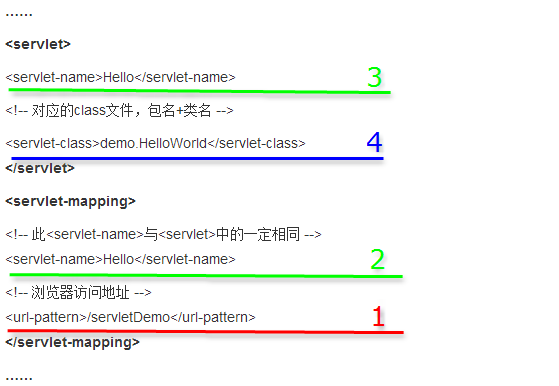

### web.xml的配置

---

我们用web.xml文件来配置Servlet，需要配置<servlet>和<servlet-mapping>

##### 基本配置

摘录某个工程的 web.xml 文件片段



访问顺序为1—>2—>3—>4，其中2和3的值必须相同。

url-pattern 标签中的值是要在浏览器地址栏中输入的 url，可以自己命名，这个 url 访问名为 servlet-name 中值的 servlet，两个 servlet-name 标签的值必须相同，因为通过 servlet 标签中的 servlet-name 标签映射到 servlet-class 标签中的值，最终访问 servlet-class 标签中的 class。

还有，web.xml 的 / 表示的是http://localhost:8080/ + 工程名 
而.jsp页面的action，加了/表示绝对路径http://localhost:8080/ ，没有加 / 表示的是相对路径

基本配置模版如下

```xml
<servlet>  
    <servlet-name>Servlet的名称（自己起的，不要重复）</servlet-name>  
    <servlet-class>Servlet的类路径（xx.xx.xx.xxservlet）</servlet-class>  
</servlet>  
<servlet-mapping>  
    <servlet-name>Servlet的名称（与上面的一样）</servlet-name>  
    <url-pattern>/url名字（自己起的，不要重复，注意/，不能丢）</url-pattern>  
</servlet-mapping>    
```


##### 参数含义

<servlet>

- <servlet>:   **用来声明一个Servlet**


- <init-param>:   将初始化参数名和参数值传递给Servlet，访问Servlet配置参数通过ServletConfig对象来完成，ServletConfig提供如下方法：`java.lang.String.getInitParameter(java.lang.String name)`：用于获取初始化参数，ServletConfig获取配置参数的方法和ServletContext获取配置参数的方法完全一样，只是ServletConfig是取得当前Servlet的配置参数，而ServletContext是获取整个Web应用的配置参数

<description>、<display-name>和<icon>

- <description>：为Servlet指定一个文本描述
- <display-name>：为Servlet提供一个简短的名字被某些工具显示
- <icon>：为Servlet指定一个图标，在图形管理工具中表示该Servlet

<servlet-name>、<servlet-class>和<jsp-file>

- <servlet-name>:   **用来定义servlet的名称，该名称在整个应用中必须是惟一的**

- <servlet-class>:   **用来指定servlet的完全限定的名称**

- <jsp-file>:   用来指定应用中JSP文件的完整路径。这个完整路径必须由/开始

<load-on-startup>

- 如果load-on-startup元素存在，而且也指定了jsp-file元素，则JSP文件会被重新编译成Servlet，同时产生的Servlet也被载入内存。<load-on-startup>的内容可以为空，或者是一个整数。这个值表示由Web容器载入内存的顺序。举个例子：如果有两个Servlet元素都含有<load-on-startup>子元素，则<load-on-startup>子元素值较小的Servlet将先被加载。如果<load-on-startup>子元素值为空或负值，则由Web容器决定什么时候加载Servlet。如果两个Servlet的<load-on-startup>子元素值相同，则由Web容器决定先加载哪一个Servlet。**<load-on-startup>1</load-on-startup>表示启动容器时，初始化Servlet**

<servlet-mapping>

- <servlet-name>：Servlet的名字，唯一性和一致性，与<servlet>元素中声明的名字一致
- <url-pattern>：指定相对于Servlet的URL的路径。该路径相对于web应用程序上下文的根路径。<servlet-mapping>将URL模式映射到某个Servlet，即该Servlet处理的URL

<welcome-file-list>

- 包含一个子元素<welcome-file>，<welcome-file>用来指定首页文件名称。<welcome-file-list>元素可以包含一个或多个<welcome-file>子元素。如果在第一个<welcome-file>元素中没有找到指定的文件，Web容器就会尝试显示第二个，以此类推


##### url-pattern匹配

1.完全匹配:   <url-pattern>/servlet/MyServlet.do</url-pattern>

2.目录匹配:   <url-pattern>/servlet/*</url-pattern>

3.扩展名匹配:   <url-pattern>\*.do</url-pattern>

注意

> 1.web server有几个默认的servlet，其Servlet-Mapping映射路径包括“*.jsp”（用于处理jsp页面响应），以及“”（用于默认页面响应）等 *
>
> 2.“/*”会覆盖掉以上所有的默认servlet,从而将所有的请求都拦截了下来 
>
> 3.“/”不会覆盖默认servlet，所以默认的“*.jsp”servlet仍然可以正常工作，（精确匹配优先）优先拦截jsp页面请求，并响应。


ref：

1.[Servlet 工程 web.xml 中的 servlet 和 servlet-mapping 标签](http://blog.csdn.net/zhaizu/article/details/9897083),   2.[Servlet Mapping 中/ 和 /*的区别](http://blog.csdn.net/u013248535/article/details/53070051),   3.[Web.xml详解](http://blog.csdn.net/believejava/article/details/43229361),   4.[web.xml中servlet配置及其含义](http://blog.csdn.net/m0_37630602/article/details/65443660),   5.[菜鸟学Java（九）——Servlet的基本配置](http://blog.csdn.net/liushuijinger/article/details/9957779),   6.[JavaWeb项目中web.xml有关servlet的基本配置](http://blog.csdn.net/github_36301064/article/details/53290900),   7.[Servlet](http://blog.csdn.net/galen2016/article/details/50732587)
