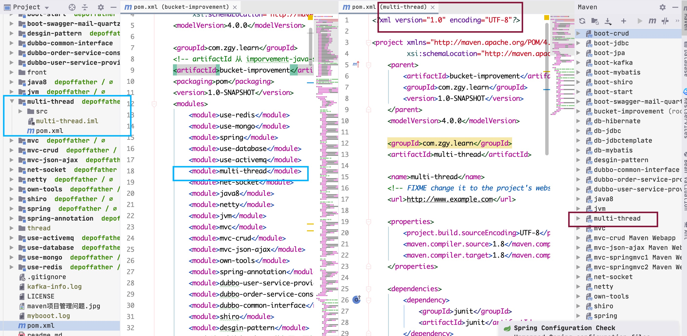

### 关于maven的一些总结
---

[TOC]

#### 基本概念
Maven是一个项目管理工具, 包含了一个项目对象模型(POM: Project Object Model), 一组标准集合, 一个项目生命周期(Project Lifecycle), 一个依赖管理系统(Dependency Management System)和用来运行定义在生命周期阶段(phase)中插件(plugin)目标(goal)的逻辑. Maven本质上是一个插件框架, 它的核心并不执行任何具体的构建任务, 所有这些任务都交给插件来完成.
Maven坐标通过5个元素定义: GroupID, artifactID, version必选, packaging可选(默认为jar), classifier不能直接定义. GroupId: **可理解为公司或者组织的域名倒置, 如com.cloud.huawei**, ArtifactId: **可以理解为项目名称**, 如logtool, 就是一个直接展示的项目名称, version: 是项目当前的版本号. packageing: 不是必选, 是项目的打包方式, 通常有pom. jar, war三种, 默认是jar.


#### 生命周期
maven的生命周期有3个, 3个之间相互独立, 作用不同, 分别是: **Clean Lifecycle, Default Lifecycle和Site Lifecycle**, 其作用如下表格:

|      生命周期名称    |            作用                                  |
|---------------------|--------------------------------------------------|
|Clean Lifecycle      |在进行真正的构建之前进行一些清理工作                 |
|Default Lifecycle    |构建的核心部分, 编译, 测试, 打包, 部署等等           |
|Site Lifecycle       |生成项目报告, 站点, 发布站点                        |


##### Clean Lifecycle的步骤

| 步骤 |         名称      |               工作                 |
|------|-------------------|-----------------------------------|
|  1   |预清洁(pre-clean)  |执行一些需要在clean之前完成的工作     |
|  2   |  清洁(clean)      |移除所有上一次构建生成的文件          |
|  3   |后清洁(post-clean) |执行一些需要在clean之后立刻完成的工作  |


##### Site Lifecycle的步骤

| 步骤 |           名称         |                             工作                     |
|------|-----------------------|------------------------------------------------------|
|  1   |预清洁(pre-site)       |执行一些需要在生成站点文档之前完成的工作                  |
|  2   |站点(site)             |生成项目的站点文档                                      |
|  3   |后站点(post-site)      |执行一些需要在生成站点文档之后完成的工作, 并且为部署做准备  |
|  4   |站点部署(site-deploy)  |将生成的站点文档部署到特定的服务器上                      |


##### Default Lifecycle的步骤
作为最常用, 最重要的生命周期, 名字却最平凡, 最不起眼, 下面介绍其功能

| 步骤 |                     名称                   |                             工作                     |
|------|-------------------------------------------|------------------------------------------------------|
|  1   |验证(validate)                             |验证项目是正确的, 所有必要的信息可用                     |
|  2   |初始化(initialize)                         |初始化构建状态, 例如设置属性或创建目录                   |
|  3   |产生来源(generate-sources)                 |生成包含在编译中的任何源代码                             |
|  4   |流程源(process-sources)                    |处理源代码, 例如过滤任何值                               |
|  5   |生成资源(generate-resources)               |生成包含在包中的资源                                     |
|  6   |流程资源(process-resources)                |将资源复制并处理到目标目录中, 准备打包                   |
|  7   |编译(compile)                              |编译项目的源代码                                         |
|  8   |工艺类(process-classes)                    |从编译后处理生成的文件, 例如对Java类进行字节码增强       |
|  9   |生成测试来源(generate-test-sources)         |生成包含在编译中的任何测试源代码                        |
|  10  |流程测试来源(process-test-sources)          |处理测试源代码, 例如过滤任何值                          |
|  11  |生成测试资源(generate-test-resources)       |创建测试资源                                            |
|  12  |流程测试资源(process-test-resources)        |将资源复制并处理到测试目标目录中                        |
|  13  |测试编译(test-compile)                      |将测试源代码编译到测试目标目录中                        |
|  14  |流程检验类(process-test-classes)            |从测试编译中处理生成的文件, 例如对Java类进行字节码增强. 对于Maven 2.0.5及以上版本          |
|  15  |测试(test)                                  |使用合适的单元测试框架运行测试. 这些测试不应该要求代码被打包或部署                         |
|  16  |制备包(prepare-package)                     |在实际包装之前, 执行必要的准备包装的操作. 这通常会导致打包的处理版本的包. (Maven 2.1及以上)|
|  17  |打包(package)                               |采取编译的代码, 并以其可分发的格式(如JAR)进行打包                                          |
|  18  |预集成测试(pre-integration-test)            |在执行集成测试之前执行所需的操作. 这可能涉及诸如设置所需环境等                             |
|  19  |集成测试(integration-test)                  |如果需要, 可以将该包过程并部署到可以运行集成测试的环境中                                   |
|  20  |整合后的测试(post-integration-test)          |执行集成测试后执行所需的操作. 这可能包括清理环境                                          |
|  21  |校验(verify)                                |运行任何检查以验证包装是否有效并符合质量标准                                               |
|  22  |安装(install)                               |将软件包安装到本地存储库中, 以作为本地其他项目的依赖关系                                   |
|  23  |部署(deploy)                                |在集成或发布环境中完成, 将最终软件包复制到远程存储库, 以与其他开发人员和项目共享           |


#### 常用命令
##### 命令格式
**maven命令有两种类型**, 一种是基本类型, 一种是和maven插件强相关的形式, 普通的命令形式如下:
```shell
mvn command
```
而和maven插件强相关的命令,格式如下:
```shell
mvn [plugin-name]:[goal-name]
```
**该命令的意思是: 执行"plugin-name"插件的"goal-name"目标(或者称为动作)**. 用户可以通过两种方式调用Maven插件目标.
1. 将插件目标与生命周期阶段(lifecycle phase)绑定, 这样用户在命令行只是输入生命周期阶段而已, 例如Maven默认将maven-compiler-plugin的compile目标与compile生命周期阶段绑定, 因此命令mvn compile实际上是先定位到compile这一生命周期阶段, 然后再根据绑定关系调用maven-compiler-plugin的compile目标. 
2. 直接在命令行指定要执行的插件目标, 例如`mvn archetype:generate`就表示调用maven-archetype-plugin的generate目标, 这种带冒号的调用方式与生命周期无关.

总体而言, **各个生命周期相互独立**, 也就是说, clean和default是两个完全独立的生命周期, 各自互不影响; **一个生命周期的阶段前后依赖**, 也就是说比如, 我们执行了`mvn clean`, 它不会单单只是仅仅执行clean这个步骤, 它会执行`pre-clean`, `clean` 和`post-clean`这三个步骤, 相当于走完了clean的整个流程, 而又比如, 我们执行了`mvn test`, 那么就会调用default生命周期的test阶段, 实际上执行的时候, 会执行test以及test之前的所有的阶段.


##### 常用命令汇总

| 序号  |            命令         |                                       作用                               |
|------|-------------------------|---------------------------------------------------------------------------|
| 0    | mvn -version            |显示版本信息                                                               |
| 1    | **mvn clean**           |清理项目生产的临时文件, 一般是模块下的target目录                              |
| 2    | **mvn compile**         |编译源代码, 一般编译模块下的src/main/java目录                                 |
| 3    | **mvn install**         |在本地repository中安装jar(包含mvn compile, mvn package, 然后上传到本地仓库)   |
| 4    | **mvn deploy**          |上传到私服(包含mvn install, 然后上传到私服)                                   |
| 5    | **mvn package**         |项目打包, 会在模块下的target目录生成jar或war等文件                            |
| 6    | mvn test                |测试命令, 或执行src/test/java/下junit的测试用例                               |
| 7    | mvn site                |生成项目相关信息的网站                                                        |
| 8    | mvn validate            |验证工程是否正确, 所有需要的资源是否可用                                      |
| 9    | mvn test-compile        |编译测试代码                                                                  |
| 10   | mvn -Dtest package      |只打包不测试                                                                  |
| 11   | **mvn package -Dmaven.test.skip=true**                  |      项目打包, 并且这个过程之中跳过测试      |
| 12   | mvn test -skipping compile -skipping test-compile       |      只测试而不编译，也不测试编译            |
| 13   | **mvn deploy**          |将打包的文件发布到远程仓库哦, 提供其他人员进行下载依赖                        |
| 14   | mvn eclipse:eclipse     |将项目转化为eclipse项目(maven-eclipse-plugin)                                 |
| 15   | mvn idea:idea           |将项目转化为ieda项目(maven-idea-plugin)                                       |
| 16   | **mvn jetty:run**       |运行项目于jetty上 (maven-jetty-plugin)                                        |
| 17   | **mvn jar:jar**         |只打jar包(maven-jar-plugin)                                                   |


##### 命令参数和注意事项
###### 命令参数
上面列举的只是比较通用的命令, 其实很多命令都可以携带参数以执行更精准的任务. Maven命令可携带的参数类型如下:
1.**-D 传入属性参数**
```shell
mvn install -Dmaven.test.skip=true
```
以"-D"开头，将"maven.test.skip"的值设为"true",就是告诉maven打包的时候跳过单元测试. 同理, `mvn deploy-Dmaven.test.skip=true`代表部署项目并跳过单元测试.
2.**-P 使用指定的Profile配置**
比如项目开发需要有多个环境, 一般为开发, 测试, 预发, 正式4个环境, 在pom.xml中的配置如下:

```xml
<profiles>  
      <profile>  
             <id>dev</id>  
             <properties>  
                    <env>dev</env>  
             </properties>  
             <activation>  
                    <activeByDefault>true</activeByDefault>  
             </activation>  
      </profile>  
      <profile>  
             <id>test</id>  
             <properties>  
                    <env>test</env>  
             </properties>  
      </profile>  
      <profile>  
             <id>pre</id>  
             <properties>  
                    <env>pre</env>  
             </properties>  
      </profile>  
      <profile>  
             <id>prod</id>  
             <properties>  
                    <env>prod</env>  
             </properties>  
      </profile>  
</profiles>
......  
<build>  
      <filters>  
             <filter>config/${env}.properties</filter>  
      </filters>  
      <resources>  
             <resource>  
                    <directory>src/main/resources</directory>  
                    <filtering>true</filtering>  
             </resource>  
      </resources>
      ......  
</build>
```
profiles定义了各个环境的变量id, filters中定义了变量配置文件的地址, 其中地址中的环境变量就是上面profile中定义的值, resources中是定义哪些目录下的文件会被配置文件中定义的变量替换.
通过maven可以实现按不同环境进行打包部署, 命令如下: 

```shell
mvn package -P dev
```
其中"dev"为环境的变量id, 代表使用Id为"dev"的profile.
3.-e 显示maven运行出错的信息
4.-o 离线执行命令, 即不去远程仓库更新包
5.-X 显示maven允许的debug信息
6.-U 强制去远程更新snapshot的插件或依赖, 默认每天只更新一次


###### 注意事项
需要注意的是, maven的命令是可以组合的, 由于三个生命周期是相互独立的, 所以我们就可以对命令组合了, 比如`mvn clean install -Dmaven.test.skip=true`, 就表示, 先对环境进行clean清理, 然后再去将项目安装到本地的仓库之中, 还有其他类似的做法, 都可以由我们自己组合产生.


#### 多模块管理
##### 三种打包方式jar war pom的区别
pom是maven依赖文件;
jar是java普通项目打包;
war是java web项目打包.

pom: 打出来可以作为其他项目的maven依赖, 在工程A中添加工程B的pom, A就可以使用B中的类. 用在父级工程或聚合工程中. 用来做jar包的版本控制.
jar包: 通常是开发时要引用通用类, 打成jar包便于存放管理. 当你使用某些功能时就需要这些jar包的支持, 需要导入jar包.
war包: 是做好一个web网站后, 打成war包部署到服务器. 目的是节省资源, 提供效率.


##### maven多模块的依赖分析
在一个maven工程之中, 我们可能会将不同的部分拆解, 然后创建新的子功能, 将其独立作为一个maven module, 这样有利于分布式部署, 功能解耦合, 好处比较多, 对于maven工程, 必定有一个pom.xml文件, 而对于其下包含的每个子maven module, 它下面也有一个pom.xml文件. 我们创建一个maven工程, 包含了三个子maven  module, 有如下示意图, 表示一个maven工程, 下有三个子maven module, 每个module的功能不一样, 所以将其拆分, 骨架示意如下:
```xml
parent-maven-project(module)
------ childA(Business module)
       --- pom.xml
------ childB(Web module)
       --- pom.xml
------ childC(Common module)
       --- pom.xml
------ pom.xml
```
那么, 经过了上述的拆分, 父级maven工程怎么知道它其中有哪些maven module呢? 就是通过在父工程的pom文件之中声明, parent-maven-project module组织好childA, childB, cildC三个module, 这个步骤叫做**聚合**, 是多个module联合编译, 也就相当于是在父 module之中, 声明了它下面有哪些子 module, 对于parent-maven-project的配置, 在其pom.xml文件之中按照如下配置即可:
```xml
<modules>
   <module>childA</module>
   <module>childB</module>
   <module>childC</module>
</modules>
```
上述的做法只是告诉maven编译器, 在读取parent的pom文件时去找到childA, childB和childC, 但还是会分别去编译他们引入的依赖. 这样就会导致pom文件引入的包重复!!! 于是我们引入了**继承**的概念, 也就是形成"父子"关系, 子pom可以引用到父pom中引入的依赖. 这样就形成了**依赖**, 此处说的依赖是**子对父**的依赖. **在maven之中的关系标明是双向的, 只是在父pom.xml之中标明模块关系, 不能完全的说明依赖, 所以还需要在子module之中标记**, 比如在childA module之中, 我们就要通过如下的方式表示, 首先, 此时我们已经定义好了父pom.xml的配置, 也就是parent-maven-project的pom.xml已经完全配置好了, 然后配置子module, childA之中的pom.xml:
parent-maven-project的pom.xml文件:

```xml
<modelVersion>4.0.0</modelVersion>  
<groupId>com.cqu.zgy</groupId>
<artifactId>parent-maven-project</artifactId>
<version>1.0.2</version>
<packaging>pom</packaging>  
<name>parent-maven-project</name>
```
childA的pom.xml文件:
```xml
<parent>
    <groupId>com.cqu.zgy</groupId>
    <artifactId>parent-maven-project</artifactId>
    <version>1.0.2</version>
    <relativePath>../pom.xml</relativePath>  <!--可选的-->
</parent>	
```
在childA的parent标签之中, relativePath是可选的. 完成了上述的配置, 直接写在父pom.xml的\<dependencies\>标签下面的\<dependency\>就可以直接使用了, 但是具体琴况分为两种, 也就是关于\<dependencyManagement\>标签的情况, 此处的情况有两种, 分别做如下的介绍.


###### 没有dependencyManagement标签
这种情况就是, 所有的\<dependency\>依赖, 都已经写好了, 全都在父pom.xml之中, 也就是parent-maven-project的pom.xml之中, 那么我们在子module之中, 就可以直接使用, 不用再去添加已经在父pom.xml文件之中添加了的依赖. 直接使用即可


###### 使用dependencyManagement标签
这种情况是在父pom.xml之中, 也就是parent-maven-project的pom.xml之中, 配置展示情况如下:
```xml
<!-- 父模块的jar包, 这样直接会被子模块所依赖和引用-->
<dependencies>
    <dependency>
        <groupId>org.apache.commons</groupId>
        <artifactId>commons-lang3</artifactId>
        <version>3.8.1</version>
    </dependency>
</dependencies>

<!-- 父模块对于jar包版本的控制, 但是这不是真正的引入, 需要到具体使用的子模块之中引入, 才可以使用-->
<dependencyManagement>
    <dependencies>
        <dependency>
            <groupId>com.alibaba</groupId>
            <artifactId>fastjson</artifactId>
            <version>1.2.56</version>
        </dependency>
    </dependencies>
</dependencyManagement>
```
如上面的注释所写的一样, **dependencyManagement标签之中的依赖, 是父模块对于jar包版本的控制, 不是真正的引入, 真正的引入, 需要到具体使用的子模块之中引入, 才可以使用**, 此时在子模块如childA之中引入fastjson, 就可以不用写版本号了, 其他没有书写上的差异. 在childA之中的pom.xml配置, 具体情况如下显式:
```xml
<parent>
    <artifactId>maventest</artifactId>
    <groupId>com.cqu.zgy</groupId>
    <version>1.0-SNAPSHOT</version>
</parent>
<modelVersion>4.0.0</modelVersion>

<artifactId>childA</artifactId>

<name>childA</name>

<dependencies>
    <!-- 子module需要fastjson的依赖, 需要自己去重新真正引入, 此处不用写version, 因为在父pom.xml的dependencyManagement之中, 已经定义好了, 当然其中含有这个jar包依赖-->
    <dependency>
        <groupId>com.alibaba</groupId>
        <artifactId>fastjson</artifactId>
    </dependency>
</dependencies>
```

>两种方式的比较:
dependencies即使在子项目中不写该依赖项, 那么子项目仍然会从父项目中继承该依赖项(全部继承)
dependencyManagement里只是声明依赖, 并不实现引入, 因此子项目需要显示的声明需要用的依赖. 如果不在子项目中声明依赖, 是不会从父项目中继承下来的; 只有在子项目中写了该依赖项, 并且没有指定具体版本, 才会从父项目中继承该项, 并且version和scope都读取自父pom; 另外如果子项目中指定了版本号, 那么会使用子项目中指定的jar版本.
即：
**父工程使用的是 dependencyManagement假引用, dependencyManagement默认是不继承的, 目的是管理版本号. dependencies用于实际上需要引入的工程, 这些工程如果继承于父工程会找到对应的版本号**.

>**优缺点总结**:
1.使用dependencyManagement更加灵活, 子module可以使用系统提供的, 也可以使用其他版本的, 这样灵活性大增, 方便依赖的配置和管理;
2.dependencyManagement声明的依赖既不会给父项目引入依赖, 也不会给他的子模块引入依赖, 其是一个版本声明, 方便版本的统一管理.


###### 插件的依赖管理
除了jar包依赖可以通过以上的方式进行, 插件也可以通过这样的方式进行管理
```xml
<!-- parent-maven-project -->
<build>
   <pluginManagement>
      <plugins>
          <plugin>
               <groupId>org.apache.maven.plugins</groupId>
               <artifactId>maven-source-plugin</artifactId>
               <version>2.1.1</version>
          </plugin>
      </plugins>
   </pluginManagement>
</build>
```

子module childA插件的配置
```xml
<!-- childA -->
<build>
   <plugins>
      <plugin>
           <groupId>org.apache.maven.plugins</groupId>
           <artifactId>maven-source-plugin</artifactId>
      </plugin>
   </plugins>
</build>
```


###### 子module之间相互引用
如果子pom间存在引用关系, 比如childA引用到了childB的jar包, 我们的配置应如下配置:
```xml
<dependency>
   <groupId>com.cqu.zgy</groupId>
   <artifactId>childA</artifactId>       <!--加上childA的依赖-->
   <version>1.0.0</version>
</dependency>
```


#### maven插件
Maven本质上是一个插件框架, 它的核心并不执行任何具体的构建任务, 所有这些任务都交给插件来完成, 像编译是通过maven-compile-plugin实现的, 测试是通过maven-surefire-plugin实现的, maven也内置了很多插件, 所以我们在项目进行编译, 测试, 打包的过程是没有感觉到. 所以说, 其实我们执行命令, 也就是调用了相应的插件的命令,  **如上所讲的的常用命令之中 , 将其命令格式分为两种, 本质上讲, 其实只有一种, 但是由于一些基本的构建插件是默认的, 如maven-clean-plugin, maven-compiler-plugin, 所以我们在执行命令的时候, 不必去按照繁琐的那种方式去执行, 而只需要简化执行**, 如`mvn clean`, `mvn compile`即可. 那种比较繁琐的命令, 一般是针对于第三方的maven插件而准备的, 如maven-jetty-plugin, mavne-tomcat-plugin, 这些插件在我们生成maven工程的时候, 不是默认配置好的, 如果需要的话, 需要我们自己去配置, 我们在build标签的plugins下面配置.
这个是父maven 工程的一般配置方式, 主要体现在可以进行插件版本的管理, 和依赖denpengdency一样, 可以只是声明, 在实际使用的模块之中再引入, 而不必去全都引入, 这样方便一些.

```xml
<project>
......
    <build>
        <!-- 如果只是一个单独的maven工程, 没有什么子模块, 那么就不需要pluginManagement 以及dependencyManagement-->
        <pluginManagement><!父工程对于子工程进行版本的管理-->
            <plugins>
                <plugin>
                    <artifactId>maven-clean-plugin</artifactId>
                    <version>3.1.0</version>
                </plugin>
                <plugin>
                    <artifactId>maven-resources-plugin</artifactId>
                    <version>3.0.2</version>
                </plugin>
                <plugin>
                    <artifactId>maven-compiler-plugin</artifactId>
                    <version>3.8.0</version>
                </plugin>
                <plugin>
                    <artifactId>maven-surefire-plugin</artifactId>
                    <version>2.22.1</version>
                </plugin>
                <plugin>
                    <artifactId>maven-jar-plugin</artifactId>
                    <version>3.0.2</version>
                </plugin>
                <plugin>
                    <artifactId>maven-install-plugin</artifactId>
                    <version>2.5.2</version>
                </plugin>
                <plugin>
                    <artifactId>maven-deploy-plugin</artifactId>
                    <version>2.8.2</version>
                </plugin>
                <plugin>
                    <artifactId>maven-site-plugin</artifactId>
                    <version>3.7.1</version>
                </plugin>
                <plugin>
                    <artifactId>maven-project-info-reports-plugin</artifactId>
                    <version>3.0.0</version>
                </plugin>
            </plugins>
        </pluginManagement>
    </build>
</project>
```

这个是maven子模块的一般配置情况
```xml
<project>
......
    <build>
        <plugins>
            <plugin>
                <!-- 继承了父maven工程(模块)的插件, 所以不用写出版本号 -->
                <artifactId>maven-clean-plugin</artifactId>
            </plugin>
            <plugin>
                <artifactId>maven-resources-plugin</artifactId>
            </plugin>
            <plugin>
                <artifactId>maven-compiler-plugin</artifactId>
            </plugin>
            <plugin>
                <artifactId>maven-surefire-plugin</artifactId>
            </plugin>
            <plugin>
                <artifactId>maven-jar-plugin</artifactId>
                <version>3.0.2</version>
            </plugin>
            <plugin>
                <artifactId>maven-install-plugin</artifactId>
                <version>2.5.2</version>
            </plugin>
            <plugin>
                <!-- 虽然继承了父maven工程(模块)的插件, 但是仍然使用自己想要使用的插件版本-->
                <!-- 如果不是继承, 那么所有的插件, 就都得完整配置artifactId和version -->
                <artifactId>maven-deploy-plugin</artifactId>
                <version>2.8.2</version>
            </plugin>
            <plugin>
                <artifactId>maven-site-plugin</artifactId>
            </plugin>
            <plugin>
                <artifactId>maven-project-info-reports-plugin</artifactId>
                <version>3.0.0</version>
            </plugin>
        </plugins>
    </build>
</project>
```


#### 其他问题
**坐标与显示**

**父模块子模块**


---
ref:
1.[maven中jar、war、pom的区别](https://www.cnblogs.com/yw-ah/p/9857050.html),   2.[Maven多模块项目管理小结](https://blog.csdn.net/whuslei/article/details/7989102),   3.[maven父工程问题dependencymanagement 和dependencies区别](https://blog.csdn.net/oppoppoppo/article/details/78331818),   4.[【日常工作】maven构建多模块项目依赖问题——dependencyManagement、dependencies](https://blog.csdn.net/guodonggang/article/details/81298118),   5.[maven父子工程pom.xml配置](https://blog.csdn.net/zsq520520/article/details/68924108),   6.[用maven创建多模块项目](https://blog.csdn.net/liuningwcsdn/article/details/72178200),   7.[Maven实战(六)--- dependencies与dependencyManagement的区别](https://blog.csdn.net/liutengteng130/article/details/46991829),   8.[Maven中dependencyManagement作用说明](https://blog.csdn.net/helllochun/article/details/81564921),   9.[Maven的dependency和dependencyManagement的区别](https://blog.csdn.net/snn1410/article/details/52859788),   10.[Maven的构建生命周期理解](https://www.cnblogs.com/EasonJim/p/6816340.html),   11.[maven的三大生命周期](https://www.cnblogs.com/huxinga/p/6740897.html),   12.[maven生命周期（lifecycle）—— maven权威指南学习笔记（四）](https://www.cnblogs.com/chrischennx/p/5119663.html),   13.[Maven实战：Maven生命周期](https://www.cnblogs.com/xrq730/p/5527254.html),   14.[这 30 个常用的 Maven 命令你必须熟悉！](https://blog.csdn.net/benhuo931115/article/details/80674760),   15.[Maven学习(十五)-----Maven常用命令](https://www.cnblogs.com/zy-jiayou/p/7661415.html),   16.[Maven常用命令](https://www.cnblogs.com/wkrbky/p/6352188.html),   17.[maven常用命令](https://www.cnblogs.com/ngy0217/p/9011053.html),   18.[maven常用命令](https://www.cnblogs.com/luchangyou/p/5944972.html),   19.[Maven之（四）Maven命令](https://blog.csdn.net/u012152619/article/details/51473410),   20.[Maven之（三）Maven插件](https://blog.csdn.net/u012152619/article/details/51473406)