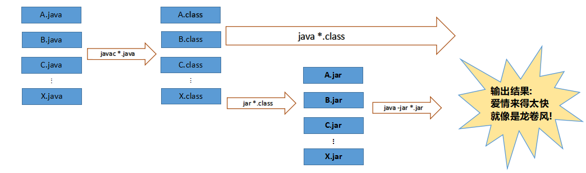

### Java自带常用命令和打jar包

***
以打jar包的命令来算, 其实我们打jar包有很多种途径, 最常用的, 可以通过各种构建工具, 比如maven, gradle, 还有springboot的打包方式, 这样的话很简单, 以maven为例子, 我们使用`mvn package -Dmaven.test.skip=true`, 这样就能够把相关的java文件打成了jar包, 这样的话是通过使用高级的方法, 现在要说的是通过最初的方式, 来构建jar包, 也就是java, javac, jar这几个相关命令, 首先来说, java是运行class文件&jar文件的, 无法直接运行\*.java文件, \*.java文件是需要让javac命令来运行的, 也就是要先通过javac的编译, 才能变换成\*.class文件, 而jar命令就是纯粹来打jar包使用. 三者之间的关系




##### 创建jar包
###### 将文件简单打包
将\*.java文件简单打包的关键在于创建**MANIFEST.MF**文件, 它是一个描述文件, 描述了这个jar包的一些组织信息. 在这个文件之中, 我们记录了如下的内容:
```txt
Manifest-Version: 1.0
Created-By: 1.8.0_121 (Oracle Corporation)
Main-Class: Hello
```
比如我们有两个类文件
```java
class Tom{
     public static void speak(){
         System.out.println("hello");
     }
}
```
```java
class Hello{
     public static void main(String[] agrs){
         Tom.speak();
     }
 }
```
执行时, 我们首先进行`javac Tom.java`和 `javac Hello.java`,然后配合上述已经创建好的MENIFEST.mf文件, 也就是这个描述文件, 目前**MENIFEST.mf和这两个类文件是在同一个目录层级**, 然后运行`jar -cvfm hello.jar MENIFEST.mf Hello.class Tom.class `, 这样打包就可以了, 然后运行`java -jar hello.jar`就输出了`hello`的结果, 这一切显示是在console之中的. **上述的是类之间有调用的情况, 有调用的时候需要全部把所需要的类打包到jar文件之中, 如果是单一的class文件, 则后面只有一个即可**.
需要注意, javac有一个选线`javac -d xxxx`,通过这个命令, 我们可以将class文件输出到不同的目录之中.
如果有包呢? 比如com. zgy这样的包? 怎么打包呢?
```java
package com.cqu;

import com.zgy.Tom;

public class Mg {
    public static void main(String[] agrs){
        Tom tom = new Tom();
        tom.speak();
    }
}
```
```java
package com.zgy;

public class Tom {
    public void speak() {
        System.out.println("hello");
    }
}
```

因为这样的话, 就会有问题产生在变异的时候, 因为, 我们直接编译的时候, Mg.java找不到Tom.java这个类, 所以汇报错, 我们可以首先编译Tom.java, 然后再编译Mg.java, 这样的话, 我们使用命令`javac Mg.java ./../zgy/Tom.java`就可以, 也就是说明, 当我们使用了包名的时候, 对于编译, 一定需要把相关的类都关联上, 才能去编译另一个要调用到的类. 这样就可以编译了.
对于打包, 首先还是要编写MANIFEST.MF文件, 区别就是**下面的MANIFEST.MF**文件添加了Class-Path, 此外其**Main-Class变成了带包的路径形式**.

```java
Manifest-Version: 1.0
Created-By: 1.8.0_121 (Oracle Corporation)
Main-Class: com.cqu.Mg
Class-Path: .
```
执行的语句分别如下:
**编译**: `javac Tom.java`, `javac Mg.java ./../zgy/Tom.java`
**打包**: (此时, 我们所在的路径在com层之外, 如/xxx/com/zgy/Tom.java & /xxx/com/cqu/Mg.java)的形式, 我们采用了的语句如下, 可以看出来, 这个时候我们没有采用相关的classpath, 所以直接使用就需要全路径, 这样不好:
`jar -cvfm gf.jar ./com/cqu/META-INF/MANIFEST.MF ./com/cqu/Mg.class ./com/zgy/Tom.class`
**执行**: 执行`java -jar gf.jar`, 然后就会输出hello, 这表示我们打包成功运行. 关于设置classpath和搜索路径的问题, 可以参考javac的命令 `javac -classpath`和`javac - cp`.
由上面可以看出, 我们要打包需要用到的命令还是很多, 要注意路径, 东西很繁琐, 所以我们最好使用IDE, 借助Maven, SpringBoot的工具, 然后可以较快的打包出jar包.


###### 使用IDEA打包
使用IDEA真的太方便了, 可以参看其他的文章, 有:[idea打包jar的多种方式(总结-共三种)](https://blog.csdn.net/qq_28289405/article/details/81111182), [IDEA中如何打包为jar包](https://blog.csdn.net/Venry_/article/details/80400282),   [Idea使用maven打包jar包](https://www.cnblogs.com/expiator/p/9926428.html),   [idea打包java可执行jar包](https://www.cnblogs.com/blog5277/p/5920560.html).


---
ref:
1.[java打jar包的几种方式详解](https://www.cnblogs.com/mq0036/p/8566427.html),   2.[IntelliJ IDEA导出 jar文件 运行不了，no main manifest attribute，找不到main函数](https://blog.csdn.net/zhan107876/article/details/97883972),   3.[Linux系统下运行jar文件，提示：No main manifest attribute, in XXX.jar](https://blog.csdn.net/kangkangwanwan/article/details/78592546),   4.[Jar 命令打包 jar包](https://cloud.tencent.com/developer/article/1453553),   5.[关于Javac命令和类文件之间的依赖问题](https://blog.csdn.net/octopusflying/article/details/53791661),   6.[jar 打包命令详解](https://www.cnblogs.com/jiftle/p/9068354.html),   7.[idea打包jar的多种方式(总结-共三种)](https://blog.csdn.net/qq_28289405/article/details/81111182),   8.[IDEA中如何打包为jar包](https://blog.csdn.net/Venry_/article/details/80400282),   9.[idea使用maven打包jar包](https://www.cnblogs.com/expiator/p/9926428.html),   10.[idea打包java可执行jar包](https://www.cnblogs.com/blog5277/p/5920560.html).