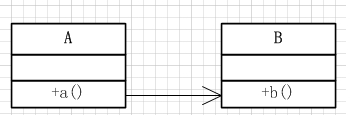
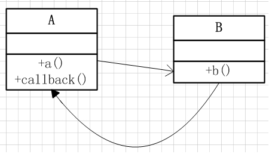
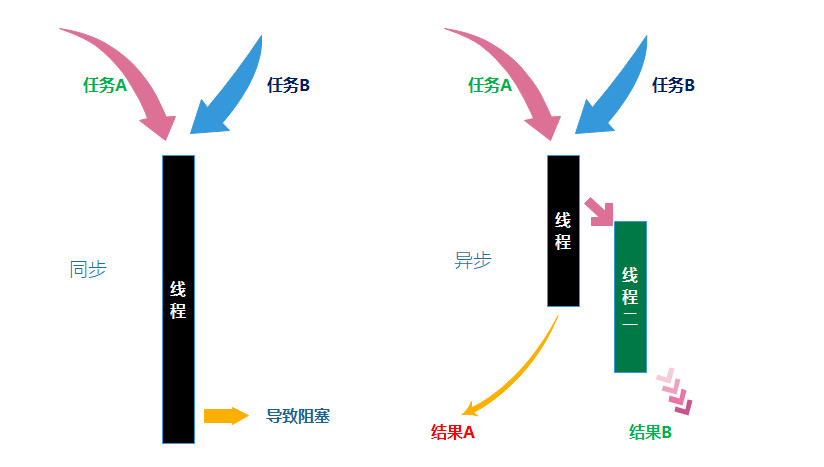

### Java调用和回调总结(2)

---
##### 调用的种类
调用有3种, **普通调用**(同步调用), **异步调用**, **异步回调**.

##### 三种调用的特点
**普通调用**:  也叫做**同步调用 **, 最常见的调用, **会造成阻塞**.

**异步调用** : 异步调用, **解决了同步调用阻塞的问题**, *但是没有返回的结果*.

**异步回调** : 异步回调, **解决了阻塞**, **还可以返回结果**.

三者递进的关系从弱到强的如`普通调用< 异步调用 < 异步回调`, 三者之间最重要的区别其实就只有两点,1:**这个调用是不是会造成主线程的阻塞**, 2: **我们调用的时候, 可不可以返回执行的结果**. 很明显,普通调用, 是会造成阻塞, 但是执行完毕之后, 我们可以立马就获得执行的结果! 但是由于有很多任务的执行时间是非常长的, 这样就会阻塞我们主线程的任务, 所以就导致**异步调用**的出现, 异步调用和同步调用区别就是, 同步调用阻塞,但是可以获得这个执行的结果, **异步调用不会阻塞, 但是无法得知这个执行的结果**! 那么如何解决无法得知任务执行结果的问题呢? 那就是需要在执行的时候, 执行完了之后, 直接通知主线程, 通知主线程, 那就是要使用主线程所在的类的对象, 然后修改其表示执行结果的字段或者属性, 或者执行某个方法让外界得知, 就表示执行的结果已经被外界得知了.

##### 同步和异步怎么解决？
同步会阻塞主线程, 因为我们执行的过程是线性, 线性是因为没有其他的执行线程,  只有一条, 因为同一个时间只有一条任务执行, 是独占的,  所以任务只能阻塞,  等这个任务执行完了才能去执行另一个任务! 
异步呢? 异步不会阻塞, 就是因为它突破了只有一个线程的限制, 所以要异步, 就要创建多个线程,  那么在java 里面, 就创建多个Thread, 这样就可以实现异步了!

##### 回调怎么理解?
不管是同步还是异步调用, 都是A调用B单线的调用, 但是这样的话, 比如我们在A线程之中调用B, 那么我们就无法知道B执行的结果, 或者是要让A等待很久, 才能让两个任务完成. 那么我们就要双向调用, 而不是单向调用, 这样的话, 可以双方调用 ,就可以知道结果了, 回调的方式, 一般是通过Interface接口来实现的, 但是也可以通过Class来实现, 但是一般还是通过Interface来实现, 我们需要面向接口来编程.

---
ref:
1.[java回调函数，看完就懂](https://www.cnblogs.com/yangmin86/p/7090882.html),   2.[Java接口回调机制详解](https://m.imooc.com/mip/article/42031),   3.[Java回调机制解析](https://blog.csdn.net/bjyfb/article/details/10462555),   4.[异步调用的理解](https://blog.csdn.net/u014571011/article/details/83097546),   5.[Java回调机制总结](https://www.cnblogs.com/prayjourney/p/9667835.html)

