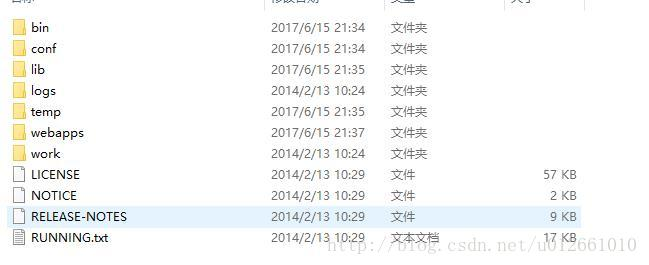
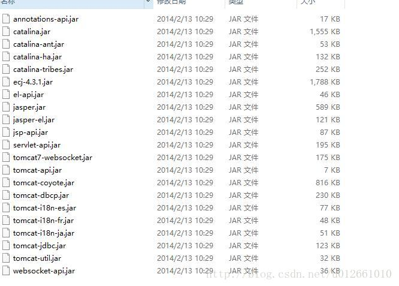
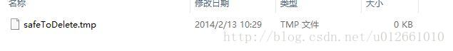
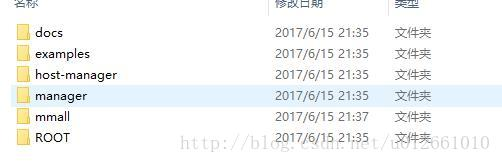

### Tomcat与目录结构详细介绍
---

##### Tomcat 是什么
Tomcat 是由 Apache 开发的一个 Servlet 容器，实现了对 Servlet 和 JSP 的支持，并提供了作为Web服务器的一些特有功能，如Tomcat管理和控制平台、安全域管理和Tomcat阀等。
**由于 Tomcat 本身也内含了一个 HTTP 服务器，它也可以被视作一个单独的 Web 服务器**。但是，不能将 Tomcat 和 Apache HTTP 服务器混淆，Apache HTTP 服务器是一个用 C 语言实现的 HTTP Web 服务器；这两个 HTTP web server 不是捆绑在一起的。Tomcat 包含了一个配置管理工具，也可以通过编辑XML格式的配置文件来进行配置。


##### 一般 web 项目路径结构
```
|-- webapp                         # 站点根目录
    |-- META-INF                   # META-INF 目录
    |   `-- MANIFEST.MF            # 配置清单文件
    |-- WEB-INF                    # WEB-INF 目录
    |   |-- classes                # class文件目录
    |   |   |-- *.class            # 程序需要的 class 文件
    |   |   `-- *.xml              # 程序需要的 xml 文件
    |   |-- lib                    # 库文件夹
    |   |   `-- *.jar              # 程序需要的 jar 包
    |   `-- web.xml                # Web应用程序的部署描述文件
    |-- <userdir>                  # 自定义的目录
    |-- <userfiles>                # 自定义的资源文件
```

`webapp`：工程发布文件夹。其实每个 war 包都可以视为 webapp 的压缩包。
`META-INF`：META-INF 目录用于存放工程自身相关的一些信息，元文件信息，通常由开发工具，环境自动生成。
`WEB-INF`：Java web应用的安全目录。所谓安全就是客户端无法访问，只有服务端可以访问的目录。
`/WEB-INF/classes`：存放程序所需要的所有 Java class 文件。
`/WEB-INF/lib`：存放程序所需要的所有 jar 文件。
`/WEB-INF/web.xml`：web 应用的部署配置文件。它是工程中最重要的配置文件，它描述了 servlet 和组成应用的其它组件，以及应用初始化参数、安全管理约束等。


##### Tomcat文件目录和介绍
打开tomcat的解压之后的目录可以看到如下的目录结构：


###### 1.bin：
bin目录主要是用来存放tomcat的命令，主要有两大类，一类是以.sh结尾的（linux命令），另一类是以.bat结尾的（windows命令）。
很多环境变量的设置都在此处，例如可以设置JDK路径、tomcat路径 
startup 用来启动tomcat 
shutdown 用来关闭tomcat 
修改catalina可以设置tomcat的内存


###### 2.conf：
conf目录主要是用来存放tomcat的一些配置文件。
server.xml可以设置端口号、设置域名或IP、默认加载的项目、请求编码 
web.xml可以设置tomcat支持的文件类型 
context.xml可以用来配置数据源之类的 
tomcat-users.xml用来配置管理tomcat的用户与权限 
在Catalina目录下可以设置默认加载的项目


###### 3.lib:
lib目录主要用来存放tomcat运行需要加载的jar包。 
例如，像连接数据库的jdbc的包我们可以加入到lib目录中来。


###### 4.logs：
logs目录用来存放tomcat在运行过程中产生的日志文件，非常重要的是在控制台输出的日志。（清空不会对tomcat运行带来影响） 
在windows环境中，控制台的输出日志在catalina.xxxx-xx-xx.log文件中 
在linux环境中，控制台的输出日志在catalina.out文件中

###### 5.temp：
temp目录用户存放tomcat在运行过程中产生的临时文件。（清空不会对tomcat运行带来影响）


###### 6.webapps：
webapps目录用来存放应用程序，当tomcat启动时会去加载webapps目录下的应用程序。可以以文件夹、war包、jar包的形式发布应用。 
当然，你也可以把应用程序放置在磁盘的任意位置，在配置文件中映射好就行。


###### 7.work:
work目录用来存放tomcat在运行时的编译后文件，例如JSP编译后的文件。 
清空work目录，然后重启tomcat，可以达到清除缓存的作用。

---
ref：
1.[Tomcat的目录结构详细介绍](https://blog.csdn.net/u012661010/article/details/73381599),   2.[Tomcat 快速入门](https://www.cnblogs.com/jingmoxukong/p/8258837.html)