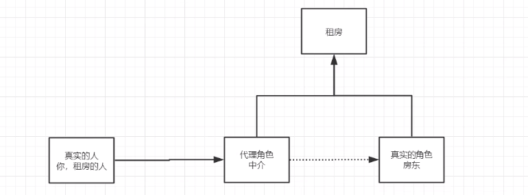
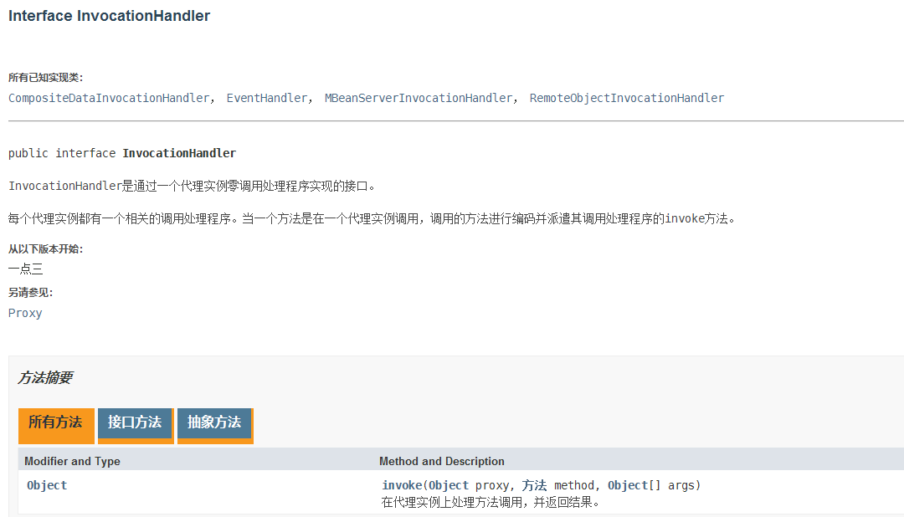
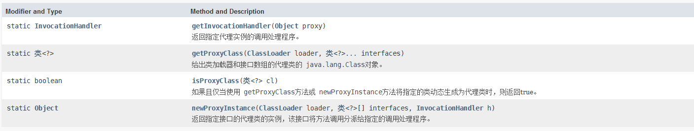

### 代理模式
#### 相关概念
**这个模式非常重要，是理解spring AOP的基础。代理模式有动态代理和静态代理两种**。
**静态代理：**简单，但是所能代理的类或者说对象，已经是写死了的，虽然实现了调用者和被代理对象的解耦，但是，他却只能代理这个类，如果要想代理其他的类，那么就要新写代理类，这样扩展也不容易**。**
**动态代理：动态代理的出现，是为了解决静态代理只能代理一个或者是几个代理对象的问题。动态代理实现了代理对象的通用化，我们不必对每个被代理对象实现他们的代理对象，而使用通用的对象即可**。其中我们使用到了java.lang.reflect包下面的Proxy类和InvocationHandler接口！Proxy来实现通用的代理类，而InvocationHandler来实现方法的调用，在JDK动态代理之中，是对于interface接口的代理，Cglib可以代理类。还有第三种的方式，也就是JAVAssist，也可以实现动态代理。

#### 三种方式实现
1. **JDK动态代理**     **只能代理接口**
2. **CGlib动态代理**   **可以代理接口和类**
3. JAVAssist动态代理   -------------------         简单，使用java编码的方式就可实现代理

#### 代理模式的角色
比较书面的描述如下


- **Subject(抽象主题角色)**：可以是抽象类，也可以是接口。抽象主题是一个普通的业务类型，无特殊要求。
- **RealSubject(具体主题角色)**：也叫做**被委托角色**或**被代理角色**，是业务逻辑的具体执行者。
- **Proxy(代理主题角色)**：也叫做**委托类**或**代理类**。**代理具体角色**。它负责对真实角色的应用，把所有抽象主题类定义的方法限制委托给真实主题角色实现，并且在具体主题角色处理完毕前后做预处理和善后处理工作。
- **Clinet(客户端)**：客户端，用来调用逻辑实现的角色。

有客户端，被代理对象，代理对象，还有一个抽象对象，这个抽象对象，是对被代理对象的一个抽象提取。


#### 静态代理
代理和被代理对象的关系，在运行之前已经确定了。如下例子，中介代理代理房东租房子。


##### 静态代理代码实现
```java
// 抽象的主题，房东，房东想要把房子租赁出去
public interface Landlord {
    // 出租房屋
    void rentOut();
}

// 真实的主题，就是一个具体的主人，他想去出租房屋，就是被代理对象
public class WankeLandlord implements Landlord {
    @Override
    public void rentOut() {
        System.out.println("万科房东要出租房屋!");
    }
}

// 这个是代理类，用来代理真实的对象，就是代理被代理对象
// 房地产经纪人，也就是中介公司，此处叫做代理
public class RealtorProxy implements Landlord {
    private Landlord landlord;

    public RealtorProxy() {
    }

    // 构造器注入，这个效率要高一些
    public RealtorProxy(Landlord landlord) {
        this.landlord = landlord;
    }

    // set方法注入
    public void setLandlord(Landlord landlord) {
        this.landlord = landlord;
    }

    @Override
    public void rentOut() {
        // 代理实现了出租
        landlord.rentOut();
    }
}

// 租户，需要找一个房子住，没法直接找房东，那就找房屋代理
public class Tenant {
    public static void main(String[] args) {
        // 如果我能直接找到房东，那也就可以去租房了，但问题是找不到
        // Landlord landlord = new WankeLandlord();
        // landlord.rentOut();
        
        // 代理方式，实现出租
        Landlord landlord = new WankeLandlord();
        RealtorProxy proxy = new RealtorProxy(landlord);
        // 这个是代理方法
        proxy.rentOut();
    }
}
```
上面的方式，只是在代理类中实现了租房的方法，这样看，代理类的作用不大，看如下
```java
public class RealtorProxy implements Landlord {
    // 。。。省略
    // 下面是两个扩展方法
    public void watchHouse(){
        System.out.println("带领租客看房子");
    }

    public void fixRefrigerator(){
        System.out.println("帮租客修理冰箱");
    }
}

public class Tenant {
    public static void main(String[] args) {
        Landlord landlord = new WankeLandlord();
        RealtorProxy proxy = new RealtorProxy(landlord);
        // 这个是代理方法
        proxy.rentOut();

        // 这是代理类的扩展方法，并没有去修改真实对象的类，符合开闭原则
        proxy.watchHouse();
        proxy.fixRefrigerator();
    }
}
```

##### 静态代理特点总结
**优点**：可以在不修改原有对象的功能上，对目标功能进行扩展；
**缺点**：因为代理对象需要与目标对象实现一样的接口，所以会有很多代理类，造成代码膨胀。同时，一旦接口增加方法，目标对象与代理对象都要维护，造成的维护成本也很高。如果要避免这个缺点就要使用动态代理。


#### 动态代理
**动态代理解释为了解决静态代理的缺点而产生的，他在调用之前，代理关系是没有确定的，都是在运行时刻才决定的**。
动态代理有JDK动态代理实现，CGLib实现，JAVAssist实现，此处用JDK动态代理，只能代理接口，有一定的局限性。此处，我们会使用到java.lang.reflect之中的Proxy类和InvocationHandler接口，前者是要生成对象，而后者是调用代理的方法。

##### 方法和重要内容的概览






##### 动态代理代码实现
```java
//  海淘，购物，国内税负高，所以去海淘
public interface Haitao {
    void buy();
}

// 这个用来生成动态代理，根据传入的类型，自动生成。
// 每个代理对象都会关联一个InvocationHandler，调用程序实现的接口
public class HaitaoDynamicProxy implements InvocationHandler {
    // 被代理的接口[对象]
    private Object target;

    public HaitaoDynamicProxy() {
    }

    public HaitaoDynamicProxy(Object target) {
        this.target = target;
    }

    // 动态生成代理对象
    public Object getProxyInstance() {
        Object proxyInstance = Proxy.newProxyInstance(
                target.getClass().getClassLoader(),
                target.getClass().getInterfaces(), this);
        return proxyInstance;
    }

    // 处理代理实例，并且返回结果
    @Override
    public Object invoke(Object proxy, Method method, Object[] args) 
        throws Throwable {
            // 动态代理的本质，就是使用反射机制
            Object result = method.invoke(target, args);
            return result;
    }
}

// 这个用来生成动态代理，根据传入的类型，自动生成。
// 每个代理对象都会关联一个InvocationHandler，调用程序实现的接口
public class HaitaoDynamicProxy implements InvocationHandler {
    // 被代理的接口[对象]
    private Object target;

    public HaitaoDynamicProxy() {
    }

    public HaitaoDynamicProxy(Object target) {
        this.target = target;
    }

    // 动态生成代理对象
    public Object getProxyInstance() {
        Object proxyInstance = Proxy.newProxyInstance(
                target.getClass().getClassLoader(),
                target.getClass().getInterfaces(), this);
        return proxyInstance;
    }

    // 处理代理实例，并且返回结果
    @Override
    public Object invoke(Object proxy, Method method, Object[] args) 
        throws Throwable {
            // 动态代理的本质，就是使用反射机制
            goodsRequire();
            Object result = method.invoke(target, args);
            return result;
    }
}

// 调用者
public class Customer {
    public static void main(String[] args) {
        // 真实角色
        Haitao ht = new XiaomingHaitao();
        // 代理角色, 现在没有，但是要动态生成，通过InvocationHandler
        HaitaoDynamicProxy proxy = new HaitaoDynamicProxy(ht);
        Haitao instance = (Haitao)proxy.getProxyInstance();
        instance.buy();
    }
}
```

上述的代码，这是实现了调用，没有增强功能，如下
```java
public class HaitaoDynamicProxy implements InvocationHandler {
    // 被代理的接口[对象]
    private Object target;

    public HaitaoDynamicProxy() {
    }

    public HaitaoDynamicProxy(Object target) {
        this.target = target;
    }

    // 动态生成代理对象
    public Object getProxyInstance() {
        Object proxyInstance = Proxy.newProxyInstance(
                target.getClass().getClassLoader(),
                target.getClass().getInterfaces(), this);
        return proxyInstance;
    }

    // 处理代理实例，并且返回结果
    @Override
    public Object invoke(Object proxy, Method method, Object[] args) 
        throws Throwable {
            // 动态代理的本质，就是使用反射机制
            goodsRequire();
            Object result = method.invoke(target, args);
            return result;
    }

    // 代理方法增强
    public void goodsRequire() {
        System.out.println("服务咨询！");
    }

    public void checkGoods() {
        System.out.println("真伪检验!");
    }

    public void findWhere() {
        System.out.println("查询目前到哪儿了!");
    }
}


public class Customer {
    public static void main(String[] args) {
        // 真实角色
        Haitao ht = new XiaomingHaitao();
        // 代理角色, 现在没有，但是要动态生成，通过InvocationHandler
        HaitaoDynamicProxy proxy = new HaitaoDynamicProxy(ht);
        Haitao instance = (Haitao)proxy.getProxyInstance();
        instance.buy();
        proxy.checkGoods();
        proxy.findWhere();

    }
}
```

##### 动态代理分析
其中的关键就是理解Proxy和InvocationHandler的作用，Proxy用来实现生成我们的代理对象，生成的代理对象，根据我们传入的接口来确定，比如上述的通用的Object target。然后HaitaoDynamicProxy是处理类，并不是一个代理类，而是一个代理生成类，他实现了InvocationHandler这个接口，这个接口之中，有一个invoke方法，这才是我们真正去处理的地方，也就是对应了静态代理之中的landlord.rentOut();这个方法，不过区别点就是一个是直接调用，一个是通过反射的方法来实现的。
重点需要理解的是Proxy.newProxyInstance和InvocationHandler的invoke方法。
> ```
> public static Object newProxyInstance(ClassLoader loader,
>                                       类<?>[] interfaces,
>                                       InvocationHandler h)
>                                throws IllegalArgumentException
> ```
>
> 返回指定接口的代理类的实例，该接口将方法调用分派给指定的调用处理程序。
>
> `Proxy.newProxyInstance`因为与`IllegalArgumentException`相同的原因而`Proxy.getProxyClass`  。 
>
> - 参数 
>
>   `loader` - 类加载器来定义代理类 
>
>   `interfaces` - 代理类实现的接口列表 
>
>   `h` - 调度方法调用的调用处理函数 
>
> - 结果 
>
>   具有由指定的类加载器定义并实现指定接口的代理类的指定调用处理程序的代理实例 
>
> - 异常 
>
>   `IllegalArgumentException`  - 如果对可能传递给 `getProxyClass`有任何 `getProxyClass`被违反 
>
>   `SecurityException`  -如果安全管理器*，S*存在任何下列条件得到满足：  给定的`loader`是`null`  ，并且调用者的类加载器不是`null` ，并且调用[`s.checkPermission`](../../../java/lang/SecurityManager.html#checkPermission-java.security.Permission-)与`RuntimePermission("getClassLoader")`权限拒绝访问;  对于每个代理接口， `intf`  ，呼叫者的类加载器是不一样的或类加载器的祖先`intf`和调用[`s.checkPackageAccess()`](../../../java/lang/SecurityManager.html#checkPackageAccess-java.lang.String-)拒绝访问`intf`  ;  任何给定的代理接口的是非公和呼叫者类是不在同一[runtime package](../../../java/lang/Package.html)作为非公共接口和调用[`s.checkPermission`](../../../java/lang/SecurityManager.html#checkPermission-java.security.Permission-)与`ReflectPermission("newProxyInPackage.{package  name}")`权限拒绝访问。 
>
>   `NullPointerException`  - 如果 `interfaces`数组参数或其任何元素是 `null` ，或者如果调用处理程序  `h`是 `null` 

InvocationHandler是由代理实例的*调用处理程序* 实现的 *接口*  。
每个代理实例都有一个关联的调用处理程序。 当在代理实例上调用方法时，方法调用将被编码并分派到其调用处理程序的invoke方法。就是说，我们如果实现了InvocationHandler接口，那么他生成的代理对象，都会自动关联到这个invoke方法，如果我们去调用被代理类之中的方法，那么就会自动关联到invoke方法，由invoke方法去执行相关的方法，其实也不难理解，在这个时候，已经拿到了代理对象，然后代理调用方法，有方法名，不过是使用反射的方式去调用罢了。这个下面是invoke方法。
>```
>Object invoke(Object proxy,
>              方法 method,
>              Object[] args)
>       throws Throwable
>```
>
>处理代理实例上的方法调用并返回结果。 当在与之关联的代理实例上调用方法时，将在调用处理程序中调用此方法。
>
>- **参数**
>
>  `proxy` - 调用该方法的代理实例
>
>  `method` -所述`方法`对应于调用代理实例上的接口方法的实例。 `方法`对象的声明类将是该方法声明的接口，它可以是代理类继承该方法的代理接口的超级接口。
>
>  `args` -包含的方法调用传递代理实例的参数值的对象的阵列，或`null`如果接口方法没有参数。 原始类型的参数包含在适当的原始包装器类的实例中，例如`java.lang.Integer`或`java.lang.Boolean` 。
>
>- **结果**
>
>  从代理实例上的方法调用返回的值。 如果接口方法的声明返回类型是原始类型，则此方法返回的值必须是对应的基本包装类的实例; 否则，它必须是可声明返回类型的类型。 如果此方法返回的值是`null`和接口方法的返回类型是基本类型，那么`NullPointerException`将由代理实例的方法调用抛出。 如上所述，如果此方法返回的值，否则不会与接口方法的声明的返回类型兼容，一个`ClassCastException`将代理实例的方法调用将抛出。
>
>- **异常**
>
>  `Throwable` - 从代理实例上的方法调用抛出的异常。 异常类型必须可以分配给接口方法的`throws`子句中声明的任何异常类型`java.lang.RuntimeException`检查的异常类型`java.lang.RuntimeException`或`java.lang.Error` 。 如果检查的异常是由这种方法是不分配给任何的中声明的异常类型`throws`接口方法的子句，则一个[`UndeclaredThrowableException`](http://www.matools.com/file/manual/jdk_api_1.8_google/java/lang/reflect/UndeclaredThrowableException.html)包含有由该方法抛出的异常将通过在方法调用抛出代理实例。
>
>- **另请参见：**
>
>  [`UndeclaredThrowableException`](http://www.matools.com/file/manual/jdk_api_1.8_google/java/lang/reflect/UndeclaredThrowableException.html)