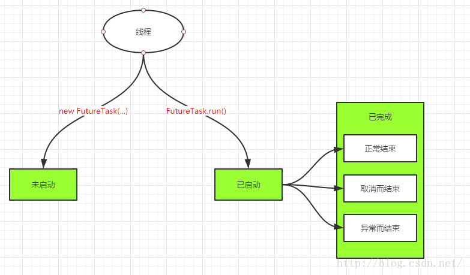
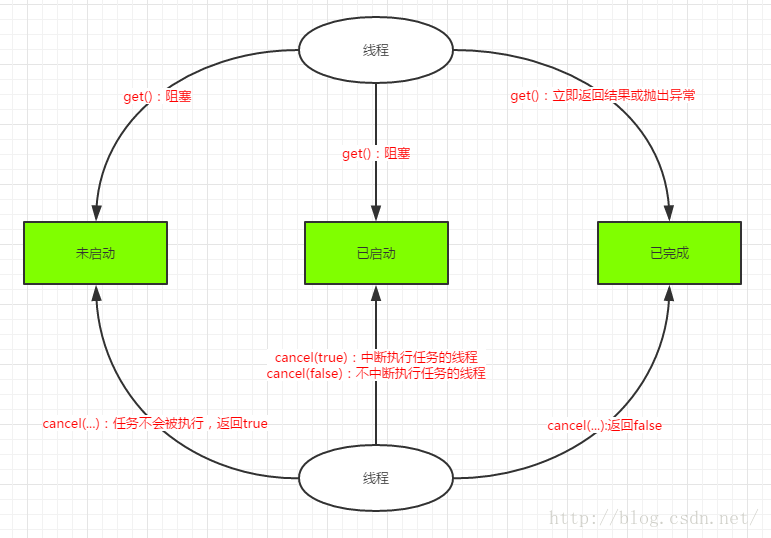

### Java多线程和线程池
***

#### 多线程
Java多线程主要的类是`Thread`和`Runnable`接口, 类只可以单继承, 接口可以多实现, 所以使用`Runnable`接口更加方便, 运行任务时候, 只需要重写run()方法, 就可以了. `Thread`有使用`Runnable`构造线程的构造函数. `Thread`之中的方法有run 和start需要注意, run是运行线程, 但是它只是运行, 也就是简单的执行, 达不到开启多条线程的效果, 而start方法是可以开启多条线程的, 开启多线程, 就需要多条线程同时start.

**多线程买票的例子**
```java
/*Thread买票*/
@Slf4j
public class MyThread extends Thread {
    @Setter
    @Getter
    private static volatile Integer no;// 可以当锁
    @Getter
    @Setter
    private String saleName;
    Object mutex = new Object();// 锁, 自己定义的, 或者使用实例的锁

    MyThread(String saleName) {
        super();
        this.saleName = saleName;
    }

    @Override
    public void run() {
        // 循环是指线程不停的去卖票
        while (no > 0) {
            try {
                Thread.sleep(1000);
                saleTicket();
            } catch (InterruptedException e) {
                log.error("多个窗口买票出现问题", e);
            }
        }
    }

    // 买一张票的情况
    public void saleTicket() {
        synchronized (no) {//在买票环节有所控制, 而非是run处
            if (no > 0) {
                System.out.println(this.getSaleName() + "卖出去了第" + this.getNo() + "张票");
                no = no - 1;
            } else {
                System.out.println("票已经卖完！");//为何有两个"票已经卖完了!"了的语句?
                return; // 结束线程, break, continue
            }
        }
    }


    public static void main(String[] args) {
        MyThread.setNo(20);//设置一共有100张票
        MyThread mt1 = new MyThread("小明");
        MyThread mt2 = new MyThread("Jack");
        MyThread mt3 = new MyThread("张辽");
        mt1.start();
        mt2.start();
        mt3.start();
    }
}
```

```java
// 使用Runnable来完成多线程的工作
@Slf4j
public class RunnaleThread implements Runnable {
    @Getter
    @Setter
    private static Integer ticket;
    @Getter
    @Setter
    private String sellName;

    RunnaleThread(String sellName) {
        this.sellName = sellName;
    }

    @Override
    public void run() {
        while (getTicket() > 0) {
            try {
                Thread.sleep(1000);
                sellTicket();
            } catch (Exception e) {
                log.error("买票出现问题", e);
            }
        }
}

    public void sellTicket() {
        synchronized (ticket) {//在买票环节有所控制, 而非是run处
            if (ticket > 0) {
                System.out.println(this.getSellName() + "卖出了第" + getTicket() + "票");
                ticket--;
            } else {
                System.out.println("票已经卖完了!");//为何有两个"票已经卖完了!"了的语句?
                return;
            }
        }
    }

    public static void main(String[] args) {
        RunnaleThread.setTicket(20);//设置一共有100张票
        RunnaleThread rt1 = new RunnaleThread("小明");
        RunnaleThread rt2 = new RunnaleThread("Jack");
        RunnaleThread rt3 = new RunnaleThread("张辽");
        Thread mt1 = new Thread(rt1);
        Thread mt2 = new Thread(rt2);
        Thread mt3 = new Thread(rt3);
        mt1.start();
        mt2.start();
        mt3.start();
    }
}
```
**结束线程**

```java
/*结束线程, 不去使用不安全的Thread.stop方法, 使用一个温和的方法停止线程*/
@Slf4j
public class StopThread extends Thread {
    private static Integer count = 30;

    @Override
    public void run() {
        while (count > 0) {
            try {
                Thread.sleep(100);
                synchronized (count) {//获取锁
                    if (count != 15) {
                        System.out.println(currentThread().getName() + ": " + count);
                        count--;
                    } else {
                        System.out.println("结束线程");
                        break;//结束线程的方式, 不用stop
                    }
                }

            } catch (InterruptedException e) {
                log.error("多个窗口买票出现问题", e);
            }
        }
    }

    public static void main(String[] args) {
        StopThread st1=new StopThread();
        StopThread st2=new StopThread();
        st1.start();
        st2.start();
        System.out.println(currentThread().getName() + ": " + count);
    }
}
```


#### 线程池基础
像上面或者类似这种每次来都是用new关键字, 新建一个Thread对象, 来创建一个线程的的方式存在着很多的弊端, 如下面:
- 每次new Thread新建对象性能差; 
- 线程缺乏统一的管理, 可以无限制新建线程, 相互之间竞争, 还可能占用过多系统资源导致死机或者OOM(Out of Memory);
- 缺乏更多的功能, 如定时执行, 定期执行, 线程中断等.

为了解决如上的问题, 在jdk1.5之中引入了`java.util.concurrent`包, 此处主要介绍关于线程池的部分内容, 关于锁, 重入锁, 无锁化操作等内容在关于JUC的文章之中说明. **线程池是基于二级调度的架构**,  所有的线程, 提交到线程池里面, 然后通过线程池进行提交运行. 关系可以通过下图来表示.

线程池的架构情况如上图, 之间的类和接口的关系如下图


##### 线程池作用
根据系统的环境情况, 可以自动或手动设置线程数量, 达到运行的最佳效果; 少了浪费了系统资源, 多了造成系统拥挤效率不高. 用线程池控制线程数量, 其他线程排队等候. 一个任务执行完毕, 再从队列的中取最前面的任务开始执行. 若队列中没有等待进程, 线程池的这一资源处于等待. 当一个新任务需要运行时, 如果线程池中有等待的工作线程, 就可以开始运行了, 否则进入等待队列. 


##### 为什么要用线程池
- 重用存在的线程, 减少对象创建, 消亡的开销, 提升性能
- 可有效控制最大并发线程数, 提高系统资源的使用率, 同时避免过多资源竞争, 避免堵塞
- 提供定时执行, 定期执行, 单线程, 并发数控制等功能
- 可以根据系统的承受能力, 调整线程池中工作线线程的数目, 防止因为消耗过多的内存, 而把服务器累趴下(每个线程需要大约1MB内存, 线程开的越多, 消耗的内存也就越大, 最后死机)


##### 主要的类
Java里面线程池的顶级接口是`Executor`, 但是严格意义上讲`Executor`并不是一个线程池, 而只是一个执行线程的工具. 真正的线程池接口是`ExecutorService`和`ScheduledExecutorService`,`ScheduledExecutorService`继承自`ExecutorService`,周期性任务的线程池的接口, `ExecutorService`是一个较为普遍的线程池接口.

| 类或接口                      | 作用                                                         |
| ----------------------------- | ------------------------------------------------------------ |
| `Executor`                    | 线程池的**接口**, 其中只有一个`execute(Runnable command)`方法 |
| `Executors`                   | 线程池的**工厂类**,  通过工厂调用工厂方法, 返回我们想要创建的线程池对象 |
| `ExecutorService`             | 真正的线程池接口, 继承自`Executor`, 其中包含了线程池实际操作的各种方法, 如`shutdown`, `shutdowmNow`, `isShutdown`,`isTerminated`,`submit`等 |
| `ScheduledExecutorService`    | 和`Timer/TimerTask`类似, 解决那些需要任务重复执行的问题.     |
| `ThreadPoolExecutor`          | `ExecutorService`的默认实现. **第一种线程池类**              |
| `ScheduledThreadPoolExecutor` | 继承自`ThreadPoolExecutor`的`ScheduledExecutorService`接口实现, 周期性任务调度的类实现. **第二种线程池类** |

要配置一个线程池是比较复杂的, 尤其是对于线程池的原理不是很清楚的情况下, 很有可能配置的线程池不是较优的, 因此在Executors类里面提供了一些静态工厂, 生成一些常用的线程池, *我们自定义的线程池, 通常使用`ThreadPoolExecutor`来完成*. 如下的5种线程池, 是jdk默认配置好的, 前面的4种是我们常用的线程池.

**ThreadPoolExecutor创建的3种常见线程池**:

1. **newSingleThreadExecutor**(结尾不是pool, 就是Exector)
创建一个**单线程**的线程池. **这个线程池只有一个线程在工作**, 也就是相当于单线程串行执行所有任务. 如果这个唯一的线程因为异常结束, 那么会有一个新的线程来替代它. 此线程池保证所有任务的执行顺序按照任务的提交顺序执行.
2. **newFixedThreadPool**
创建**固定大小**的线程池. 每次提交一个任务就创建一个线程, 直到线程达到线程池的最大大小. 线**程池的大小一旦达到最大值就会保持不变**.如果某个线程因为执行异常而结束, 那么线程池会补充一个新线程.
3. **newCachedThreadPool**
创建一个**可缓存**的线程池. 如果线程池的大小超过了处理任务所需要的线程, 那么就会回收部分空闲(60秒不执行任务)的线程, 当任务数增加时, 此线程池又可以智能的添加新线程来处理任务. **此线程池不会对线程池大小做限制**, 线程池大小完全依赖于操作系统(或者说JVM)能够创建的最大线程大小.

**ScheduleThreadPoolExecutor创建的2种常见线程池:**
1. **newScheduledThreadPool**
创建一个**大小无限**的线程池. 此线程池支持**定时以及周期性执行任务**的需求.
2. **SingleThreadScheduleExecutor**:
这个是单个线程, 不是常用的4种线程池之中的一种, 相当于单线程的周期性任务执行方式.


##### 基本线程池的使用实例
```java
public class TaskRun implements Runnable {
    @Getter
    @Setter
    private String name;

    TaskRun(String name) {
        this.name = name;
    }

    @Override
    public void run() {
        int no = 0;
        System.out.println(Thread.currentThread().getName()+"====="+this.getName() + "线程正在运行...");
        while (no < 10000000) {
            no++;
        }
        if (no >=10000000) {//判断条件
            System.out.println(this.getName() + "线程结束运行");
            return;
        }
    }
}
```
1.**newCachedThreadPool**
创建一个可缓存线程池, 如果线程池长度超过处理需要, 可灵活回收空闲线程, 若无可回收, 则新建线程. 示例代码如下:
```java
@Slf4j
public class MyThreadCachePool {
    public static void main(String[] args) {
        ExecutorService cachedThreadPool = Executors.newCachedThreadPool();//创建一个可调整大小的线程缓存池
        for (int i = 0; i < 10; i++) {
//            try {
            cachedThreadPool.execute(new TaskRun(String.valueOf(i)));
//                Thread.sleep(100);//停止主线程
//            } catch (InterruptedException e) {
//                log.error("线程运行出现问题", e);
//            }
//        }
        }
    }
}
```
线程池为无限大, 当执行第二个任务时第一个任务已经完成, 会复用执行第一个任务的线程, 而不用每次新建线程.

2.**newFixedThreadPool**
创建一个定长线程池, 可控制线程最大并发数, 超出的线程会在队列中等待. 示例代码如下:
```java
public class MyThreadFixedPool {
    public static void main(String[] args) {
        ExecutorService fix = Executors.newFixedThreadPool(10);//创建固定为10个线程大小的线程池
        TaskRun tr1 = new TaskRun("xc1");
        TaskRun tr2 = new TaskRun("xc2");
        TaskRun tr3 = new TaskRun("xc3");
        TaskRun tr4 = new TaskRun("xc4");
        TaskRun tr5 = new TaskRun("xc5");
        fix.execute(tr1);
        fix.execute(tr2);
        fix.execute(tr3);
        fix.execute(tr4);
        fix.execute(tr5);
        if (!fix.isShutdown()) {
            fix.shutdown();
            System.out.println("fix线程池停止了");
        }
    }
}
```
定长线程池的大小最好根据系统资源进行设置. 如`Runtime.getRuntime().availableProcessors()`

3.**newScheduledThreadPool**
创建一个定长线程池, 支持定时及周期性任务执行. 每次根据循环的次数, 时间成倍的增加, 代码如下:

```java
public class MyThreadScheduledPool {
    public static void main(String[] args) {
        // ScheduledExecutorService继承自ExecutorService,  两种ExecutorService都可以创建newScheduledThreadPool的线程池,
        // 但是, 只使用ExecutorService创建的线程池, 没有定时功能
        ScheduledExecutorService schedule = Executors.newScheduledThreadPool(3);//容量为3的规划线程池
        for (int i = 0; i < 10; i++) {
            TaskRun tr = new TaskRun("第" + i + "条线程");
            schedule.schedule(tr, 1000 * i, TimeUnit.MILLISECONDS);
        }
    }
}
```

4.**newSingleThreadExecutor**
创建一个单线程化的线程池, 它只会用唯一的工作线程来执行任务, 保证所有任务按照指定顺序(FIFO, LIFO, 优先级)执行. 示例代码如下:

```java
public class MyThreadSinglePool {
    public static void main(String[] args) {
        ExecutorService single = Executors.newSingleThreadExecutor();//只有一个线程的线程池
        TaskRun tr1 = new TaskRun("xc1");
        TaskRun tr2 = new TaskRun("xc2");
        TaskRun tr3 = new TaskRun("xc3");
        single.execute(tr1);//只有一个线程, execute执行之后没有返回的结果, 需要结果需要用到submit, 配合callable接口
        single.execute(tr1);
        single.execute(tr1);

    }
}
```
结果依次输出, 相当于顺序执行各个任务.
**注意**: 以上的execute()方法可以替换为submit()方法, 执行的结果是一样的.


##### submit() 和execute()的区别
JDK5往后, 任务分两类: 一类是实现了Runnable接口的类, 一类是实现了Callable接口的类. 两者都可以被`ExecutorService`执行, 但是他们之间还是有差异的, 区别如下, 可用下图形象描述之间的关系:
1. `execute(Runnable x) `: **没有返回值**. 可以执行任务, 但**无法判断任务是否成功完成**. ------实现Runnable接口
2. `submit(Runnable x) `:**返回一个future**. 可以用这个future来判断任务是否成功完成.------实现Callable接口


方法原型如下:

```java
   void execute(Runnable command);//execute
   <T> Future<T> submit(Runnable task, T result);//submit
   <T> Future<T> submit(Callable<T> task);//submit
```


#### 线程池进阶
由于实现了`Runnable`接口的线程任务, 其run方法的返回值是`void`, 所以其没有返回值, 而如果我们需要返回值的话, 那就需要使用`Callable`接口, `Future`接口, `FutureTask`接口等, 来实现获取返回结果的线程池.
##### Callable
Callable接口位于`java.util.concurrent`包, 这是一个泛型接口. Callable与Runnable的功能大致相似, Callable中有一个call()函数, **但是call()函数有返回值**, 而Runnable的run()函数不能将结果返回给客户程序.Callable的声明如下 
```java
public interface Callable<T> {
    T call() throws Exception;
}
```


##### Future
那么怎么使用Callable呢? Callable一般情况下是配合ExecutorService来使用的, 在ExecutorService接口中声明了若干个submit方法的重载版本:
```java
<T> Future<T> submit(Callable<T> task);
<T> Future<T> submit(Runnable task, T result);
Future<?> submit(Runnable task);
```
1.第一个submit方法里面的参数类型就是Callable.
2.一般情况下我们使用第一个submit方法和第三个submit方法, 第二个submit方法很少使用.
3.Future就是对于具体的Runnable或者Callable任务的执行结果进行取消, 查询是否完成, 获取结果. 必要时可以通过get方法获取执行结果, 该方法会阻塞直到任务返回结果.
Future接口也位于`java.util.concurrent`包, 其接口定义如下:

```java
public interface Future<V> {    
    boolean cancel(boolean mayInterruptIfRunning);    
    boolean isCancelled();    
    boolean isDone();    
    V get() throws InterruptedException, ExecutionException;    
    V get(long timeout, TimeUnit unit) throws InterruptedException, ExecutionException, TimeoutException;}
```
**方法解析**:
- **V get()**: 获取异步执行的结果, 如果没有结果可用, 此方法会阻塞直到异步计算完成. 
- **V get(Long timeout , TimeUnit unit)**: 获取异步执行结果, 如果没有结果可用, 此方法会阻塞, 但是会有时间限制, 如果阻塞时间超过设定的timeout时间, 该方法将抛出异常. 
- **boolean isDone()** : 如果任务执行结束, 无论是正常结束或是中途取消还是发生异常, 都返回true. 
- **boolean isCanceller()**: 如果任务完成前被取消, 则返回true. 
- **boolean cancel(boolean mayInterruptRunning)**: 如果任务还没开始, 执行cancel(...)方法将返回false; 如果任务已经启动, 执行cancel(true)方法将以中断执行此任务线程的方式来试图停止任务, 如果停止成功, 返回true; 当任务已经启动, 执行cancel(false)方法将不会对正在执行的任务线程产生影响(让线程正常执行到完成), 此时返回false; 当任务已经完成, 执行cancel(...)方法将返回false. mayInterruptRunning参数表示是否中断执行中的线程. 

**Future提供的三种功能**:

- 能够中断执行中的任务;
- 判断任务是否执行完成;
- 获取任务执行完成后额结果;

但是我们必须明白Future只是一个接口, 我们无法直接创建对象, 因此就需要其实现类FutureTask登场啦.


##### FutureTask
FutureTask则是一个RunnableFuture\<V\>, 而RunnableFuture实现了Runnbale又实现了Futrue\<V\>这两个接口.
```java
public class FutureTask<V> implements RunnableFuture<V>
```
RunnableFuture接口的源码如下:
```java
public interface RunnableFuture<V> extends Runnable, Future<V> {
    void run();
}
```
分析: FutureTask除了实现了Future接口外还实现了Runnable接口, 因此FutureTask也可以直接提交给Executor执行. 当然也可以调用线程直接执行(FutureTask.run()). 接下来我们根据FutureTask.run()的执行时机来分析其所处的3种状态:
- 未启动, FutureTask.run()方法还没有被执行之前, FutureTask处于未启动状态, 当创建一个FutureTask, 而且没有执行FutureTask.run()方法前, 这个FutureTask也处于未启动状态.
- 已启动, FutureTask.run()被执行的过程中, FutureTask处于已启动状态.
- 已完成, FutureTask.run()方法执行完正常结束, 或者被取消或者抛出异常而结束, FutureTask都处于完成状态.


下面我们再来看看FutureTask的方法执行示意图(方法和Future接口基本是一样的)


**分析**:
- 当FutureTask处于未启动或已启动状态时, 如果此时我们执行FutureTask.get()方法将导致调用线程阻塞; 当FutureTask处于已完成状态时, 执行FutureTask.get()方法将导致调用线程立即返回结果或者抛出异常.
- 当FutureTask处于未启动状态时, 执行FutureTask.cancel()方法将导致此任务永远不会执行.
- 当FutureTask处于已启动状态时, 执行cancel(true)方法将以中断执行此任务线程的方式来试图停止任务, 如果任务取消成功, cancel(...)返回true; 但如果执行cancel(false)方法将不会对正在执行的任务线程产生影响(让线程正常执行到完成), 此时cancel(...)返回false.当任务已经完成, 执行cancel(...)方法将返回false.

**FutureTask的两种构造函数**:

```java
public FutureTask(Callable<V> callable) {
}
public FutureTask(Runnable runnable, V result) {
}
```


##### 使用Callable接口返回结果的例子
使用Callable+Future的例子
```java
public class CallableFuture {
    public static void main(String args[]) throws Exception {
        /*任务*/
        ServiceTask task = new ServiceTask();
        ExecutorService executor = Executors.newCachedThreadPool();
        /*使用Future来完成任务提交到线程池*/
        Future<Integer> result = executor.submit(task);
        executor.shutdown();
        System.out.println("正在执行任务");
        Thread.sleep(1000);
        System.out.println("task运行结果为:" + result.get());
    }
}

/*ServiceTask实现了Callable接口*/
class ServiceTask implements Callable<Integer> {
    @Override
    public Integer call() throws Exception {
        Thread.sleep(2000);
        int result = 0;
        // 假设一个很庞大的计算
        for (int i = 1; i < 100; i++) {
            for (int j = 0; j < i; j++) {
                result += j;
            }
        }
        return result;
    }
}
```

使用Callable+FutureTask的例子
```java
public class CallableFutureTask {
    public static void main(String[] args) throws ExecutionException, InterruptedException {
        ExecutorService service1 = Executors.newCachedThreadPool();
        ExecutorService service2 = Executors.newCachedThreadPool();
        MyFuture mf1 = new MyFuture();
        MyFuture mf2 = new MyFuture();
        MyFuture mf3 = new MyFuture();
        /*使用Future*/
        Future<Integer> resultFuture = service1.submit(mf1);
        service1.shutdown();
        System.out.println("正在执行service1");
        System.out.println("callable的返回值为: " + resultFuture.get());//此处是获取线程任务的值, 结果
        /*使用FutureTask*/
        /*可以看出,FutureTask是一个实现了的类, 可以创建其对象, 可以自己去提交任务,
         *而不像Future, 只能在创建一个对象的同时, 将任务提交给线程池,
         *FutureTask, 先创建对象, 然后提交到线程池, 执行任务
         **/
        FutureTask<Integer> resFutureTask = new FutureTask<Integer>(mf2);
        service2.submit(resFutureTask);
        service2.shutdown();
        System.out.println("正在执行service2");
        System.out.println("callable的返回值为: " + resFutureTask.get());//此处是获取线程任务的值, 结果

    }
}

class MyFuture implements Callable<Integer> {

    @Override
    public Integer call() throws Exception {
        int result = 0;
        for (int i = 0; i < 1000000; i++) {
            result += i;
        }
        return result;
    }
}
```


ref:
1.[java 线程池——异步任务](https://www.cnblogs.com/0201zcr/p/6060068.html),   2.[Executor框架的使用简介](https://blog.csdn.net/qq_16811963/article/details/52161713),   3.[Java并发编程系列之十五：Executor框架](https://blog.csdn.net/u011116672/article/details/51057585),   4.[Java并发编程-Executor框架](https://blog.csdn.net/chenchaofuck1/article/details/51606224),   5.[Java 线程池学习](https://www.cnblogs.com/jersey/archive/2011/03/30/2000231.html),   6.[JAVA多线程高并发学习笔记(三)——Callable、Future和FutureTask](https://www.cnblogs.com/superfj/p/7526855.html),   7.[Java多线程：Callable,Future,FutureTask](https://www.cnblogs.com/ITtangtang/p/3966484.html),   8.[Java多线程编程：Callable、Future和FutureTask浅析](https://www.cnblogs.com/lcngu/p/6863529.html),   9.[java并发编程--Runnable Callable及Future](https://www.cnblogs.com/MOBIN/p/6185387.html),   10.[Java多线程编程：Callable、Future和FutureTask浅析（多线程编程之四）](https://blog.csdn.net/javazejian/article/details/50896505),  11.[Java并发之Runnable、Callable、Future、FutureTask](https://www.jianshu.com/p/cf12d4244171),   12.[Java并发编程：Callable、Future和FutureTask](https://lidong1665.github.io/2017/02/27/Java%E5%B9%B6%E5%8F%91%E7%BC%96%E7%A8%8B%EF%BC%9ACallable%E3%80%81Future%E5%92%8CFutureTask/),   13.[在Java中使用Callable、Future进行并行编程](https://segmentfault.com/a/1190000012291442),   14.[Java中的Runnable、Callable、Future、FutureTask的区别与示例](https://blog.csdn.net/bboyfeiyu/article/details/24851847),   15.[Java多线程编程：Callable、Future和FutureTask浅析（多线程编程之四）](https://blog.csdn.net/javazejian/article/details/50896505),   16.[Java并发编程与技术内幕:Callable、Future、FutureTask、CompletionService](https://blog.csdn.net/Evankaka/article/details/51610635),   17.[Callable 有返回值的异步（Runnable 异步是没有返回值的）](https://blog.csdn.net/xiaojin21cen/article/details/41820983)