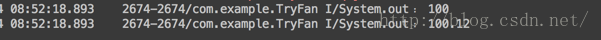
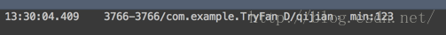
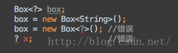
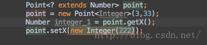

###  Java泛型的定义及使用初探

***
[TOC]

#### 泛型是什么

##### 0.概述
**泛型，即“参数化类型”。一提到参数，最熟悉的就是定义方法时有形参，然后调用此方法时传递实参。那么参数化类型怎么理解呢？顾名思义，就是将类型由原来的具体的类型参数化，类似于方法中的变量参数，此时类型也定义成参数形式（可以称之为类型形参），然后在使用/调用时传入具体的类型（类型实参）。**泛型的本质便是类型参数化，通俗的说就是用一个变量来表示类型，这个类型可以是String，Integer等等不确定，表明可接受的类型。
为何要引入泛型，即泛型与Object的优势，由于泛型可以接受多个参数，而Object经过强制类型转换可以转换为任何类型，既然二者都具有相同的作用，为何还要引进泛型呢？这是因为，泛型可以把使用Object的错误提前到编译后，而不是运行后，提升安全性。

##### 1. 泛型是什么
首先告诉大家ArrayList就是泛型。那ArrayList能完成哪些想不到的功能呢？先看看下面这段代码：
```java
ArrayList<String> strList = new ArrayList<String>();
ArrayList<Integer> intList = new ArrayList<Integer>();
ArrayList<Double> doubleList = new ArrayList<Double>();
```
大家对ArrayList很熟悉，这里构造了三个List, 分别盛装String、Integer和Double；这就是ArrayList的过人之处：即各种类型的变量都可以组装成对应的List，而不必针对每个类型分别实现一个构建ArrayList的类。这里可能看不懂，开篇总是困难的，下面看看如果没有泛型的话，我们要怎么做；


##### 2. 没有泛型会怎样
如下的代码，我们实现两个能够设置点坐标的类，分别设置Integer类型的点坐标和Float类型的点坐标：
```java
//设置Integer类型的点坐标
class IntegerPoint{
    private Integer x ;       // 表示X坐标
    private Integer y ;       // 表示Y坐标
    
    public void setX(Integer x){
        this.x = x ;
    }

    public void setY(Integer y){
        this.y = y ;
    }

    public Integer getX(){
        return this.x ;
    }

    public Integer getY(){
        return this.y ;
    }
}

//设置Float类型的点坐标
class FloatPoint{
    private Float x ;       // 表示X坐标
    private Float y ;       // 表示Y坐标

    public void setX(Float x){
        this.x = x ;
    }

    public void setY(Float y){
        this.y = y ;
    }

    public Float getX(){
        return this.x ;
    }

    public Float getY(){
        return this.y ;
    }
}
```

那现在有个问题：大家有没有发现，他们除了变量类型不一样，一个是Integer一个是Float以外，其它并没有什么区别！那我们能不能合并成一个呢？答案是可以的，因为Integer和Float都是派生自Object的，我们用下面这段代码代替：

```java
class ObjectPoint{
    private Object x ;
    private Object y ;

    public void setX(Object x){
        this.x = x ;
    }

    public void setY(Object y){
        this.y = y ;
    }

    public Object getX(){
        return this.x ;
    }

    public Object getY(){
        return this.y ;
    }
}
```

即全部都用Object来代替所有的子类；在使用的时候是这样的：

```java
ObjectPoint integerPoint = new ObjectPoint();
integerPoint.setX(new Integer(100));
Integer integerX=(Integer)integerPoint.getX();
```

在设置的时候，使用new Integer(100)来新建一个Integer

```java
integerPoint.setX(new Integer(100));
```

然后在取值的时候，进行强制转换：

```java
Integer integerX=(Integer)integerPoint.getX();
```

由于我们设置的时候，是设置的Integer，所以在取值的时候，强制转换是不会出错的。同理，FloatPoint的设置和取值也是类似的，代码如下：

```java
ObjectPoint floatPoint = new ObjectPoint();
floatPoint.setX(new Float(100.12f));
Float floatX = (Float)floatPoint.getX();
```

但问题来了：注意，注意，我们这里使用了强制转换，我们这里setX（）和getX（）写得很近，所以我们明确的知道我们传进去的是Float类型，那如果我们记错了呢？比如我们改成下面这样，编译时会报错吗：

```java
ObjectPoint floatPoint = new ObjectPoint();
floatPoint.setX(new Float(100.12f));
String floatX = (String)floatPoint.getX();
```

不会！！！我们问题的关键在于这句：

```java
String floatX = (String)floatPoint.getX();
```

强制转换时，会不会出错。因为编译器也不知道你传进去的是什么，而floatPoint.getX()返回的类型是Object，所以编译时，将Object强转成String是成立的。必然不会报错。而在运行时，则不然，在运行时，floatPoint实例中明明传进去的是Float类型的变量，非要把它强转成String类型，肯定会报类型转换错误的！那有没有一种办法在编译阶段，即能合并成同一个，又能在编译时检查出来传进去类型不对呢？当然，这就是泛型。下面我们将对泛型的写法和用法做一一讲解。


#### 泛型类定义及使用

##### 泛型类定义及使用
我们先看看泛型的类是怎么定义的：
```java
//定义泛型类
class Point<T>{// 此处可以随便写标识符号 
    private T x ;      
    private T y ;      

    public void setX(T x){//作为参数
        this.x = x ;
    }

    public void setY(T y){
        this.y = y ;
    }

    public T getX(){//作为返回值
        return this.x ;
    }

    public T getY(){
        return this.y ;
    }
};

//IntegerPoint使用
Point<Integer> p = new Point<Integer>() ; 
p.setX(new Integer(100)) ; 
System.out.println(p.getX());  

//FloatPoint使用
Point<Float> p = new Point<Float>() ; 
p.setX(new Float(100.12f)) ; 
System.out.println(p.getX());  
```

先看看运行结果：


从结果中可以看到，我们实现了开篇中IntegerPoint类和FloatPoint类的效果。下面来看看泛型是怎么定义及使用的吧。

**a. 定义泛型类：Point\<T\>**
首先，大家可以看到Point\<T\>，**即在类名后面加一个尖括号，括号里是一个大写字母**。这里写的是T，其实这个字母可以是任何大写字母，大家这里先记着，可以是任何大写字母，意义是相同的。

```java
class Point<T>{
    ...
}
```

**b. 类中使用泛型**
**这个T表示派生自Object类的任何类**，比如String，Integer，Double等等。这里要注意的是，*T一定是派生于Object类的*。为方便起见，大家可以在这里把T当成String，即String在类中怎么用，那T在类中就可以怎么用！*所以下面的：定义变量，作为返回值，作为参数传入的定义就很容易理解了*。

```java
//定义变量
private T x ; 

//作为返回值
public T getX(){ 
    return x ;  
}  

//作为参数
public void setX(T x){  
    this.x = x ;  
} 
```

c .使用泛型类
下面是泛型类的用法：
```java
//IntegerPoint使用
Point<Integer> p = new Point<Integer>() ; 
p.setX(new Integer(100)) ; 
System.out.println(p.getX());  

//FloatPoint使用
Point<Float> p = new Point<Float>() ; 
p.setX(new Float(100.12f)) ; 
System.out.println(p.getX());  
```

首先，是构造一个实例：
```java
Point<String> p = new Point<String>() ; 
```
这里与普通构造类实例的不同之点在于，普通类构造函数是这样的：Point p = new Point() ; 而泛型类的构造则需要在类名后添加上<String>，即一对尖括号，中间写上要传入的类型。**虽然在定义泛型类的时候我们需要在后面写上<T> ，但是在构造函数之中，并不需要<T>**，这点需要注意如下：
```java
class Point<T>{
    private T t1;
    public Point(){
    }
    
    public Point(T t){
        this.t1=t;
    }
}
```
因为我们构造时，是这样的：class Point<T>，所以在使用的时候也要在Point后加上类型来定义T代表的意义。然后在getVar（）和setVar（）时就没有什么特殊的了，直接调用即可。从上面的使用时，明显可以看出泛型的作用，在构造泛型类的实例的时候：
```java
//IntegerPoint使用
Point<Integer> p = new Point<Integer>() ; 

//FloatPoint使用
Point<Float> p = new Point<Float>() ; 
```
**尖括号中，你传进去的是什么，T就代表什么类型。这就是泛型的最大作用，我们只需要考虑逻辑实现，就能拿给各种类来用**。前面我们提到ArrayList也是泛型，我们顺便它的实现：
```java
public class ArrayList<E>{
	…………
}
```
看到了吧，跟我们的Point实现是一样的，这也就是为什么ArrayList能够盛装各种类型的主要原因。

d .使用泛型实现的优势

相比我们开篇时使用Object的方式，有两个优点：
- **不用强制转换**
-  在settVar()时如果传入类型不对，编译时会报错，**在编译阶段之前就杜绝类型错误发生**

```java
//使用Object作为返回值，要强制转换成指定类型
Float floatX = (Float)floatPoint.getX();

//使用泛型时，不用强制转换，直接出来就是String
System.out.println(p.getVar()); 
```

可以看到，当我们构造时使用的是String,而在setVar时，传进去Integer类型时，就会报错。而不是像Object实现方式一样，在运行时才会报强制转换错误。


#### 泛型接口定义及使用
在接口上定义泛型与在类中定义泛型是一样的，也是在接口名后加尖括号；代码如下：

```java
interface Info<T>{        // 在接口上定义泛型  
    public T getVar() ;   // 定义抽象方法，抽象方法的返回值就是泛型类型  
    public void setVar(T x);
}  
```

##### 1.使用方法一：非泛型类
但是在使用的时候，就出现问题了，我们先看看下面这个使用方法：
```java
class InfoImpl implements Info<String>{	// 定义泛型接口的子类
    private String var ;				// 定义属性
    public InfoImpl(String var){		// 通过构造方法设置属性内容
        this.setVar(var) ;
    }

    @Override
    public void setVar(String var){
        this.var = var ;
    }

    @Override
    public String getVar(){
        return this.var ;
    }

}

public class GenericsDemo24{
    public  void main(String arsg[]){
        InfoImpl i = new InfoImpl("harvic");
        System.out.println(i.getVar()) ;
    }
}
```
从上可以看得到`InfoImpl`的定义，**很清楚的一点是`InfoImpl`不是一个泛型类！因为他类名后没有\<T\>！** *然后在在这里我们将Info\<String\>中的泛型变量T定义填充为了String类型*。所以在重写时`setVar()`和`getVar()`时，**IDE会也我们直接生成String类型的重写函数**。最后在使用时，没什么难度，传进去String类型的字符串来构造InfoImpl实例，然后调用它的函数即可。

##### 2.使用方法二：泛型类
在方法一中，我们在类中直接把Info<T>接口给填充好了，但我们的类，是可以构造成泛型类的，那我们利用泛型类来构造填充泛型接口会是怎样呢？
```java
interface Info<T>{		// 在接口上定义泛型
	public T getVar() ;	// 定义抽象方法，抽象方法的返回值就是泛型类型
	public void setVar(T var);
}

class InfoImpl<T> implements Info<T>{	// 定义泛型接口的子类
	private T var ;				// 定义属性
	public InfoImpl(T var){		// 通过构造方法设置属性内容
		this.setVar(var) ;	
	}

	public void setVar(T var){
		this.var = var ;
	}

	public T getVar(){
		return this.var ;
	}
}

public class GenericsDemo24{
	public static void main(String arsg[]){
		InfoImpl<String> i = new InfoImpl<String>("harvic");
		System.out.println(i.getVar()) ;
	}
}
```

最关键的是构造泛型类的过程：

```java
class InfoImpl<T> implements Info<T>{	// 定义泛型接口的子类
	private T var ;				// 定义属性
	public InfoImpl(T var){		// 通过构造方法设置属性内容
		this.setVar(var) ;	
	}

	public void setVar(T var){
		this.var = var ;
	}

	public T getVar(){
		return this.var ;
	}
}
```

*在这个类中，我们构造了一个泛型类InfoImpl\<T\>，然后把泛型变量T传给了Info\<T\>，这说明接口和泛型类使用的都是同一个泛型变量*。然后在使用时，就是构造一个泛型类的实例的过程，使用过程也不变。其实第一个例子和第二个例子其实是非常相似的，但是说明了一个问题，那就是**决定一个类是不是泛型类的标志，关键在于定义类的时候，其类名后有无\<T\>标识符，而不在于它继承或者实现的类或者接口是不是泛型类或泛型接口，重点在于自己，而非他人**。

> 使用泛型类来继承泛型接口的作用就是让用户来定义接口所使用的变量类型，而不是像方法一那样，在类中写死。

那我们稍微加深点难度，构造一个多个泛型变量的类，并继承自Info接口：

```java
class InfoImpl<T,K,U> implements Info<U>{	// 定义泛型接口的子类
     private U var ;	
     private T x;
     private K y;

     public InfoImpl(U var){		// 通过构造方法设置属性内容
         this.setVar(var) ;
     }

     public void setVar(U var){
         this.var = var ;
     }

     public U getVar(){
         return this.var ;
     }
 }
```
在这个例子中，我们在泛型类中定义三个泛型变量T, K, U并且把第三个泛型变量U用来填充接口Info。所以在这个例子中Info所使用的类型就是由U来决定的。使用时是这样的：泛型类的基本用法，不再多讲,代码如下：
```java
public class GenericsDemo24{
    public  void main(String arsg[]){
        InfoImpl<Integer,Double,String> i = new InfoImpl<Integer,Double,String>("harvic");
        System.out.println(i.getVar()) ;
    }
}
```


#### 泛型函数定义及使用
##### 泛型函数的定义

和普通的方法定义一样，方法需要返回值，而如果是一个泛型方法的话，那么就还需要表现其泛型的特征，所以需要\<T\>的标志，通常情况下表示出来就是 

```java
public <T> String method(T a){  //A
    ......
    retrun a.toString();
}

public <T> T method(T a){    //B
    ......
    retrun a;
}
```

上面我们讲解了类和接口的泛型使用，下面我们再说说，怎么单独在一个函数里使用泛型。比如我们在新建一个普通的类StaticFans，然后在其中定义了两个泛型函数：

```java
public class StaticFans {
	//静态函数1
    public static  <T> void StaticMethod(T a){
        Log.d("harvic","StaticMethod: "+a.toString());
    }
    //静态函数2
    public static  <T> T StaticMethod(T a){
        Log.d("harvic","StaticMethod: "+a.toString());
        return a;
    }

	//普通函数1
    public  <T> void OtherMethod(T a){
        Log.d("harvic","OtherMethod: "+a.toString());
    }
    //普通函数2
    public  <T> T OtherMethod(T a){
        Log.d("harvic","OtherMethod: "+a.toString());
        return a;
    }
}
```

**上面分别是静态泛型函数和常规泛型函数的定义方法，与以往方法的唯一不同点就是在返回值前加上\<T\>来表示泛型变量**。其它没什么区别。使用方法如下：

```java
//静态方法
StaticFans.StaticMethod("adfdsa");//使用方法一
StaticFans.<String>StaticMethod("adfdsa");//使用方法二

//常规方法
StaticFans staticFans = new StaticFans();
staticFans.OtherMethod(new Integer(123));//使用方法一
staticFans.<Integer>OtherMethod(new Integer(123));//使用方法二
```

结果如下：


首先，我们看静态泛型函数的使用方法：
```java
StaticFans.StaticMethod("adfdsa");//使用方法一
StaticFans.<String>StaticMethod("adfdsa");//使用方法二
```

从结果中我们可以看到，这两种方法的结果是完全一样的，但他们还有些区别的，区别如下：
**方法一**: 可以像普通方法一样，直接传值，任何值都可以（但必须是派生自Object类的类型，比如String,Integer等），函数会在内部根据传进去的参数来识别当前T的类别。但尽量不要使用这种隐式的传递方式，代码不利于阅读和维护。因为从外观根本看不出来你调用的是一个泛型函数。
**方法二**: 与方法一不同的地方在于，**在调用方法前加了一个\<String\>来指定传给\<T\>的值，如果加了这个\<String\>来指定参数的值的话，那StaticMethod()函数里所有用到的T类型也就是强制指定了是String类型**。这是我们建议使用的方式。

同样，常规泛型函数的使用也有这两种方式：
```java
StaticFans staticFans = new StaticFans();

staticFans.OtherMethod(new Integer(123));//使用方法一
staticFans.<Integer>OtherMethod(new Integer(123));//使用方法二
```

可以看到，与平常一样，先创建类的实例，然后调用泛型函数。
方法一，隐式传递了T的类型，与上面一样，不建议这么做。
方法二，显示将T赋值为Integer类型，这样OtherMethod（T a）传递过来的参数如果不是Integer那么编译器就会报错。

**进阶：返回值中存在泛型**

一开始的两种定义方式之中，返回值之中存在泛型是第二种B类型，A类型是比较常规的，上面的例子也是按照A类型来写的，其中的返回值也可以换成String，void，int等类型，上面我们的函数中，返回值都是void，但现实中不可能都是void，有时，我们需要将泛型变量返回，比如下面这个函数：

```java
public static <T> List<T> parseArray(String response,Class<T> object){
    List<T> modelList = JSON.parseArray(response, object);
    return modelList;
}
```
函数返回值是List\<T>类型。至于传入参数Class\<T\> object的意义，我们下面会讲。这里也就是想通过这个例子来告诉大家，泛型变量其实跟String,Integer，Double等等的类的使用上没有任何区别，T只是一个符号，可以代表String,Integer，Double……这些类的符号，在泛型函数使用时，直接把T看到String,Integer，Double……中的任一个来写代码就可以了。**唯一不同的是，要在函数定义的中在返回值前加上\<T\>标识泛型**。


#### 其它用法:Class\<T\>类传递及泛型数组
##### 1.使用Class\<T\>传递泛型类Class对象
有时，我们会遇到一个情况，比如，我们在使用JSON解析字符串的时候，代码一般是这样的
```java
public static List<SuccessModel> parseArray(String response){
    List<SuccessModel> modelList = JSON.parseArray(response, SuccessModel.class);
    return modelList;
}
```

其中SuccessModel是自定义的解析类，代码如下，其实大家不用管SuccessModel的定义，只考虑上面的那段代码就行了。写出来SuccessModel的代码，只是不想大家感到迷惑，其实，这里只是fastJson的基本用法而已。
这段代码的意义就是根据SuccessModel解析出List\<SuccessModel\>的数组。

```java
public class SuccessModel {
    private boolean success;  
    
    public boolean isSuccess() {
        return success;
    }

    public void setSuccess(boolean success) {
        this.success = success;
    }
} 
```
那现在，我们把下面这句组装成一个泛型函数要怎么来做呢?
```java
public static List<SuccessModel> parseArray(String response){
    List<SuccessModel> modelList = JSON.parseArray(response, SuccessModel.class);
    return modelList;
}
```
首先，我们应该把SuccessModel单独抽出来做为泛型变量，但parseArray（）中用到的SuccessModel.class要怎么弄呢？先来看代码：
```java
public static <T> List<T> parseArray(String response,Class<T> object){
    List<T> modelList = JSON.parseArray(response, object);
    return modelList;
}
```
注意到，我们用的Class\<T\> object来传递类的class对象，即我们上面提到的SuccessModel.class。这是因为Class\<T\>也是一泛型，它是传来用来装载类的class对象的，它的定义如下：
```java
public final class Class<T> implements Serializable {
	......
}
```
通过Class\<T\>来加载泛型的Class对象的问题就讲完了，下面来看看泛型数组的使用方法吧。


##### 2.定义泛型数组
在写程序时，大家可能会遇到类似String[] list = new String[8];的需求，这里可以定义String数组，当然我们也可以定义泛型数组，泛型数组的定义方法为 T[]，与String[]是一致的，**一定不能忘记\<T\>是泛型的标志， 有泛型必有\<T\>， 这样而言， 其他的所有的返回值， 所有的类型全都是照搬**， 下面看看用法：
```java
//定义
public static <T> T[] fun1(T...arg){  // 接收可变参数  
       return arg ;            // 返回泛型数组  
}  
//使用
public static void main(String args[]){  
       Integer i[] = fun1(1,2,3,4,5,6) ;
       Integer[] result = fun1(i) ;
}  
```
我们先看看 定义时的代码：
```java
public static <T> T[] fun1(T...arg){  // 接收可变参数  
       return arg ;            // 返回泛型数组  
}  
```
首先，定义了一个静态函数，然后定义返回值为T[]，参数为接收的T类型的可变长参数。如果有同学对T...arg是JAVA 可变长参数， arg使用一个数组将参数包裹起来。由于可变长参数在输入后，会保存在arg这个数组中，所以，我们直接把数组返回即可。


#### 多泛型变量定义及字母规范

##### 1.多泛型变量定义

上在我们只定义了一个泛型变量T，那如果我们需要传进去多个泛型要怎么办呢？可以采用多个字母, 中间使用英文逗号分隔，类似下面这样就可以了：

```java
class MorePoint<T, U>{
        ......
}
```

也就是在原来的T后面用逗号隔开，写上其它的任意大写字母即可。想加几个就加几个，比如我们想加五个泛型变量，那应该是这样的：

```java
class MorePoint<T,U,A,B,C>{
         ......
}
```

举个粟子，我们在Point上再另加一个字段name，也用泛型来表示，那要怎么做？代码如下：

```java
class MorePoint<T,U> {
    private T x;
    private T y;       
    private U name;

    public void setX(T x) {
        this.x = x;
    }

    public T getX() {
        return this.x;

    }
	…………

    public void setName(U name){
        this.name = name;
    }
    
    public U getName() {
        return this.name;
    }

}
//使用
MorePoint<Integer,String> morePoint = new MorePoint<Integer, String>();
morePoint.setName("harvic");
Log.d(TAG, "morPont.getName:" + morePoint.getName());
```

从上面的代码中，可以明显看出，就是在新添加的泛型变量U用法与T是一样的。

##### 2.字母规范

在定义泛型类时，我们已经提到用于指定泛型的变量是一个大写字母：

```java
class Point<T>{
 …………
}
```

当然不是的！！！！**任意一个大写字母都可以**。他们的意义是完全相同的，*但为了提高可读性*，大家还是用有意义的字母比较好，**一般来讲，在不同的情境下使用的字母意义如下**：

- E — Element，常用在java Collection里，如：List<E>,Iterator<E>,Set<E>
- K, V — Key，Value，代表Map的键值对
- N — Number，数字
- T — Type，类型，如String，Integer等等

如果这些还不够用，那就自己随便取吧，反正26个英文字母呢。再重复一遍，**使用哪个字母是没有特定意义的！只是为了提高可读性！！！！**


#### 类型绑定

为什么会有类型绑定的话题呢? 我们重新看上篇写的一个泛型：
```java
class Point<T> {
    private T x;       // 表示X坐标
    private T y;       // 表示Y坐标

    public void setX(T x) {
        this.x = x;
    }

    public void setY(T y) {
        this.y = y;
    }

    public T getX() {
        return this.x;
    }

    public T getY() {
        return this.y;
    }
}

//使用
Point<Integer> p1 = new Point<Integer>();
p1.setX(new Integer(100));
System.out.println(p1.getX());
```

首先，我们要知道一点，任何的泛型变量（比如这里的T）都是派生自Object，所以我们在填充泛型变量时，只能使用派生自Object的类，比如String,Integer,Double，等而不能使用原始的变量类型，比如int,double,float等。然后，问题来了，那在泛型类Point\<T\>内部，利用泛型定义的变量T x能调用哪些函数呢？
```java
private T x;  
```
当然只能调用Object所具有的函数，**因为编译器根本不知道T具体是什么类型，只有在运行时，用户给什么类型，他才知道是什么类型。编译器唯一能确定的是，无论什么类型，都是派生自Object的，所以T肯定是Object的子类，所以T是可以调用Object的方法的**。那么问题又来了，如果我想写一个找到最小值的泛型类；由于不知道用户会传什么类型，所以要写一个接口,让用户实现这个接口来自已对比他所传递的类型的大小。
接口如下：
```java
public interface Comparable<T>{
    public boolean compareTo(T i);
}
```

但如果我们直接利用T的实例来调用`compareTo()`函数的话，会报错，编译器截图如下：


这是**因为，编译器根本无法得知T是继承自Comparable接口的函数。那怎么样才能让编译器知道，T是继承了Comparable接口的类型呢？ 这就是类型绑定的作用了**。

##### 类型绑定：extends

###### 定义

有时候，你会希望泛型类型只能是某一部分类型，比如操作数据的时候，你会希望是Number或其子类类型。这个想法其实就是给泛型参数添加一个界限。其定义形式为：
```java
<T extends BoundingType>// extends 添加的是上限
```

**此定义表示T应该是`BoundingType`或者`BoundingType`的子类型(subtype)**。T和`BoundingType`可以是类，也可以是接口。另外注意的是，*此处的`extends`表示的子类型，不等同于继承*。一定要非常注意的是，**泛型之中使用的extends不是类继承里的那个extends！两个根本没有任何关联**。*在这里extends后的BoundingType可以是类，也可以是接口，意思是说，T是在BoundingType基础上创建的，具有BoundingType的功能*。目测是JAVA的开发人员不想再引入一个关键字，所以用已有的extends来代替而已。

###### 实例：绑定接口
同样，我们还使用上面对比大小的接口来做例子，首先，看加上extends限定后的min函数：
```java
public interface Comparable<T> {
    public boolean compareTo(T i);
}
//添加上extends Comparable之后，就可以Comparable里的函数了
public static <T extends Comparable>  T min(T...a){
    T smallest = a[0];
    for(T item:a){
        if (smallest.compareTo(item)){
            smallest = item;
        }
    }
    return smallest;
}
```

这段代码的意思就是根据传进去的T类型数组a，然后调用其中item的compareTo()函数，跟每一项做对比，最终找到最小值。从这段代码也可以看出，**类型绑定有两个作用：1、对填充的泛型加以限定 2、使用泛型变量T时，可以使用BoundingType内部的函数**。这里有一点非常要注意的是，在这句中smallest.compareTo(item)，smallest和item全部都是T类型的，也就是说，compareTo对比的是同一种类型。然后我们实现一个派生自Comparable接口的类：

```java
public class StringCompare implements Comparable<StringCompare> {
    private String mStr;

    public StringCompare(String string){
        this.mStr = string;
    }

    @Override
    public  boolean compareTo(StringCompare str) {
        if (mStr.length() > str.mStr.length()){
            return true;
        }
        return false;
    }
}
```

在这段代码，大家可能会疑惑为什么把T也填充为StringCompare类型，记得我们上面说的吗：smallest.compareTo(item)，smallest和item是同一类型！！！所以compareTo的参数必须是与调用者自身是同一类型，所以要把T填充为StringCompare；在这段代码中compareTo的实现为，对比当前mstr的长度与传进来实例的mstr长度进行比较，如果超过，则返回true,否则返回false;最后是使用min函数：
```java
StringCompare result = min(new  StringCompare("123"),new StringCompare("234"),new StringCompare("59897"));
Log.d(TAG,"min:"+result.mStr);
```

结果如下：

这里有extends接口，我们开篇说过，extends表示绑定，后面的BindingType即可以是接口，也可以是类，下面我们就再举个绑定类的例子。

###### 实例：绑定类
我们假设，我们有很多种类的水果，需要写一个函数，打印出填充进去水果的名字：为此，我们先建一个基类来设置和提取名字：
```java
class Fruit {
    private String name;
    
    public String getName() {
        return name;
    }
    public void setName(String name) {
        this.name = name;
    }
}
```

然后写个泛型函数来提取名字：

```java
public static <T extends Fruit> String getFruitName(T t){
    return t.getName();
}
```

这里泛型函数的用法就出来了，由于我们已知水果都会继承Fruit基类，所以我们利用`<T extends Fruit>`就可以限定填充的变量必须派生自Fruit的子类。一来，在T中，我们就可以利用Fruit类中方法和函数；二来，如果用户填充进去的类没有派生自Fruit，那编译器就会报错。然后，我们新建两个类，派生自Fruit，并填充进去它们自己的名字:
```java
class Banana extends Fruit{
    public Banana(){
        setName("bababa");
    }
}

class Apple extends Fruit{
    public Apple(){
        setName("apple");
    }
}
```
最后调用：
```java
String name_1 = getFruitName(new Banana());
String name_2 = getFruitName(new Apple());
Log.d(TAG,name_1);
Log.d(TAG,name_2);
```
结果如下：


###### 绑定多个限定

上面我们讲了，有关绑定限定的用法，其实我们可以同时绑定多个绑定,用&连接，比如：

```java
public static <T extends Fruit&Serializable> String getFruitName(T t){
    return t.getName();
}
```

再加深下难度，如果我们有多个泛型，每个泛型都带绑定，那应该是什么样子的呢：

```java
public static <T extends Comparable & Serializable, U extends Runnable> T foo(T a, U b){
	…………
}
```

大家应该看得懂，稍微讲一下：这里有两个泛型变量T和U,将T与Comparable & Serializable绑定，将U与Runnable绑定。


#### 通配符
通配符是一个非常令人头疼的一个功能，理解与掌握难度比较大，下面我尽力去讲明白它与泛型变量的区别与用法。重新来看我们上篇用的Point泛型定义：
```java
class Point<T> {
    private T x;      
    private T y;   
    
    public Point(){
    }

    public Point(T x,T y){
        this.x = x;
        this.y = y;
    }

    public void setX(T x) {
        this.x = x;
    }

    public void setY(T y) {
        this.y = y;
    }

    public T getX() {
        return this.x;
    }

    public T getY() {
        return this.y;
    }
}
```
这段代码很简单，引入了一个泛型变量T，然后是有两个构造函数，最后分别是利用set和get方法来设置和获取x,y的值。这段代码没什么难度，不再细讲。我们看看下面这段使用的代码：
```java
Point<Integer> integerPoint = new Point<Integer>(3,3);
…………
Point<Float> floatPoint = new Point<Float>(4.3f,4.3f);
…………
Point<Double> doublePoint = new Point<Double>(4.3d,4.90d);
…………
Point<Long> longPoint = new Point<Long>(12l,23l);
…………
```
在这段代码中，我们使用Point<T>生成了四个实例:integerPoint,floatPoint,doublePoint和longPoint；在这里，我们生成四个实例，就得想四个名字。如果我们想生成十个不同类型的实例呢？那不得想十个名字。光想名字就是个事，（其实我并不觉得想名字是个什么大事…… T _ T ，没办法，想不出更好的例子了…… ）那有没有一种办法，生成一个变量，可以将不同类型的实例赋值给他呢？

##### 无边界通配符：？

###### 概述

先不讲无边界通配符是什么，同样拿上面的例子来看，如果我们这样实现：

```java
Point<?> point;
point = new Point<Integer>(3,3);
point = new Point<Float>(4.3f,4.3f);
point = new Point<Double>(4.3d,4.90d);
point = new Point<Long>(12l,23l);
```

在这里，我们首先，利用下面的代码生成一个point实例，注意到，在填充泛型时，用的是?

```java
Point<?> point;
```

然后，各种类型的Point实例，都可以赋值给point了：

```java
point = new Point<Integer>(3,3);
point = new Point<Float>(4.3f,4.3f);
point = new Point<Double>(4.3d,4.90d);
point = new Point<Long>(12l,23l);
```

这里的**?就是无边界通配符。通配符的意义就是它是一个未知的符号，可以是代表任意的类**。所以这里可能大家就明白了，这里不光能将泛型变量T填充为数值类型，其实任意Point实例都是可以传给point的：比如这里的Point\<String\>(),Point\<Object\>()都是可以的

###### ？与T的区别

大家可能会有疑问，那无边界通配符？与泛型变量T有什么区别呢？答案是：他们俩没有任何联系！！！！！泛型变量T不能在代码用于创建变量，只能在类，接口，函数中声明以后，才能使用。比如：

```java
public class Box<T> {
   public T get(){
	   ......
   };
   public void put(T element){
       ......
   };
}
```

而**无边界通配符？则只能用于填充泛型变量T，表示通配任何类型！！！！**再重复一遍：？只能用于填充泛型变量T。它是用来填充T的！！！！只是填充方式的一种！！！**类型通配符一般是使用 ? 代替具体的类型实参。注意了，此处是类型实参，而不是类型形参！且Box<?>在逻辑上是Box\<Integer\>、Box\<Number\>...等所有Box<具体类型实参>的父类。由此，我们依然可以定义泛型方法，来完成此类需求。**比如：

```java
//无边界通配符填充
Box<?> box;
//其它类型填充
Box<String> stringBox;
```

##### 通配符只能用于填充泛型变量T，不能用于定义变量

大家一定要记得，通配符的使用位置只有：

```java
Box<?> box;
box = new Box<String>();
```

即填充泛型变量T的位置，不能出现在后面String的位置！！！！下面的第三行，第四行，都是错误的。通配符不能用于定义变量。


**再次强调，？只能出现在Box<?> box;中，其它位置都是不对的**。


#### 通配符？的绑定
##### extends绑定
从上面我们可以知道通配符？可以代表任意类型，但跟泛型一样，如果不加以限定，在后期的使用中编译器可能不会报错。所以我们同样，要对？加以限定。**绑定的形式，同样是通过extends关键字**，意义和使用方法都用泛型变量一致。同样，以我们上面的Point<T>泛型类为例，因为Point在实例意义中，其中的值是数值才有意义，所以将泛型变量T填充为Object类型、String类型等都是不正确的。所以我们要对Point<?> point加以限定：只有数值类型才能赋值给point；我们把代码改成下面的方式：


我们给通配符加上限定： `Point<? extends Number> point;`此时，最后两行，当将T填充为String和Object时，赋值给point就会报错！这里?表示所有的类，但是extends关键字还是发挥了它的作用，表示不关?代表什么类，必须是Number类或者Number类的子类。~~这里虽然是指派生自Number的任意类型，但大家注意到了没： new Point<Number>();也是可以成功赋值的，这说明包括边界自身~~。再重复一遍：**无边界通配符只是泛型T的填充方式，给他加上限定，只是限定了赋值给它（比如这里的point）的实例类型**。如果想从根本上解决乱填充Point的问题，需要从Point泛型类定义时加上\<T extends Number\>:
```java
class Point<T extends Number> {
    private T x;       // 表示X坐标
    private T y;       // 表示Y坐标
    ......
}
```

##### extends通配符实例内容：能取不能存
注意：利用<? extends Number>定义的变量，只可取其中的值，不可修改，看下面的代码，发现明显在`point.setX(Integer(122));`时报编译错误。但point.getX()却不报错。这是为什么呢？

首先，point的类型是由Point<? extends Number>决定的，并不会因为point = new Point<Integer>(3,3);而改变类型。即便point = new Point<Integer>(3,3);之后，point的类型依然是Point<? extends Number>，即派生自Number类的未知类型！！！这一点很好理解，如果在point = new Point<Integer>(3,3);之后，point就变成了Point<Integer>类型，那后面point = new Point<Long>(12l,23l); 操作时，肯定会因为类型不匹配而报编译错误了，正因为，point的类型始终是Point<? extends Number>，因此能继续被各种类型实例赋值。回到正题，现在说说为什么不能赋值，正因为point的类型为 Point<? extends Number> point，那也就是说，填充Point的泛型变量T的为<? extends Number>，这是一个什么类型？未知类型！！！怎么可能能用一个未知类型来设置内部值！这完全是不合理的。
但取值时，正由于泛型变量T被填充为<? extends Number>，所以编译器能确定的是T肯定是Number的子类，编译器就会用Number来填充T
也就是说，编译器，只要能确定通配符类型，就会允许，如果无法确定通配符的类型，就会报错。

##### super绑定
如果说**<? extends XXX>指填充为派生于XXX的任意子类的话，那么<? super XXX>则表示填充为任意XXX的父类！**我们先写三个类，Employee，Manager，CEO，分别代表工人，管理者，CEO。其中Manager派生于Employee，CEO派生于Manager，代码如下：

```java
class CEO extends Manager {
}

class Manager extends Employee {
}

class Employee {
}
```
然后，如果我这样生成一个变量：
```java
List<? super Manager> list;
```
它表示的意思是将泛型T填充为<? super Manager>，即任意Manager的父类；也就是说任意将List<T>中的泛型变量T填充为Manager父类或者Manager类本身的List变量，都可以赋值给list;

```java
List<? super Manager> list;
list= new ArrayList<Employee>();
list= new ArrayList<Manager>();
list= new ArrayList<CEO>();// error
```

从上面的代码中可以看出new ArrayList<Employee>()，new ArrayList<Manager>()都是正确的，而new ArrayList<CEO>()却报错，当然是因为CEO类已经不再是Manager的父类了。所以会报编译错误。
这里还要注意一个地方，从代码中可以看出new ArrayList<Manager>()是可以成功赋值给 List<? super Manager> list的，可见，super关键字也是包括边界的。即边界类型（这里是Manager）组装的实例依然可以成功赋值。

##### super通配符实例内容：能存不能取
上面我们讲了，extends通配符，能取不能存，那super通配符情况又怎样呢？我们试试看：


先看存的部分：
```java
List<? super Manager> list;
list = new ArrayList<Employee>();
//存
list.add(new Employee()); //编译错误
list.add(new Manager());
list.add(new CEO());
```

首先，需要声明的是，与Point<? extends Number> point中point的类型是由Point<? extends Number>确定的，相同的是list的类型是也是由List<? super Manager> ；list的item的类型始终是<? super Manager>，即Manager类的任意父类，即可能是Employee或者Object.大家可能疑惑的地方在于，为什么下面这两个是正确的！而list.add(new Employee()); 却是错误的！

```java
list.add(new Manager());
list.add(new CEO());
```

因为list里item的类型是<? super Manager>,即Manager的任意父类，我们假如是Employee，那下面这段代码大家能理解了吧：

```java
List<Employee> list = new ArrayList<Employee>();
list.add(new Manager());
list.add(new CEO());
```

在这里，正因为Manager和CEO都是Employee的子类，在传进去list.add()后，会被强制转换为Employee！现在回过头来看这个：

```java
List<? super Manager> list;
list = new ArrayList<Employee>();
//存
list.add(new Employee()); //编译错误
list.add(new Manager());
list.add(new CEO());
```

编译器无法确定<? super Manager>的具体类型，但唯一可以确定的是Manager()、CEO()肯定是<? super Manager>的子类，所以肯定是可以add进去的。但Employee不一定是<? super Manager>的子类，所以不能确定，不能确定的，肯定是不允许的，所以会报编译错误。

最后再来看看取：

```java
// 取
Object object = list.get(0);
Employee employee = list.get(0);//error
```

在这段代码中，Object object = list.get(0);是不报错的，而Employee employee = list.get(0);是报错的；
我们知道list中item的类型为<? super Manager>，那编译器能肯定的是<? super Manager>肯定是Manger的父类；但不能确定，它是Object还是Employee类型。但无论是填充为Object还是Employee，它必然是Object的子类！所以Object object = list.get(0);是不报错的。因为 list.get(0);肯定是Object的子类；而编译器无法判断list.get(0)是不是Employee类型的，所以Employee employee = list.get(0);是报错的。这里虽然看起来是能取的，但取出来一个Object类型，是毫无意义的。所以我们认为super通配符：能存不能取；


#### 通配符？总结
总结 ? extends 和 the ? super 通配符的特征，我们可以得出以下结论：
◆ 如果你想从一个数据类型里获取数据，使用 ? extends 通配符（能取不能存）
◆ 如果你想把对象写入一个数据结构里，使用 ? super 通配符（能存不能取）
◆ 如果你既想存，又想取，那就别用通配符。


#### 常见问题注意

##### Point与Point\<T\>构造泛型实例的区别

同样以Point泛型类为例：

```java
class Point<T> {
    private T x;       // 表示X坐标
    private T y;       // 表示Y坐标

    public Point(){
    }
    public Point(T x,T y){
        this.x = x;
        this.y = y;
    }

    public void setX(T x) {
        this.x = x;
    }

    public void setY(T y) {
        this.y = y;
    }

    public T getX() {
        return this.x;
    }

    public T getY() {
        return this.y;
    }
}
```

我们来看看下面这种构造Point泛型实例有什么区别：

```java
//使用Point<?>
Point<?> point1 = new Point(new Integer(23),new Integer(23));
Point<?> point2 = new Point(new String(""),new String(""));

//直接使用Point
Point point3 = new Point(new Integer(23),new Integer(23));
Point point4 = new Point(new String(""),new String(""));
```

上面的四行代码中，point1,point2生成的是Point<?>的实例，填充的是无边界通配符。而point3和point4则非常奇怪，没有了泛型的<>标识，直接使用Point生成的实例，那它填充的是什么呢？这四行代码在编译和运行时，都没有报错，而且输出结果也一样！那么问题就来了:

```java
Point<?> point1 = new Point(new Integer(23),new Integer(23));
Point<?> point2 = new Point(new String(""),new String(""));
```

在上面的代码中，使用了无界通配符，所以能够将各种Point实例赋值给Point<?> point1，而省略了泛型标识的构造方法，依然能将各种Point实例赋值给它：

```java
Point point3 = new Point(new Integer(23),new Integer(23));
Point point4 = new Point(new String(""),new String(""));
```

这说明：**构造泛型实例时，如果省略了填充类型，则默认填充为无边界通配符**！所以下面这两个是对等的：

```java
Point point3 = new Point(new Integer(23),new Integer(23));
Point<?> point3 = new Point(new Integer(23),new Integer(23));
```

最后重复一遍：构造泛型实例时，如果省略了填充类型，则默认填充为无边界通配符！


#### 泛型运行时类型擦除

有如下代码

```java
 1 import java.util.*; 
 2 public class ErasedTypeEquivalence { 
 3     public static void main(String[] args) { 
 4         Class c1 = new ArrayList<String>().getClass(); 
 5         Class c2 = new ArrayList<Integer>().getClass(); 
 6         System.out.println(c1 == c2); 
 7     } 
 8 }/* Output: 
 9 true 
10 *///:~ 
```

在代码的第4行和第5行，我们分别定义了一个接受String类型的List和一个接受Integer类型的List，按照我们正常的理解，泛型ArrayList<T>虽然是相同的，但是我们给它传了不同的类型参数，那么c1和2的类型应该是不同的。但是结果恰恰想法，运行程序发现二者的类型时相同的。这是为什么呢？这里就要说到Java语言实现泛型所独有的——擦除，即当我们声明List<String>和List<Integer>时，在运行时实际上是相同的，都是List，而具体的类型参数信息String和Integer被擦除了。这就导致一个很麻烦的问题：**在泛型代码内部，无法获得任何有关泛型参数类型的信息**(摘自《Java编程思想第4版》)。


ref:

1.[Java泛型详解：<T>和Class<T>的使用。泛型类，泛型方法的详细使用实例](https://blog.csdn.net/qq_27093465/article/details/73229016),   2.[夯实JAVA基本之一 —— 泛型详解(1):基本使用](https://blog.csdn.net/harvic880925/article/details/49872903),   3.[夯实JAVA基本之一——泛型详解(2)：高级进阶](https://blog.csdn.net/harvic880925/article/details/49883589),   4.[java 泛型详解-绝对是对泛型方法讲解最详细的，没有之一](https://blog.csdn.net/s10461/article/details/53941091),   5.[Java总结篇系列：Java泛型](https://www.cnblogs.com/lwbqqyumidi/p/3837629.html),   6.[Java：泛型](https://www.cnblogs.com/studyLog-share/p/5380090.html),   7.[深入理解java泛型](https://www.cnblogs.com/hq233/p/7227887.html),   8.[【Java心得总结三】Java泛型上——初识泛型](https://www.cnblogs.com/xlturing/p/3649386.html),   9.[【Java心得总结四】Java泛型下——万恶的擦除](https://www.cnblogs.com/xlturing/p/3671943.html),   10.[Java泛型详解](http://www.importnew.com/24029.html),   11.[java 泛型详解-绝对是对泛型方法讲解最详细的，没有之一](https://www.cnblogs.com/gscq073240/articles/8094423.html),   12.[Java泛型学习一](https://www.cnblogs.com/upcwanghaibo/p/5651168.html),   13.[Java泛型学习二](https://www.cnblogs.com/upcwanghaibo/p/5651489.html),   14.[关于Java泛型深入理解小总结](https://www.cnblogs.com/fantasy01/p/3963593.html),   15.[[疯狂Java]泛型：类型参数多态问题、类型通配符（?）、类型通配符的上下限、类型参数的上限（类、接口）](https://blog.csdn.net/Lirx_Tech/article/details/51594703),   16.[Eclipse V3.1 中的 Java 泛型支持](https://www.ibm.com/developerworks/cn/opensource/os-ecljgs/index.html)


