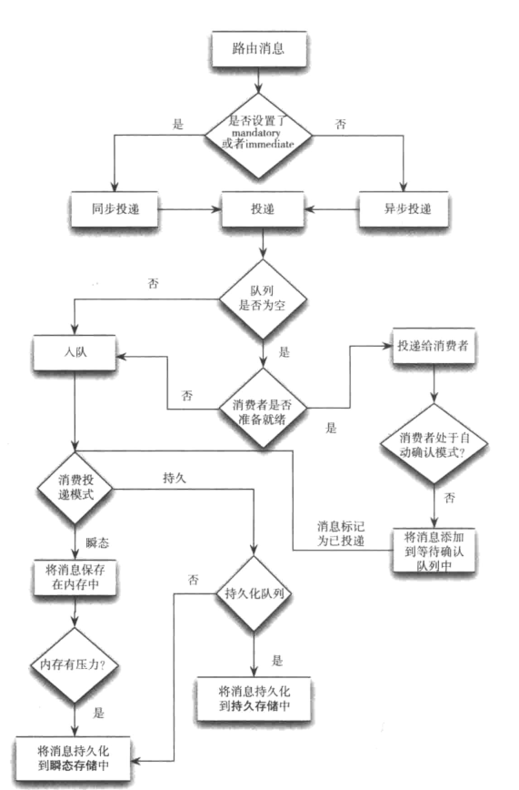
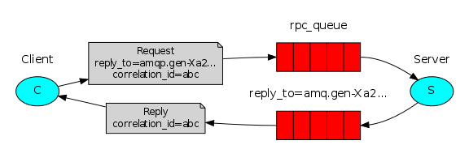

### RabbitMQ的概念和原理

***

AMQP, 即Advanced Message Queuing Protocol, 高级消息队列协议, 是应用层协议的一个开放标准, 为面向消息的中间件设计. 消息中间件主要用于组件之间的解耦, 消息的发送者无需知道消息使用者的存在, 反之亦然.  AMQP的主要特征是面向消息, 队列, 路由(包括点对点和发布/订阅), 可靠性, 安全.  RabbitMQ是一个开源的AMQP实现, 服务器端用Erlang语言编写, 支持多种客户端, 如: Python, Ruby, doNET, Java, JMS, C, PHP, ActionScript, XMPP, STOMP等, 支持AJAX. 用于在分布式系统中存储转发消息, 在易用性, 扩展性, 高可用性等方面表现不俗.  下面将重点介绍RabbitMQ中的一些基础概念, 了解了这些概念, 是使用好RabbitMQ的基础. 

#### RabbitMQ概念介绍

1. **Broker**: RabbbitMQ消息队列代理服务器实体
2. **Producer**: 发送消息的应用程序
3. **Consumer**: 接收消息的用户程序
4. **Exchange**: 交换器, 生产者直接将消息发送给交换器. 交换器将消息分发给指定的队列. 它指定消息按什么规则, 路由到哪个队列.
5. **Binding**: 绑定, 指的是交换器和队列之间的关系. 它的作用就是把exchange和queue按照路由规则绑定起来.
6. **Routing Key**: 路由关键字, exchange根据这个关键字进行消息投递.
7. **vhost**: 虚拟主机, 一个broker里可以开设多个vhost, 用作不同用户的权限分离.
8. **Channel**: 消息通道, 包含了大量的API可用于编程. 在客户端的每个连接里, 可建立多个channel, 每个channel代表一个会话任务.
9. **Connection**: 在客户创建一个到某个虚拟主机的连接
10. **ConnectionFactory**: 连接工厂类, 可以创建一个连接.
11. **Message**: RabbitMQ中的消息有自己的一系列属性, 某些属性对信息流有直接影响.
12. **Queue**: 队列, 消息暂时呆的地方. 对应上图红色队列

ConnectionFactory, Connection, Channel都是RabbitMQ对外提供的API中最基本的对象. Connection是RabbitMQ的socket链接, 它封装了socket协议相关部分逻辑. ConnectionFactory为Connection的制造工厂.  Channel是我们与RabbitMQ打交道的最重要的一个接口, 我们大部分的业务操作是在Channel这个接口中完成的, 包括定义Queue, 定义Exchange, 绑定Queue与Exchange, 发布消息等. 

#### Queue(队列)
Queue(队列)是RabbitMQ的内部对象, 用于存储消息, 用下图表示. 

**RabbitMQ中的消息都只能存储在Queue中**, 生产者(下图中的P)生产消息并最终投递到Queue中, 消费者(下图中的C)可以从Queue中获取消息并消费. 

**多个消费者可以订阅同一个Queue**, *这时Queue中的消息会被平均分摊给多个消费者进行处理, 而不是每个消费者都收到所有的消息并处理*. 

#### AMQP消息路由的组成
**AMQP消息路由的三个组成部分: 交换器, 队列和绑定**. 在上一节我们看到生产者将消息投递到Queue中, 实际上这在RabbitMQ中这种事情永远都不会发生. 实际的情况是, 生产者将消息发送到Exchange(交换器, 下图中的X), 由Exchange将消息路由到一个或多个Queue中(或者丢弃). 

Exchange是按照什么逻辑将消息路由到Queue的？这个将在Binding一节介绍.  RabbitMQ中的Exchange有四种类型, 不同的类型有着不同的路由策略, 这将在Exchange Types一节介绍. 

##### Routing key(路由关键字)
生产者在将消息发送给Exchange的时候, 一般会指定一个routing key, 来指定这个消息的路由规则, 而这个routing key需要与Exchange Type及binding key联合使用才能最终生效.  在Exchange Type与binding key固定的情况下(在正常使用时一般这些内容都是固定配置好的), 我们的生产者就可以在发送消息给Exchange时, 通过指定routing key来决定消息流向哪里.  RabbitMQ为routing key设定的长度限制为255 bytes. 

##### Binding(绑定)
RabbitMQ中通过Binding将Exchange与Queue关联起来, 这样RabbitMQ就知道如何正确地将消息路由到指定的Queue了. 

##### Binding key(绑定 key)
在绑定(Binding)Exchange与Queue的同时, 一般会指定一个binding key；消费者将消息发送给Exchange时, 一般会指定一个routing key；当binding key与routing key相匹配时, 消息将会被路由到对应的Queue中. 这个将在Exchange Types章节会列举实际的例子加以说明.  在绑定多个Queue到同一个Exchange的时候, 这些Binding允许使用相同的binding key.  binding key 并不是在所有情况下都生效, 它依赖于Exchange Type, 比如fanout类型的Exchange就会无视binding key, 而是将消息路由到所有绑定到该Exchange的Queue. 

#### Exchange Type(交换机类型)
交换机是用来发送消息的AMQP实体. 交换机拿到一个消息之后将它路由给一个或零个队列. 它使用哪种路由算法是由交换机类型和被称作绑定(bindings)的规则所决定的. AMQP 0-9-1的代理提供了四种交换机

| Name(交换机类型)            | Default pre-declared names(预声明的默认名称) |
| --------------------------- | -------------------------------------------- |
| Direct exchange(直连交换机) | (Empty string) and amq.direct                |
| Fanout exchange(扇型交换机) | amq.fanout                                   |
| Topic exchange(主题交换机)  | amq.topic                                    |
| Headers exchange(头交换机)  | amq.match (and amq.headers in RabbitMQ)      |
除交换机类型外, 在声明交换机时还可以附带许多其他的属性, 其中最重要的几个分别是:
- Name
- Durability(消息代理重启后，交换机是否还存在)
- Auto-delete(当所有与之绑定的消息队列都完成了对此交换机的使用后, 删掉它)
- Arguments(依赖代理本身)

交换机可以有两个状态: **持久(durable), 暂存(transient)**. 持久化的交换机会在消息代理(broker)重启后依旧存在, 而暂存的交换机则不会(它们需要在代理再次上线后重新被声明). 然而并不是所有的应用场景都需要持久化的交换机.

RabbitMQ常用的Exchange Type有fanout, direct, topic, headers这四种(AMQP规范里还提到两种Exchange Type, 分别为system与自定义, 这里不予以描述), 下面分别进行介绍. 

##### fanout(扇型交换机)
fanout类型的Exchange路由规则非常简单, 它会把所有发送到该Exchange的消息路由到所有与它绑定的Queue中. 

上图中, 生产者(P)发送到Exchange(X)的所有消息都会路由到图中的两个Queue, 并最终被两个消费者(C1与C2)消费. 

##### direct(直连交换机)
direct类型的Exchange路由规则也很简单, 它会把消息路由到那些binding key与routing key完全匹配的Queue中. 

以上图的配置为例, 我们以routingKey=”error”发送消息到Exchange, 则消息会路由到Queue1(amqp.gen-S9b…, 这是由RabbitMQ自动生成的Queue名称)和Queue2(amqp.gen-Agl…)；如果我们以routingKey=”info”或routingKey=”warning”来发送消息, 则消息只会路由到Queue2. 如果我们以其他routingKey发送消息, 则消息不会路由到这两个Queue中. 

##### topic(主题交换机)
前面讲到direct类型的Exchange路由规则是完全匹配binding key与routing key, 但这种严格的匹配方式在很多情况下不能满足实际业务需求. topic类型的Exchange在匹配规则上进行了扩展, 它与direct类型的Exchage相似, 也是将消息路由到binding key与routing key相匹配的Queue中, 但这里的匹配规则有些不同, 它约定: 
- routing key为一个句点号“. ”分隔的字符串(我们将被句点号“. ”分隔开的每一段独立的字符串称为一个单词), 如“stock.usd.nyse”, “nyse.vmw”, “quick.orange.rabbit”
- binding key与routing key一样也是句点号“. ”分隔的字符串
- binding key中可以存在两种特殊字符“*”与“#”, 用于做模糊匹配, 其中“\*”用于匹配一个单词, “#”用于匹配多个单词(可以是零个)

以上图中的配置为例, routingKey=”quick.orange.rabbit”的消息会同时路由到Q1与Q2, routingKey=”lazy.orange.fox”的消息会路由到Q1与Q2, routingKey=”lazy.brown.fox”的消息会路由到Q2, routingKey=”lazy.pink.rabbit”的消息会路由到Q2(只会投递给Q2一次, 虽然这个routingKey与Q2的两个bindingKey都匹配); routingKey=”quick.brown.fox”, routingKey=”orange”, routingKey=”quick.orange.male.rabbit”的消息将会被丢弃, 因为它们没有匹配任何bindingKey. 

##### headers(头交换机)
headers类型的Exchange不依赖于routing key与binding key的匹配规则来路由消息, 而是根据发送的消息内容中的headers属性进行匹配.  在绑定Queue与Exchange时指定一组键值对；当消息发送到Exchange时, RabbitMQ会取到该消息的headers(也是一个键值对的形式), 对比其中的键值对是否完全匹配Queue与Exchange绑定时指定的键值对；如果完全匹配则消息会路由到该Queue, 否则不会路由到该Queue.  该类型的Exchange没有用到过(不过也应该很有用武之地), 所以不做介绍. 

#### 消息投递流程
消息队列的使用过程大概如下:
1.客户端连接到消息队列服务器, 打开一个channel.
2.客户端声明一个exchange, 并设置相关属性.　　
3.客户端声明一个queue, 并设置相关属性.
4.客户端使用routing key, 在exchange和queue之间建立好绑定关系. 
5.客户端投递消息到exchange. exchange接收到消息后, 就根据消息的key和已经设置的binding, 进行消息路由, 将消息投递到一个或多个队列里.

#### RabbitMQ实现RPC
MQ本身是基于异步的消息处理, 前面的示例中所有的生产者(P)将消息发送到RabbitMQ后不会知道消费者(C)处理成功或者失败(甚至连有没有消费者来处理这条消息都不知道).  但实际的应用场景中, 我们很可能需要一些同步处理, 需要同步等待服务端将我的消息处理完成后再进行下一步处理. 这相当于RPC(Remote Procedure Call, 远程过程调用). 在RabbitMQ中也支持RPC.

RabbitMQ中实现`RPC` 的机制是: 
- 客户端发送请求(消息)时, 在消息的属性(`MessageProperties` , 在`AMQP` 协议中定义了14中`properties` , 这些属性会随着消息一起发送)中设置两个值`replyTo` (一个`Queue` 名称, 用于告诉服务器处理完成后将通知我的消息发送到这个`Queue` 中)和`correlationId` (此次请求的标识号, 服务器处理完成后需要将此属性返还, 客户端将根据这个id了解哪条请求被成功执行了或执行失败)
- 服务器端收到消息并处理
- 服务器端处理完消息后, 将生成一条应答消息到`replyTo` 指定的`Queue` , 同时带上`correlationId` 属性
- 客户端之前已订阅`replyTo` 指定的`Queue` , 从中收到服务器的应答消息后, 根据其中的`correlationId`属性分析哪条请求被执行了, 根据执行结果进行后续业务处理

#### Message acknowledgment(消息的确认)
在实际应用中, 可能会发生消费者收到Queue中的消息, 但没有处理完成就宕机(或出现其他意外)的情况, 这种情况下就可能会导致消息丢失. 为了避免这种情况发生, 我们可以要求消费者在消费完消息后发送一个回执给RabbitMQ, RabbitMQ收到消息回执(Message acknowledgment)后才将该消息从Queue中移除；如果RabbitMQ没有收到回执并检测到消费者的RabbitMQ连接断开, 则RabbitMQ会将该消息发送给其他消费者(如果存在多个消费者)进行处理. 这里不存在timeout概念, 一个消费者处理消息时间再长也不会导致该消息被发送给其他消费者, 除非它的RabbitMQ连接断开.  这里会产生另外一个问题, 如果我们的开发人员在处理完业务逻辑后, 忘记发送回执给RabbitMQ, 这将会导致严重的bug——Queue中堆积的消息会越来越多；消费者重启后会重复消费这些消息并重复执行业务逻辑…另外pub message是没有ack的. 

#### Message durability(消息持久化)
如果我们希望即使在RabbitMQ服务重启的情况下, 也不会丢失消息, 我们可以将Queue与Message都设置为可持久化的(durable), 这样可以保证绝大部分情况下我们的RabbitMQ消息不会丢失. 但依然解决不了小概率丢失事件的发生(比如RabbitMQ服务器已经接收到生产者的消息, 但还没来得及持久化该消息时RabbitMQ服务器就断电了), 如果我们需要对这种小概率事件也要管理起来, 那么我们要用到事务. 由于这里仅为RabbitMQ的简单介绍, 所以这里将不讲解RabbitMQ相关的事务. 

#### Prefetch count(预取消息count)
前面我们讲到如果有多个消费者同时订阅同一个Queue中的消息, Queue中的消息会被平摊给多个消费者. 这时如果每个消息的处理时间不同, 就有可能会导致某些消费者一直在忙, 而另外一些消费者很快就处理完手头工作并一直空闲的情况. 我们可以通过设置prefetchCount来限制Queue每次发送给每个消费者的消息数, 比如我们设置prefetchCount=1, 则Queue每次给每个消费者发送一条消息；消费者处理完这条消息后Queue会再给该消费者发送一条消息. 

ref:
1.[RabbitMQ笔记](https://yuanwenjian.github.io/2018/06/10/RabbitMQ%E7%AC%94%E8%AE%B0/),   2.[RabbitMQ系列-概念介绍](https://www.codetd.com/article/2926806),   3.[RabbitMQ基础概念详细介绍](https://yq.aliyun.com/articles/353879),   4.[RabbitMQ消息队列入门篇（环境配置+Java实例+基础概念）](https://www.kancloud.cn/digest/javaframe/125581),   5.[RabbitMQ 的基本概念和模型](https://toutiao.io/posts/581132/app_preview),   6.[RabbitMQ概念介绍](https://blog.csdn.net/zouhuixing/article/details/80493678),   7.[Java与RabbitMQ（六）RabbitMQ几个重要的概念、术语详解](https://blog.csdn.net/zixiao217/article/details/52733712),   8.[RabbitMQ基本概念和使用](https://www.cnblogs.com/starof/p/4173413.html),   9.[RabbitMQ 简介和概念介绍](https://blog.csdn.net/liushuiziyouliu/article/details/79253265),   10.[我为什么要选择RabbitMQ ，RabbitMQ简介，各种MQ选型对比](https://www.sojson.com/blog/48.html)