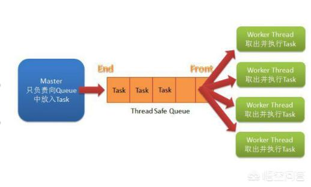

### MQ与RPC对比

***

大部分情况下, “给定场景下应该使用这两个产品中哪个”这个问题, 大家都会容易决定, 而且不需要多少讨论.  我为什么要拿出来讨论一下:
- 一些场景会比较模糊, 觉得都可以使用. 这时需要知道产品缺点, 而不是看到优势. 
- 一些新人会觉得产品功能是可以替换的, 要给说明一下. 

##### 总述
**首先, 这几个概念本就不是同一层次上的东西, 本身风马牛不相及.**


###### 先说RPC
RPC通常指的是PRC框架(分布式框架), 或者PRC协议, 如GRPC, JSON-RPC等. **这类框架主要解决远程通信间的问题**, 所以底层的通信机制是不需要使用者去关心去实现就能很好实现远程通信的, 最出名的莫过于阿里的dubbo.


###### 再说任务队列
这是个逻辑概念, 即比如饭店高峰期时, 顾客单子不得不按照下单顺序一个个放在厨房, 进行先后炒菜处理, 这一堆的单子就是任务队列.


###### 最后说消息队列
**消息队列(MQ)可以理解成两个应用程序间(生产者消费者间)的通信**, 例如短信发送模块, 因为模块的发送速度跟不上, 这时候需要有一个容器, 暂存一下, 缓解下压力, **那么“消息队列”就是在消息的传输过程中保存消息的“容器”**.然后短信模块就可以从容不怕的去消息队列取出要发出的短信内容, 进行发送处理.接下来主要从系统架构和功能特点这两个角度来说.


##### 系统架构
RPC系统结构如下, Consumer调用的Provider提供的服务.
```tcl
+----------+     +----------+
| Consumer | <=> | Provider |
+----------+     +----------+
```

Message Queue系统结构如下, Sender发送消息给Queue; Receiver从Queue拿到消息来处理.
```tcl
+--------+     +-------+     +----------+
| Sender | <=> | Queue | <=> | Receiver |
+--------+     +-------+     +----------+123
```


##### 功能特点
> 在架构上, RPC和Message Queue的差异点是, Message Queue有一个中间结点Message Queue(broker), 可以把消息存储.

###### 消息队列的特点
1. Message Queue把请求的压力保存一下, 逐渐释放出来, 让处理者按照自己的节奏来处理. 
2. Message Queue引入一下新的结点, 让系统的可靠性会受Message Queue结点的影响. 
3. Message Queue是异步单向的消息. 发送消息设计成是不需要等待消息处理的完成. 

所以对于有同步返回需求, 用Message Queue则变得麻烦了.

###### RPC的特点
1. 同步调用, 对于要等待返回结果/处理结果的场景, RPC是可以非常自然直觉的使用方式. RPC也可以是异步调用. 
2. 由于等待结果, Consumer(Client)会有线程消耗.

如果以异步RPC的方式使用, Consumer(Client)线程消耗可以去掉. 但不能做到像消息一样暂存消息/请求, 压力会直接传导到服务Provider.


##### 关于RPC
###### RPC适用场合说明
1. 希望同步得到结果的场合, RPC合适.
2. 希望使用简单, 则RPC; RPC操作基于接口, 使用简单, **使用方式模拟本地调用**. 异步的方式编程比较复杂.
3. 不希望发送端(RPC Consumer, Message Sender)受限于处理端(RPC Provider, Message Receiver)的速度时, 使用Message Queue.

随着业务增长, 有的处理端处理量会成为瓶颈, 会进行同步调用到异步消息的改造. 这样的改造实际上有调整业务的使用方式. 比如原来一个操作页面提交后就下一个页面会看到处理结果; 改造后异步消息后, 下一个页面就会变成“操作已提交, 完成后会得到通知”.

###### RPC不适用场合说明
1. RPC同步调用使用Message Queue来传输调用信息. 上面分析可以知道, 这样的做法, 发送端是在等待, 同时占用一个中间点的资源. 变得复杂了, 但没有对等的收益. 
2. 对于返回值是void的调用, 可以这样做, 因为实际上这个调用业务上往往不需要同步得到处理结果的, 只要保证会处理即可.(RPC的方式可以保证调用返回即处理完成,  使用消息方式后这一点不能保证了.) 
3. 返回值是void的调用, 使用消息, 效果上是把消息的使用方式Wrap成了服务调用(服务调用使用方式成简单, 基于业务接口).


##### MQ与RPC优缺点对比
| 通讯方式 | RPC                                                          | 消息队列                                                     |
| -------- | ------------------------------------------------------------ | ------------------------------------------------------------ |
| 优点     | 舒适感非常好, 直接远程调用, 无需关注通讯协议等等细节(除了这个, 我还真不知道RPC还有什么优点) | 1. 解耦, 2.冗余, 3.可扩展, 4.可恢复, 5.交易缓冲, 6.消息投递保证, 7.异步通信(支持同步) , 8.提高系统吞吐,健壮性 |
| 缺点     | 1. 对开发人员素质要求高,  2. 同步调用(当然是可以做到异步调用的, 但大多应用都是同步的), 会造成延迟问题, 3. 对于分布式系统, 难实现分布式事务, 4. 耦合度高, 5.扩展难度大, 6. 排查业务问题难度高 | 1. 安全控制复杂,  2.稳定性要求非常高                         |


##### MQ与RPC异同
**相同**:
1.都利于大型系统的解耦;
2.都提供子系统之间的交互, 特别是异构子系统(如java\node等不同开发语言);

**不同**：
1.RPC侧重功能调用, 因此多半是同步的(也有基于MQ上实现RPC的, 这样的话就是异步的, MQ本身, 如rabbitMQ也有提供实现RPC的能力)
2.MQ 的使用, 一方面是基于性能的考虑, 比如服务端不能快速的响应客户端(或客户端也不要求实时响应),需要在队列里缓存; 另外一方面, 它更侧重数据的传输, 因此方式更加多样化, 除了点对点外, 还有订阅发布等功能.


##### MQ与RPC各自适用场景
**RPC比较适合**
1. 客户端调用哪个服务器比较明确 
2. 调用需要立即得到返回结果 
>在一个由多个微服务构成的大系统中, 某些关键服务间的调用应当在较短的时间内返回, 而且各个微服务的专业化程度较高, 同一个请求的关注者只有一个. 这个时候就应该用RPC. 比如在一个ERP系统中, 有一个管理仓储的微服务, 以及一个负责订单的微服务. 新建订单时需要查知当前的存货是否充足, 如果不充足就通知用户; 提交订单时预订指定数量的货物, 如果此时货物不错, 也要终止订单的提交, 并通知用户. 显然在这种场景下是不允许较大的延迟, 否则会影响用户体验. 所以应该使用RPC, 及时返回仓储情况.

**MQ比较适合**
1. 消息的发送者和消费者需要解耦的情况 
2. 发送者并不明确谁是消费者 
3. 发送者并不关心谁来消费消息 
4. 各个消费者可以从不同的角度入手处理消息 
5. 消费者的处理结果也不返回给发送者 
6. 消息的发送和处理是异步的 
7. 消息的关注者不止一个 
>在一个由多个微服务构成的大系统中, 会有一些非关键服务, 用来执行一些不需要立刻得到结果的计算. 而且它们的计算结果并不会返回给消息的发送者. 这个时候就应该使用MQ. 比如在一个ERP系统中有一些日志服务, 业务监控服务等. 这些服务会发布一些系统事件, 针对这些事件可能有多个应用关注, 对于日志服务, 当系统出现某些异常情况时需要浏览日志, 查找问题的根源; 也可以在分析系统运行的瓶颈时提供关键数据. 对于业务监控系统, 例如货物入仓出仓的消息, 可以被报表系统关注, 生成报表; 也可以被配货系统关注, 及时补足所需库存.


ref:
1.[Java常用消息队列原理介绍及性能对比](https://blog.csdn.net/songfeihu0810232/article/details/78648706),   2.[系统通讯之RPC VS 消息队列](https://www.cnblogs.com/sunsc/p/5655044.html),   3.[任务队列，消息队列和rpc的区别是什么？](https://blog.csdn.net/qq_41790443/article/details/80542718),   4.[远程调用服务(RPC)和消息队列(Message Queue)对比及其适用/不适用场合分析](https://blog.csdn.net/cfydaniel/article/details/44621163),   5.[RPC和MQ各自适合的应用场景](https://blog.csdn.net/xuduorui/article/details/56511055),   6.[RPC和MQ对比及其适用/不适用场合](https://blog.csdn.net/glory1234work2115/article/details/51728172),   7.[关于RPC与MQ异同的理解](https://blog.csdn.net/skiof007/article/details/51838884)