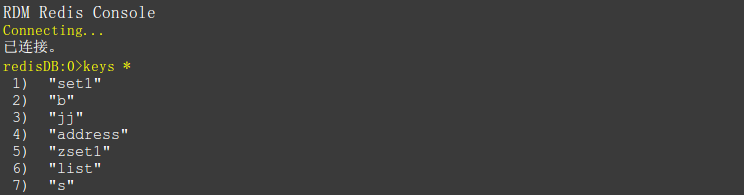
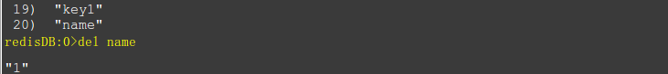
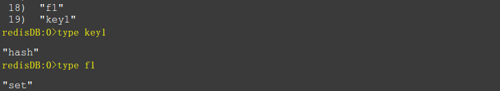

### Redis基本数据类型

***

##### 基本介绍
redis作为一种nosql数据库, 和传统的关系型数据库不同, 尤其是在数据类型方面, 和传统的比如mysql数据库的数据类型没有太多的相关性, 如下对redis数据库的数据类型和每种数据类型的读取, 删除, 修改, 查询等基本的操作进行介绍.


##### 基本数据类型
Redis常用的数据类型包括5种, 分别是: 
**String(字符串), List(列表), Hash(字典), Set(集合), Sorted Set(有序集合)**
几个基本的命令:
**KEYS \* **: *获得当前数据库的所有键*

**EXISTS key [key ...] **: *判断键是否存在, 返回个数, 如果key有一样的也是叠加数(存在一个返回1, 存在两个返回2)*

**DEL key [key ...]**: *删除键，返回删除的个数*

**TYPE key**: *获取减值的数据类型(string, hash, list, set, zset)*

**SELECT no**: *选择一个数据库, no为1, 2, 3...默认情况下, 一个redis数据库有16个库*

**FLUSHALL**: * 清空所有数据库*

**CONFIG [get、set] xx**: *redis配置*
**-inf**: *负无穷*
**+inf**: *正无穷*


##### String(字符串)
String类型是包含很多种类型的特殊类型, 是Redis的最基本类型, 它可以存储任何形式的字符串, 并且是二进制安全的. 比如序列化的对象进行存储, 比如一张图片进行二进制存储, 比如一个简单的字符串, 数值等等. **其它的四种类型都是字符串类型的不同形式**.

**语法形式**:

>**添加字符串：SET**                          语法：SET key，SET key value   value如果有空格需要双引号以示区分
>**获取字符串内容：GET**                   语法：GET key，SET key value   value如果有空格需要双引号以示区分
>整数递增：INCR                            语法：INCR key    默认值为0，所以首先执行命令得到 1 ，不是整型提示错误
>增加指定的整数：INCRBY            语法：INCRBY key increment
>整数递减：DECR                           语法：DECR key   默认值为0，所以首先执行命令得到 -1，不是整型提示错误
>减少指定的整数：DECRBY           语法：DECRBY key increment
>增加指定浮点数：INCRBYFLOAT 语法：INCRBYFLOAT key increment  与INCR命令类似，只不过可以递增一个双精度浮点数
>**向尾部追加值：APPEND**               语法：APPEND key value   redis客户端并不是输出追加后的字符串，而是输出字符串总长度
>**获取字符串长度：STRLEN**            语法：STRLEN key  如果键不存在返回0，注意如果有中文时，一个中文长度是3，redis是使用UTF-8编码中文的
>**获取多个键值：MGET**                   语法：MGET key [key ...]  例如：MGET key1 key2 
>**设置多个键值：MSET**                    语法：MSET key value [key value ...]  例如：MSET key1 1 key2 "hello redis"
```java
//选择9号数据库
redisDB:1>select 9
"OK"
redisDB:9>keys *
 1)  "address"
//设置一个string字符串 key为weather
redisDB:9>set weather sunny
"OK"
//获取weather的内容
redisDB:9>get weather
"sunny"
redisDB:9>set int9 9
"OK"
//自增
redisDB:9>incr int9
"10"
redisDB:9>incrby int9 12
"22"
//自减
redisDB:9>decr int9
"21"
redisDB:9>decrby int9 3
"18"
//自增一个浮点数
redisDB:9>incrbyfloat int9 12
"30"
redisDB:9>strlen address
"8"
//追加字符串
redisDB:9>append address tangzheng
"17"
redisDB:9>get address
"shanghaitangzheng"
//获取多个key的值
redisDB:9>mget address int9
 1)  "shanghaitangzheng"
 2)  "30"
redisDB:9>keys *
 1)  "int9"
 2)  "address"
 3)  "weather"
//设置多个key的值
redisDB:9>mset key1 hello key2 world key3 everyday
"OK"
redisDB:9>mget key1 key2 key3
 1)  "hello"
 2)  "world"
 3)  "everyday"
redisDB:9>
```

**应用场景**:
String是最常用的一种数据类型, 普通的key/ value 存储都可以归为此类. 即可以完全实现目前 Memcached 的功能, 并且效率更高. 还可以享受Redis的定时持久化, 操作日志及 Replication等功能. 除了提供与 Memcached 一样的get, set, incr, decr 等操作外, Redis还提供了下面一些操作:
- 获取字符串长度
- 往字符串append内容
- 设置和获取字符串的某一段内容
- 设置及获取字符串的某一位（bit）
- 批量设置一系列字符串的内容

**实现方式**:
String在redis内部存储默认就是一个字符串, 被redisObject所引用, 当遇到incr, decr等操作时会转成数值型进行计算, 此时redisObject的encoding字段为int.


##### Hash类型(字典, 哈希表)
Hash类型是String类型的filed和value的映射表, 或者说一个String集合. 它特别适合存储对象, 相比较而言, **将一个对象类型存储在Hash类型里要比存储在String类型里占用更少的内存空间, 并方便存取整个对象**.Redis Hash对应Value内部实际就是一个HashMap, 实际有2种不同实现, 这个Hash的成员比较少时Redis为了节省内存会采用类似一维数组的方式来紧凑存储, 而不会采用真正的HashMap结构, 对应的value redisObject的encoding为zipmap, 当成员数量增大时会自动转成真正的HashMap, 此时encoding为ht.


**语法形式**:
>设置单个：HSET                         语法：HSET key field value，不存在时返回1，存在时返回0，没有更新和插入之分
设置多个：HMSET                      语法：HMSET key field value [field value ...]
读取单个：HGET                         语法：HGET key field，不存在是返回nil
读取多个：HMGET                      语法：HMGET key field [field ...]
读取全部：HGETALL                   语法：HGETALL key，返回时字段和字段值的列表
判断字段是否存在：HEXISTS     语法：HEXISTS key field，存在返回1 ，不存在返回0
字段不存在时赋值：HSETNX      语法：HSETNX key field value，与hset命令不同，hsetnx是键不存在时设置值
增加数字：HINCRBY                   语法：HINCRBY key field increment ，返回增加后的数，不是整数时会提示错误
删除字段：HDEL                         语法：HDEL key field [field ...] ，返回被删除字段的个数
只获取字段名：HKEYS               语法：HKEYS key ，返回键的所有字段名
只获取字段值：HVALS                语法：HVALS key  ，返回键的所有字段值
字段数量：HLEN                         语法：HLEN key ，返回字段总数
```java
//设置一个hash, key为hash1, 里面还有字段, 此处设置的是id
redisDB:10>hset hash1 id name
"1"
//覆盖id的值
redisDB:10>hset hash1 id 1
"0"
redisDB:10>hset hash1 name zhangsan
"1"
redisDB:10>hset hash1 age 25
"1"
redisDB:10>hset hash1 address hangzhou
"1"
redisDB:10>hset hash1 zhiye chifan
"1"
redisDB:10>hget hash1 name
"zhangsan"
//设置多个hash1之中的字段, key-value key value的模式
redisDB:10>hmset hash1 xiaoxue zzxiaoxue zhongxue zzzhongxue daxue zzdaxue
"OK"
//获取多个的字段值
redisDB:10>hmget hash1 id name age
 1)  "1"
 2)  "zhangsan"
 3)  "25"
redisDB:10>hgetall  hash1
 1)  "id"
 2)  "1"
 3)  "name"
 4)  "zhangsan"
 5)  "age"
 6)  "25"
 7)  "address"
 8)  "hangzhou"
 9)  "zhiye"
 10)  "chifan"
 11)  "xiaoxue"
 12)  "zzxiaoxue"
 13)  "zhongxue"
 14)  "zzzhongxue"
 15)  "daxue"
 16)  "zzdaxue"
//测试hash之中是否存在是否存在name字段
redisDB:10>hexists hash1 name
"1"
//当hometown不存在的时候设置它的值
redisDB:10>hsetnx hash1 hometown beijing
"1"
redisDB:10>hsetnx hash1 hometown nn
"0"
//获取所有的字段key
redisDB:10>hkeys hash1
 1)  "id"
 2)  "name"
 3)  "age"
 4)  "address"
 5)  "zhiye"
 6)  "xiaoxue"
 7)  "zhongxue"
 8)  "daxue"
 9)  "hometown"
//获取所有字段value
redisDB:10>hvals hash1
 1)  "1"
 2)  "zhangsan"
 3)  "25"
 4)  "hangzhou"
 5)  "chifan"
 6)  "zzxiaoxue"
 7)  "zzzhongxue"
 8)  "zzdaxue"
 9)  "beijing"
//获取长度
redisDB:10>hlen hash1
"9"
//删除一个字段
redisDB:10>hdel hash1 daxue
"1"
redisDB:10>
```

**应用场景**:
**假设有多个用户及对应的用户信息, 可以用来存储以用户ID为key, 将用户信息序列化为比如json格式做为value进行保存**. 在Memcached中, 我们经常将一些结构化的信息打包成HashMap, 在客户端序列化后存储为一个字符串的值, 比如用户的昵称, 年龄, 性别, 金额等, 这时候在需要修改其中某一项时, 通常需要将所有值取出反序列化后, 修改某一项的值, 再序列化存储回去. **这样不仅增大了开销, 也不适用于一些可能并发操作的场合**(比如两个并发的操作都需要修改金额). 而Redis的Hash结构可以使你像在数据库中Update一个属性一样只修改某一项属性值.

**实现方式**:
Redis Hash对应Value内部实际就是一个HashMap, 实际这里会有2种不同实现, 这个Hash的成员比较少时Redis为了节省内存会采用类似一维数组的方式来紧凑存储, 而不会采用真正的HashMap结构, 对应的value redisObject的encoding为zipmap,当成员数量增大时会自动转成真正的HashMap, 此时encoding为ht.


##### List(列表类型)
List类型是一个链表结构的集合, 其主要功能有push, pop获取元素等. 更详细地说, **List类型是一个双端链表结构**. 我们可以通过相关操作进行集合的头部或尾部添加删除元素, List的设计非常简单巧妙, 既可以作为栈, 又可以作为队列, 满足绝大多数需求. **list中元素可重复**, 内部使用双向链表实现, 所以获取越接近两端的元素速度越快, 但通过索引访问时会比较慢.

**语法形式**:
>**添加左边元素: LPUSH**                     语法: LPUSH key value [value ...] , 返回添加后的列表元素的总个数
>**添加右边元素: RPUSH**                     语法: RPUSH key value [value ...] , 返回添加后的列表元素的总个数
>**移除左边第一个元素: LPOP**             语法: LPOP key , 返回被移除的元素值
>**移除右边第一个元素: RPOP**            语法: RPOP key , 返回被移除的元素值 
>**插入元素: LINSERT**                         语法: LINSERT key before value1 value2, value1已经在list之中存在
>**列表元素个数: LLEN**                        语法: LLEN key , 不存在时返回0 , redis是直接读取现成的值 , 并不是统计个数
>**获取列表片段: LRANGE**                  语法: LRANGE key start stop , 如果start比stop靠后时返回空列表 , 0 -1 返回整个列表
>                                                                     正数时：start 开始索引值 , stop结束索引值（索引从0开始）
>                                                                     负数时：例如 lrange num -2 -1 , -2表示最右边第二个 , -1表示最右边第一个
>删除指定值: LREM                          语法: LREM key count value , 返回被删除的个数
>                                                                     count>0 , 从左边开始删除前count个值为value的元素
>                                                                     count<0 , 从右边开始删除前|count|个值为value的元素
>                                                                     count=0 , 删除所有值为value的元素
>**索引元素值: LINDEX**                       语法: LINDEX key index , 返回索引的元素值 , -1表示从最右边的第一位
>**设置元素值: LSET**                           语法: LSET key index value
>保留列表片段: LTRIM                      语法: LTRIM key start stop , start、top 参考lrange命令
>一个列表转移另一个列表: RPOPLPUSH      语法: RPOPLPUSH source desctination , 从source列表转移到desctination列表 , 
>                                                                该命令分两步看 , 首先source列表RPOP右移除 , 再desctination列表LPUSH
```java
//左边添加一个元素(头部)
redisDB:12>lpush list1 hello
"1"
redisDB:12>lpush  list1 world
"2"
//右边添加一个元素(尾部)
redisDB:12>rpush list1 age
"5"
redisDB:12>rpush list1 name
"6"
//从list的头部删除元素，并返回删除元素
redisDB:12>lpop list1
"hi"
//从list的尾部删除元素，并返回删除元素
redisDB:12>rpop list1
"name"
//返回list的长度
redisDB:12>llen list1
"4"
//取值, 从0到6, 尾部大于长度时候, 获得后续的全部
redisDB:12>lrange list1 0 6
 1)  "everyday"
 2)  "world"
 3)  "hello"
 4)  "age"
//返回索引为2的值, 从0开始, 2表示第3个数据
redisDB:12>lindex list1 2
"hello"
redisDB:12>lpush list1 hellomg
"5"
//设置第3个的值为ddd
redisDB:12>lset list1 2 ddd
"OK"
redisDB:12>lset list1 0 helloworld
"OK"
redisDB:12>lset list1 -2 hellowe
"OK"
redisDB:12>lrem list1 2 ddd
"1"
//插入一个元素
redisDB:12>linsert list1 before 1 2 
"-1"
//插入一个元素, 在helloworld元素之前插入everyday元素
redisDB:12>linsert list1 before helloworld everyday
"5"
redisDB:12>linsert list1 before sss everyday
"-1"
redisDB:12>linsert list1 before ss helloworld
"-1"
redisDB:12>linsert list1 before age hello
"6"
```

**应用场景**: 
Redis list的应用场景非常多, 也是Redis最重要的数据结构之一, 比如twitter的关注列表, 粉丝列表等都可以用Redis的list结构来实现. Lists 就是链表.使用Lists结构, 我们可以轻松地实现最新消息排行等功能. Lists的另一个应用就是消息队列, 可以利用Lists的PUSH操作, 将任务存在Lists中, 然后工作线程再用POP操作将任务取出进行执行. Redis还提供了操作Lists中某一段的api, 可以直接查询, 删除Lists中某一段的元素.

**实现方式**: 
Redis list的实现为一个双向链表, 即可以支持反向查找和遍历, 更方便操作, 不过带来了部分额外的内存开销, Redis内部的很多实现, 包括发送缓冲队列等也都是用的这个数据结构.


##### Set(集合类型)
集合类型值具有唯一性, 常用操作是向集合添加, 删除, 判断某个值是否存在, 集合内部是使用值为空的散列表实现的. **set 的内部实现是一个 value永远为null的HashMap, 实际就是通过计算hash的方式来快速排重的, 这也是set能提供判断一个成员是否在集合内的原因**.

**语法形式**:
>**添加元素: SADD**                          语法: SADD key member [member ...] , 向一个集合添加一个或多个元素, 因为集合的唯一性, 
>                                                                                     所以添加相同值时会被忽略. 返回成功添加元素的数量.
>**删除元素: SREM**                         语法: SREM key member [member ...] 删除集合中一个或多个元素, 返回成功删除的个数.
>**获取全部元素: SMEMBERS**        语法: SMEMBERS key, 返回集合全部元素
>**值是否存在: SISMEMBER**          语法: SISMEMBER key member,  如果存在返回1, 不存在返回0
>差运算: SDIFF                             语法: SDIFF key [key ...] , 例如：集合A和集合B，差集表示A-B，在A里有的元素B里没有, 
>                                                                                     返回差集合; 多个集合(A-B)-C
>交运算: SINTER             　　       语法: SINTER key [key ...], 返回交集集合, 每个集合都有的元素
>并运算: SUNION　　　　　　     语法: SUNION key [key ...], 返回并集集合, 所有集合的元素
>**集合元素个数: SCARD**                 语法: SCARD key, 返回集合元素个数
>集合运算后存储结果                     语法: SDIFFSTROE destination key [key ...] , 差运算并存储到destination新集合中
>　　　　　　　　　　 　　　　　　　SINTERSTROE destination key [key ...], 交运算并存储到destination新集合中
>                                                               SUNIONSTROE destination key [key ...], 并运算并存储到destination新集合中
>**随机获取元素: SRANDMEMBER**       语法: SRANDMEMBER key [count], 根据count不同有不同结果，
>                                                                     count大于元素总数时返回>全部元素
>　　　　　　　　　　　　　　　　　　    count>0, 返回集合中count不重复的元素
>　　　　　　　　　　　　　　　　　　    count<0, 返回集合中count的绝对值个元素，但元素可能会重复
>**弹出元素: SPOP**                           语法: SPOP key [count] , 因为集合是无序的, 所以spop会随机弹出一个元素
>**迭代元素: SSCAN**                         语法: SSCAN key cursor \[MATCH pattern]\[COUNT count],  迭代set里面的元素
```java
redisDB:12>select 15
"OK"
//添加set, 一下子添加4个元素, 重复的会过滤掉
redisDB:15>sadd myset s1 s2 s3 s4
"4"
redisDB:15>sadd myset s2 s3 s4 s5 s6 s7
"3"
//删除一个元素, 可以删除多个, 删除多个和添加多个元素都可以
redisDB:15>srem myset s4
"1"
redisDB:15>srem myset s1 s2
"2"
//获取元素
redisDB:15>smembers myset
 1)  "s6"
 2)  "s3"
 3)  "s7"
 4)  "s1"
 5)  "s5"
 6)  "s2"
//判断是否为元素
redisDB:15>sismember myset s2
"1"
//返回元素的个数
redisDB:15>scard myset
"6"
//随机一个元素
redisDB:15>srandmember myset
"s2"
//弹出一个元素
redisDB:15>spop myset 1
 1)  "s7"
redisDB:15>
```

**应用场景**:
Redis set对外提供的功能与list类似是一个列表的功能, 特殊之处在于set是可以自动排重的, 当你需要存储一个列表数据, 又不希望出现重复数据时, set是一个很好的选择, 并且set提供了判断某个成员是否在一个set集合内的重要接口, 这个也是list所不能提供的. Sets 集合的概念就是一堆不重复值的组合. 利用Redis提供的Sets数据结构, 可以存储一些集合性的数据, 比如在微博应用中, 可以将一个用户所有的关注人存在一个集合中, 将其所有粉丝存在一个集合. Redis还为集合提供了求交集, 并集, 差集等操作, 可以非常方便的实现如共同关注, 共同喜好, 二度好友等功能, 对上面的所有集合操作, 你还可以使用不同的命令选择将结果返回给客户端还是存集到一个新的集合中.

**实现方式**:
set 的内部实现是一个 value永远为null的HashMap, 实际就是通过计算hash的方式来快速排重的, 这也是set能提供判断一个成员是否在集合内的原因.


##### Zset类型(有序集合类型)
**Zset与List的关系**
Zset与List类型区别在于“有序”二字，有序集合在某些方面与列表类型也比较**类似**:
1) 二者都是有序的;
2) 二者都可以获得某一范围内的元素;
当然也有明显的**区别**;
1) List通过链表实现, 获取两端数据极快, 而取中间的数据较慢;
2) Zset是使用散列表和跳跃表实现, 即使位于中间的数据读取也很快, 复杂度为: O(log(N));
3) List不能简单的调整元素的位置, 但是Zset可以;
4) Zset比List更耗费内存.
**Zset与Set**
Zset类似Set, 不同的是增加了一个功能, 即集合是有序的.** 一个Zset的每个成员带有分数, 用于进行排序**. Redis有序集合添加, 删除和测试的时间复杂度均为O(1)(固定时间, 无论里面包含的元素集合的数量). 列表的最大长度为2^32- 1元素(4294967295, 超过40亿每个元素的集合).Redis sorted set的内部使用HashMap和跳跃表(SkipList)来保证数据的存储和有序, HashMap里放的是成员到score的映射, 而跳跃表里存放的是所有的成员, 排序依据是HashMap里存的score, 使用跳跃表的结构可以获得比较高的查找效率, 并且在实现上比较简单.

**语法形式**:
>**添加集合元素: ZADD**              语法: ZADD key \[NX|XX]\[CH] \[INCR] score member [score member ...], 不存在添加, 存在更新
>**获取元素分数:ZSCORE **         语法: ZSCORE key member ，返回元素成员的score 分数
>**元素小到大:ZRANGE **            语法: ZRANGE key start top [WITHSCORES] , 参考LRANGE, 
>                                                         加上withscores 返回带元素, 即元素, 分数, 当分数一样时, 按元素排序
>**元素大到小:ZREVRANGE**       语法: ZREVRANGE key start [WITHSCORES], 与zrange区别在于zrevrange是从大到小排序
>指定分数范围元素:ZRANGEBYSCORE   语法: ZRANGEBYSCORE key min max \[WITHSCORE][LIMIT offest count]
>　　　　　　　　　　　　　　　返回从小到大的在min和max之间的元素, ( 符号表示不包含，例如：80-100，(80 100，
>　　　　　　　　　　　　　　    withscore返回带分数
>　　　　　　　　　　　　　　    limit offest count 向左偏移offest个元素, 并获取前count个元素
>指定分数范围元素:ZREVRANGESCORE   语法：ZREVRANGEBYSCORE key max  min \[WITHSCORE][LIMIT offest count]
>　　　　　　　　　　　　　　　 与zrangebyscore类似, 只不过该命令是从大到小排序的。
>增加分数:ZINCRBY                语法: ZINCRBY key increment member, 注意是增加分数, 返回增加后的分数; 如果成员不存在, 添 
>                                                          加一个为0的成员.
>**获得数量:ZCARD**                   语法: ZCARD key 得到的有序集合成员的数量
>计算给定范围内的分数: ZCOUNT            语法:  ZCOUNT key min max 计算一个有序集合成员与给定值范围内的分数
>确定成员的索引中有序集合 :ZRANK       语法: ZRANK key member 确定成员的索引中有序集合
>**删除一个或者多个元素: ZREM**                语法: ZREM key member [member ...] 从有序集合中删除一个或多个成员，不存在
>                                                         的成员将被忽略
>迭代元素: ZSCAN                                   语法: ZSCAN key cursor \[MATCH pattern][COUNT count] 增量迭代排序元素集和相关
>                                                         的分数
```java
redisDB:0>select 6
"OK"
//添加元素, 可以有多个元素
redisDB:6>zadd zset1 1 hello 2 world 3 every 4 sdfa 5 jkljkl
"5"
//返回元素的个数
redisDB:6>zcard zset1
"5"
//返回集合中score在给定区间中的数量
redisDB:6>zcount zset1 2 5
"4"
//返回排序索引 从小到大排序（升序排序之后再找索引） 注意 一个是顺序号 一个是索引 zrank返回的是索引
redisDB:6>zrange  zset1 0 3
 1)  "hello"
 2)  "world"
 3)  "every"
 4)  "sdfa"
//删除一个或多个元素
redisDB:6>zrem zset1 sdfa
"1"
redisDB:6>zadd zset1 55 fsf 45 fds  453 mg
"3"
redisDB:6>zcard zset1
"7"
redisDB:6> zcount zset1 0 3
"3"
redisDB:6>zrank zset1 one
null
redisDB:6>zrank zset1 fds
"4"
redisDB:6>zrevrank zset1 fds
"2"
redisDB:6>
```

**使用场景：**
Redis sorted set的使用场景与set类似, 区别是set不是自动有序的, 而sorted set可以通过用户额外提供一个优先级(score)的参数来为成员排序, 并且是插入有序的, 即自动排序. 当你需要一个有序的并且不重复的集合列表, 那么可以选择sorted set数据结构, 比如twitter 的public timeline可以以发表时间作为score来存储, 这样获取时就是自动按时间排好序的. 另外还可以用Sorted Sets来做带权重的队列, 比如普通消息的score为1, 重要消息的score为2, 然后工作线程可以选择按score的倒序来获取工作任务. 让重要的任务优先执行.

**实现方式：**
Redis sorted set的内部使用HashMap和跳跃表(SkipList)来保证数据的存储和有序, HashMap里放的是成员到score的映射, 而跳跃表里存放的是所有的成员, 排序依据是HashMap里存的score, 使用跳跃表的结构可以获得比较高的查找效率, 并且在实现上比较简单.


ref:
1.[Redis常用数据类型介绍、使用场景及其操作命令](https://www.cnblogs.com/lizhenghn/p/5322887.html),   2.[redis 数据类型详解 以及 redis适用场景场合](https://www.cnblogs.com/mrhgw/p/6278619.html),  3.[Redis 5种主要数据类型和命令](https://www.cnblogs.com/mingtianct/p/6291593.html),   4.[redis的5种数据类型](https://blog.csdn.net/living_ren/article/details/79166436),   5.[Redis常用数据类型](https://blog.csdn.net/inhumming/article/details/78833096),   6.[Redis 数据类型](http://www.runoob.com/redis/redis-data-types.html),   7.[业余学习之Redis初级篇](https://www.bcoder.top/2017/11/24/%E4%B8%9A%E4%BD%99%E5%AD%A6%E4%B9%A0%E4%B9%8BRedis%E5%88%9D%E7%BA%A7%E7%AF%87/#Redis-%E6%95%B0%E6%8D%AE%E7%B1%BB%E5%9E%8B)


