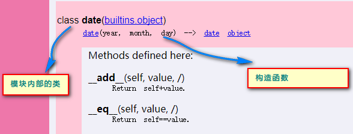
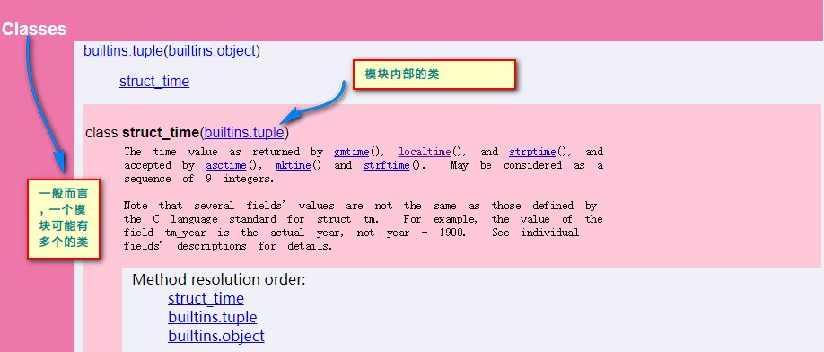
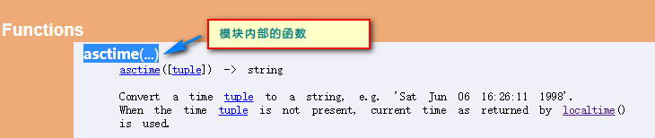

Python库的使用方法简单介绍

***
Python有各种各样的库，为开发提供了很大的便利，但是如何使用这些库呢？

##### 了解结构
首先，Python库由一个独立的Python文件构成，*一个文件里面可以包含多个**类**，多个**方法**，以及**字段***


##### 调用方式
调用Python库之中的任何内容，都要使用相应的库名称，一般是此文件名称，比如调用`datetime`库之中的内容，则需要使用`datetime`这个模块名去调用其中的字段，如`datetime.MAXYEAR`,又如调用方法，使用`math`库，则有`math.sin(36)`,再者调用`datetime`中的`date类`，则为`datetime.date(1992,9,19)`,当我们需要调用此类之中的方法时，如`weekday()`则为`datetime.date(1992,9,19).weekday()`,可以以通过`from datetime import date`而单独使用`date`类，此时就无需在类的前面调用模块名了

##### 使用的关键
其实使用的关键还是要看清楚**模块，类，函数，字段的所代表的含义**，了解其含义之后，知悉其用法，知道每个函数的**参数，返回值，类的构造函数**，然后结合具体的问题，就可以将模块熟悉，从而更加了解可以使用之处,使实际和理论相得益彰，相互促进


##### 图片支持
类的构造函数

模块之中的类

模块之中的函数

模块之中的字段

函数的参数与返回值


##### 使用案例

```python
import math
print(math.e)#使用模块名，调用模块之中的字段
print(math.sin(26))#使用模块名，调用模块之中的函数

import datetime
print(datetime.datetime.today())#使用模块名，调用模块中类的方法
obj=datetime.datetime(2017,11,3)#使用模块中的类，来构造一个对象
print(obj.weekday())

import string
print(string.capwords('12s2lllll2uiouoi22', sep='2'))

from time import struct_time
st=struct_time((1992,2,5,2,3,4,1,2,8))#使用模块之中的类,调用模块之中的方法
print("年："+str(st.tm_year),"日："+str(st.tm_mday))
```

