### DataGrip操作技艺

***

##### 前言

安装创建连接等操作不再赘述。我们来使用DataGrip完成数据库的常用操作，包括查询数据、修改数据，创建数据库、表等

##### 显示连接信息

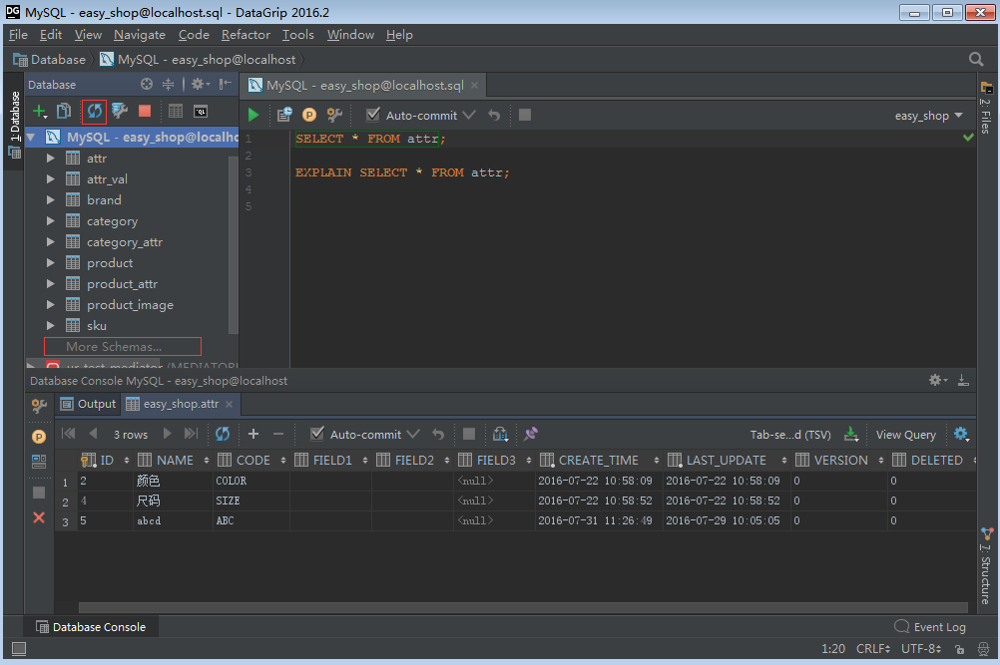
左上区域显示了当前数据库连接，展开后会显示数据库表等信息，如果展开后没有任何信息，需要选中数据库连接，点击上面的旋转图标同步一下，下方有个More Schema选项，点击可以切换不同的schema。

##### 写SQL语句，执行SQL语句

**右键选中的数据库连接，选择open console**，就可以在右侧的控制台中书写sql语句了。DataGrip的智能提示非常爽，无论是标准的sql关键字，还是表名、字段名，甚至数据库特定的字段，都能提示，不得不感叹这智能提示太强大了，Intellij IDEA的智能提示也是秒杀eclipse。

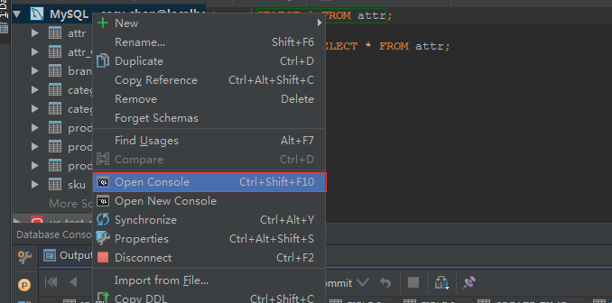

写完sql语句后，可以选中，电子左上侧绿色箭头执行，要执行选中的某一句，也可以直接***CTRL+ENTER***

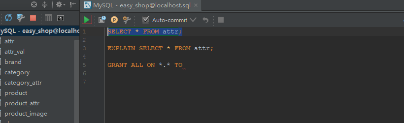
 也可以使用快捷键Ctrl+Enter，选中情况下，会直接执行该sql，未选中情况下，如果控制台中有多条sql，会提示你要执行哪条sql。之前习惯了dbvisualizer中的操作，dbvisualizer中光标停留在当前sql上(sql以分号结尾)，按下Ctrl+.快捷键会自动执行当前sql，其实DataGrip也能设置，在setting->Database-General中

 语句执行时默认是提示，改成smallest statement后，光标停留在当前语句时，按下Ctrl+Enter就会直接执行当前语句。

 

语句的执行结果在底部显示

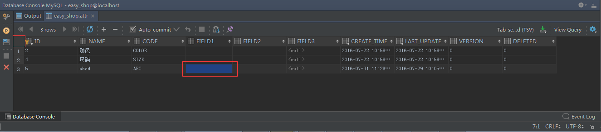
 如果某列的宽度太窄，可以鼠标点击该列的任意一个，使用快捷键Ctrl+Shift+左右箭头可以调整宽度，如果要调整所有列的宽度，可以点击左上角红框部分，选择所有行，使用快捷键Ctrl+Shift+左右箭头调整

添加行、删除行也很方便，上部的+、-按钮能直接添加行或删除选中的行，编辑列同样也很方便，双击要修改的列，输入修改后的值，鼠标在其他部分点击就完成修改了

 有的时候我们要把某个字段置为null，不是空字符串""，DataGrip也提供了渐变的操作，直接在列上右键，选择set null

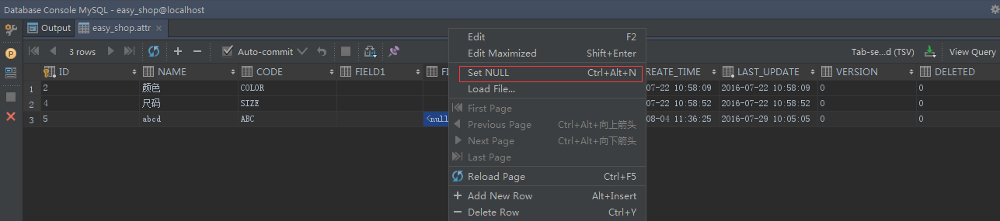
 对于需要多窗口查看结果的，即希望查询结果在新的tab中展示，可以点击pin tab按钮，那新查询将不会再当前tab中展示，而是新打开一个tab

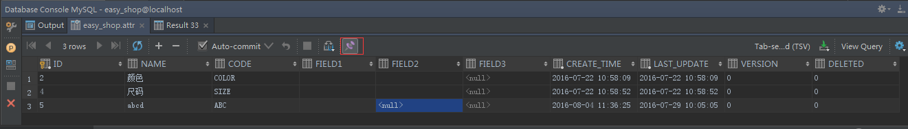

旁边的output控制台显示了执行sql的日志信息，能看到sql执行的时间等信息， 我就问这么吊的工具，还有谁！！！

#####  建立Table表

要新建表也是相当简单、智能，选中数据库连接，点击绿色+号下选择table

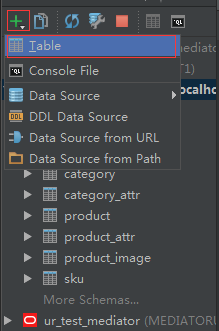
 在新打开的窗口中，可以填写表信息， 我就问你看到这个窗口兴奋不兴奋！！！

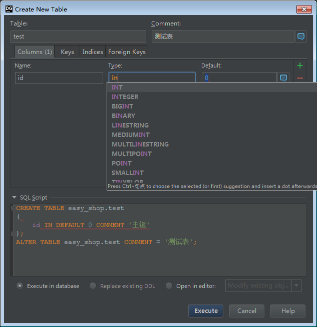

顶部可以填写表名、表注释，中间可以点击右侧绿色+号添加列，列类型type也是能自动补全，default右侧的消息框图标点击后能对列添加注释，旁边的几个tab可以设置索引及外键。**所有这些操作的DDL都会直接在底部显示**

 表建完后，可以点击下图中的table图标，打开表查看视图，可以查看表的数据，也能查看DDL语句

##### 数据导出 

选择需要导出数据的表，右键，Dump Data To File，**即可以导出insert、update形式的sql语句，也能导出为html、csv、json格式的数据**

也可以在查询结果视图中导出

 点击右上角下载图标，在弹出窗口中可以选择不同的导出方式，如sql insert、sql update、csv格式等

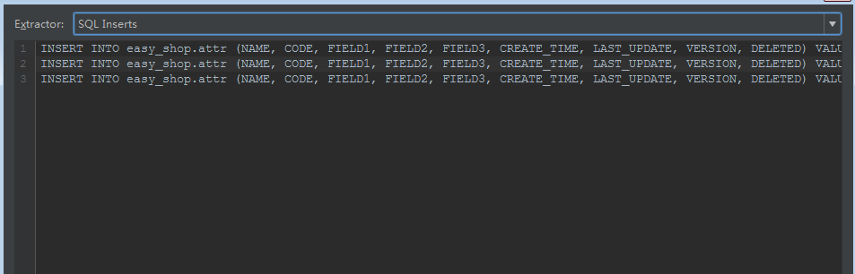

如果是导出到csv格式，还能控制导出的格式

导出后用excel打开是这种结果

##### 数据导入

选择表，右键->Import from File，选择要导入的文件。 注意，导出的时候如果勾选了左侧的两个header选项，导入的时候如果有header，也要勾选，不然会提示列个数不匹配

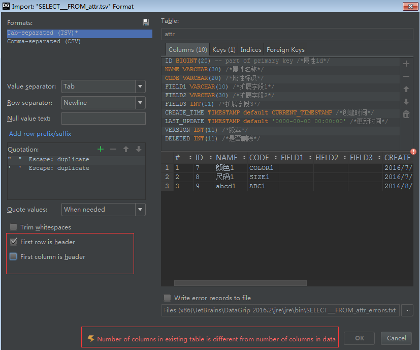

##### 进阶功能

:one:.关键字导航

当在datagrip的文本编辑区域编写sql时，**按住键盘Ctrl键不放，同时鼠标移动到sql关键字上**，比如表名、字段名称、或者是函数名上，鼠标会变成手型，关键字会变蓝，并加了下划线，点击，**会自动定位到左侧对象树，并选中点击的对象**

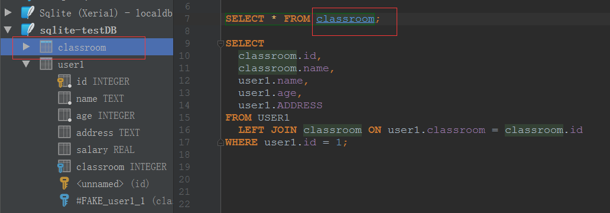

:two:.快速导航到指定的表、视图、函数等

在datagrip中，使用Ctrl+N快捷键，弹出一个搜索框，输入需要导航的名称，回车即可

:three:.全局搜索

连续两次按下shift键，或者鼠标点击右上角的搜索图标，弹出搜索框，搜索任何你想搜索的东西

:four:.结果集搜索

在查询结果集视图区域点击鼠标，按下Ctrl+F快捷键，弹出搜索框，输入搜索内容，支持正则表达式、过滤结果

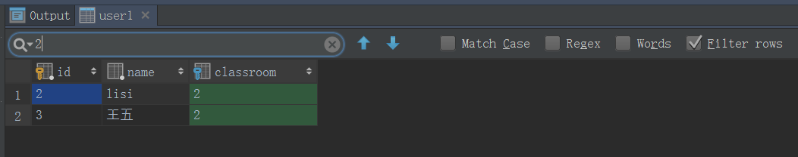

:five:.导航到关联数据

表之间会有外检关联，查询的时候，能直接定位到关联数据，或者被关联数据，例如user1表有个外检字段classroom指向classroom表的主键id，在查询classroom表数据的时候，可以在id字段上右键，go to，referencing data

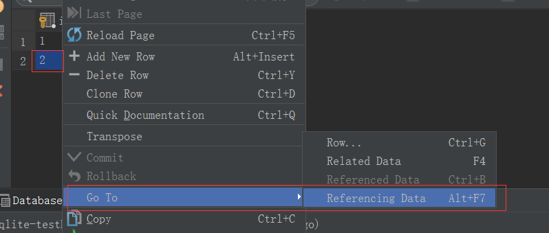
 选择要显示第一条数据还是显示所有数据

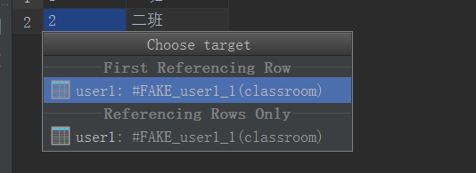
 会自动打开关联表的数据，相反，查询字表的数据时，也能自动定位到父表

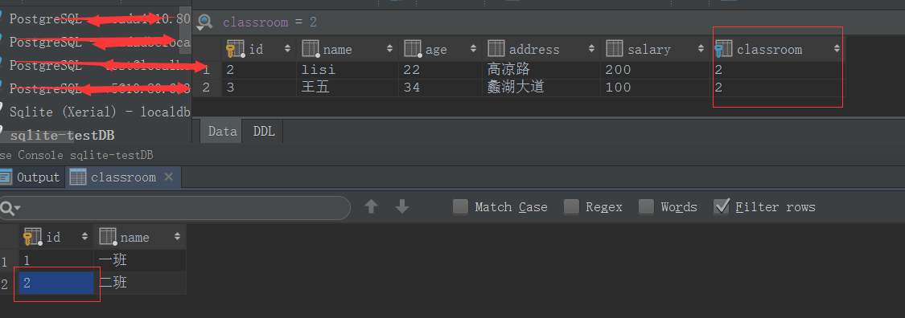

:six:.结果集数据过滤

对于使用table edit（对象树中选中表，右键->table editor）打开的结果集，可以使用条件继续过滤结果集，如下图所示，可以在结果集左上角输入款中输入where条件过滤

 也可以对着需要过滤数据的列右键，filter by过滤

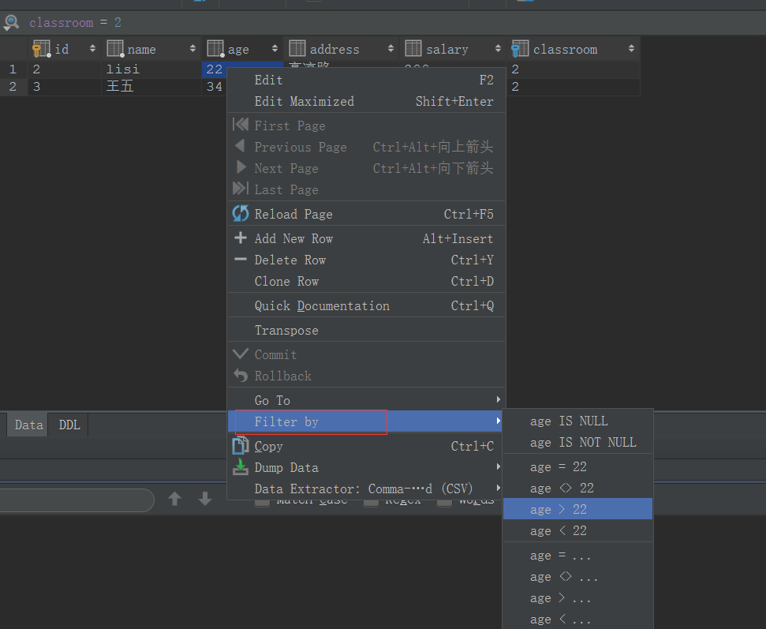

:seven:.行转列

对于字段比较多的表，查看数据要左右推动，可以切换成列显示，在结果集视图区域使用Ctrl+Q快捷键

:eight:.变量重命名

鼠标点击需要重命名的变量，按下Shift+F6快捷键，弹出重命名对话框，输入新的名称

:nine: .自动检测无法解析的对象

如果表名、字段名不存在，datagrip会自动提示，此时对着有问题的表名或字段名，按下Alt+Enter，会自动提示是否创建表或添加字段

:one::zero:.权限定字段名

对于查询使用表别名的，而字段中没有使用别名前缀的，datagrip能自动添加前缀，鼠标停留在需要添加别名前缀的字段上，使用Alt+Enter快捷键

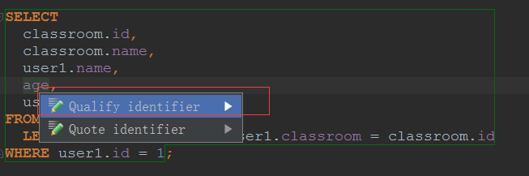

:one::one:.通配符自动展开

查询的时候我们会使用select *查询所有列，这是不好的习惯，datagrip能快速展开列，光标定位到*后面，按下Alt+Enter快捷键

:one::two:.大写自动转换

sql使用大写形式是个好的习惯，如果使用了小写，可以将光标停留在需要转换的字段或表名上，使用Ctrl+shift+U快捷键自动转换

 

:one::three:.sql格式化

选中需要格式化的sql代码，使用Ctrl+Alt+L快捷键

:one::two:.多光标模式

**datagrip提供了一个功能强大的编辑器，实现了notpad++的列编辑模式**。在编辑sql的时候，可能需要同时输入或同时删除一些字符，按下alt+shift，同时鼠标在不同的位置点击，会出现多个光标

:one::three:.代码注释

选中要注释的代码，按下Ctrl+/或Ctrl+shift+/快捷键，能注释代码，或取消注释

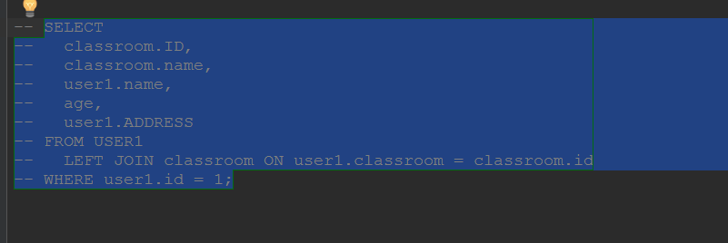

 :one::four:.列编辑

按住键盘Alt键，同时按下鼠标左键拖动，能选择多列，拷贝黏贴等操作

:one::five:.代码历史

在文本编辑器中，邮件，local history，show history，可以查看使用过的sql历史

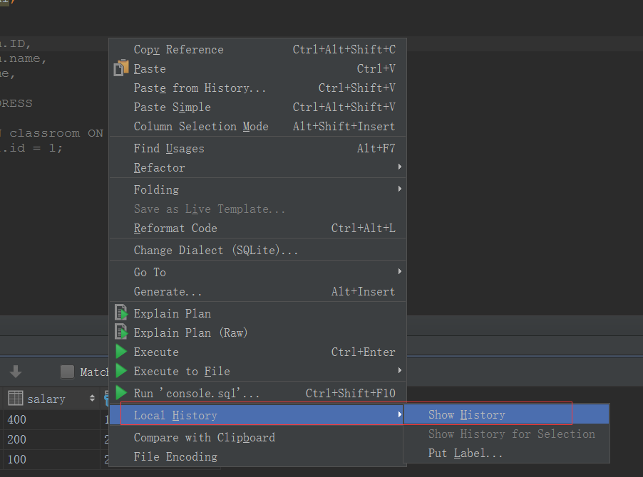
 命令历史

ref：

1.[DataGrip使用入门-安装及数据源管理（一）](http://ywu.iteye.com/blog/2315446),   2.[DataGrip使用入门-常用设置（二）](http://ywu.iteye.com/blog/2315449),   3.[DataGrip使用入门-常用操作（三）](http://ywu.iteye.com/blog/2315495),   4.[taGrip使用入门-导出数据（四）](http://ywu.iteye.com/blog/2315501),   5.[DataGrip使用进阶-导航及搜索（一）](http://ywu.iteye.com/blog/2341838),   6.[DataGrip使用进阶-代码提示及格式化（二）](http://ywu.iteye.com/blog/2341844),   7.[DataGrip使用进阶-文本编辑器（三）](http://ywu.iteye.com/blog/2341847)