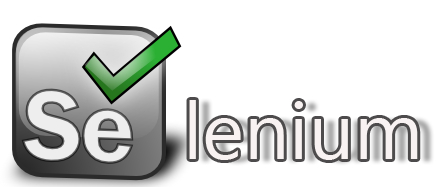
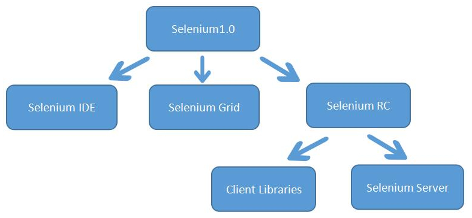
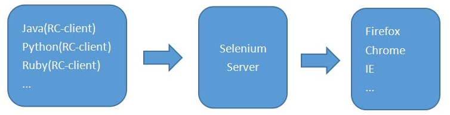
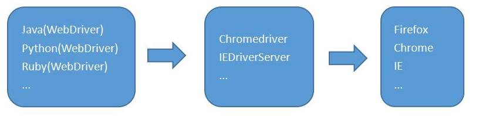

## Selenium和Robot Framework简介

### Selenium发展历史

Jason Huggins在2004年发起了Selenium项目，当时身处ThoughtWorks的他，为了不想让自己的时间浪费在无聊的重复性工作中，幸运的是，所有被测试的浏览器都支持Javascript。Jason和他所在的团队采用Javascript编写一种测试工具来验证浏览器页面的行为；这个JavaScript类库就是Selenium core，同时也是seleniumRC、Selenium IDE的核心组件。Selenium由此诞生。
关于Selenium的命名比较有意思，当时QTP mercury是主流的商业自化工具，是化学元素汞（俗称水银），而Selenium是开源自动化工具，是化学元素硒，硒可以对抗汞。

##### Selenium 1.0

用简单的公式：
**Selenium 1.0** = Selenium IDE + Selenium Grid + Selenium RC

**Selenium IDE**：Selenium IDE是嵌入到Firefox浏览器中的一个插件，实现简单的浏览器操作的录制与回放功能。
**Selenium Grid**：Selenium Grid是一种自动化的测试辅助工具，Grid通过利用现有的计算机基础设施，能加快Web-App的功能测试。利用Grid可以很方便地实现在多台机器上和异构环境中运行测试用例。
**Selenium RC(Remote Control)**:是Selenium家族的核心部分。Selenium RC 支持多种不同语言编写的自动化测试脚本，通过Selenium RC的服务器作为代理服务器去访问应用，从而达到测试的目的。*Selenium RC分为Client Libraries和Selenium Server*。Client Libraries库主要用于编写测试脚本，用来控制Selenium Server的库。Selenium Server负责控制浏览器行为。所以，我们在学习Selenium1.0的时候，核心应该是学习RC，它的工作原理是这样的：

在2006年的时候，Google的工程师Simon Stewart发起了WebDriver的项目；因为长期以来Google一直是Selenium的重度用户，但却被限制在有限的操作范围内。**Selenium RC 是在浏览器中运行JavaScript应用**，使用浏览器内置的JavaScript翻译器来翻译和执行selenese命令（selenese是Selenium命令集合）。**WebDriver是通过原生浏览器支持或者浏览器扩展来直接控制浏览器**。WebDriver针对各个浏览器而开发，取代了嵌入到被测Web应用中的JavaScript，与浏览器紧密集成，因此支持创建更高级的测试，避免了JavaScript安全模型导致的限制。除了来自浏览器厂商的支持之外，WebDriver还利用操作系统级的调用，模拟用户输入。
Selenium与WebDriver原是属于两个不同的项目，WebDriver的创建者Simon Stewart早在2009年8月的一份邮件中解释了项目合并的原因。*Selenium与WebDriver合并原因：为何把两个项目合并？部分原因是WebDriver解决了Selenium存在的缺点（例如能够绕过JavaScript沙箱，我们有出色的API），部分原因是Selenium解决了WebDriver存在的问题（例如支持广泛的浏览器），部分原因是因为Selenium的主要贡献者和我都觉得合并项目是为用户提供最优秀框架的最佳途径*。

##### Selenium 2.0
因为Selenium和Webdriver的合并，所以，Selenium 2.0由此诞生。简单用公式表示为：
**Selenium 2.0** = Selenium 1.0 + WebDriver

需要强调的是，在Selenium 2.0中主推的是WebDriver，可以将其看作Selenium RC的替代品。因为Selenium为了保持向下的兼容性，所以在Selenium 2.0中并没有彻底地抛弃Selenium RC。所以，我们在学习Selenium2.0的时候，核心是学习WebDriver。它的工作原理是这样的：

2016年7月，Selenium3.0悄悄发布第一个beta版。

#####  Selenium 3.0

Selenium 3.0做了一些不大不小的更新,终于去掉了RC，简单用公式表示为：
**Selenium 3.0**= Selenium 2.0 + Selenium RC（Remote Control）

此外还有如下特性，1.Selenium3.0只支持Java8版本以上；2.Selenium3.0中的Firefox浏览器驱动独立了，以前装完selenium2就可以驱动Firefox浏览器了，现在和Chrome一样，必须下载和设置浏览器驱动；3.MAC OS 集成Safari的浏览器驱动。默认在/usr/bin/safaridriver 目录下；4.只支持IE 9.0版本以上。

### selenium学习路线

**配置你的测试环境**，真对你所学习语言，来配置你相应的selenium 测试环境。selenium 好比定义的语义---“问好”，假如你使用的是中文，为了表术问好，你的写法是“你好”，假如你使用的是英语，你的写法是“hello”。 所以，同样有语义在不同的语言下会有不同的写法（语法）；接着你需要**熟悉webdriver API**，API就是selenium 所定义一方法，用于定位，操作页面上的各种元素；**先学习元素的定位**，selenium 提供了id、name、class name、 tag name、link text、partial link text、 xpath、css、等定位方法。xpath和css 功能强大语法稍微复杂，在这其间你可能还需要了解更多的前端知识。xml ,javascript 等；定位元素的目的是为了**操作元素**，接就要学习各种元素有操作，输入框，下拉框，按钮点击，文件上传、下载，分页，对话框，警告框...等等；经过一段时间的学习，你可以游刃有余的模拟手工测试来操作页面上的各种元素了。接着你需要做的就是把这些“用例”组织起来，**编写用例**，统一来跑；那么你需要做的就是**学习并使用单元测试框架**，单元测试框架本身就解决了用例的组织与运行；当你写了一些“测试用例”之后，你会发现用例中有大量重复的操作，能不能写到一个单独的文件中，需要的时候调用这些操作？当然可以，运用你的编程能力来实现这一点将非常简单。然后，你又发现每个用例中都有一些数据，这些数据也是一样的，但如果变化了修改起来非常麻烦，你也可以把他写到一个单独的文件中进行读取，也就是**精简脚本，提取公共代码**，接着你又遇到了新的疑问，我写的脚本（用例）都是流水式的，我怎么知道用例运行失败还是成功。那么就需要在脚本中加一些**验证与断言**；接着你又有了更多的想法，单元测试框架的log太简陋了，能不能生成一张漂亮的**测试报告**出来。我能不能定时的来跑这个脚本。能不能把每一次跑脚本的测试结果直接发到我的邮箱。能不能......；为解决这些问题，你不得不学习更多的编程技术，然后你的“测试结构”会功能越来越强大，越来越灵活。产生了一定的通用性和移植性。一个有模有样的自动化测试框架诞生了。

 

### Robot Framework

##### Robot Framework简介
**Robot Framework**简称RF，是一款python编写的功能自动化测试框架。具备良好的可扩展性，支持关键字驱动，可以同时测试多种类型的客户端或者接口，可以进行分布式测试执行。主要用于轮次很多的验收测试和验收测试驱动开发（ATDD）。Robot Framework是开源软件，由Nokia Siemens Networks开发并提供支持。

##### RF特性

- 测试用例使用文本文件（txt或者tsv文件）保存，使用制表符分隔数据。可以方便的使用任何文本编辑器，或者EXCEL编辑测试用例。也可以使用HTML格式创建用例。
- 测试用例中支持变量使用，可以使用IF语句和FOR循环语句。
- 可以利用“标签”功能对测试用例进行分类和有选择执行。
- 支持关键字驱动、数据驱动和行为驱动。
- 利用已有的关键字，测试人员可以创建自己需要的关键字，形成更高级别的行为。
- 测试执行报告和日志是HTML格式，容易阅读。
- Robot Framework并不是一款像QTP一样的自动化测试工具。它是一个自动化测试框架，或者说是一个自动化测试平台。
- 提供了测试执行事件的监听接口，并且可以自定义接口中的脚本。
- 提供了命令行接口和XML格式的输出。可以与版本管理工具结合，进行持续集成。
- Robot Framework是通过测试库识别被对象、操纵被测对象，有很多自带的或者第三方的开源测试库。例如，使用“selenium2Library”库测试web客户端。此外还可以测试java客户端、Win32客户端、SSH协议的字符终端等。
- 测试人员可以使用Python和java创建自己需要的测试库。
- 提供了远程测试执行接口，可以进行分布式测试执行。

##### RIDE
RIDE是一款专门用来编辑Robot Framework用例的软件，用Python编写并且开源。RIDE可以从Robot Framework官网找到最新的下载链接。

##### Robot Framework+WebDriver 架构

##### 环境搭建
整个robot framework自动化环境的搭建包括robotframework运行环境的搭建、Web自动化测试环境搭建、appium自动化测试环境搭建、接口自动化环境搭建、数据库自动化环境的搭建等等，此章节先介绍robot framework运行环境的搭建、Web自动化测试环境搭建，下载可以使用如下[链接](http://pan.baidu.com/s/1qYMn5SS)。

###### 安装Python
安装完Python之后，将其安装路径加入到Path环境变量之中(包括安装的Scripts)

###### 安装setuptools
setuptools 是Python Enterprise Application Kit（PEAK）的一个副项目，它是一组Python 的distutilsde工具的增强工具可以让程序员更方便的创建和发布Python 包，特别是那些对其它包具有依赖性的状况。在DOS下切换到下setuptools解压目录下，执行python setup.py install即可安装

###### 安装pip
pip 是一个安装和管理Python 包的工具，通过pip 去安装Python 包将变得十分简单，我们将省去了搜索--查找版本--下载--安装等繁琐的过程。pip 的安装依赖于setuptools ，所以在安装pip 之间需要先安装setuptools，在DOS下切换到下pip解压目录下，执行python setup.py install，现在一般而言setuptools和pip工具都已经随着Python环境安装好了

###### 安装Selenium
通过pip install selenium直接安装

###### 安装wxPython
robot framework-ride的版本必须要和wxPython版本匹配，否则无法运行

###### 安装robot framework
双击安装即可，[下载地址](https://pypi.python.org/pypi/robotframework/2.8.5#downloads)

###### 安装robotframework-ride
双击安装即可，[下载地址](https://pypi.python.org/pypi/robotframework-ride/1.3)

###### 安装Selenium2Library的依赖库decorator
decorator是Selenium2Library的依赖库

###### 安装Selenium2Library库
这个库主要是用于页面Web UI操作，pip install robotframework-selenium2library，robot framework 的运行环境搭建完成，下面就可以使用RIDE去编写程序。

##### 辅助软件安装
以火狐浏览器为例，安装**FireBug**，**selenium-ide**，**FirePath**等插件，为测试做好准备

 

ref:

1.[自动化基础普及之selenium是啥？](http://www.cnblogs.com/fnng/p/3980093.html), 2.[在做自动化测试之前你需要知道的](http://www.cnblogs.com/fnng/p/3653793.html), 3.[Selenium发展史](http://www.cnblogs.com/fnng/p/7426928.html),  4.[Robot Framework和Selenium简介](http://www.cnblogs.com/tinghai8/p/5714229.html), 5.[有什么好的开源自动化测试框架可以推荐？](https://www.zhihu.com/question/19923336), 6.[在WIN10下搭建Robot Framework环境](http://www.cnblogs.com/littlemonsterksn/p/7444043.html)
