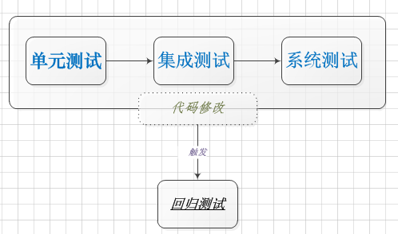
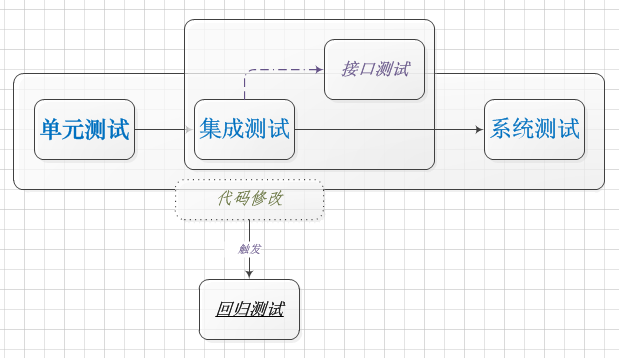

### 测试基本知识
***

1.所有的测试都应该可追溯到客户需求

2.测试应该从小规模开始，逐步转向大规模

3.*穷举测试是不可能的*

4.++按事情的重要程度而编排行事优先次序：8020法则++

5.软件错误与软件缺陷

6.软件测试可以找出过错缺陷，但难以找到遗漏缺陷

7.*测试用例*：一组输入和预期输出的集合

8.**黑盒测试**：也称功能测试，把程序看作一个不能打开的黑盒子，在完全不考虑程序内部结构和内部特性的情况下，~~在程序接口进行测试，它只检查程序功能是否按照需求规格说明书的规定正常使用，程序是否能适当地接收输入数据而产生正确的输出信息。~~黑盒测试着眼于程序外部结构，不考虑内部逻辑结构，主要针对软件界面和软件功能进行测试。黑盒测试是以用户的角度，从输入数据与输出数据的对应关系出发进行测试的。++如果外部特性本身设计有问题或规格说明的规定有误，用黑盒测试方法是发现不了的++。

9.**白盒测试**：又称结构测试、透明盒测试、逻辑驱动测试或基于代码的测试。=="白盒"法全面了解程序内部逻辑结构、对所有逻辑路径进行测试。== **"白盒"法是穷举路径测试。** 在使用这一方案时，测试者必须检查程序的内部结构，从检查程序的逻辑着手，得出测试数据。常用的软件测试方法有两大类：静态测试方法和动态测试方法。静态测试不要求在计算机上实际执行所测程序，主要以一些人工的模拟技术对软件进行分析和测试；动态测试是通过输入一组预先按照一定的测试准则构造的实例数据来动态运行程序，而达到发现程序错误的过程。在动态分析技术中,最重要的技术是路径和分支测试。下面要介绍的六种覆盖测试方法属于动态分析方法。

10.*黑盒测试方法*：边界值、等价类、决策表、因果图等等

11.*白盒测试方法*：语句覆盖、分支覆盖、条件覆盖、路径覆盖

12.*静态测试技术*：代码审查、编程规范检查、PC-LINT检查技术等

13.*动态测试技术*：单元测试、集成测试、系统测试等

14.*单元测试*：对软件最小的设计单元， 构件或者模块的检测和有效性确认。

15.*集成测试*：单元测试完成后，需要将各个功能组件集成到部分或者一个完成的软件之中，此时需要进行的测试就是集成测试，++目的是发现组件交互的问题++，一般采用增量式集成测试的方法。

16.*回归测试*：回归测试是对某些已经进行过的测试的子集重新执行，以保证上述改变不会带来无法预料的副作用。**通常是以往所有测试用例的一个子集，但专注于被修改过的软件构件的测试**。

17.*接口测试*：模块或者子系统集成到比较大的时候，需要进行接口测试，**其目的是为了发现参与集成测试的模块之间接口交互的问题**。

18.*系统测试*：将软件放置于**运行环境**之中，++确认其与软件需求说明书之间的描述是否一致，而进行的一系列系统集成和确认测试++。通常包含有恢复测试、安全测试、压力测试等。
]

19.功能测试：对于被测系统提供的功能性需求而进行的测试。

20.性能测试：验证软件是否满足性能需求的测试，如++负载测试，压力测试都属于性能测试++。
![性能测试]

后两者，主要是针对系统工作强度大，内存不充足，服务不可用等情况*；++极限测试侧重于验证系统内外部在达到最大额定工作指标时，能否正常工作++;**敏感性测试重在验证在一些临界点是，功能和性能是否会产生突变**。

22.保密性测试：检查系统抵御非法入侵的能力。

23.恢复测试：使用一些手段，强制软件发生一些列故障，然后验证软件恢复之后是否能够正常运行，*是一种系统测试的方法*。

24.配置测试：测试不同的软硬件平台和不同配置下系统表现和处理能力。

25.文档测试：对软件的文档进行评审和审查以及评估，另外可动态测试，按照说明和帮助来操作，验证文档的结果。

26.*验收测试*：确定系统是否满足客户要求而执行的测试，其*重点在与演示系统可以正确执行，而非发现问题*。与系统测试的区别是，系统测试是软件工程师测试，而验收测试是由用户火气授权方来测试。**验收测试分为α测试与β测试**,++α测试在开发场所进行，由开发者指导测试，记录问题，**在一个受控的环境下进行**；β测试由用户主导，开发者不在场，**环境不受控制**++。

27.**冒烟测试**：冒烟测试源自硬件行业，对一个硬件或者硬件组件改动后，直接给设备加电，看看设备会不会冒烟，没冒烟，就表示待测组件是通过了测试。++其实就是看，改动之后的功能会不会造成原有功能的'短路'++，其在测试之中最核心的点就是：当开发人员在试图解决一个bug的时候，因为集中考虑当前问题而忽略其他问题，可能引起其他的新的Bug,==冒烟测试就是为了测试是否真正解决了当前的Bug==。

ref
[谈冒烟测试](http://www.cnblogs.com/leipei2352/archive/2011/05/22/2053365.html)  
