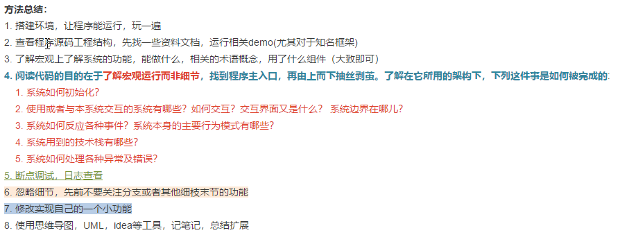

##### 方法总结
1. 搭建环境，让程序能运行，玩一遍
2. 查看程序源码工程结构，先找一些资料文档，运行相关demo(尤其对于知名框架)
3. 了解宏观上了解系统的功能，能做什么，相关的术语概念，用了什么组件（大致即可）
4. 阅读代码的目的在于**了解宏观运行而非细节**，找到程序主入口，再由上而下抽丝剥茧。了解在它所用的架构下，下列这件事是如何被完成的**:
    1. 系统如何初始化？
    2. 使用或者与本系统交互的系统有哪些？如何交互？交互界面又是什么？ 系统边界在哪儿？
    3. 系统如何反应各种事件？系统本身的主要行为模式有哪些？
    4. 系统用到的技术栈有哪些？
    5. 系统如何处理各种异常及错误？
5. 断点调试，日志查看
6. 忽略细节，先前不要关注分支或者其他细枝末节的功能
7. 修改实现自己的一个小功能
8. 使用思维导图，UML，idea等工具，记笔记，总结扩展

