### idea多线程Debug
---

多线程的开发，就需要多线程调试， 如何进行多线程调试呢？以下是一个小Demo来演示多线程的Debug调试：
```java
public class LockDemoReetrantLock{
     private int i=0;
     private ReentrantLock reentrantLock=new ReentrantLock();
     public void inCreate(){
     // 断点   
         reentrantLock.lock();
         try{
             i++;
     }finally {
            //注意：一般的释放锁的操作都放到finally中，
            // 多线程可能会出错而停止运行，如果不释放锁其他线程都不会拿到该锁
            reentrantLock.unlock();
        }
    }
    public static void main(String[] args){
        ReentrantLock lock = new ReentrantLock();
        lock.lock();
        LockDemoReetrantLock lockDemoReetrantLock = new LockDemoReetrantLock();
        for(int i=0;i<3;i++){
            new Thread(()->{
                    lockDemoReetrantLock.inCreate();
                }).start();
        }
    }
}
```


#### 普通的调试
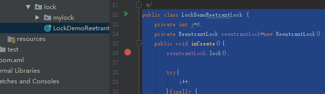

开始刚一执行此时，i=2

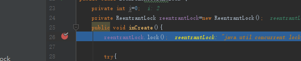

接着下一步下一步，程序直接跳出 看不到ReentrantLock的排队操作，再次运行，在进行一次调试此时i=1


同样看不到排队操作，不是我们想要的结果！！达不到想要的效果！！！


#### 多线程调试
**关键关键关键来了！**我们需要将断点阻塞设置成针对线程的, 而非全局的, 有两种方式可以设置, 推荐第**②**种，更加方便！
##### ①.运行Debug, 其它两个线程就已经启动了，其中有一个线程能够停止到这个断点，选择Debug栏的所有断点，选择到我们需要设置的断点， 然后将将suspend从All修改成Thread， 然后点Done，此时就Ok了。


##### ②.我们在代码侧边栏，设置断点，然后打上断点，右键红色小断点，然后将suspend从All修改成Thread， 然后点Done，可以设置成全局都是Thread， 否则相关的代码断点可能会跳过，因此就需要重新去设置。点击Done后就完成了设置。***推荐使用这种方式，简单明了，一目了然。***

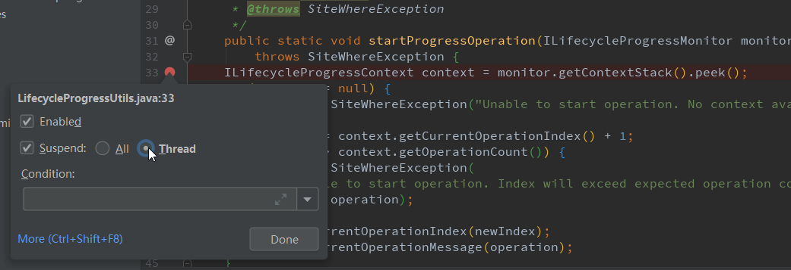


**注意**：我们开启程序后，进入到相关的线程，就会在断点上打到，如果现在运行的不是这个线程，那么久不会在这个断点上面打钩， 只有运行到上面，才会打钩。

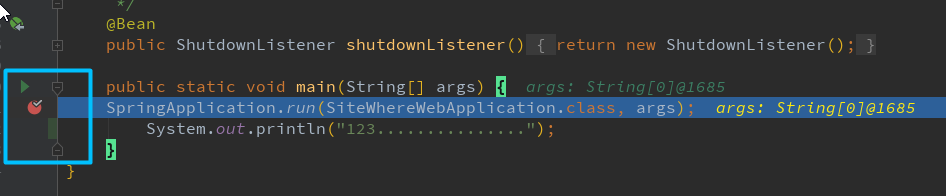

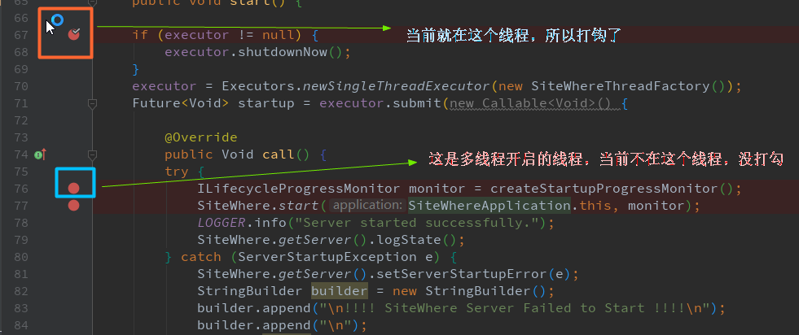

开始单步调试执行，会有如下提示查看Frames：

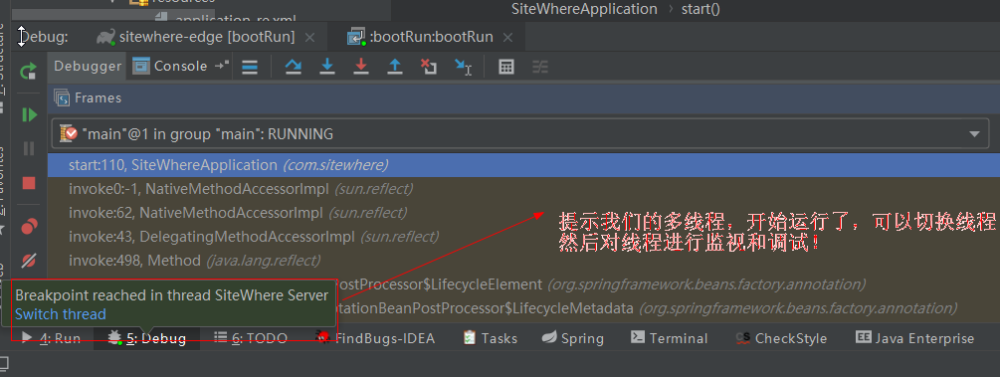

查看Frames, 选择我们想要调试的线程：


此时效果如下，我们就可以开始多线程的调试了：

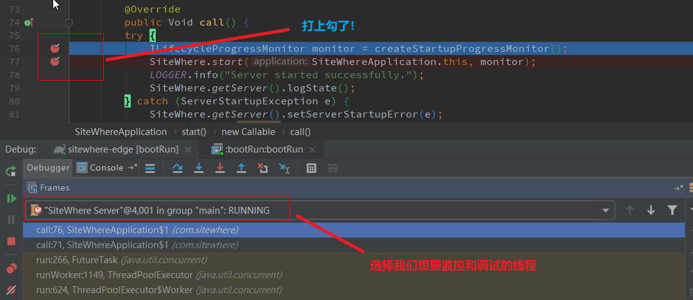


#### 多线程调试案例
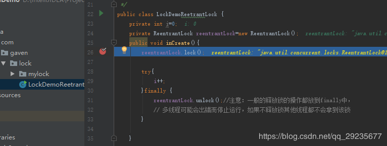

开始调试， 单步执行

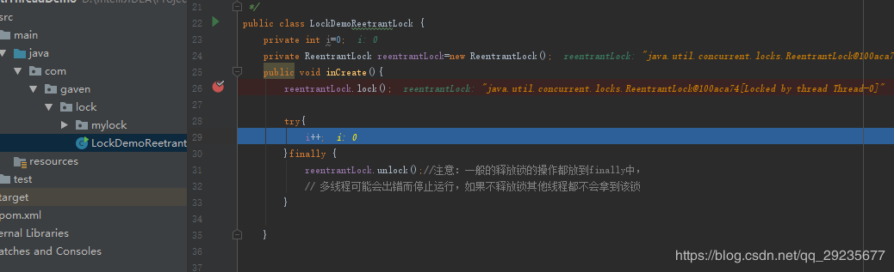

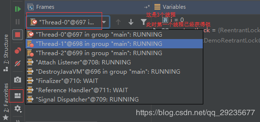

接下来我们看第二个线程是否获得锁，点入该线程(012线程顺序是随机的)

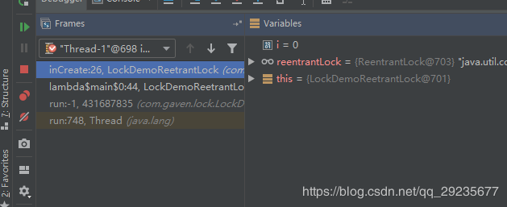

F8显示未挂起的线程不可用 该线程没能获取到该锁（同理Thread2也不能获取该锁）


线程1和2 wait 线程0和主线程running，线程1和2都在等待资源

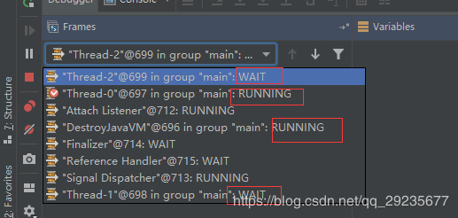

接下来看ReetrantLock 的执行过程，重新启动

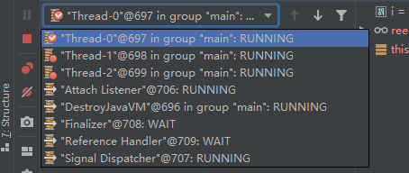

此时3个线程都停留在这


此时跳入inCreat方法


再跳进到lock方法中去  进入到非公平锁的实现

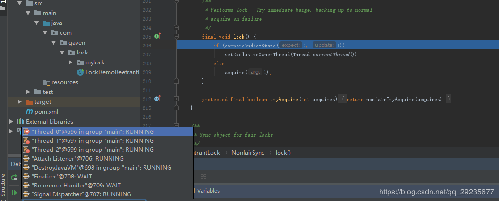

F8首先执行CAS


其他线程就不会执行

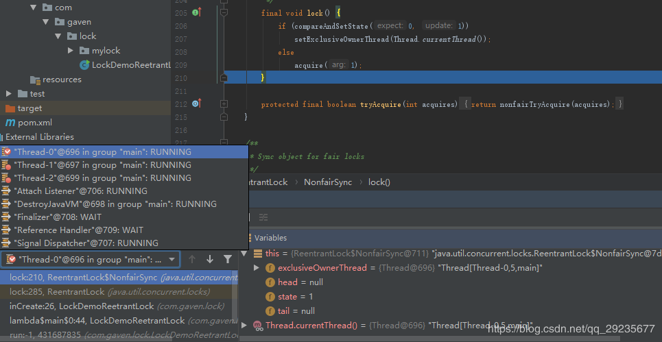


此时由于是线程0先执行的，我们再开一下线程1（012执行顺序是随机的这里假定0先执行），接下来看线程1


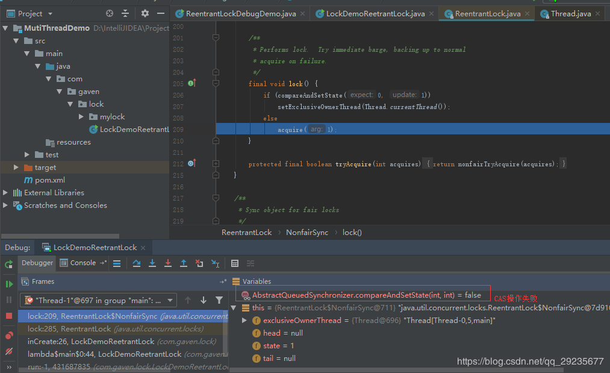

之后执行acquire方法

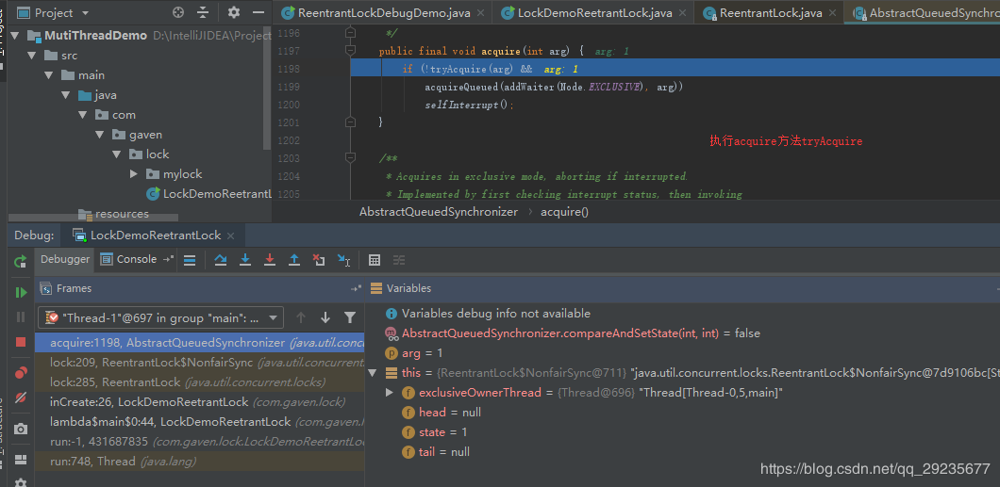


再跳


跳进去


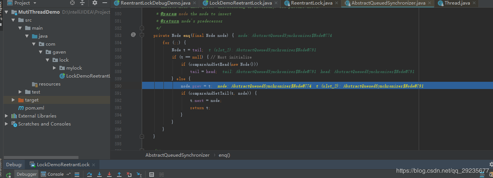

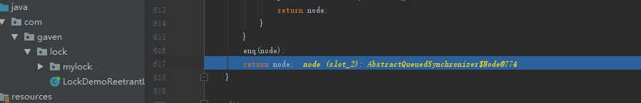

此时addWaiter执行完毕


接着执行acquireQueued方法

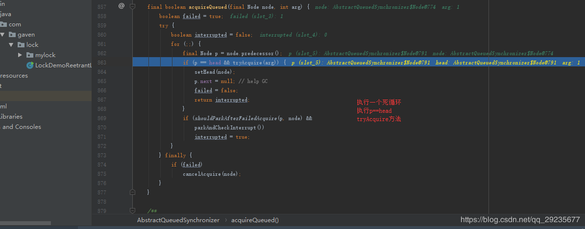

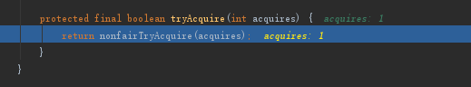


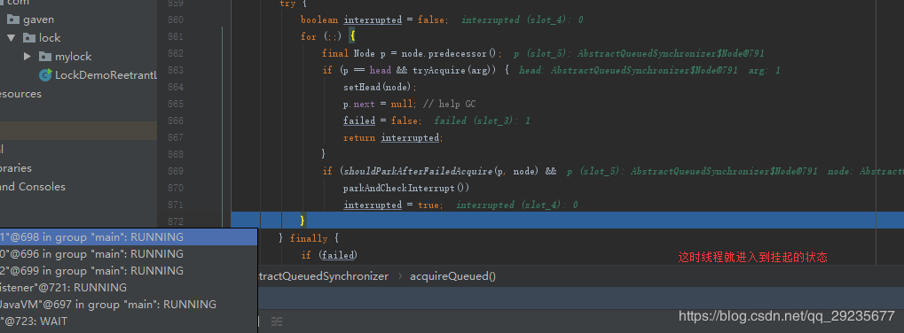

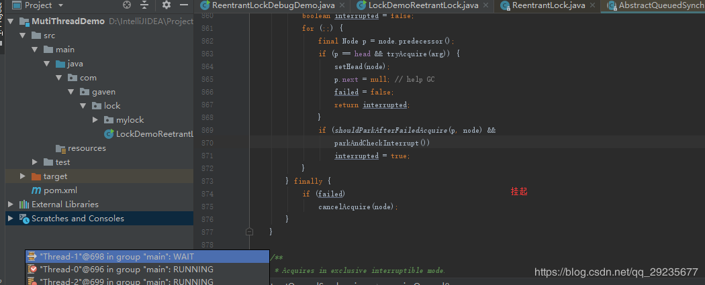

同理线程2也这样

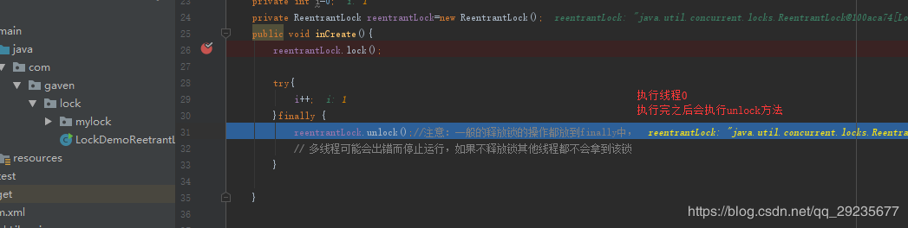

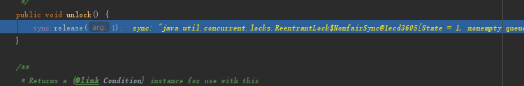

执行tryRelease方法

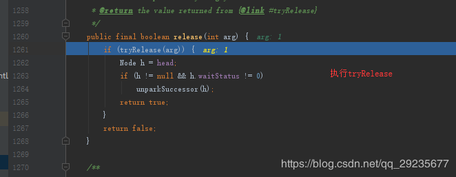

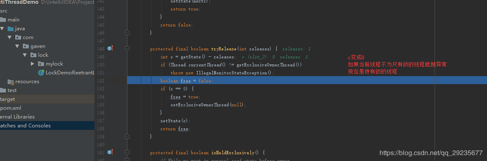


tryRelease方法执行成功


执行完成之后就会唤醒其他线程

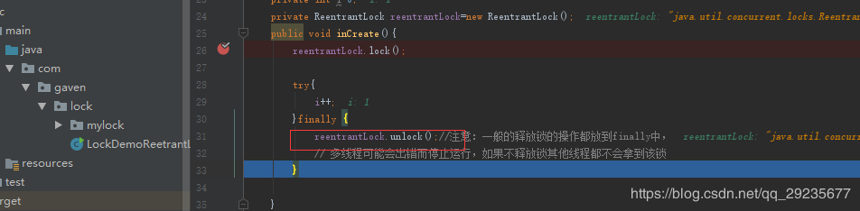


该线程执行完毕。接着查看其他线程（1，2）

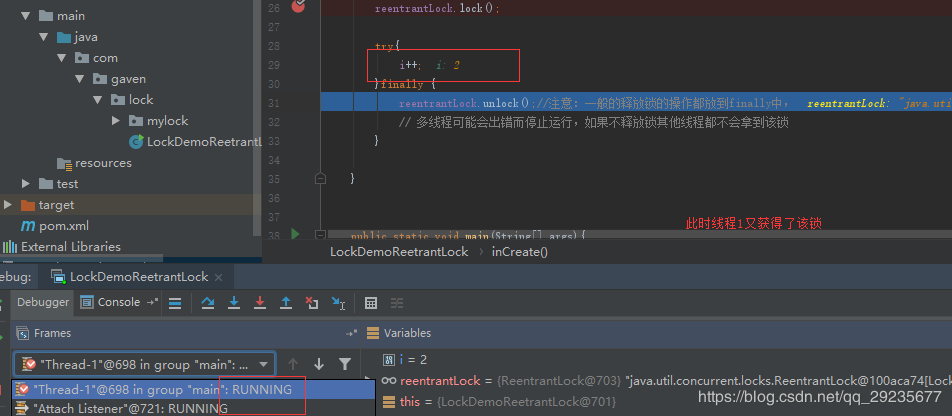


---
ref:
1.[多线程——多线程debug调试](https://blog.csdn.net/qq_29235677/article/details/88186308)