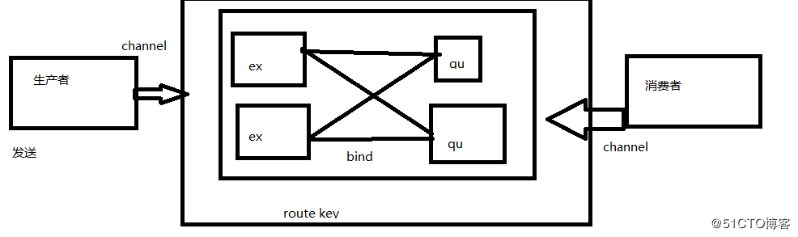

### MQ和使用场景

***

##### 消息队列(Message Queue)
**消息(Message)是指在应用间传送的数据**, 消息可以非常简单, 比如只包含文本字符串, 也可以更复杂, 可能包含嵌入对象.
**消息队列(Message Queue)是一种应用间的通信方式**, 消息发送后可以立即返回, **由消息系统来确保消息的可靠传递**. *消息发布者只管把消息发布到 MQ 中而不用管谁来取, 消息使用者只管从MQ中取消息而不管是谁发布的*. **这样发布者和使用者都不用知道对方的存在, 这样能大大平台解耦能力**, 将每一个功能都具体到模块化操作.

##### 消息队列基本术语
**Broker**:  它提供一种传输服务, 它的角色就是维护一条从生产者到消费者的路线, 保证数据能按照指定的方式进行传输.
**Exchange**：消息交换机, 它指定消息按什么规则,路由到哪个队列.
**Queue**: 消息的载体, 每个消息都会被投到一个或多个队列.
**Binding**: 绑定, 它的作用就是把exchange和queue按照路由规则绑定起来.
**Routing Key**: 路由关键字, exchange根据这个关键字进行消息投递. 
**vhost**: 虚拟主机,一个broker里可以有多个vhost, 用作不同用户的权限分离. 
**Producer**: 消息生产者, 就是投递消息的程序.
**Consumer**: 消息消费者, 就是接受消息的程序.
**Channel**: 消息通道,在客户端的每个连接里, 可建立多个channel.

##### 为何需要消息队列
**解耦** 
在项目启动之初来预测将来项目会碰到什么需求, 是极其困难的. 消息系统在处理过程中间插入了一个隐含的, 基于数据的接口层, 两边的处理过程都要实现这一接口. 这允许你独立的扩展或修改两边的处理过程, 只要确保它们遵守同样的接口约束. 
**冗余** 
有些情况下, 处理数据的过程会失败. 除非数据被持久化, 否则将造成丢失. 消息队列把数据进行持久化直到它们已经被完全处理, 通过这一方式规避了数据丢失风险. 许多消息队列所采用的”插入-获取-删除”范式中, 在把一个消息从队列中删除之前, 需要你的处理系统明确的指出该消息已经被处理完毕, 从而确保你的数据被安全的保存直到你使用完毕. 
**扩展性** 
因为消息队列解耦了你的处理过程, 所以增大消息入队和处理的频率是很容易的, 只要另外增加处理过程即可. 不需要改变代码, 不需要调节参数. 扩展就像调大电力按钮一样简单. 
**灵活性 & 峰值处理能力** 
在访问量剧增的情况下, 应用仍然需要继续发挥作用, 但是这样的突发流量并不常见；如果为以能处理这类峰值访问为标准来投入资源随时待命无疑是巨大的浪费. 使用消息队列能够使关键组件顶住突发的访问压力, 而不会因为突发的超负荷的请求而完全崩溃. 
**可恢复性** 
系统的一部分组件失效时, 不会影响到整个系统. 消息队列降低了进程间的耦合度, 所以即使一个处理消息的进程挂掉, 加入队列中的消息仍然可以在系统恢复后被处理. 
**顺序保证** 
在大多使用场景下, 数据处理的顺序都很重要. 大部分消息队列本来就是排序的, 并且能保证数据会按照特定的顺序来处理. Kafka保证一个Partition内的消息的有序性. 
**缓冲** 
在任何重要的系统中, 都会有需要不同的处理时间的元素. 例如, 加载一张图片比应用过滤器花费更少的时间. 消息队列通过一个缓冲层来帮助任务最高效率的执行———写入队列的处理会尽可能的快速. 该缓冲有助于控制和优化数据流经过系统的速度. 
**异步通信** 
很多时候, 用户不想也不需要立即处理消息. 消息队列提供了异步处理机制, 允许用户把一个消息放入队列, 但并不立即处理它. 想向队列中放入多少消息就放多少, 然后在需要的时候再去处理它们. 

##### 消息队列的应用场景
以下介绍消息队列在实际应用中常用的使用场景. **异步处理**, **应用解耦**, **流量削锋**和**消息通讯**四个场景, 以下对每个场景进行说明
###### 异步处理
场景说明: 用户注册后, 需要发注册邮件和注册短信. 传统的做法有两种: 1.串行的方式, 2.并行方式
1. 串行方式: 将注册信息写入数据库成功后, 发送注册邮件, 再发送注册短信. 以上三个任务全部完成后, 返回给客户端
  
2. 并行方式: 将注册信息写入数据库成功后, 发送注册邮件的同时, 发送注册短信. 以上三个任务完成后, 返回给客户端. 与串行的差别是, **并行的方式可以提高处理的时间**
  
  假设三个业务节点每个使用50毫秒钟, 不考虑网络等其他开销, 则串行方式的时间是150毫秒, 并行的时间可能是100毫秒. 因为CPU在单位时间内处理的请求数是一定的, 假设CPU1秒内吞吐量是100次. 则串行方式1秒内CPU可处理的请求量是7次(1000/150). 并行方式处理的请求量是10次(1000/100)
>小结：如以上案例描述，传统的方式系统的性能（并发量，吞吐量，响应时间）会有瓶颈。如何解决这个问题呢？
引入消息队列，将不是必须的业务逻辑，异步处理。改造后的架构如下：

按照以上约定, 用户的响应时间相当于是注册信息写入数据库的时间, 也就是50毫秒. 注册邮件, 发送短信写入消息队列后, 直接返回, 因此写入消息队列的速度很快, 基本可以忽略, 因此用户的响应时间可能是50毫秒. 因此架构改变后, 系统的吞吐量提高到每秒20 QPS. 比串行提高了3倍, 比并行提高了两倍

###### 应用解耦
场景说明: 用户下单后, 订单系统需要通知库存系统. 传统的做法是, 订单系统调用库存系统的接口. 如下图

传统模式的缺点: 

- 假如库存系统无法访问, 则订单减库存将失败, 从而导致订单失败
- 订单系统与库存系统耦合

如何解决以上问题呢? 引入应用消息队列后的方案, 如下图:

- 订单系统: 用户下单后, 订单系统完成持久化处理, 将消息写入消息队列, 返回用户订单下单成功
- 库存系统: 订阅下单的消息, 采用拉/推的方式, 获取下单信息, 库存系统根据下单信息, 进行库存操作
- 假如: 在下单时库存系统不能正常使用. 也不影响正常下单, 因为下单后, 订单系统写入消息队列就不再关心其他的后续操作了. 实现订单系统与库存系统的应用解耦

###### 流量削锋
流量削锋也是消息队列中的常用场景, 一般在秒杀或团抢活动中使用广泛
应用场景: 秒杀活动, 一般会因为流量过大, 导致流量暴增, 应用挂掉. 为解决这个问题, 一般需要在应用前端加入消息队列.

- 可以控制活动的人数
- 可以缓解短时间内高流量压垮应用

 
- 用户的请求, 服务器接收后, 首先写入消息队列. 假如消息队列长度超过最大数量, 则直接抛弃用户请求或跳转到错误页面
- 秒杀业务根据消息队列中的请求信息, 再做后续处理

###### 日志处理
日志处理是指将消息队列用在日志处理中, 比如Kafka的应用, 解决大量日志传输的问题. 架构简化如下

- 日志采集客户端, 负责日志数据采集, 定时写受写入Kafka队列
- Kafka消息队列, 负责日志数据的接收, 存储和转发
- 日志处理应用: 订阅并消费kafka队列中的日志数据

以下是新浪kafka日志处理应用案例: 转自(http://cloud.51cto.com/art/201507/484338.htm)

(1)Kafka: 接收用户日志的消息队列
(2)Logstash: 做日志解析, 统一成JSON输出给Elasticsearch
(3)Elasticsearch: 时日志分析服务的核心技术, 一个schemaless, 实时的数据存储服务, 通过index组织数据, 兼具强大的搜索和统计功能
(4)Kibana: 基于Elasticsearch的数据可视化组件, 超强的数据可视化能力是众多公司选择ELK stack的重要原因

###### 消息通讯
消息通讯是指, 消息队列一般都内置了高效的通信机制, 因此也可以用在纯的消息通讯. 比如实现点对点消息队列, 或者聊天室等
点对点通讯:

客户端A和客户端B使用同一队列, 进行消息通讯.
聊天室通讯:

客户端A, 客户端B, 客户端N订阅同一主题, 进行消息发布和接收. 实现类似聊天室效果.
以上实际是消息队列的两种消息模式, 点对点或发布订阅模式. 模型为示意图, 供参考.

ref:
1.[rabbitmq管理界面开启](http://blog.51cto.com/xiong51/2113794),   2.[Java常用消息队列原理介绍及性能对比](https://blog.csdn.net/songfeihu0810232/article/details/78648706),   3.[消息队列及常见消息队列介绍](https://www.cnblogs.com/Terry-Wu/p/7644279.html),   4.[消息队列使用的四种场景介绍](https://www.cnblogs.com/ruiati/p/6649868.html),   5.[MQ基础概念和介绍](https://www.cnblogs.com/yanduanduan/p/7157836.html).