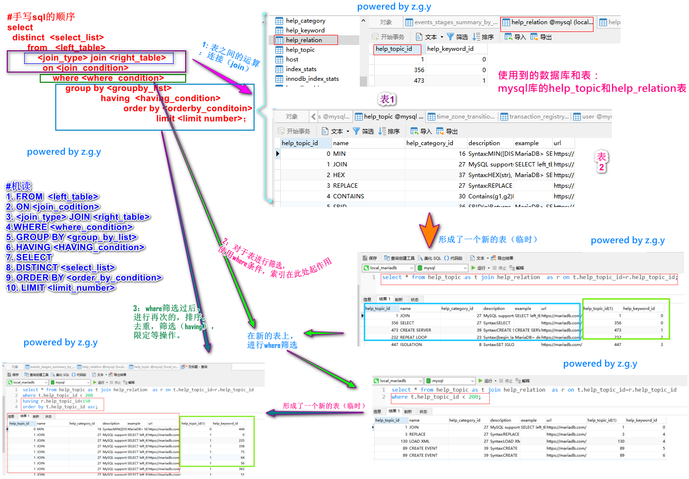

### MySQL查询语句执行过程图解

比如有如下的sql查询语句，其中的执行顺序是什么样子的呢？

```sql
select * from help_topic as t join help_relation  as r on t.help_topic_id = r.help_topic_id
where t.help_topic_id < 200
having r.help_topic_id<150
order by t.help_topic_id asc; 
```
简单来说，上述语句是我们所写的SQL语句，这个是人理解的顺序，当然对于初学者，这个顺序是有点绕的，机器执行的顺序和我们手写SQL的顺序是**不一致**的！其执行顺序如下：
```sql
1. FROM  <left_table>
2. ON <join_codition>
3. <join_type> JOIN <right_table>
4. WHERE <where_condition>
5. GROUP BY <group_by_list>
6. HAVING <HAVING_condition>
7. SELECT 
8. DISTINCT <select_list>
9. ORDER BY <order_by_condition>
10. LIMIT <limit_number>
```

总体来说，MYSQL的查询语句，可以分为三个部分:
- 一个是表之间的各种连接，这部分是join ...on....形成了一个新的表(可以这么理解)；
  - `select * from help_topic as t join help_relation  as r on t.help_topic_id = r.help_topic_id;`
- 第二是按照条件去筛选，此处使用的是where条件，也可以理解成形成了一个新的表；
  - `select * from help_topic as t join help_relation  as r on t.help_topic_id = r.help_topic_id where t.help_topic_id < 200;`
- 第三是按照上述形成的新的临时表，然后去通过分组(group by)，筛选(having)，排列(order by)，限定行数(limit)等操作。
  - `select * from help_topic as t join help_relation  as r on t.help_topic_id = r.help_topic_id where t.help_topic_id < 200
    having r.help_topic_id < 150 order by t.help_topic_id asc; `

正如上述描述，SQL查询就可以分成这么三个步骤。形象的解释如下图所示：
