### Chrome调试技巧

***

#### 常用快捷键
- command + option + j(mac): 调出调试工具, F12(win)
- { }: 在Source页面格式化JS或者HTML代码
- 🚫图标: 清空Console的内容

#### 先来认识一下这些按钮
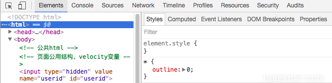
先来看这张图最上头的一行是一个功能菜单，每一个菜单都有它相应的功能和使用方法，依次从左往右来看
**1.箭头按钮**
用于在页面选择一个元素来审查和查看它的相关信息，当我们在**Elements**这个按钮页面下点击某个Dom元素时，箭头按钮会变成选择状态

**2.设备图标**
点击它可以切换到不同的终端进行开发模式，移动端和pc端的一个切换，可以选择不同的移动终端设备，同时可以选择不同的尺寸比例，chrome浏览器的模拟移动设备和真实的设备相差不大，是非常好的选择可选择的适配
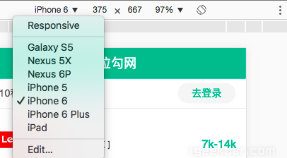

**3.Elements** 功能标签页：用来查看，修改页面上的元素，包括DOM标签，以及css样式的查看，修改，还有相关盒模型的图形信息，下图我们可以看到当我鼠标选择id 为lg_tar的div元素时，右侧的css样式对应的会展示出此id 的样式信息，此时可以在右侧进行一个修改，修改即可在页面上生效， 灰色的element.style样式同样可以进行添加和书写，唯一的区别是，在这里添加的样式是添加到了该元素内部，实现方式即：该div元素的style属性，这个页面的功能很强大，在我们做了相关的页面后，修改样式是一块很重要的工作，细微的差距都需要调整，但是不可能说做到每修改一点即编译一遍代码，再刷新浏览器查看效果，这样很低效，一次性在浏览器中修改之后，再到代码中进行修改
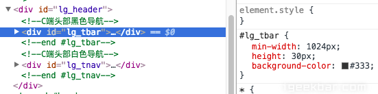

- 对应的样式
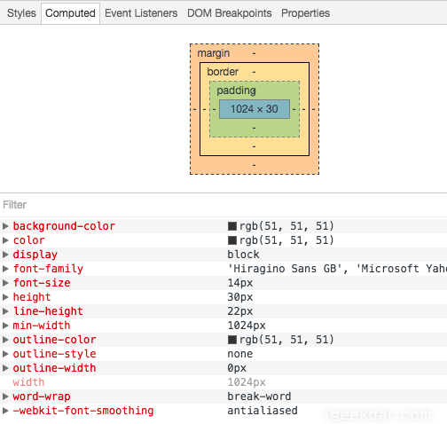

- 盒模型信息
同时，当我们浏览网站看到某些特别炫酷的效果和难做的样式时候，打开这个功能，我们即可看到别人是如何实现的，学会它这知识就是你的了，仔细钻研也会有意想不到的收获

**4.Console控制台**
用于打印和输出相关的命令信息，其实console控制台除了我们熟知的报错，打印console.log信息外，还有很多相关的功能，下面简单介绍几个：
1. 一些对页面数据的指令操作，比如打断点正好执行到获取的数据上，由于数据都是层层嵌套的对象，这个时候查看里面的key/value不是很方便，即可用这个指令开查看，obj的json string 格式的key/value，我们对于数据里面有哪些chrome字段和属性即可一目了然

2. 除了console.log还有其他相关的指令可用chromconsole也有相关的API
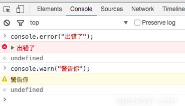

**5.Sources** 资源页面(html+css+js)
这个页面内我们可以找到当然浏览器页面中的js 源文件，方便我们查看和调试，在我还没有走出校园时候，我经常看一些大站的js代码，那时候其实基本都看不懂，但是最起码可以看看人家的代码风格，人家的命名方式，所有的代码都是压缩之后的代码，我们可以点击下面的{}大括号按钮将代码转成可读格式,，Sources Panel 的左侧分别是 Sources 和 Content scripts和Snippets

- 对应的源代码

- 格式化后的代码

关于打断点调试的内容，下面介绍，先来说一些，其他平时基本没人用但是很有用的小点，比如当我们想不起某个方法的具体使用时候，会打开控制台随意写一些测试代码，或者想测试一下刚刚写的方法是否会出现期待的样子，但是控制台一打回车本想换行但是却执行刚写的半截代码，所以推荐使用**Sources**下面的左侧的Sinppets代码片段按钮，这时候点击创建一个新的片段文件，写完测试代码后把鼠标放在新建文件上run，再结合控制台查看相关信息（**新建了一个名叫：app.js的片段代码，在你的项目环境页面内，该片段可执行项目内的方法**）

- 自己书写的片段
Content scripts 是 Chrome 的一种扩展程序，它是按照扩展的ID来组织的，这些文件也是嵌入在页面中的资源，这类文件可以读写和操作我们的资源，需要调试这些扩展文件，则可以在这个目录下打开相关文件调试，但是几乎我们的项目还没有相关的扩展文件，所以啥也看不到，平时也不需要关心这块。
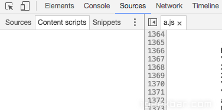

- Sinppets
在Sinppets中,我们也 可以编辑(重写)js代码片段。这些片段实际上就相当于你的js文件一样,不同的是本地的js文件在编辑器里面编辑的,而此处,你是在浏览器中编写的。这些代码片段在浏览器刷新的时候既不会消失,也不会执行,除非是你手动执行它。它可以存在你的本地浏览器中,即使关闭浏览器,再次打开时它依然还在那里。它的主要作用可以使得我们编写一些项目的测试代码时提供便捷,你知道,如果你在编辑器上编写这些代码,在发布时你必须为它们添加注释符号或者手动删除它们,而在浏览器上编写就不需要这样繁琐了。在Snippets选项的空白处右键后选择弹出的new选项,建立一个你自己的新的文件,然后在区域2之中编辑它。
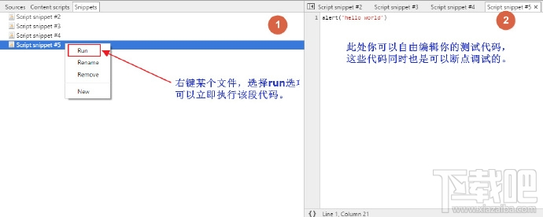

**6.Network** 网络请求标签页(**与前端交互调试，发送请求和接收数据的重点**)
可以看到所有的资源请求，包括网络请求，图片资源，html，css，js文件等请求，可以根据需求筛选请求项，一般多用于网络请求的查看和分析，分析后端接口是否正确传输，获取的数据是否准确，请求头，请求参数的查看

- 所有的资源
以上我选择了All，就会把该页面所有资源文件请求下来，如果只选择XHR 异步请求资源，则我们可以分析相关的请求信息
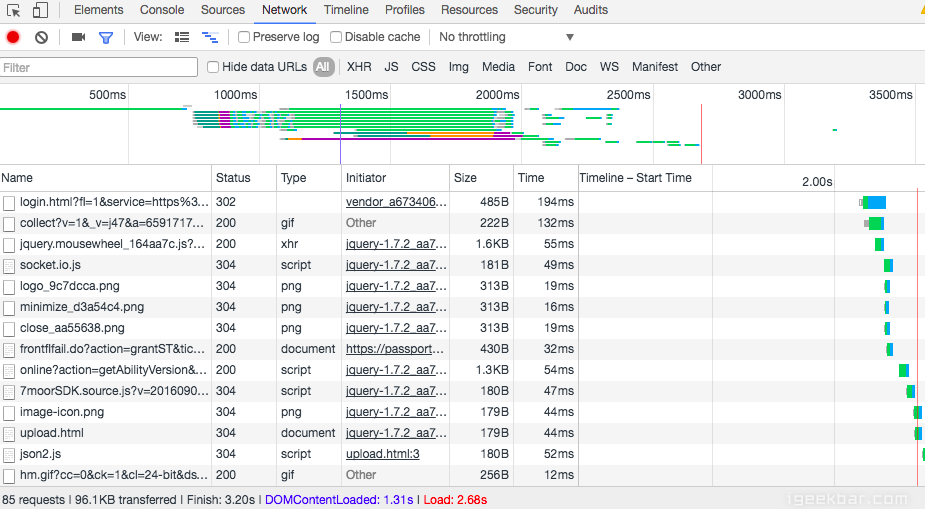

- 请求的相关信息
打开一个Ajax异步请求，可以看到它的请求头信息，是一个POST请求，参数有哪些，还可以预览它的返回的结果数据，这些数据的使用和查看有利于我们很好的和后端工程师们联调数据，也方便我们前端更直观的分析数据

- 预览请求的数据

- 查看资源HTTP的Response信息
在Response标签里面可根据选择的资源类型（JSON、图片、文本、JS、CSS）显示相应资源的Response响应内容。下图显示的是当选择的资源是CSS格式时的响应内容。
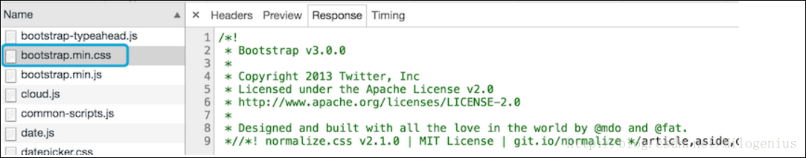

**7.Timeline**标签
可以显示JS执行时间、页面元素渲染时间，这个Timeline的标签页不是指网络请求的时间响应情况哦（这个在Network标签页里查看），这个Timeline指的JS执行时间、页面元素渲染时间，此处查看应该选项是JS，但是实际显示的效果和圈出来的效果是一样的。
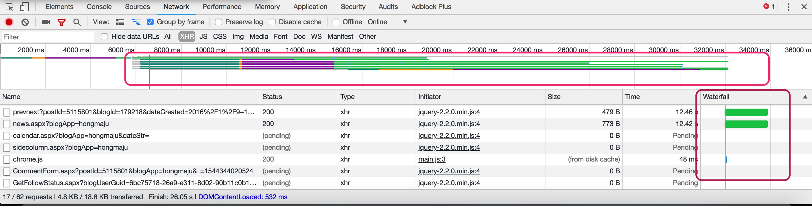

**8.Profiles**标签
可以**查看**CPU执行时间与内存占用，不做过多介绍

**9.Resources**标签
会列出所有的资源，以及HTML5的Database和LocalStore等，你可以对存储的内容编辑和删除，现在改名为Application了，集成的内容更多，也更详细，显示如下
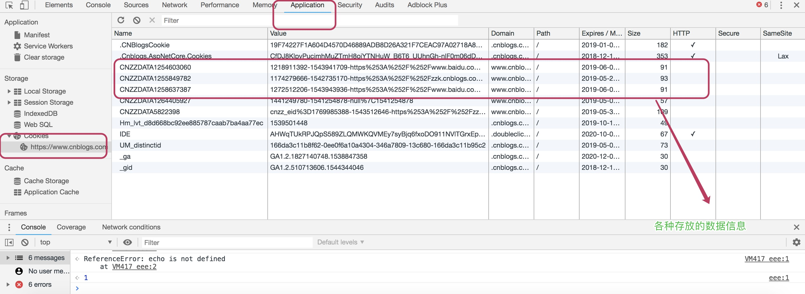

**10.Security**标签
可以告诉你这个网站的安全性，查看有效的证书等

**11.Audits**标签
可以帮你分析页面性能，有助于优化前端页面，分析后得到的报告
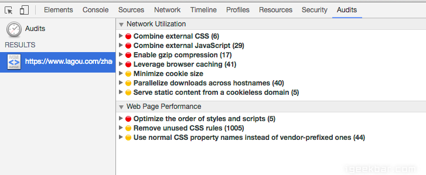

#### Sources资源页面的断点调试
**1.如何调试**：
调试js代码，肯定是我们常用的功能，那么如何打断点，找到要调试的文件，然后在内容源代码左侧的代码标记行处点击即可打上一个断点
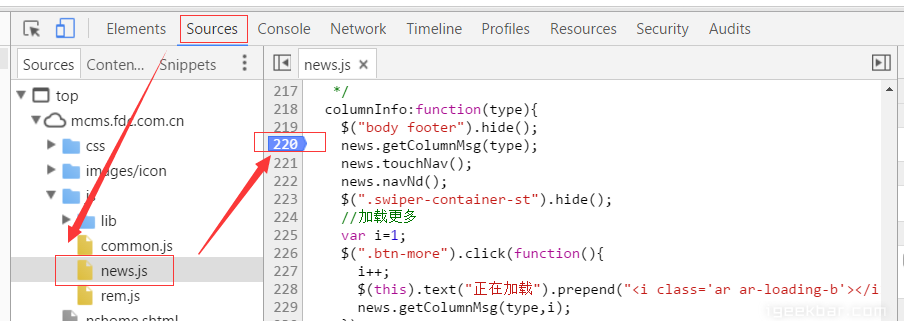

**2.断点与 js代码修改**
看下面这张图，我在一个名为toggleTab的方法下打了两个断点，当开始执行我们的点击切换tab行为后，代码会在执行的断点出停下来，并把相关的数据展示一部分，此时可以在已经执行过得代码处，把鼠标放上去，即可查看相关的具体数据信息，同时我们可以使用右侧的功能键进行调试，右侧最上面一排分别是：暂停/继续、单步执行(**F10快捷键**)、单步跳入此执行块(**F11快捷键**)、单步跳出此执行块、禁用/启用所有断点。下面是各种具体的功能区

- 在代码中打断点，临时修改
在当前的代码执行区域，在调试中如果发现需要修改的地方，也是可以立即修改的，修改后保存即可生效，这样就免去了再到代码中去书写，再刷新回看了
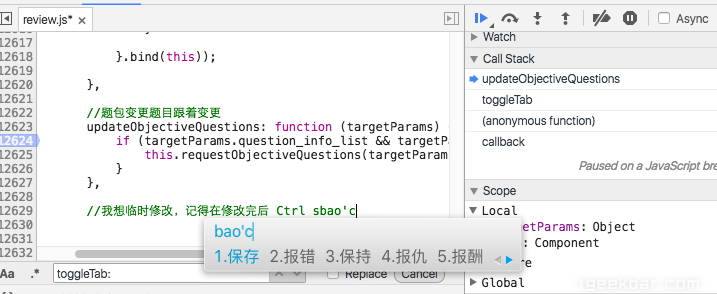

**3.快速进入调试的方法**
当我们的代码执行到某个程序块方法处，这个方法上可能你并没有设置相关的断点，此时你可以F11进入此程序块，但是往往我们的项目都是经过很多源代码封装好的方法，有时候进入后，会走很多底层的封装方法，需要很多步骤才能真正进入这个函数块，此时将鼠标放在此函数上，会出现相关提示，会告诉你在该文件的哪一行代码处，点击即可直接看到这个函数，然后临时打上断点，按F10或者点击右上角的第二个按钮即可直接进入此函数的断点处
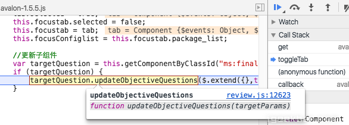

**4.调试的功能区域**
每一个功能区，都有它相关的左右，先来看一张图，它都有哪些功能

**5.Call Stack调用栈**：
当断点执行到某一程序块处停下来后，右侧调试区的 Call Stack 会显示当前断点所处的方法调用栈，从上到下由最新调用处依次往下排列，Call Stack 列表的下方是Scope Variables列表可以查看此时局部变量和全局变量的值。图中可以看出，我们最先走了toggleTab这个方法，然后走到了一个更新对象的方法上，当前调用在哪里，箭头会帮你指向哪里，同时我们可以点击，调用栈列表上的任意一处，即可回头再去看看代码
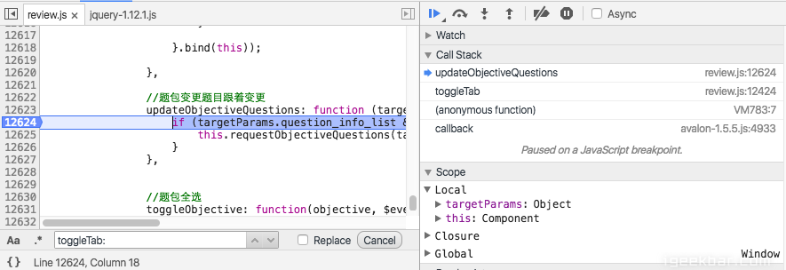

但是若你想从新从某个调用方法出执行，可以右键Restart Frame， 断点就会跳到此处开头重新执行，**Scope** 中的变量值也会依据代码从新更改，这样就可以回退来从新调试，错过的调试也可以回过头来反复查看
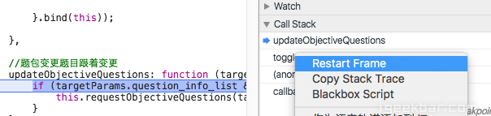

**6.Breakpoints**关于断点：所有当前js的断点都会展示在这个区域，你可以点击按钮用来“去掉/加上”此处断点，也可以点击下方的代码表达式，调到相应的程序代码处，来查看
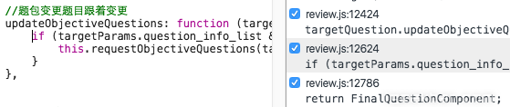

**7.XHR Breakpoints**
在XHR Breakpoints处，点击右侧的+号，可以添加请求的URL，一旦 XHR 调用触发时就会在 request.send() 的地方中断
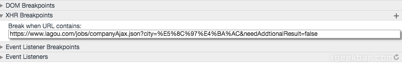

**8.DOM Breakpoints:**
可以给你的DOM元素设置断点，有时候真的需要监听和查看某个元素的变化情况，赋值情况，但是我们并是不太关心哪一段代码对它做的修改，只想看看它的变化情况，那么可以给它来个监听事件，这个时候DOM Breakpoints中会如图

当要给DOM添加断点的时候，会出现选择项分别是如下三种修改1.子节点修改2.自身属性修改3.自身节点被删除。选中之后，Sources Panel 中右侧的 DOM Breakpoints 列表中就会出现该 DOM 断点。一旦执行到要对该 DOM 做相应修改时，代码就会在那里停下来

**9.Event listener Breakpoints** 
最后Event Listener 列表，这里列出了各种可能的事件类型。勾选对应的事件类型，当触发了该类型的事件的 JavaScript 代码时就会自动中断

#### 详细调试的方法
#####  JavaScript脚本断点调试
1.打开开发者工具，按F12或者在浏览器页面上右键选择检查
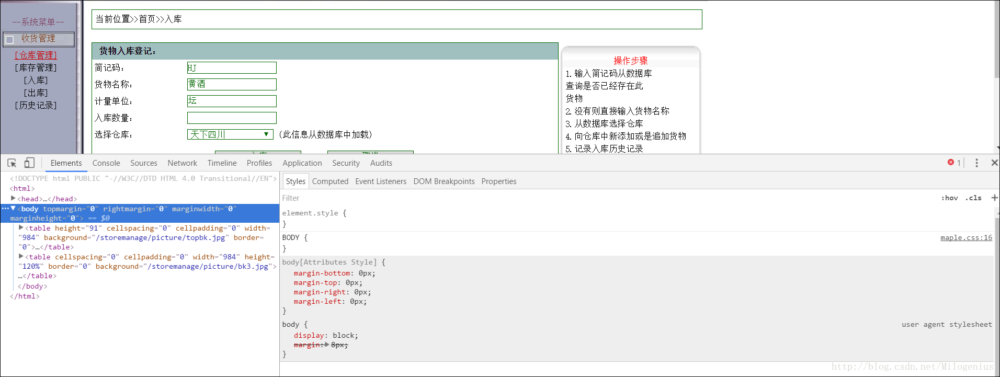

2.在Source面板中找到需要调试的文件
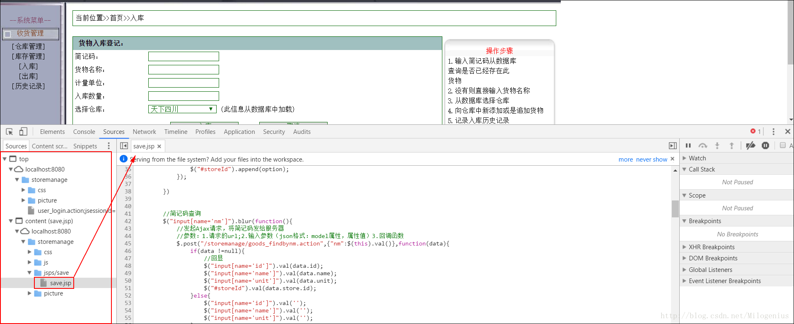

3.设置断点

4.触发调试部分程序的运行，开始调试

调试过程中常用的按钮及快捷键：

**跳到下一个断点**：点击Sources面板右侧的“三角按钮”，快捷键：F8  , Ctrl+\ 

**跳到下一步（逐步跨方法）**：点击Sources面板右侧的第二个按钮，快捷键：F10 ，Ctrl+’ 

**跳进断点处的方法中**：点击Sources面板右侧第三个按钮，快捷键：F11 ，Ctrl+; 

**跳出正在执行的方法**：点击Sources面板右侧第四个按钮，快捷键：Shift+F11 ，Ctrl+Shift+;

**禁用断点**：点击Sources面板右侧的第五个按钮

**暂停在捕获到的异常处**：点击Sources面板右侧的第六个按钮，然后勾选Pause On Caught Exception
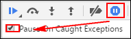

**暂停在未捕获的异常处**：点击Sources右侧的第六个按钮，不勾选Pause On Caught Exception

**Sources面板调试过程中快捷键预览**： 
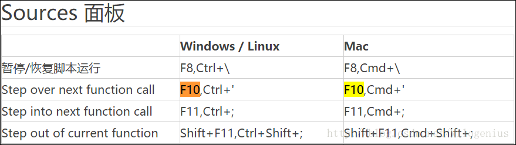

**查看断点处，获取的数据的值**： 
将鼠标光标停留在变量上面即可，也可以将变量赋值到Console的控制台上打印出来。

**清除断点**： 
在Source面板最右侧面板中，找到Breakpoints打开，可以看到你打的断点。在断点列表出右键选择Remove all breakpoints可以一次性删除所有断点。

##### XHR断点调试
右侧调试区有一个 XHR Breakpoints，点击+ 并输入 URL 包含的字符串即可监听该 URL 的 Ajax 请求，输入内容就相当于 URL 的过滤器。如果什么都不填，那么就监听所有 XHR 请求。一旦 XHR 调用触发时就会在 request.send() 的地方中断。XHR是Ajax异步请求。

##### 事件监听断点
事件监听是对我们选定的是事件类型进行监听，当这个事件触发的时候，程序就会在这个事件处停止。有助于我们快速找到某一个元素上绑定的事件。 
**应用场景**：我们刚接手一个项目时，对业务不熟。想找到提交登录事件对应的方法，但是发现页面上登录按钮绑定事件写的不是很明确，而且处理登录业务的JavaScript脚本文件有几百行，想找到这个按钮很不容易。此时，我们就可以选定鼠标的点击事件进行监听，当我们点击登录按钮的时候控制台Sources面板会自动将我们带到登录方法处。 
**事件监听断点使用步骤（以查找天猫首页登录方法为例）**：
1.首先打开京东登录页面找到登录按钮； 

2.在登录按钮上右键属性==》检查 打开开发者工具，然后打开Sources面板 
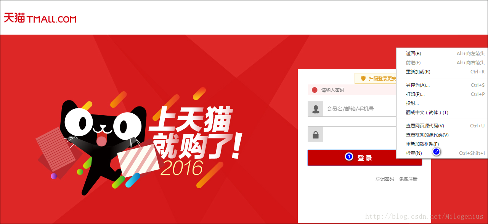

3.打开Sources面板右侧的Event Listener Breakpoints 找到Mouse及鼠标事件下边的click然后勾选上。
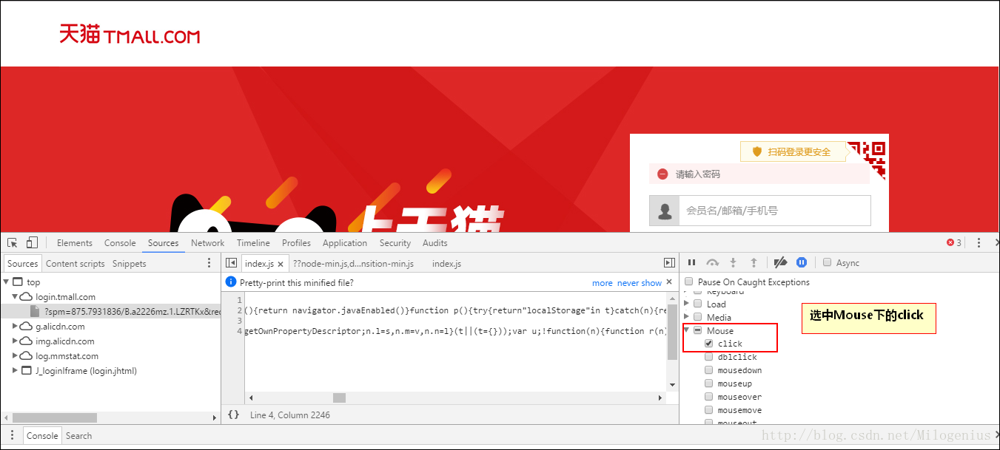

4.点击登录按钮，触发鼠标的点击事件，发现程序中断在JavaScript文件中，点击面板下方的 “{}” 将代码格式化一下，此时就找到了登录按钮触发的点击事件了。此时就可以一步一步的像下跟，知道跟到天猫的登录方法了。
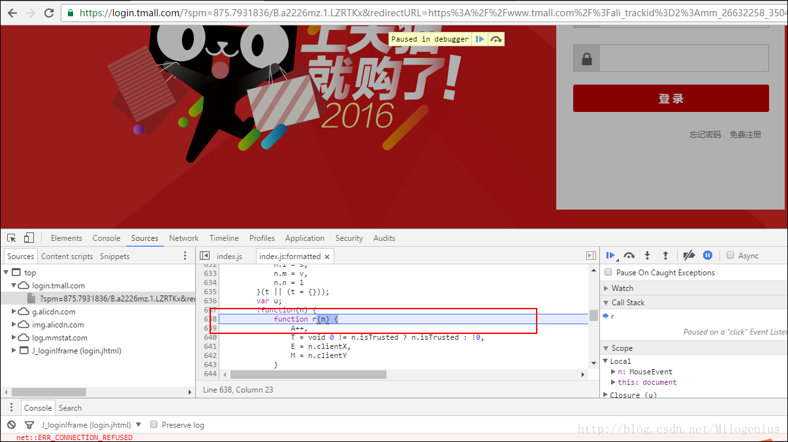

##### 其他设置
1.**清除浏览器缓存的方法**：
浏览器缓存（Browser Caching）是为了节约网络的资源加速浏览，浏览器在用户磁盘上对最近请求过的文档进行存储，当访问者再次请求这个页面时，浏览器就可以从本地磁盘显示文档，这样就可以加速页面的阅览。但是，对开发人员来说，我们修改了JavaScript脚本之后需要立即看到修改的效果，所以需要清除缓存，清除缓存常用的方法有：
- Ctrl + F5
F5通常只是刷新本地缓存；Ctrl+F5可以把INTERNET临时文件夹的文件删除再重新从服务器下载，也就是彻底刷新页面了。

- 开发者工具打开之后，快速清除缓存的方法
开发者工具打开之后，浏览器刷新图标上右键会出现清空缓存并硬性重新加载。这一方法能够在开发者工具打开时快速清理缓存。
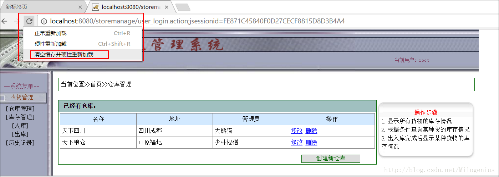

- Ctrl + Shift + Del 快捷键清除缓存
选中地址栏中的URL，按快捷键：Ctrl + Shit + Del 会弹出一个清除浏览数据的弹窗，选择要清理的数据项之后，点击清除浏览数据即可。

2.**禁用页面的JavaScript脚本** 
应用场景：在开发互联网电商项目时，需要一些商品图片，于是就去京东找到一个商品打开商品图片之后，想复制或者将这个图片另存为，此时，发现右键后什么都没有。 

原因是，京东在图片上通过JavaScript脚本禁用了鼠标右键点击事件。此时，我们可以通过禁用当前页面的JavaScript事件，通过鼠标右键保存图片。

3.**禁用网页JavaScript事件的方法**
- 开发者工具==》Settings
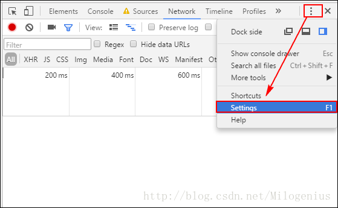

- 勾选Debugger下的Disable JavaScript 复选框。

ref:
1.[超完整的 Chrome 浏览器客户端调试大全](http://web.jobbole.com/89344/),   2.[Chrome格式化JavaScript](https://www.cnblogs.com/chucklu/p/9101066.html),   3.[前端开发神一样的工具chrome调试技巧](https://blog.csdn.net/nanjingshida/article/details/72775687),   4.[谷歌浏览器怎么调试js](https://www.cnblogs.com/hongmaju/p/5115801.html),  5. [Google Chrome 调试JS简单教程(更新)](https://www.cnblogs.com/mq0036/p/3850035.html),   6.[谷歌Chrome浏览器开发者工具教程—JS调试篇](https://blog.csdn.net/cyyax/article/details/51242720),   7.[Chrome（谷歌）浏览器调试教程珍藏版](https://blog.csdn.net/milogenius/article/details/78897745),   8.[聊聊 Chrome DevTools 中你可能不知道的调试技巧](http://web.jobbole.com/95089/),   9.[Chrome 调试技巧](http://web.jobbole.com/95178/),   10.[chrome调试技巧--持续更新](https://www.cnblogs.com/freeyiyi1993/p/3620670.html)