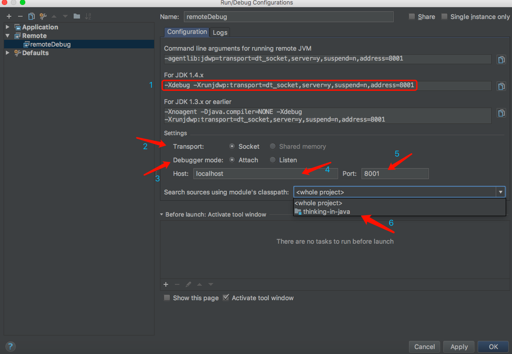
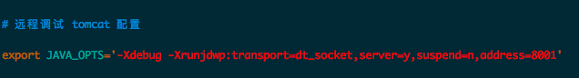

### IDEA远程调试
***

在调试代码的过程中，为了更好的定位及解决问题，有时候需要我们使用远程调试的方法。在本文中，记录了如何利用 IntelliJ IDEA 进行远程 Tomcat 的调试。

首先，配置remote：

如上图所示，点击Edit Configurations，进入如下界面：

如上图所示，我们进入了Run/Debug Configurations界面，然后点击左上角的+，选择Remote：

- 标注 1：运行远程 JVM 的命令行参数；
- 标注 2：传输方式，默认为`Socket`；
- 标注 3：调试模式，默认为`Attach`；
- 标注 4：服务器 IP 地址，默认为`localhost`，**需要修改为目标服务器的真实 IP 地址**；
- 标注 5：服务器端口号，默认为`5005`，**需要修改为目标服务器的真实端口号**；
- 标注 6：搜索资源是使用的环境变量，默认为\<whole project>，即整个项目。

如上图所示，其中 标注 2 和 标注 3 又分别有两种分类，对于 标注 2，

- 标注 2：传输方式，默认为**Socket**； 
  `Socket`：macOS 及 Linux 系统使用此种传输方式；
  `Shared memory`： Windows 系统使用此种传输方式。
  对于 标注 3，

- 标注 3：调试模式，默认为Attach； 
  `Attach`：此种模式下，调试服务端（被调试远程运行的机器）启动一个端口等待我们（调试客户端）去连接；
  `Listen`： 此种模式下，是我们（调试客户端）去监听一个端口，当调试服务端准备好了，就会进行连接。

然后，复制 标注 1，即 IntelliJ IDEA 自动生产的命令行参数，然后导入到 Tomcat 的配置文件中。以 Linux 系统为例，导入语句为：
`export JAVA_OPTS='-Xdebug -Xrunjdwp:transport=dt_socket,server=y,suspend=n,address=8001'`
如果是 Windows 系统，则导入语句为：
`set JAVA_OPTS=-Xdebug -Xrunjdwp:transport=dt_socket,server=y,suspend=n,address=8001`
两者的区别在于导入语句的关键字不同以及有无引号，Linux 系统的导入关键字为export，Windows 为set；Linux 的导入值需要用单引号**' '**括起来，而 Windows 则不用。

接下来，修改 Tomcat 的 bin 目录下的catalina.sh文件（如果是 Windows 系统则修改catalina.bat文件），将上述的导入语句添加到此文件中即可：

在这里，我们假设服务器的 IP 地址为`10.11.12.39`，端口号为`16203`，设置完成后，进入`Debug`模式，如果连接成功，则会出现如下提示：

至此，IntelliJ IDEA 远程调试 Tomcat 的配置已经完成了，调试的后续步骤按正常的调试技巧进行就可以啦！

ref:
1.[详述 IntelliJ IDEA 远程调试 Tomcat 的方法](https://blog.csdn.net/qq_35246620/article/details/78507324) ,   2.[Intellij IDEA 配置Tomcat远程调试](https://blog.csdn.net/mingjie1212/article/details/52281847),   3.[IDEA远程调试Tomcat](https://www.jianshu.com/p/f902ac5d29e4)