###Jenkins和其使用
***

####  Jenkins是什么

##### Jenkins简介
Jenkins是一个可扩展的持续集成引擎。主要作用：
- 持续、自动地构建/测试软件项目。
- 监控一些定时执行的任务。

##### Jenkins特性
- 易于安装-只要把jenkins.war部署到servlet容器，不需要数据库支持。
- 易于配置-所有配置都是通过其提供的web界面实现。
- 集成RSS/E-mail通过RSS发布构建结果或当构建完成时通过e-mail通知。
- 生成JUnit/TestNG测试报告。
- 分布式构建支持Jenkins能够让多台计算机一起构建/测试。
- 文件识别:Jenkins能够跟踪哪次构建生成哪些jar，哪次构建使用哪个版本的jar等。
- 插件支持:支持扩展插件，你可以开发适合自己团队使用的工具。

##### Jenkins的由来
目前持续集成(CI)已成为当前许多软件开发团队在整个软件开发生命周期内侧重于保证代码质量的常见做法。它是一种实践，旨在缓和和稳固软件的构建过程。并且能够帮助您的开发团队应对如下挑战：
- 软件构建自动化 ：配置完成后，CI系统会依照预先制定的时间表，或者针对某一特定事件，对目标软件进行构建。
- 构建可持续的自动化检查 ：CI系统能持续地获取新增或修改后签入的源代码，也就是说，当软件开发团队需要周期性的检查新增或修改后的代码时，CI系统会不断确认这些新代码是否破坏了原有软件的成功构建。这减少了开发者们在检查彼此相互依存的代码中变化情况需要花费的时间和精力(说直接一点也是钱啊，呵呵)。
- 构建可持续的自动化测试 ：构建检查的扩展部分，构建后执行预先制定的一套测试规则，完成后触发通知(Email,RSS等等)给相关的当事人。
- 生成后后续过程的自动化 :当自动化检查和测试成功完成，软件构建的周期中可能也需要一些额外的任务，诸如生成文档、打包软件、部署构件到一个运行环境或者软件仓库。这样，构件才能更迅速地提供给用户使用。

**部署一个CI系统需要的最低要求是，一个可获取的源代码的仓库，一个包含构建脚本的项目**。下图概括了CI系统的基本结构：

该系统的各个组成部分是按如下顺序来发挥作用的：
1. 开发者检入代码到源代码仓库。
2. CI系统会为每一个项目创建了一个单独的工作区。当预设或请求一次新的构建时，它将把源代码仓库的源码存放到对应的工作区。
3. CI系统会在对应的工作区内执行构建过程。
4. (配置如果存在)构建完成后，CI系统会在一个新的构件中执行定义的一套测试。完成后触发通知(Email,RSS等等)给相关的当事人。
5. (配置如果存在)如果构建成功，这个构件会被打包并转移到一个部署目标(如应用服务器)或存储为软件仓库中的一个新版本。软件仓库可以是CI系统的一部分，也可以是一个外部的仓库，诸如一个文件服务器或者像Java.net、 SourceForge之类的网站。
6. CI系统通常会根据请求发起相应的操作，诸如即时构建、生成报告，或者检索一些构建好的构件。

Jenkins就是这么一个CI系统。之前叫做Hudson。以下是使用Jenkins的一些理由：
- 是所有CI产品中在安装和配置上最简单的。
- 基于Web访问，用户界面非常友好、直观和灵活，在许多情况下，还提供了AJAX的即时反馈。
- Jenkins是基于Java开发的(如果你是一个Java开发人员，这是非常有用的)，但它不仅限于构建基于Java的软件。
- Jenkins拥有大量的插件。这些插件极大的扩展了Jenkins的功能；它们都是开源的，而且它们可以直接通过web界面来进行安装与管理。

#### Jenkins的目标
Jenkins的主要目标是监控软件开发流程，快速显示问题。所以能保证开发人员以及相关人员省时省力提高开发效率。
CI系统在整个开发过程中的主要作用是控制：当系统在代码存储库中探测到修改时，它将运行构建的任务委托给构建过程本身。如果构建失败了，那么CI系统将通知相关人员，然后继续监视存储库。它的角色看起来是被动的；但它确能快速反映问题。
特别是它具有以下优点：
- Jenkins一切配置都可以在web界面上完成。有些配置如MAVEN_HOME和Email，只需要配置一次，所有的项目就都能用。当然也可以通过修改XML进行配置。
- 支持Maven的模块(Module)，Jenkins对Maven做了优化，因此它能自动识别Module，每个Module可以配置成一个job。相当灵活。
- 测试报告聚合，所有模块的测试报告都被聚合在一起，结果一目了然，使用其他CI，这几乎是件不可能完成的任务。
- 构件指纹(artifact fingerprint)，每次build的结果构件都被很好的自动管理，无需任何配置就可以方便的浏览下载。

#### Jenkins的主要特点
**容易安装**，只需要执行Java -jar jenkins.war， 或者直接部署到一个servlet container中，例如tomcat。不需要安装，不需要数据库的支持。
**容易配置**，jenkins可以完全地通过友好的web GUI来配置，且配置页面支持配置项的错误检查和很好的在线帮助。不需要手动地编辑xml的配置文件，但是jenkins也支持手动修改xml配置文件。
**项目源码修改的检测**，jenkins能够从项目的Subversion/CVS生成最近修改的集合列表，且改方式非常有效，不会增加Subversion/CVS Repository的负载。
**可读的永久的链接生成**，jenkins对于大部分pages都生成清楚的可读的永久的链接，例如''latest build"/"latest successful build",因此可以容易地在其他的地方引用jenkins的生成的pages。
**RSS/EMail/IM集成**，可以通过RSS，EMail或IM来实时地监视build的失败。
**Build完成后仍然可以tag**，支持在build完成后tag或重tag。
**Junit/TestNG 测试报告**，能够很好地显示各种测试的报告，且可以生成失败的趋向图。
**分布式build**，jenkins能够分发build/test的负载到多台机器，能够更好地利用硬件资源，提高build的时间。
**文件标识**，jenkins可以标识build产生的文件，例如jars。
**插件支持**，jenkins可以通过第三方的插件来扩展。
**跨平台**，支持几乎所有的平台，例如Windows,Ubuntu/Debian,Red Hat/Fedora/CentOS,Mac OS X,openSUSE,FreeBSD,OpenBSD,Solaris/OpenIndiana.Gentoo。

### 安装Jenkins
在最简单的情况下，Jenkins 只需要两个步骤：
1. 下载最新的版本(一个 WAR 文件)。Jenkins官方网址: [http://Jenkins-ci.org/](http://jenkins-ci.org/)
2. 命运行运行 `java -jar jenkins.war` (默认情况下端口是8080，如果要使用其他端口启动，可以通过命令行`java –jar Jenkins.war --httpPort=80`的方式修改）
注意：Jenkins 需要运行 Java 5以及以上的版本。
还有一种安装方式就是将下载的war包文件部署到 servlet 容器，然后启动容器，在浏览器的URL地址栏中输入类似[http://localhost:8080/jenkins/](http://localhost:8088/hudson/)这样的地址即可。下图是安装成功后的界面（使用的是Linux+Tomcat6+Java6环境）：

#### Jenkins配置
在配置前的一些话：Jenkins的配置不可能全部都说到的，大部分配置是有英文说明的，点击输入框后面的问号就可以看见了。英文不会用翻译工具，多测试几次就懂了。

##### 系统管理
在已运行的Jenkins主页中，点击左侧的系统管理进入如下界面：
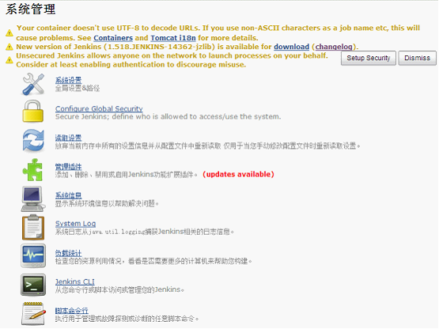

###### 提示信息
ps:版本不同提示的消息有可能不同

###### UTF-8编码
Your container doesn't use UTF-8 to decode URLs. If you use non-ASCII characters as a job name etc, this will cause problems. See [Containers](http://wiki.jenkins-ci.org/display/JENKINS/Containers) and [Tomcat i18n](http://wiki.jenkins-ci.org/display/JENKINS/Tomcat#Tomcat-i18n) for more details.
Jenkins建议在tomcat中使用utf-8编码，配置tomcat下conf目录的server.xml文件

ps：如果Job的控制台中文输出乱码，请将URIEncoding=”utf-8”更改为useBodyEncodingForURI="true"

###### 新的版本
New version of Jenkins (1.518.JENKINS-14362-jzlib) is available for download (changelog).
提示有新的版本可以下载了,喜欢更新的点击download去下载吧！

###### 安全设置
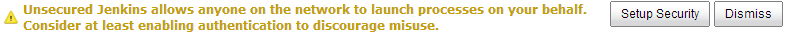
Jenkins允许网络上的任何人代表您启动进程。考虑至少启用身份验证来阻止滥用。点击Dismiss忽略该消息,点击Setup Security进入设置界面.详细设置请参考 Configure Global Security(安全设置) 章节

##### 系统设置
在已运行的Jenkins主页中，点击左侧的系统管理—>系统设置进入如下界面：

ps：jenkins的根目录，默认地在C:\Documents and Settings\AAA\.hudson。

##### JDK、Maven、Ant配置(图为Windows环境)
配置一个JDK、Ant、Maven实例，请在每一节下面单击Add(新增) 按钮，这里将添加实例的名称和绝对地址。下图描述了这两个部分。
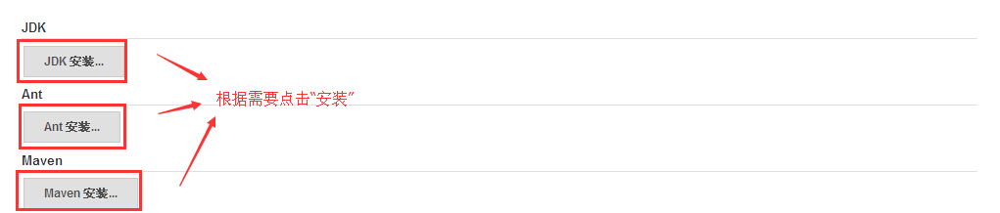
点击“安装”，添加相应的设置，如下图：

JDK别名：给你看的，随便你自己
JAVA_HOME：这个是本机JDK的安装路径（错误的路径会有红字提示你的）
注：Ant, Maven的配置是一样的(JDK去oracle官网下载，Ant与Maven去apache官网下载),**自动安装不推荐这个选项**
Ps：每个文本框后面都有个问号，点击问号就会出现帮助信息

##### 邮件通知配置(默认)
###### 配置发件人地址
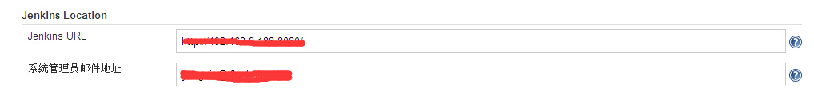系统管理员邮件地址（System Admin e-mail address）：Jenkins邮件发送地址，切记，必须设置。

###### 配置邮件通知
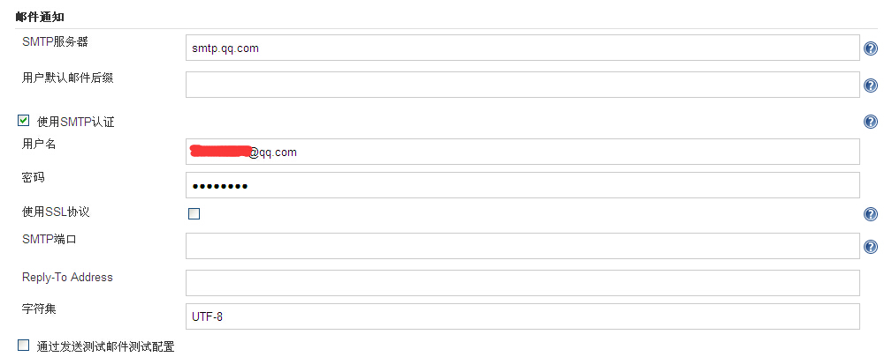
设置：SMTP服务器，勾选"使用SMTP认证"，输入用户名与密码
ps：小技巧：用户默认邮件后缀配置了后，以后你填写邮件地址只需要@之前的就行了

##### Subversion配置
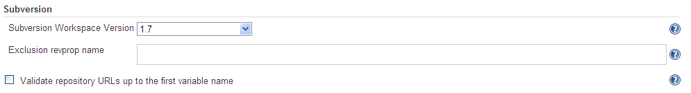
Subversion Workspace Version：Subversion 的版本号，选择你对应的版本号就行了

##### Configure Global Security(安全设置)
在已运行的Jenkins主页中，点击左侧的系统管理—>Configure Global Security进入如下界面：
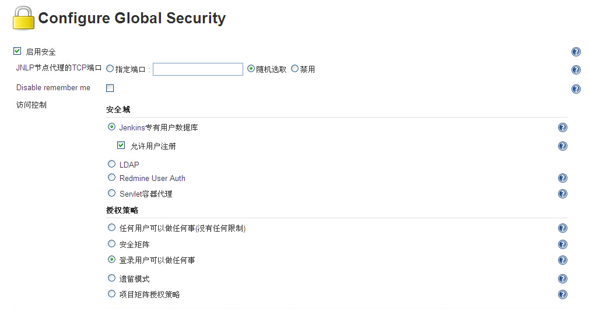
设置如上图，保存后系统管理中就出现管理用户的选项。页面右上角也会出现登录/注册的选项。
此设置：只有登录用户可以做任何事

##### 管理用户设置
在右上角点击注册
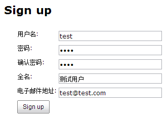
点击sign up按钮，提示你现在已经登录.返回首页.
登录后和匿名账号看到的首页有几点不同，如下图红框所示：

##### 管理插件设置
建议先阅读[Jenkins插件](http://www.cnblogs.com/zz0412/p/jenkins02.html#_Jenkins%E6%8F%92%E4%BB%B6)章节，在回来安装如下所示的插件。
需求：这个插件将生成的构件（war或者ear）部署到主流的服务器上。
插件名称：[Deploy Plugin](https://wiki.jenkins-ci.org/display/JENKINS/Deploy+Plugin)
插件介绍：This plugin takes a war/ear file and deploys that to a running remote application server at the end of a build

#### 项目构建设置
##### 构建自由风格的Job
###### 新建自由风格构建任务
在已运行的Jenkins主页中，点击左侧的新建Job进入如下界面：

这时，需要为新的构建任务指定一个名称。（这里输入的任务名称为：Ant_test）这里有几种的任务类型可供选择，鉴于初步介绍，先选择构建一个自由风格的软件项目。对于其他的类型,经常使用的是拷贝已存在任务;这主要为了能在现有的任务基础上新建任务。点击OK按钮.
**需要注意的是**：
1.Job名称千万不要用中文名称（不作死就不会死）。
2.创建Job名称时最好有个规划，因为我们最后会通过正则匹配自动将Job归类，比如我喜欢 “项目前缀_一些说明-Job类型”这种方式。

##### 构建任务配置
###### 源码管理配置 
演示是使用Subversion的链接，在Repository URL中输入你的项目链接，如果没有权限则会提示如下图：
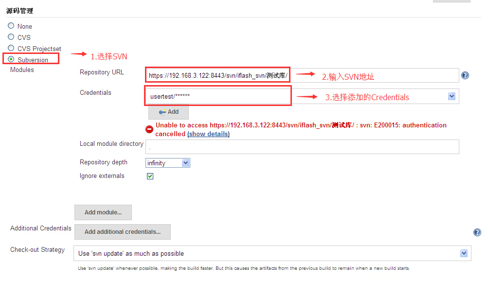
设置成功后，就直接从SVN此目录获取文件到本地。Ps:要先添加Credentials。添加的方法如下操作：
点击Jenkins首页左侧Credentials，进入页面
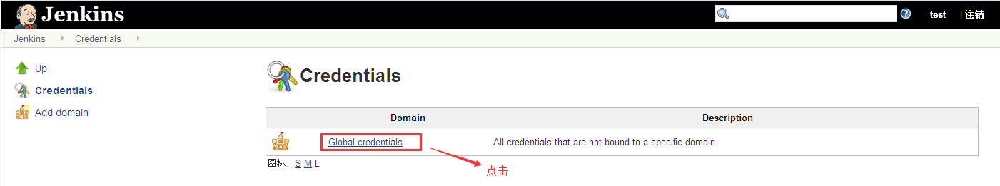
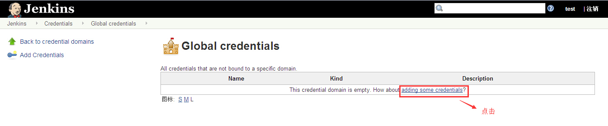
下一步：一般都是使用的用户名和密码登陆的

Ps：svn的用户名和密码设置了是没有办法在web界面修改的。如果要修改则先去Jenkins目录删除hudson.scm.SubversionSCM.xml文件

ref:
1.[Jenkins学习一：Jenkins是什么？](https://www.cnblogs.com/yangxia-test/p/4354213.html),   2.[Jenkins学习二：Jenkins安装与配置](https://www.cnblogs.com/yangxia-test/p/4354328.html)

