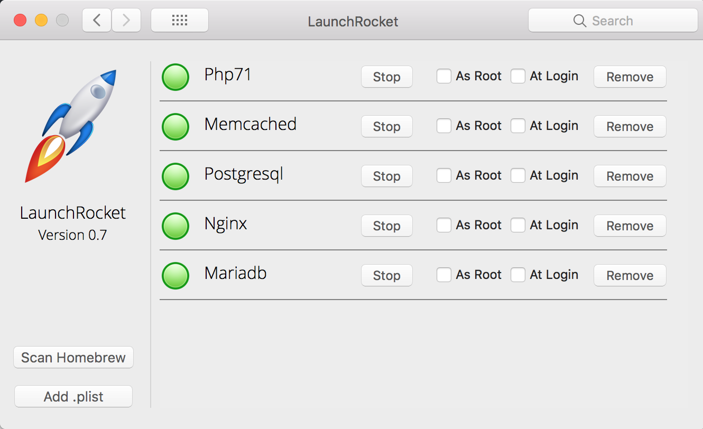

### macOs服务的启动和停止
***

##### 使用brew的命令
主要是针对通过brew安装的软件提供的服务, 如果不是使用brew安装的软件, 则无效, 启动服务主要是通过 `brew services`命令来实现, 常用的如下:

常用的服务启动:
```shell
启动Redis: brew services start redis
启动Mongdb: brew services start mongdb
启动RabbitMq: brew services start rabbitmq
启动Mariadb: brew services start mariadb
停止Redis: brew services stop redis
停止Mariadb: brew services stop mariadb
```


##### 使用LaunchRocket来管理brew安装的服务

安装
```shell
brew cask install launchrocket
```

启动
系统设置(System Preferences) - LaunchRocket

第一次启动，点一下左边这个Scan Homebrew,它会自动检测你现在系统里通过brew安装的一些服务。



***
ref:
1.[macOS下安装LaunchRocket管理brew安装的系统自启动服务](),   2.[Homebrew下安装的软件自启动服务管理工具：Launchrocket](https://www.cnblogs.com/EasonJim/p/7176590.html)

