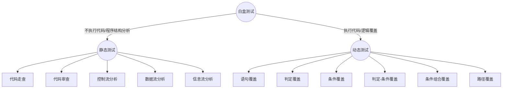

### MarkDown语法小总结
- - -
##### 目录
- 使用"[TOC]"或者"[TOC "float:left"]"来表示，如下</br>
[TOC "float:left"]

- - -
##### 标题
- **一级标题**：使用"#"来表示,如下<br>
  # 一级标题
- **二级标题**：使用"##"来表示,如下<br>
  ## 二级标题
- **三级标题**：使用"###"来表示,如下<br>
  ### 三级标题
- **四级标题**：使用"####"来表示,如下<br>
  #### 四级标题
- **五级标题**：使用"#####"来表示,如下<br>
  ##### 五级标题
- **六级标题**：使用"######"来表示,如下<br>
  ####### 六级标题

- - -
##### 文字
- **斜体**：使用"\*"将所需要的文字包围即可，如下</br> *MarkDown语法小总结*
- **黑体**：使用"\*\*"将所需要的文字包围即可，如下</br> **MarkDown语法小总结**
- **下划线**：使用"\+\+"将所需要的文字包围即可，如下</br> ++MarkDown语法小总结++(部分编辑器支持)
- **高亮**：使用"\=\="将所需要的文字包围即可，如下</br> ==MarkDown语法小总结==(部分编辑器支持)
- **下标**：使用"\~"将所需要的文字包围即可，如下</br> Test~MarkDown语法小总结~
- **上标**：使用"\^"将所需要的文字包围即可，如下</br> Test^MarkDown语法小总结^
- **删除线**：使用"\~\~"将所需要的文字包围即可，如下</br> ~~MarkDown语法小总结~~

- - -
##### 列表
- **无序列表**：使用"\- "在列表名前面，注意有一个空格，包括此层级，形成多层级无须列表，每一级别比上一层空两格，示例如下</br>
   - 第二层
    - 第三层
      - 第四层
- **有序列表**：使用"1. ,2. 等数字表示，后面的空格不能缺少"，如下</br>
   1. 第一层
     1. 第一层第一个
     2. 第一层第二个
       1. 第二层第一个
- ** 任务列表**：使用"- [ ] "的形式，在列表名的前面[ ] 后的空格最好保留，完成可在其中填"x",如下</br>
  - [ ] 任务1
    - [ ] 任务1.1
      - [ ] 任务1.1.1
      - [x] 任务1.1.2
  - [ ] 任务2

- - -
##### 表格
- 表格使用如下的语法来表示，如下</br>
  |  列名1  |  列名2 |   列名3 |
  |--------|--------|--------|
  |   1    |     2  |   3    |

  |  剧名  |  口白 |   人物 |   时间  |
  |--------|--------|--------|------|
  |   轰动武林    |     黄文择  |   意琦行   | 2013.01|
  |   轰定干戈    |     黄文择  |   鷇音子   | 2013.06|
  |   轰掣天下    |     黄文择  |   倦收天   | 2013.11|
  |  轰霆剑海录    |     黄文择  |   阎王   | 2014.03|
  |   创神篇    |     黄文择  |   商清逸   | 2014.08|
  |   创神篇下阙    |     黄文择  |   素还真   | 2015.01|

- - -
#####链接
- **图片**：使用"*\!\[title](url)*"的形式来表示，如下</br>

- **链接**：使用"*\[title](url)*"的形式来表示，如下</br>
[我的GitHub](https://github.com/prayjourney)
- **引用**：使用"*\[^id]*"与"*\[^id]:text*"的形式来表示，分别在文中和文尾使用，如下</br>
<center>
将进酒
唐代：李白[^1]
君不见，黄河之水天上来，奔流到海不复回。
君不见，高堂明镜悲白发，朝如青丝暮成雪。
人生得意须尽欢，莫使金樽空对月。
天生我材必有用，千金散尽还复来。
烹羊宰牛且为乐，会须一饮三百杯。
岑夫子，丹丘生，将进酒，杯莫停。
与君歌一曲，请君为我倾耳听。
钟鼓馔玉不足贵，但愿长醉不复醒。
古来圣贤皆寂寞，惟有饮者留其名。
陈王昔时宴平乐，斗酒十千恣欢谑。
主人何为言少钱，径须沽取对君酌。
五花马，千金裘，呼儿将出换美酒，与尔同销万古愁[^2]。
</center>
- **行内引用**：使用">"来表示，如下</br>
> 李白，701年－762年，字太白，号青莲居士，又号“谪仙人”，是唐代伟大的浪漫主义诗人，被后人誉为“诗仙”，与杜甫并称为“李杜”，为了与另两位诗人李商隐与杜牧即“小李杜”，区别，杜甫与李白又合称“大李杜”[3]。其人爽朗大方，爱饮酒作诗，喜交友。

- - -
#####代码
- 行内代码：使用\`code\`来表示，如下</br> `print("hello python!")`
- 块代码：使用\`\`\`(lan) code \`\`\`来表示，如下</br>
```python
       def aboutdict():
           a={"name":"zhangsan","age":24}
           b={"f1":"apple","f2":"orange"}
           c={"cityname":"hangzhou","area":"3600km^2"}
           adict={"people":a,"fruit":b,"city":c}
           print(adict)

       for x in adict.keys():
           print("the big key is: "+x)
           for y,z in adict[x].items():
               print("the key is: "+str(y)+", the value is: "+str(z)+"\t", end="")

       if __name__=="__main__":
           aboutdict()
```

- - -
#####公式
- 行内公式：使用\$\$\$ inline math\$\$\$来表示，</br> $$$ a=\sqrt{b^2+c-200} $$$
- 块公式：使用\$\$ inline math\$\$来表示，如下</br>
  $$x=\frac{-b\pm\sqrt{b^2-4ac}}{2a}$$

- - -
#####分隔符
- **句子分隔符**：使用"\_\_\_"来表示，如下</br>
  _ _ _
- **段落分隔符**：使用"\-\-\-"来表示，如下</br>
  - - -
- **页面分隔符**：使用"\*\*\*"来表示，如下</br>
  * * *

- - -
#####图表
目前Markdown对于图表的支持还不够完善，只能画一些比较简单的图，主要是通过js的内部调用来实现的，当前比较好的有mermaid图库[^3]与flowchart图库[^4]，示例如下</br>


++此部分暂时不全面，后续补充++.

- - -
##### 注意点
1. Markdown语法之中都是有空一格的，比如"### 我是标题"，此处的"###"和"我是标题"之间有一个" "(空格)
2. **居中**：可以使用html语法来让文字居中，例如<center>sss</center>，就可以让文字在居中，在标题之中也可以让 标题居中显示。
3. 设置**文字颜色**：文字的颜色设置也是使用html语法来设置的，例如要将文字设置成红色，可以使用如下的方式，<font color="red">Markdown语法小总结</font>，就将文字颜色设置成了红色。
4. **换行**的设置：使用html语法来设置，可以使用**< /br>**(此处的空格不要)，如</br>我是使用了< /br>的效果
5. **转义字符**：在Markdown语法之中有一些是固定的语法标识符，如果直接使用就会显示为该标识符的功能，此时就需要使用转义字符，其为"**\\**"，例如，我需要一个反斜杠，则使用两个反斜杠表示"\\"，我需要一个星号，则使用"\*"来表示。
6. **空格**：半方大的空白"& ensp;"全方大的空白"& emsp;"不断行的空白格"& nbsp;"都可以表示为空格，这其实也是HTML之中的实体键，可以在md之中直接使用，通常的空格可以直接用"& nbsp;"表示，此处的空格是为了显示方便才添加的，实践之中不需要，另外不能忽略了最后面的英文";"。

######ref:
1.[Markdown 语法说明](http://www.appinn.com/markdown/)
2.[flowchart](https://github.com/adrai/flowchart.js)
3.[mermaid](https://github.com/knsv/mermaid)
4.[Markdown中插入数学公式的法](http://blog.csdn.net/xiahouzuoxin/article/details/26478179)
5.[markdown流程图语法](http://blog.csdn.net/aizhaoyu/article/details/44350821)
6.[为什么我的markdown里无法直接画出流程图？](https://segmentfault.com/q/1010000010637970)
7.[markdown绘图插件----mermaid简介](http://blog.csdn.net/wangyaninglm/article/details/52887045)

8.[Markdown笔记：如何画流程图](https://segmentfault.com/a/1190000006247465),   9.[用Markdown画序列图和流程图](https://blog.csdn.net/ely2007/article/details/53056782),   10.[Markdown里面的流程图](https://blog.csdn.net/Subson/article/details/75126945),   11.[Markdown 语法手册 （完整整理版）](https://blog.csdn.net/witnessai1/article/details/52551362),   12.[Markdown里面的序列图](https://blog.csdn.net/subson/article/details/78032857),   13.[Markdown里面使用mermaid画流程图（基础）](https://blog.csdn.net/Subson/article/details/78054689)


[^1]: 李白，701年－762年，字太白，号青莲居士，又号“谪仙人”，是唐代伟大的浪漫主义诗人，被后人誉为“诗仙”，与杜甫并称为“李杜”，为了与另两位诗人李商隐与杜牧即“小李杜”，区别，杜甫与李白又合称“大李杜”[3]。其人爽朗大方，爱饮酒作诗，喜交友。
[^2]: 尔同你。
[^3]: https://github.com/knsv/mermaid
[^4]: https://github.com/adrai/flowchart.js
