### Wireshark 与 Fiddler
***
### Wireshark

##### Wireshark介绍

[wireshark](http://www.wireshark.org/)是非常流行的网络封包分析软件，功能十分强大。可以截取各种网络封包，显示网络封包的详细信息。使用wireshark前必须了解网络协议[^1]，**为了安全考虑，wireshark只能查看封包，而不能修改封包的内容，或者发送封包**。

##### Wireshark的用途
  1. 网络管理员会使用wireshark来**检查网络问题**
  2. 软件测试工程师使用wireshark抓包，**来分析自己测试的软件**
  3. **从事socket编程的工程师会用wireshark来调试**

##### Wireshark VS Fiddler
Fiddler是在windows上运行的程序，**专门用来捕获HTTP，HTTPS的**。wireshark能获取HTTP，也能获取HTTPS，++但是不能解密HTTPS++，所以wireshark看不懂HTTPS中的内容。++总结，如果是处理HTTP,HTTPS 还是用Fiddler, 其他协议比如TCP,UDP 就用Wireshark++。

##### Wireshark使用介绍

  1. 开始界面

  2. 选择网卡

  3. 开始捕获

##### Wireshark 窗口介绍
  1. 窗口介绍

    
  2. 窗口介绍
	- Display Filter(显示过滤器)，  用于过滤
	- Packet List Pane(封包列表)， 显示捕获到的封包， 有源地址和目标地址，端口号。 颜色不同，代表
	- Packet Details Pane(封包详细信息), 显示封包中的字段
	- Dissector Pane(16进制数据)
	- Miscellanous(地址栏，杂项)

##### Wireshark 过滤
1. 显示过滤
   使用过滤是非常重要的， 初学者使用wireshark时，将会得到大量的冗余信息，在几千甚至几万条记录中，以至于很难找到自己需要的部分。搞得晕头转向。**过滤器会帮助我们在大量的数据中迅速找到我们需要的信息。**

  一般情况下，我们会将所有的数据都抓取下来，但是会找我们需要的数据，这时候就需要使用显示过滤。
过滤器有两种，
  一种是**显示过滤器**，就是主界面上那个，用来在捕获的记录中找到所需要的记录。
  
  一种是**捕获过滤器**，用来过滤捕获的封包，以免捕获太多的记录。 在Capture -> Capture Filters 中设置。
  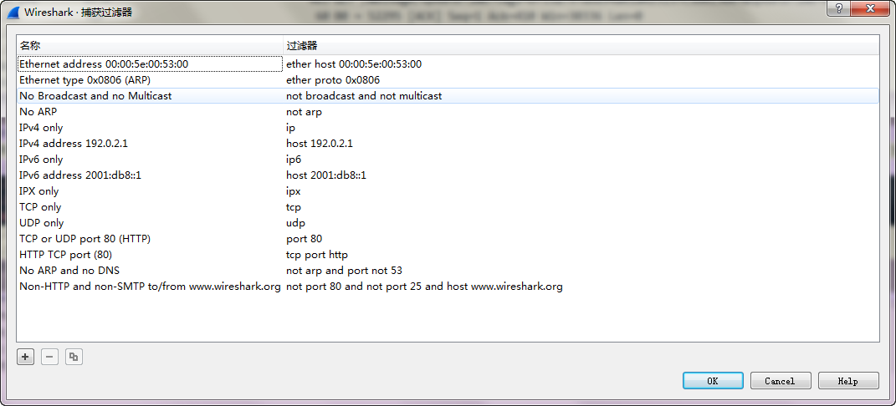

2. 保存过滤
    在Filter栏上，填好Filter的表达式后，点击Save按钮， 取个名字。比如"Filter 102",
    
    Filter栏上就多了个"Filter 102" 的按钮，可以直接应用于显示之中。
    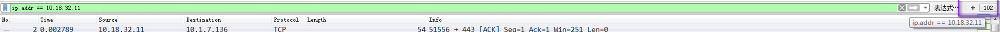

3. 过滤表达式的规则
 1. **协议过滤**
 比如TCP，只显示TCP协议。
 2. **IP 过滤**
 比如 ip.src ==192.168.1.102 显示源地址为192.168.1.102，
 ip.dst==192.168.1.102, 目标地址为192.168.1.102
 3. **端口过滤**
 tcp.port ==80,  端口为80的
 tcp.srcport == 80,  只显示TCP协议的愿端口为80的。
 4. **Http模式过滤**
 http.request.method=="GET",   只显示HTTP GET方法的。
 5. **逻辑运算符为 AND/ OR**
 6. **常用的过滤表达式**
| 过滤表达式 | 用途 |
|--------|--------|
|    http    |   只查看HTTP协议的记录     |
|ip.src\==192.168.1.102 or ip.dst==192.168.1.102	| 源地址或者目标地址是192.168.1.102|

##### 封包列表
1. 封包列表(Packet List Pane)
    ++封包列表的面板中显示，编号，时间戳，源地址，目标地址，协议，长度，以及封包信息++。你可以看到不同的协议用了不同的颜色显示，也可以修改这些显示颜色的规则，视图 ->着色规则。
    
2. 封包列表详细信息(Packet Details Pane)
    **这个面板是我们最重要的，各行信息分别为**
| TCP/IP层 | 信息 |
|--------|--------|
|  **Frame**       |  物理层的数据帧概况  |
|  **Ethernet II** |  数据链路层以太网帧头部信息  |
|  **Internet Protocol Version 4**   |  互联网层IP包头部信息  |
|  **Transmission Control Protocol** |  传输层T的数据段头部信息，此处是TCP  |
|  **Hypertext Transfer Protocol**   |  应用层的信息，此处是HTTP协议       |
  ++下面是在界面中对应的显示++
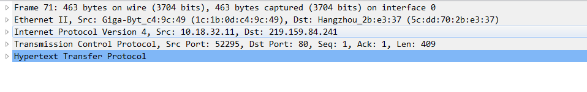

3. wireshark与对应的OSI七层模型
    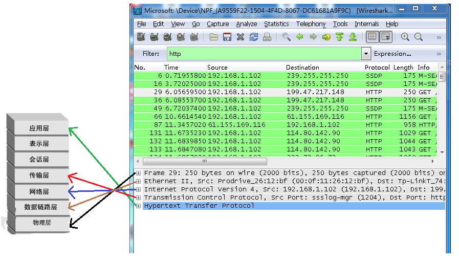

##### 实例分析TCP三次握手过程
1. TCP包的具体内容
    从下图可以看到wireshark捕获到的TCP包中的每个字段。
    
2. TCP三次握手过程
    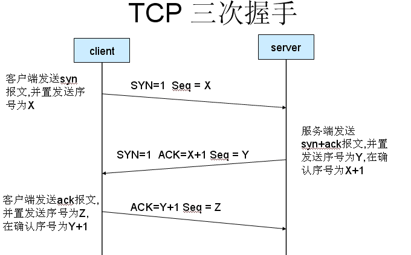
3. 实例分析
打开wireshark, 打开浏览器输入[百度](http://www.baidu.com)，使用帐号密码登录，在wireshark中输入tcp过滤，这样做的目的是为了得到与浏览器打开网站相关的数据包，将得到如下图
   
    图中可以看到wireshark截获到了三次握手的三个数据包。第四个包才是HTTP的， 这说明HTTP的确是使用TCP建立连接的，在下图之中标出来了。
    第一次握手数据包，**客户端发送一个TCP，标志位为SYN，序列号为0， 代表客户端请求建立连接**。 如下图
   
    第二次握手的数据包，**服务器发回确认包, 标志位为 SYN,ACK. 将确认序号(Acknowledgement Number)设置为客户的I S N加1，即0+1=1**, 如下图
   
    第三次握手的数据包，**客户端再次发送确认包(ACK) SYN标志位为0,ACK标志位为1.并且把服务器发来ACK的序号字段+1,放在确定字段中发送给对方.并且在数据段放写ISN的+1**, 如下图:
   
    经过以上三步就TCP三次握手，建立了连接。
***
###  Fiddler

##### Fiddle介绍
[Fiddler](http://www.telerik.com/fiddler)是位于客户端和服务器端的HTTP代理，也是目前最常用的http抓包工具之一。它能够记录客户端和服务器之间的所有 HTTP请求，可以针对特定的HTTP请求，分析请求数据、设置断点、调试web应用、修改请求的数据，甚至可以修改服务器返回的数据，支持跨浏览器、跨平台、跨语言，功能非常强大，是web调试的利器。

##### Fiddler原理
Fiddler 作为系统代理，当启用 Fiddler 时，**IE 的PROXY 设定会变成 127.0.0.1:8888**，++因此如果你的浏览器在开启fiddler之后没有设置相应的代理，则fiddler是无法捕获到HTTP请求的++。

如下是启动Fiddler之后，IE浏览器的代理设置：

如下是启动Fiddler之后，Firefox浏览器的代理设置：
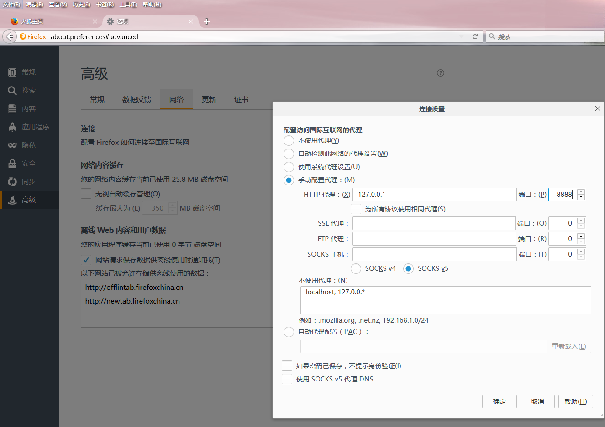
如下是启动Fiddler之后，Chrome浏览器的代理设置：

**设置了代理就可以使用Fiddler抓取任何使用HTTP请求了的软件，进程的数据包了**。

##### Fiddler窗口介绍
1. 窗口介绍

2. 窗口介绍
   主界面中主要包括四个常用的块：
     1.**Fiddler的菜单栏**，包括捕获http请求，停止捕获请求，保存http请求，载入本地session、设置捕获规则等功能。
     2.**Fiddler的工具栏**，包括Fiddler针对当前view的操作（暂停，清除session,decode模式、清除缓存等）。
     
     3.**Web Session面板**，上图黄色区域，主要是Fiddler抓取到的每条http请求（每一条称为一个session）,主要包含了请求的url，协议，状态码，body等信息，详细的字段含义如下图所示：
   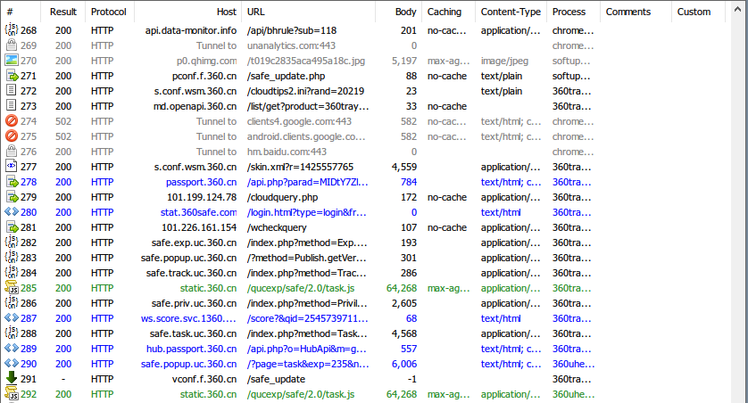
   
   4.**详情和数据统计面板**，针对每条http请求的具体统计（例如发送/接受字节数，发送/接收时间，还有粗略统计世界各地访问该服务器所花费的时间）和数据包分析。
   - ==statistics标签==：**显示该Seeion的连接的大概统计情况**，如时间，地址等信息
      
   - ==inspector标签==：**提供headers、textview、hexview,Raw等多种方式查看单条http请求的请求报文的信息**，inspector栏目上面的部分是请求信息，下面的部分是应答信息
      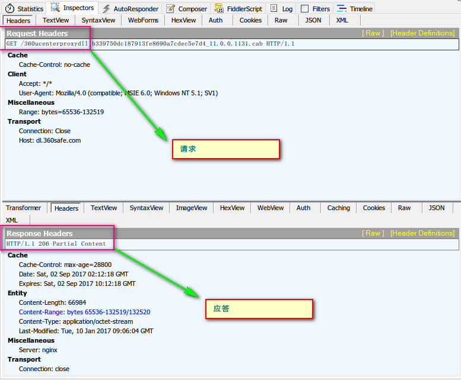
   - ==composer标签==：**可以模拟向相应的服务器发送数据的过程**++（这是灌水机器人的基本原理,也可以是部分http flood的一种方式）++
      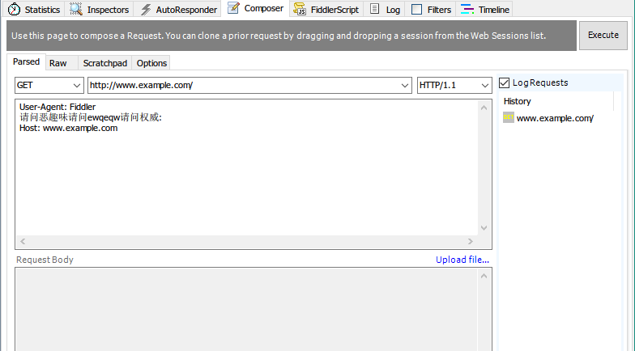
      也可以粘贴一次请求的raw http headers,达到模拟请求的目的：
      
   - ==Filter标签==：**可以设置Fiddler的过滤规则，来达到过滤http请求的目的**。最简单如：过滤内网http请求而只抓取internet的http请求，或则过滤相应域名的http请求。Fiddler的过滤器非常强大，可以过滤特定http状态码的请求，可以过滤特定请求类型的http请求（如css请求，image请求，js请求等），可以过滤请求报文大于或则小于指定大小（byte）的请求
      

##### Fiddler使用
1. 抓包
    抓包是Fiddler的最基本的应用，启动Fiddler之后，在浏览器中输入某网址，键入回车之后，在Fiddler的web session界面捕获到的HTTP请求如下图
    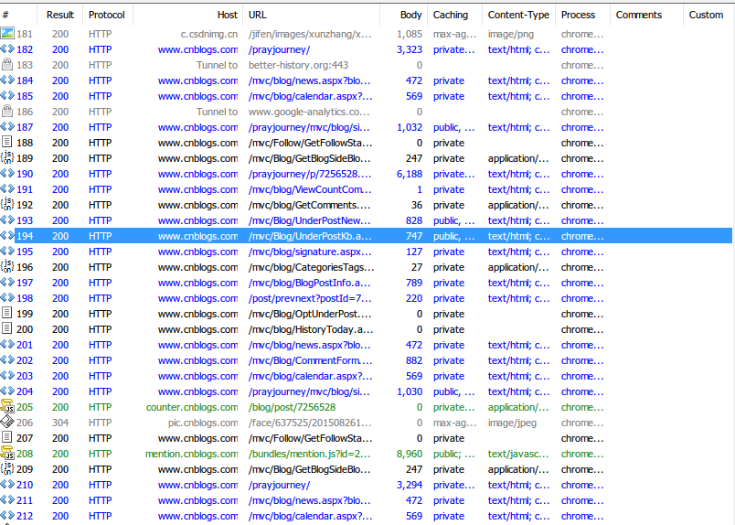
    *各字段的详细说明已经解释过，需要注意的是#号列中的图标，每种图标代表不同的相应类型*，具体的类型包括：
    
    ++另外，注意有些请求的host字段。如百度，会有多个来自www.baidu.com的子域名的响应，说明在大型网站的架构中，大多需要多个子域名++，这些子域名可能是单独用于缓存静态资源的，也可能是专门负责媒体资源的，或者是专门负责数据统计的（如pingback）。右键单击其中的一条请求。可以选择的操作有：save(保存请求的报文信息，可以是请求报文，可以是响应报文)。例如，我们保存的一条请求头信息如下：
    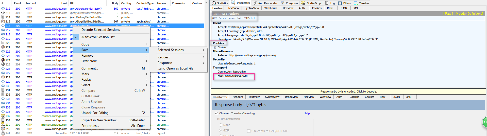
    不仅是单条session, Fiddler还支持保存所有抓取到的session(并支持导入)，这对于抓取可疑请求然后保存，并在之后随时分析这些请求是很有帮助的。++如果想要重新发送某些请求，可以选中这些请求，然后点击工具栏中的reply.就可以重新发送选中的这些请求++。左键点击单条HTTP请求，可以在右侧的tab面板中看到如下信息：
  - ***Statistic***
    关于HTTP请求的性能和其他数据分析：我们可以从下图中看出一些基本性能数据：如DNS解析的时间消耗是0ms,建立数据大小是1973byte等。
    
  - ***Inspectors***
    **分为上下两个部分，上半部分是请求头部分，下半部分是响应头部分**。对于每一部分，提供了多种不同格式查看每个请求和响应的内容。JPG 格式使用 ImageView 就可以看到图片，HTML/js/CSS 使用 TextView 可以看到响应的内容。Raw标签可以查看原始的符合HTTP标准的请求和响应头。Auth则可以查看授权Proxy-Authorization 和 Authorization的相关信息。Cookies标签可以看到请求的cookie和响应的set-cookie头信息。
    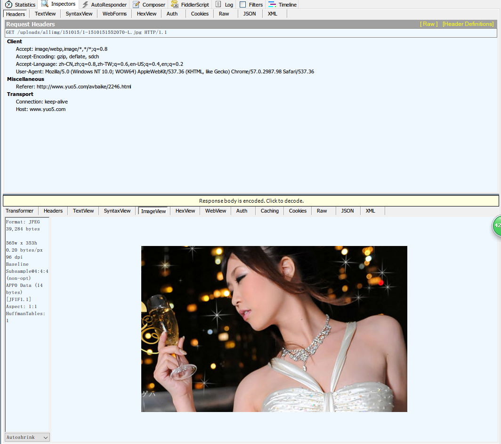
  - ***AutoResponder***
    Fiddler比较重要且比较强大的功能之一。**可用于拦截某一请求，并重定向到本地的资源，或者使用Fiddler的内置响应**。++可用于调试服务器端代码而无需修改服务器端的代码和配置，因为拦截和重定向后，实际上访问的是本地的文件或者得到的是Fiddler的内置响应++。==当勾选enable rules，在Rules Editor中设置相应的规则，并保存，就可以实施响应了==。++设置时可以关联内置数据，也可以关联自定义数据==。本例中的规则是将EXACT:http://www.yuo5.com/uploads/allimg/151015/1-1510151552070-L.jpg 的请求拦截到本地的文件003c83f1.jpg）,如下图所示
    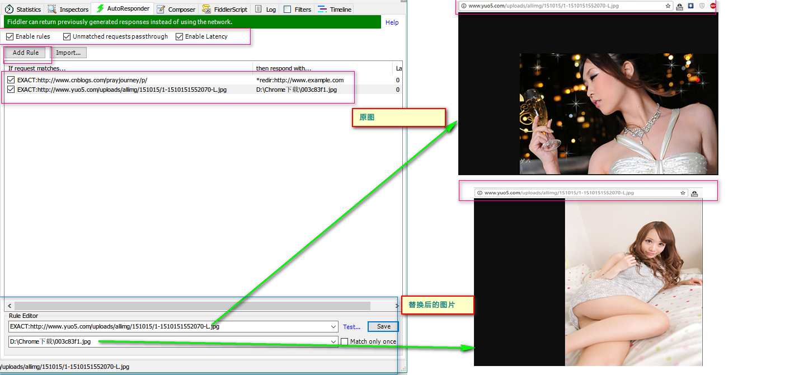
    说明请求已经成功被拦截到本地.当然也可以使用Fiddler的内置响应。下图是Fiddler支持的拦截重定向的方式：
    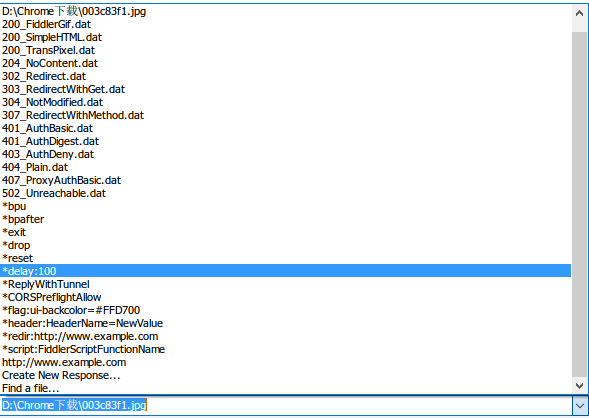

    因此，如果要调试服务器的某个脚本文件，可以将该脚本拦截到本地，在本地修改完脚本之后，再修改服务器端的内容，这可以保证，尽量在真实的环境下去调试，从而最大限度的减少bug发生的可能性。
    不仅是单个url，Fiddler支持多种url匹配的方式：
    I. 字符匹配
    如 example可以匹配 http://www.example.com和http://example.com.cn
    II. 完全匹配
    **以EXACT开头表示完全匹配**，如上边的例子
    EXACT:http://www.yuo5.com/uploads/allimg/151015/1-1510151552070-L.jpg
    III. 正则表达式匹配
    **以regex:开头，使用正则表达式来匹配URL**，如
    regex:(?insx).*\.(css|js|PHP)$  表示匹配所有以css,js,php结尾的请求url
  - ***Composer***
    用来构建相应的请求，有两种常用的方式构建请求:
    - **Parsed方式**，输入请求的url之后executed即可，也可以修改相应的头信息（如添加常用的accept, host, referrer, cookie，cache-control等头部）后execute.这个功能的常见应用是：“刷票”（不是火车票！！），如刷新页面的访问量（基于道德和安全原因，如果你真去刷票，刷访问量，本博客概不负责）
    - **Raw方式**，使用HTTP头部信息构建http请求。
  - ***Filter***
    Fiddler另一个比较强大的功能。Fiddler提供了多维度的过滤规则，足以满足日常开发调试的需求
    
    常用的有
    a. *host和zone过滤*：可以过滤只显示intranet或则internet的HTTP请求，也可以选择特定域名的HTTP请求
    b. *client process*：可以捕获指定进程的请求

2. **Fiddler内置命令**
 1. 内置命令
Web session（与我们通常所说的session不是同一个概念，这里的每条HTTP请求都成为一个session）界面中可以看到Fiddler抓取的所有HTTP请求.而为了更加方便的管理所有的session, Fiddler提供了一系列内置的函数用于筛选和操作这些session(输入命令的位置在web session管理面板的下方，**通过快捷键alt+q可以focus到命令行**.

 2. 内置命令详细情况[^2]
   -  **?**
      问号（?）后边跟一个字符串，Fiddler 将所有会话中存在该字符串匹配的全部高亮显示（下图输入的是 ?baidu），需要注意的是，**匹配的字符串是 Protocol、Host 和 URL 中的任何子字符串**
      
   - **>** 和 **<**
      大于号（>）和小于号（<）后边跟一个数值，表示高亮所有尺寸大于或小于该数值的会话，注意**可以直接输入 >5k 表示你想高亮所有尺寸大于5KB的会话**
      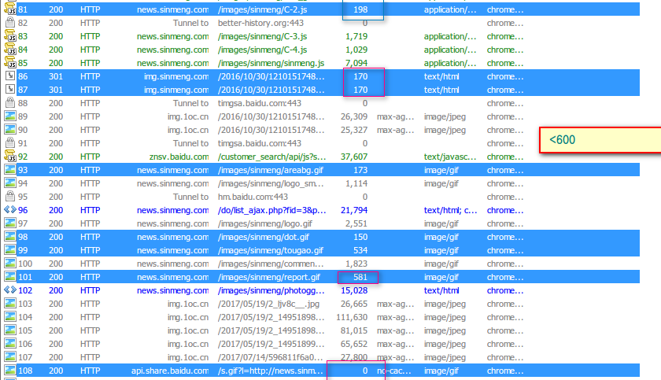
   - **=**
      等于号（=）后边可以接 HTTP 状态码或 HTTP 方法，比如 =200 表示高亮所有正常响应的会话。例如**输入了 =POST，表示希望高亮所有 POST 方法的会话**
      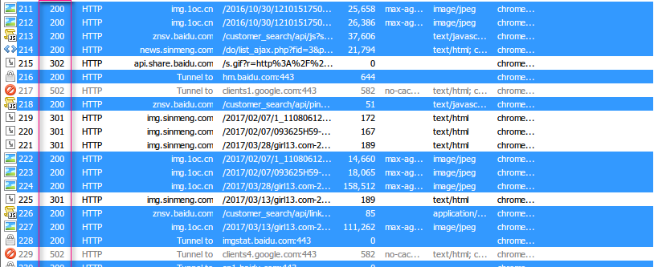
   - **@**
      **@后边跟的是 Host**，比如我想高亮所有百度连接，我可以 @baidu.com
      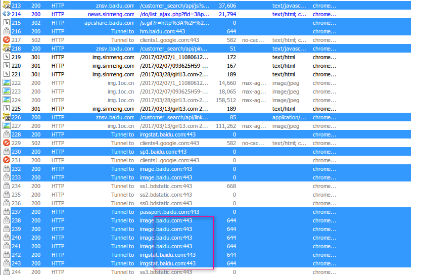
   - **select**
      **选择所有相应类型（指content-type）为指定类型的HTTP请求**，如选择图片，使用命令select image.而select css则可以选择所有相应类型为css的请求，select html则选择所有响应为HTML的请求。如图是执行select image之后的结果
      
      -**Bpafter, Bps, Bpv, Bpm, Bpu**
      1.这几个命令主要用于批量设置断点
| 命令 | 作用与用法 |
|--------|--------|
|  Bpafter      |  bpafter 后边跟一个字符串，表示中断所有包含该字符串的会话      |
|  Bps      |  bps 后边跟的是 HTTP 状态码，表示中断所有为该状态码的会话      |
|  Bpv      |  bpv 或 bpm 后边跟的是 HTTP 方法，表示中断所有为该方法的会话      |
|  Bpm      |  等同于Bpv xxx      |
|  Bpu      |  跟 bpafter 类似，区别：bpu 是在发起请求时中断，而 bpafter 是在收到响应后中断      |
   注意：**当这些命令没有加参数时，会清空所有设置了断点的HTTP请求**。
   2.其他命令
| 命令 | 作用与用法 | 说明 |
|--------|--------|-------|
|cls 或 clear| 清除当前的所有会话| - |
|dump  | 将所有的会话打包成 .zip 压缩包的形式保存到 C 盘根目录下  | - |
|g 或 go  | 放行所有中断下来的会话  | - |
| hide  | 将 Fiddler 隐藏  | -  |
|show   | 将 Fiddler 恢复  | -  |
|urlreplace  |urlreplace 后边跟两个字符串，表示替换 URL 中的字符串   | urlreplace 后边跟两个字符串，表示替换 URL 中的字符串  |
|start  | Fiddler 开始工作  | -   |
|stop   | Fiddler 停止工作  | -   |
|allbut 或 keeponly | 跟 select 类似   |**allbut 和 keeponly 会将所有无关的会话删除**   |
|!dns  | 后边跟一个域名，执行 DNS 查找并在右边的 LOG 栏打印结果  |   |
| !listen | 设置其他监听的端口  |  默认端口是 8888 |
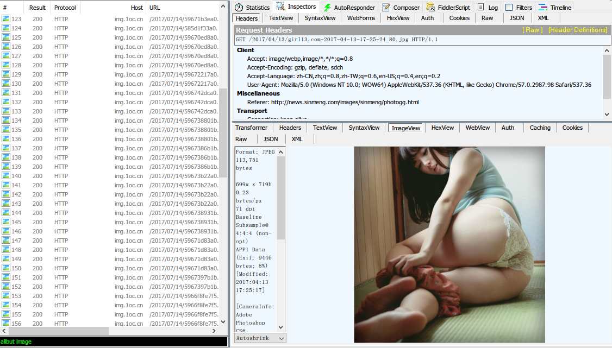

3. **Fiddler断点调试**
  1. 断点调试优点

    这是Fiddler又一强大和实用的工具之一。通过设置断点，Fiddler可以做到：
  - 修改HTTP请求头信息。例如修改请求头的UA, Cookie, Referer 信息，通过“伪造”相应信息达到达到相应的目的（调试，模拟用户真实请求等）
  - 构造请求数据，突破表单的限制，随意提交数据。避免页面js和表单限制影响相关调试
  - 拦截响应数据，修改响应实体
    *为什么以上方法是重要的？假设js前端程序员和服务器程序员是分工合作的，js程序员想要调试Ajax请求的功能，这样便不必等待服务器端程序员开发好所有接口之后再开始开发js端的ajax请求功能，因为通过“模拟”真实的服务器端的响应，便可以保证功能的正确性，而服务器端开发程序员，只要保证最终的响应是符合规定的即可。这大大简化了程序开发的效率，当然也降低了不同业务线程序员联调的难度*

  2. 断点设置方法
  - **菜单栏方式**：fiddler菜单栏->rules->automatic Breakpoints->选择断点方式，这种方式下设定的断点会对之后的**所有HTTP请求有效**
    有两个断点位置：
    a. before response。也就是发送请求之后，但是Fiddler代理中转之前，这时可以修改请求的数据。
    b. after response。也就是服务器响应之后，但是在Fiddler将响应中转给客户端之前。这时可以修改响应的结果。
    c.断点消除：点击Rules-> Automatic Breakpoint  ->Disabled
  - **命令行方式**：在命令行之中输入bpafter xxx或者bpv,bpu,bpm等设置断点。这种断点**只针对特定类型的请求**
    断点消除：在命令行中输入命令，如 bpu

  3. 断点调试实战
    a.修改请求
    首先设置断点，截获登陆页面的所有请求，然后在页面上输入用户名和错误的密码，进行登陆操作，然后在Inspectors-->WebForms里面修改密码，即可替换掉错误的密码，登陆成功。
    ]
    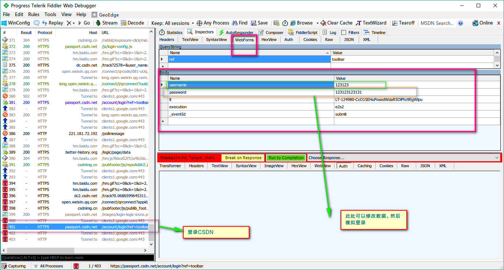
    b.修改响应
    首先设置断点，请求某一网页，然后在Inspectors-->TextViews里面修改响应内容，即可实现自定义的响应内容。
    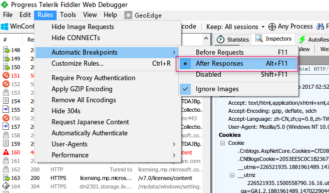]
    
    **当修改完相应的内容之后，点击Run to Completion, 即可进行下一步的操作**。

---
ref:
[Wireshark抓包工具使用教程以及常用抓包规则](http://fangxin.blog.51cto.com/1125131/735178/), [通信协议——Http、TCP、UDP](http://www.cnblogs.com/xhwy/archive/2012/03/03/2378293.html), [Wireshark基本介绍和学习TCP三次握手](http://www.cnblogs.com/TankXiao/archive/2012/10/10/2711777.html), [网络抓包工具 wireshark 入门教程](http://www.cnblogs.com/52php/p/6262956.html), [wireshark怎么抓包、wireshark抓包详细图文教程](http://blog.csdn.net/holandstone/article/details/47026213), [协议的分用以及wireshark对协议的识别](http://www.cnblogs.com/Leo_wl/p/3308958.html)
[【HTTP】Fiddler（一） - Fiddler简介](http://blog.csdn.net/ohmygirl/article/details/17846199), [【HTTP】Fiddler（二） - 使用Fiddler做抓包分析](http://blog.csdn.net/ohmygirl/article/details/17849983), [【HTTP】Fiddler（三）- Fiddler命令行和HTTP断点调试](http://blog.csdn.net/ohmygirl/article/details/17855031), [抓包工具之fiddler实战1-基本设置](http://www.cnblogs.com/testrabbit/p/5931949.html), [抓包工具之fiddler实战2-设置断点](http://www.cnblogs.com/testrabbit/p/5931965.html), [抓包工具之fiddler实战3-接口测试](http://www.cnblogs.com/testrabbit/p/5932250.html), [Fiddler内置命令](http://www.cnblogs.com/nihaorz/p/5455148.html), [Fiddler 断点调试http请求
](http://www.cnblogs.com/50614090/p/7389451.html), [抓包工具：Fiddler 2-强大功能之一 断点](http://chessman-126-com.iteye.com/blog/2001288)

[^1]:[网络基础知识](ttps://github.com/prayjourney/SummaryOfProgramming/blob/master/%E8%AE%A1%E7%AE%97%E6%9C%BA%E5%9F%BA%E7%A1%80/%E8%AE%A1%E7%AE%97%E6%9C%BA%E7%BD%91%E7%BB%9C/%E7%BD%91%E7%BB%9C%E5%9F%BA%E7%A1%80%E7%9F%A5%E8%AF%86.md)
[^2]:[Fiddler内置命令官方文档](http://docs.telerik.com/fiddler/knowledgebase/quickexec)