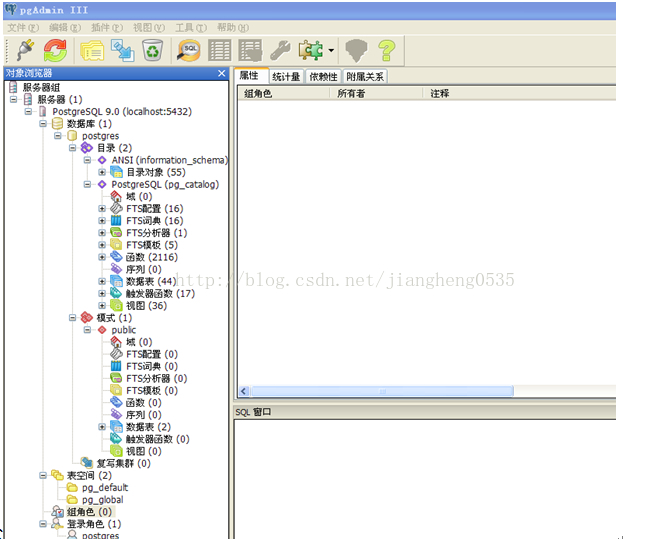
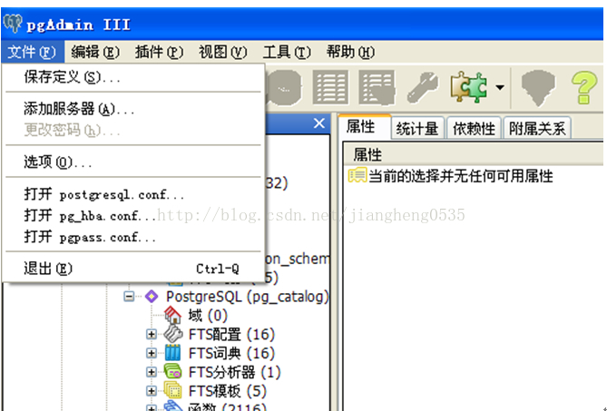
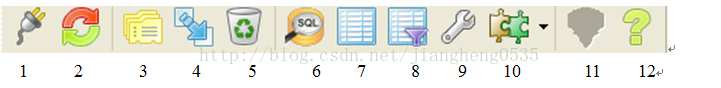
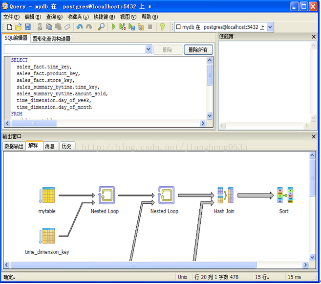
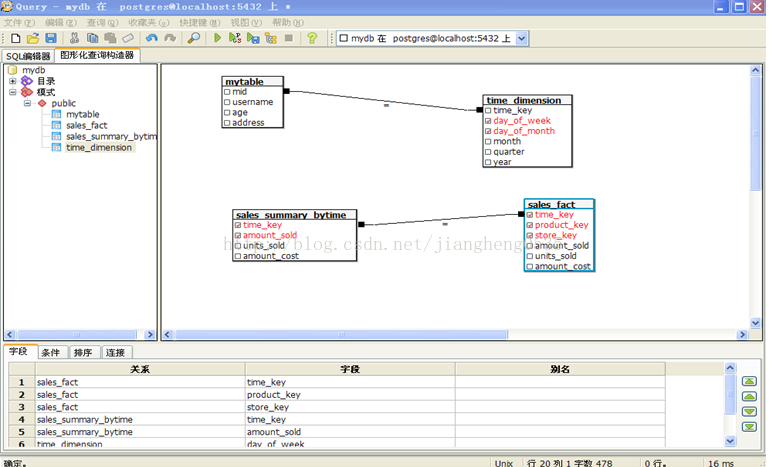

### pgAdmin III简介
***

要打开一个到服务的连接，在树中选择所需的服务，并双击它，或使用“工具”菜单上的连接即可。
####  主窗体

在主窗口中，显示数据库的结构。您可以创建新的对象，删除和编辑现有的对象，如果你使用的是当前连接到数据库用户的权限，在主窗口的左侧显示所有服务器，以及它们所包含的对象树。
右上方显示，目前在树中选定的对象的详细信息。右下方包含一个SQL脚本。


####  导航菜单功能
#####  文件菜单
在文件菜单中当点击服务器根节点下某个节点时可以更改连接密码。
点击选项（o）按钮中您可以调节些属性，例如：用户界面的语言，偏好，SQL语法高亮的颜色等。菜单中还可以对postgresql.conf, pg_hba.conf, pgpass.conf文件进行编辑。来优化postgresql的性能。添加所需的服务器，使用菜单中“添加服务器”。在新服务器登记的时候可以选择组。当按下“确定”按钮时，将出现新组并且服务器包含在其中。这个类似文件夹的功能可以将服务器按照类型或用途分组。如下图所示：


#####  编辑菜单
点击编辑菜单可以对数据库和对象做相应的操作。（右键所选对象相当于编辑中所有相关功能）

#####  插件
启动psql控制台并连接到在pgAdmin中所选的数据库。可以输入相应的命令。

#####  视图
用来调节页面视图的显示。例如：打开与关闭ＳＱＬ窗口。

#####  工具
在主窗体左面的对象树中点击不同的节点　工具中菜单的高亮显示可做相应的操作。（所选对象右键操作可达到相同效果但工具中可以打开查询工具）。

#####  帮助
可以查看帮助文档

####  工具栏的介绍　

- 图标１．新建立一个服务器
- 图标２．刷新所选择对象（所选对象右键刷新也可以实现）
- 图标３．显示所选对象属性（所选对象右键刷新也可以实现）
- 图标４．创建和选取对象同类型的对象。例如：选择数据库表点击该图标就创建新的数据库表，选取函数点击该图标就新创建个函数。
- 图标５．删除当前所选择的对象。
- 图标６．此图标为pgAdminIII最为重要工具之一（之后详细介绍）。
- 图标７．查看所选对象数据。例如选中数据库表点击该图标会显示表中的数据。
- 图标８．输入条件对所选对象的数据进行过滤。
- 图标９．可以对数据库和数据表进行维护。
- 图标１０.执行上次使用过的插件。如导航栏中插件psql。
- 图标１１.显示当前对象的指导建议。
- 图标１２.显示关于ＳＱＬ指令的帮助。

详细介绍图标６的功能打开之后如下图所示


1.在SQL编辑器中输入相应的SQL语句，点绿色箭头可以执行该ＳＱＬ语句，也可以选中部分执行。（执行ＳＱＬ语句快捷键F5）。在下方输出窗口中可以查看相应的结果。点击菜单查询解释（快捷键Shift+F7）分析会出现相应的解释图类似于图形化查询。还可以保存数据。

2.图形化查询构造器允许用鼠标来构建查询：从导航器中拖动数据表和视图到图形面板中，在他们之间添加连接，点击检查框增加字段，追加条件以及设置结果顺序。



3.可以从桌面拖拽一个文件到查询文本框然后释放它，查询工具会自动打开这个文件。右上方为连接下拉框中用一个方框显示服务器颜色点击下拉菜单合一新建服务器连接。


查询语句历史自动保存在一个文件里，这个文件的内容显示在查询文本框上方的下拉框中，同时具有删除文件中选中查询或者全部查询的功能。如果想要用以前保存的查询替代当前查询，可以在下拉框中选择。


#### 数据库与表的创建


1.数据库的创建。选中数据库=>右键=>新建数据库


一般都选择默认就可以。在结构树中目录中存放的是系统的对象和系统表等。系统默认模式为public可以建其他模式。只有相应的权限才能看见模式下的内容。

２表的创建。选中数据表=>右键=>新建数据库表（特别注意新建表时表名与字段名要小写，因为它会区分大小写。大写或者大小写混的会加上双引号）。


３.表的修改
右键选中所要操作的表选择新建对象可以对表做相应的错做。例如：新增字段等。


右键选中所要操作的表查看数据所有行，可以查看该表的数据，并可以做相应的修改。（注意：想要一表格形式修改此表，该表必须有主键）。


在表格中右键选中字段可以过滤与排序等。使操作更加快捷方便。


在修改表的时候允许编辑SQL标签，例如：当追加一个带有缺省值和非空制约的新字段时， pgAdmin无法在一个动作中完成，因为需要先新增字段，然后修改所有已存在记录的值，最后再设置非空制约。而现在，可以使用UI一次完成。你可以使用这样的语句：

 
接下来，点击“只读”检查框进入直接编辑模式，更新语句并执行。


#### 数据库的备份与恢复
右键选择要备份的数据库。用pgadmin可以把postgres备份成三种格式，compress，tar，plain。compress最小，是压缩过的，但是里面乱码。文件以.backup结尾tar比较大，上面有几行是乱码，下部分都是数据，格式看上去不太整齐。文件以.backup结尾。plain也很大，但不是乱码，里面的内容很整齐，分为两部分，上部分是相关的属性和数据表的信息。下部分全是数据。字段用一个Tab分隔。然而恢复时只有compress和tar的文件能够恢复。也就是以.backup结尾的！还有这样恢复时，最好把库删了！然后新建空库从新恢复！不要在原来库的基础上恢复！会有数据丢失！新表会加上，但旧表里的新数据不会加上。如图所示：


#### 数据库远程访问
如果要远程通过TCP/IP来访问Postgresql数据库，需要做这两步操作：
1.修改数据库配置文件 pg_hba.conf
```shell
# vi /var/database/pgsql/data/pg_hba.conf
# "local" is for Unix domain socketconnections only
local  all        all                              trust
# IPv4 local connections:
host   all        all        127.0.0.1/32          trust
host   all        all         192.168.2.0/24       trust
host   all        all        192.168.23.53/32      trust
```
2.启动 postgresql的时候，加上“-i”这个参数
```shell
$ /usr/local/pgsql/bin/postmaster -D/var/database/pgsql/data/ -i &
```
这样,就能通过TCP/IP来访问Postgresql数据库了。Postgresql默认的通讯端口是 5432 。


ref:
1.[pgAdmin III 使用图解](https://www.cnblogs.com/ExMan/p/9052186.html)

