### 图解常用Linux命令

***

#### 1.ls – List

ls会列举出当前工作目录的内容（文件或文件夹），就跟你在GUI中打开一个文件夹去看里面的内容一样。
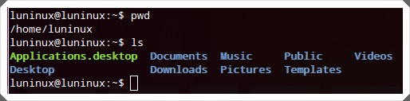

#### 2.mkdir – Make Directory

mkdir 用于新建一个新目录
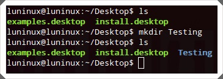

#### 3.pwd – Print Working Directory

pwd显示当前工作目录


#### 4.cd – Change Directory

对于当前在终端运行的会中中，cd 将给定的文件夹（或目录）设置成当前工作目录。


#### 5.rmdir – Remove Directory

rmdir 删除给定的目录。


#### 6.rm – Remove

rm 会删除给定的文件或文件夹，可以使用rm -r 递归删除文件夹


#### 7.cp – Copy

cp 命令对文件或文件夹进行复制，可以使用cp -r 选项来递归复制文件夹。
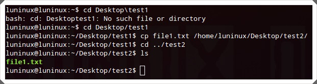

#### 8.mv – MoVe

mv 命令对文件或文件夹进行移动，如果文件或文件夹存在于当前工作目录，还可以对文件或文件夹进行重命名。
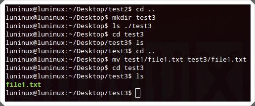

#### 9.cat – concatenate and print files

cat 用于在标准输出（监控器或屏幕）上查看文件内容


#### 10.tail – print TAIL (from last) 

tail 默认在标准输出上显示给定文件的最后10行内容，可以使用tail -n N 指定在标准输出上显示文件的最后N行内容。
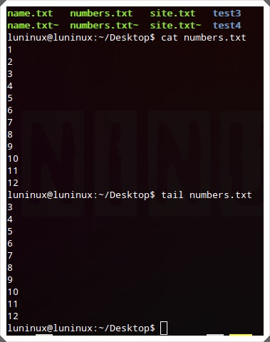

#### 11.less – print LESS

less 按页或按窗口打印文件内容。在查看包含大量文本数据的大文件时是非常有用和高效的。你可以使用Ctrl+F向前翻页，Ctrl+B向后翻页。
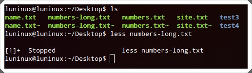

#### 12.grep

grep "" 在给定的文件中搜寻指定的字符串。grep -i "" 在搜寻时会忽略字符串的大小写，而grep -r "" 则会在当前工作目录的文件中递归搜寻指定的字符串。
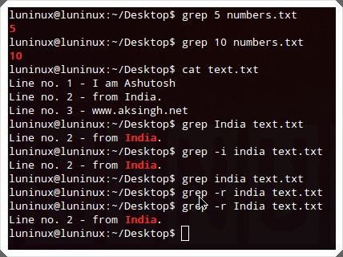]

#### 13.Find

这个命令会在给定位置搜寻与条件匹配的文件。你可以使用find -name 的-name选项来进行区分大小写的搜寻，find -iname 来进行不区分大小写的搜寻。

```
find <folder-to-search> -iname <file-name>
```

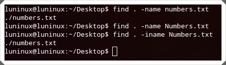

#### 14.tar

tar命令能创建、查看和提取tar压缩文件。tar -cvf <archive-name.tar> 是创建对应压缩文件，tar -tvf <archive-to-view.tar> 来查看对应压缩文件，tar -xvf <archive-to-extract.tar>来提取对应压缩文件。


#### 15.gzip

gzip 命令创建和提取gzip压缩文件，还可以用gzip -d 来提取压缩文件。
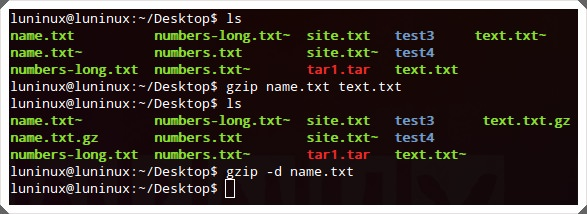

#### 16.unzip

unzip <archive-to-extract.zip>对gzip文档进行解压。在解压之前，可以使用unzip -l <archive-to-extract.zip>命令查看文件内容。


#### 17.help

--help会在终端列出所有可用的命令,可以使用任何命令的-h或-help选项来查看该命令的具体用法。


#### 18.whatis – What is this command

whatis 会用单行来描述给定的命令。
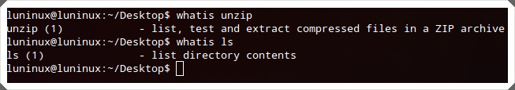

#### 19.man – Manual

man 会为给定的命令显示一个手册页面。


#### 20.exit

exit用于结束当前的终端会话。


#### 21.ping

ping 通过发送数据包ping远程主机(服务器)，常用与检测网络连接和服务器状态。


#### 22.who – Who Is logged in

who能列出当前登录的用户名。
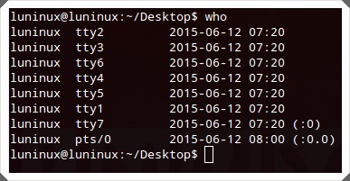

#### 23.su – Switch User

su 用于切换不同的用户。即使没有使用密码，超级用户也能切换到其它用户。


#### 24.uname

uname会显示出关于系统的重要信息，如内核名称、主机名、内核版本、处理机类型等等，使用uname -a可以查看所有信息。


#### 25.free – Free memory

free会显示出系统的空闲内存、已经占用内存、可利用的交换内存等信息，free -m将结果中的单位转换成KB，而free –g则转换成GB。
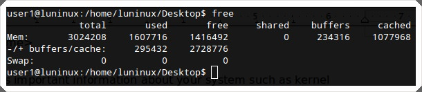

#### 26.df – Disk space Free

df查看文件系统中磁盘的使用情况–硬盘已用和可用的存储空间以及其它存储设备。你可以使用df -h将结果以人类可读的方式显示。


#### 27.ps – ProcesseS

ps显示系统的运行进程。


#### 28.Top – TOP processes

top命令会默认按照CPU的占用情况，显示占用量较大的进程,可以使用top -u 查看某个用户的CPU使用排名情况。


#### 29.shutdown

shutdown用于关闭计算机，而shutdown -r用于重启计算机。


ref : 
1.50个最常用的Unix/Linux命令,   2.linux下各文件夹的作用,   3.初窥Linux 之 我最常用的20条命令,   4.29个你必须知道的Linux命令,   5.Linux 新手应该知道的 26 个命令,   6.linux中常用操作命令,   7.linLINUX中常用操作命令,   8.linux常用基本命令