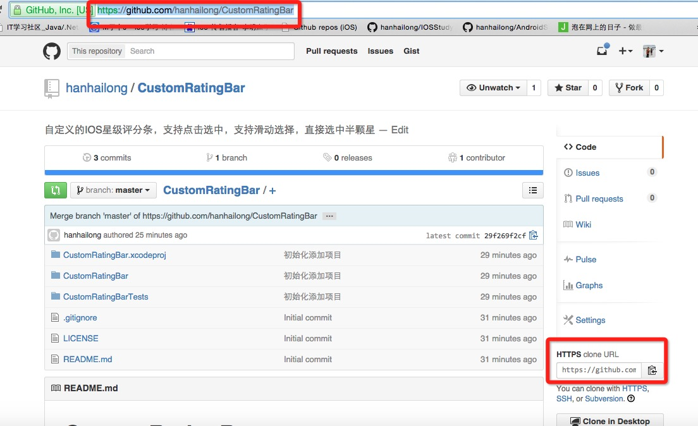

### 本地代码上传到GitHub 

------

##### 本地代码到GitHub

**第一步：建立git仓库** 
cd到你的本地项目根目录下，执行git命令

```xml
git init1
```

**第二步：将项目的所有文件添加到仓库中**

```xml
git add .1
```

**如果想添加某个特定的文件，只需把.换成特定的文件名即可**

**第三步：将add的文件commit到仓库**

```xml
git commit -m "注释语句1"
```

------

**第四步：去github上创建自己的Repository，创建页面如下图所示：** 


**点击下面的Create repository，就会进入到类似下面的一个页面，拿到创建的仓库的https地址，红框标示的就是** 


**第五步：重点来了，将本地的仓库关联到github上**

```js
git remote add origin https://github.com/hanhailong/CustomRatingBar1
```

**后面的https链接地址换成你自己的仓库url地址，也就是上面红框中标出来的地址**

**第六步：上传github之前，要先pull一下，执行如下命令：**

```
git pull origin master1
```

**敲回车后，会执行输出类似如下** 


**第七步，也就是最后一步，上传代码到github远程仓库**

```
git push -u origin master1
```

**执行完后，如果没有异常，等待执行完就上传成功了，中间可能会让你输入Username和Password，你只要输入github的账号和密码就行了**

**最后附上代码上传成功后的截图：** 


**查看本地分支对应哪个远程分支**

使用`git branch -vv`


##### Github已经存在的仓库上添加LICENSE 文件

在仓库之中，新建一个File，输入license，会自动跳出来各种license 让我们选择选择一个即可，如MIT, BSD, Apache2.0等


##### Git忽略已加入和未加入版本控制的文件或目录

###### 未加入版本控制

创建 .gitignore 文件。在项目根目录中创建.gitignore文件，在文件中添加不想版本控制的文件，例如

```xml
/image/.settings  
/image/.classpath
/image/.project
/image/.gradle
build/        # 忽略 build/ 目录下的所有文件
class/*.class # 忽略 class文件夹下所有.class文件
.gitignore    #忽略.gitignore文件本身
```

###### 已加入版本控制

git 忽略已经被提交的文件。有时候在 .gitignore 文件中添加规则并未生效，原因是 .gitignore 只能忽略原来没有被 track 的文件，如果某些文件已经加入了版本管理中，修改 .gitignore 是无效的。解决方法：**先把不想记录文件的本地缓存删除，再在 .gitignore 中添加忽略该文件，然后再提交**。

```xml
git rm -r --cached xxx   //xxx表示不再想版本控制的文件，然后在  .gitignore 文件中加入该忽略的文件 
git add .
git commit -m 'update .gitignore'
git rm -rf --cached x123xx文件夹  //x123xx文件夹表示一个文件夹
```

或者，**需要命令来强制忽略**

如果不小心 config.xml 文件被加入版本库了，可以用如下命令强制忽略这个文件：

```
git update-index --assume-unchanged config.xml
```

这样，即使已经更改了文件，用git status也不会看见文件已经更改。

取消这种设定可以使用如下命令：

```
git update-index --no-assume-unchanged config.xml
```


ref:

1.[教你上传本地代码到github ](https://blog.csdn.net/hanhailong726188/article/details/46738929),   2.[Github上如何添加 LICENSE 文件？](http://www.cnblogs.com/chenmingjun/p/8555906.html),   3.[Git——.gitignore 忽略文件和忽略已经提交过的文件 ](https://blog.csdn.net/revitalizing/article/details/51337509),   4.[Git忽略已加入和未加入版本控制的文件 ](https://blog.csdn.net/zhangbinu/article/details/69375250?utm_source=itdadao&utm_medium=referral),   5.[git忽略已经被提交的文件](https://segmentfault.com/q/1010000000430426)