### Understand:高效代码静态分析神器详解
---

之前用Windows系统，一直用source insight查看代码非常方便，但是年前换到mac下面，虽说很多东西都方便了，但是却没有了静态代码分析工具，很幸运，前段时间找到一款比source insight软件还强大的代码静态分析工具，堪称神器–Understand。这款软件具有强大的代码静态分析功能，并且可以绘制各种流程图，不幸的是没有发现Windows版本，只看到mac版和Linux版本，因此用Windows系统的朋友抱歉了。
因为工作太忙，还没有时间详细的研究一下使用方法，只是简单的了解了一下，由于该软件可以帮助你快速的分析代码结构流程，因此我提前分享给大家，希望和大家一起研究，共同学习，下面我针对这个软件做个初步讲解，后续会出详细讲解，由于软件是全英文的所以有问题的地方望大家指出，我会及时更正。由于安装很简单，在此就不说了，直接进入工程配置讲解。

##### 导入项目
导入项目有两种方法，一种是从菜单栏点击File–>New–>Project,另一种是点击下面界面中间的New Project
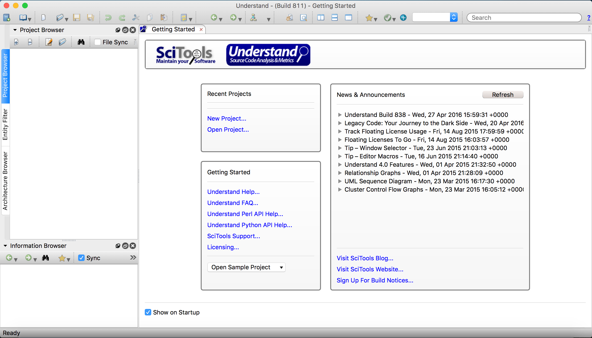
点击后，会进入到如下界面，你可以更改项目名称为你要导入的项目名称，以便于以后查找，你可以直接导入你正在开发的项目，你的代码更改后，这个项目也会自动更新，方便你快速开发，不需要每次导入。
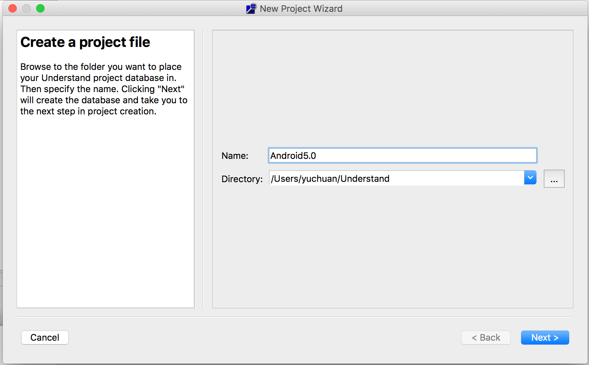
更改名称后点击Next进入如下界面，这个界面是让你选择你要导入项目包含了哪几种语言，注意，在C/C++后面有两种模式，下面有注释，其中Strict模式包含Object-C和Object—C++，还有Web的注释，自己看看就好了，在此就不再解释，

然后点击Next进入下面界面：
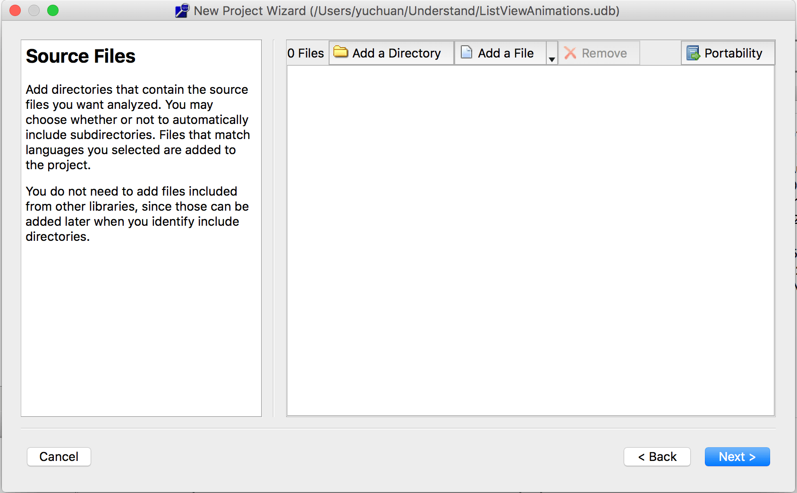
在此界面点击上面的“Add a Directory”,也就是添加你要导入项目的路径，点击后会弹出如下界面,此时有个奇葩就是弹出的界面会被上图界面遮挡，此时你要移开该界面，然后会出现下面界面：

点击后面的带有三个点的按钮选择你要加入的项目文件夹，此处不用打开文件夹，只要点中文件夹点击open按钮：
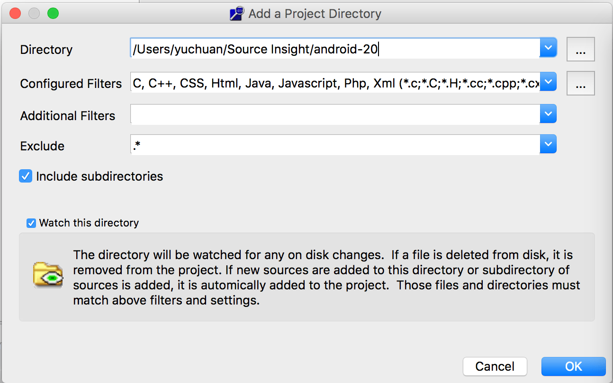
此时只需要点击OK即可，界面会跳转到如下界面：

此时有两个选项，一个是立即分析代码，一个选择配置，对于我们来说只需要默认即可，然后点击OK按钮，此时软件开始分析代码，分析完成后会出现如下界面：
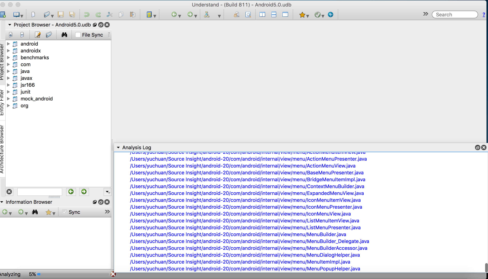
左侧会出你的项目结构，中间出现你项目的名称，此时你可以操作左面项目来查看相关代码，如下图所示：
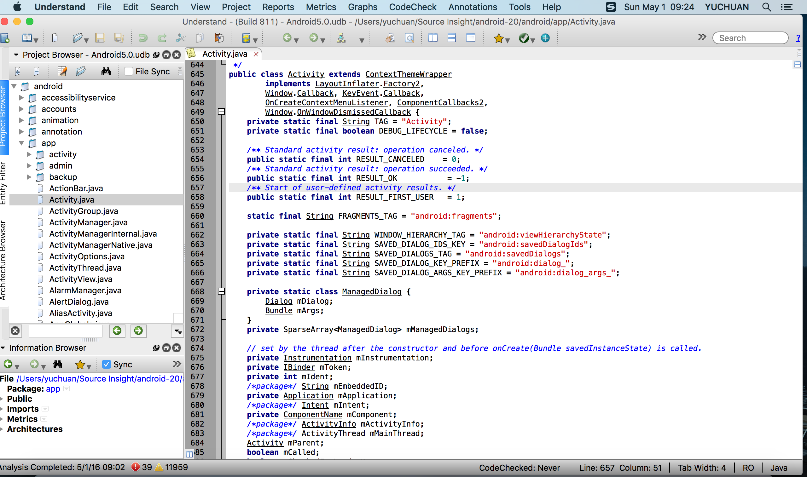
这么多类和方法如何快速定位，那肯定是搜索，该软件针对不同位置，不同属性有不同的搜索方法，下面介绍搜索功能。

##### 搜索功能
1.左侧项目结构中搜索：在这个搜索中你可以快速搜索你要查看的类，快捷键，鼠标点击左侧上面项目结构窗口，然后按command + F键会出现如下图所示的搜索框，在框中输入你想要的类回车即可
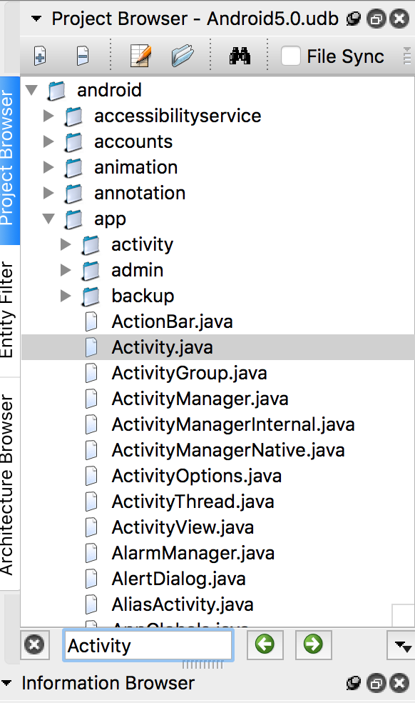
2.类中方法搜索：将鼠标定位到右侧代码中，点击command + F，会弹出搜索框，输入方法回车即可：

3.在文件中搜索：也就是全局搜索，快捷键F5或者去上面菜单栏中的search栏中查找，输入你想要的类或者方法，回车查找，下面会列出所有使用的地方：

4.实体类查找：软件菜单栏search中最后一项–Find Entity，点击输入你要查找的实体类，回车查找：

快速搜索是软件快速使用必备的技能，包括我们常用的idea一样，快速定位类，方法，常量等，可以快速帮助我们解决问题。
上面我介绍改软件时提到可以绘制流程图等功能，下面就针对这个功能介绍一些一些图形的绘制功能，帮助你快速分析代码。

##### 项目视图
项目视图包含很多的功能，能够自动生成各种流程图结构图，帮助你快速理清代码逻辑、结构等，以便快速理解项目流程，快速开发，视图查看方式有两种，一种是鼠标点击你要查看的类或者方法等上面，然后右键弹出菜单，鼠标移动到Graphical Views，然后弹出二级菜单，如下图所示：
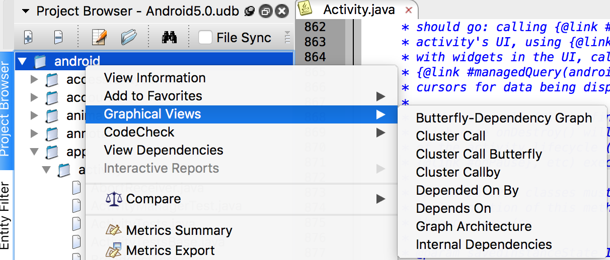
另一种方式是点击要查看的类或者方法，然后找到代码上面菜单栏中的如下图标：
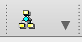
然后点击图标右下角的下拉箭头，弹出如下菜单，即可选择查看相关视图：
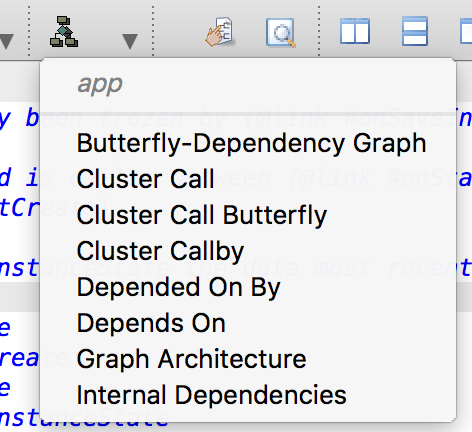

##### 层级关系视图分类：
1.Butterfly：如果两个实体间存在关系，就显示这两个实体间的调用和被调用关系；如下图为Activity中的一个方法的关系图：

2.Calls：展示从你选择的这个方法开始的整个调用链条；
3.Called By：展示了这个实体被哪些代码调用，这个结构图是从底部向上看或者从右到左看；

4.Calls Relationship/Calledby Relationship:展示了两个实体之间的调用和被调用关系，操作方法：首先右键你要选择的第一个实体，然后点击另一个你要选择的实体，如果选择错误，可以再次点击其他正确即可，然后点击ok；
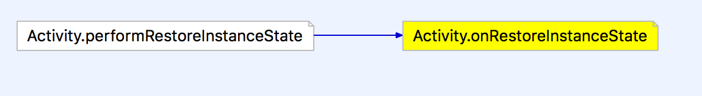

5.Contains:展示一个实体中的层级图，也可以是一个文件，一条连接线读作”x includes y“；
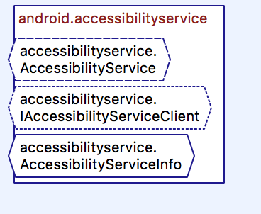
6.Extended By:展示这个类被哪些类所继承，
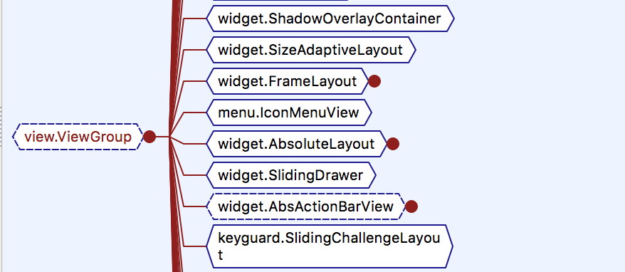
7.Extends:展示这个类继承自那个类：

##### 结构关系视图分类：
1.Graph Architecture：展示一个框架节点的结构关系；
2.Declaration:展示一个实体的结构关系，例如：展示参数，则返回类型和被调用函数，对于类，则展示私有成员变量（谁继承这个类，谁基于这个类）
3.Parent Declaration:展示这个实体在哪里被声明了的结构关系；
4.Declaration File:展示所选的文件中所有被定义的实体（例如函数，类型，变量，常量等）；
5.Declaration Type:展示组成类型；
6.Class Declaration:展示定义类和父类的成员变量；
7.Data Members:展示类或者方法的组成，或者包含的类型；
8.Control Flow:展示一个实体的控制流程图或者类似实体类型；
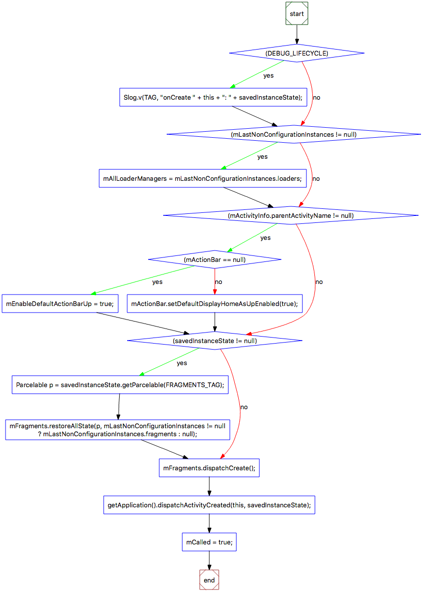
9.Cluster Control Flow:展示一个实体的流程图或者类似实体类型，这个比上一个更具有交互性；
10.UML Class Diagram:展示这个项目中或者一个文件中定义的类以及与这个类关联的类
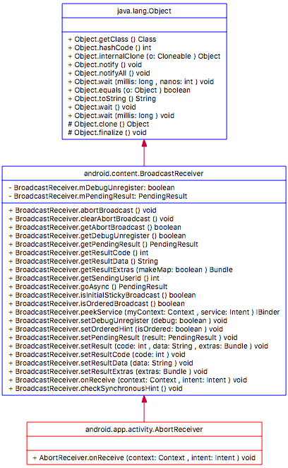
11.UML Sequence Diagram:展示两个实体之间的时序关系图；

12.Package:展示给定包名中声明的所有实体
13.Task:展示一个任务中的参数，调用，实体
14.Rename Declaration:展示实体中被重命名的所有实体
由于视图比较多，所以就一一贴上代码，主要还是需要自己去调试，查看各个功能视图的展示结构以及作用，孰能生巧，多操作几下就会了，所以不再做过多的解释。最终希望这款软件能够帮助你快速开发，快速阅读别人的或者自己的代码。

---
ref:
1.[Understand:高效代码静态分析神器详解（转）](https://www.cnblogs.com/hackerl/p/5749169.html),   2.[SourceInsight 4.0 查看Java项目教程](https://blog.csdn.net/zx123zxxp/article/details/78715121),   3.[源码阅读工具-understand](https://blog.csdn.net/guozhongwei1/article/details/80282734)