### IDEA调试技巧和Java代码调试技术

***
#### 基本调试技术

程序设计中有三类错误：

- 编译时错误：语法错误，初学者易犯
- 运行时错误：异常处理
- 逻辑错误：能编译运行，但运行结果不对

**逻辑错误是大家学习中遇到最多的错误，要学会通过调试（Debug）来定位逻辑错误**，常用技能有:

- 自顶向下进行调试
- 学会设置断点（行断点/函数断点/条件断点/临时断点）
- 学会单步运行
- 循环的调试
- 函数（方法）的调试
- 二分法定位错误
- ...

在命令行中调试Java程序参考[Java中使用JDB](http://www.cnblogs.com/rocedu/p/6371262.html),我们在这学习在IDEA中调试程序。

1. 在上面的HelloWorld项目中，新建「HelloJDB」类，输入如下代码：

```java
public class HelloJDB {
   public static void main(String[] args) {
       int i = 5;
       int j = 6;
       int sum = add(i, j);
       System.out.println(sum);
           
       sum = 0;
       for(i=0; i< 100; i++)
          sum += i;
          
      System.out.println(sum);
  }
      
  public static int add(int augend, int addend){
      int sum = augend + addend;
      return sum;
  }
}
```

1. 调试程序首先要会**设置断点**和**单步运行**。设置断点比较简单，在要设置断点的行号旁用鼠标单击一下就行了（或使用`Ctrl+F8`快捷键），如下图所示，我们在第5行设了个断点：
  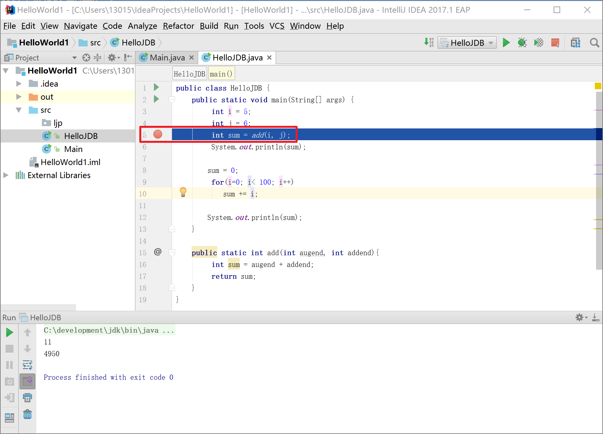
2. 然后单击菜单「Run」->「Debug...」（或使用`Alt+Shift+F9`快捷键）开始调试Java程序，我们可以看到程序停留在了第5行，如下图所示：
  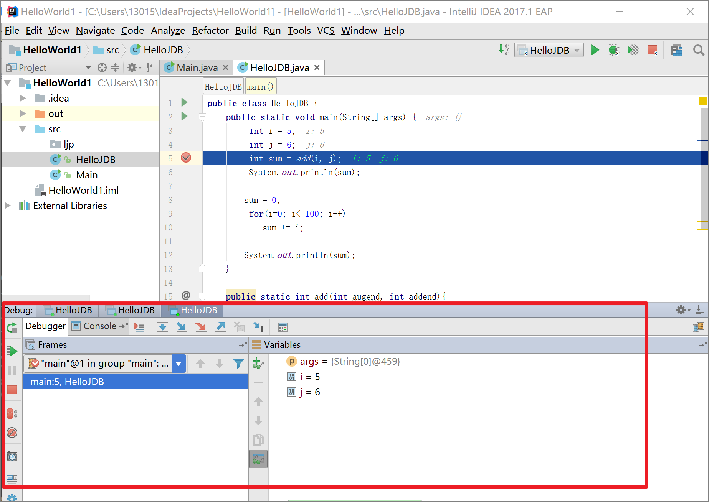
   注意，此时第5行代码并没有执行，我们看到变量sum的值并不是11，我们通过单步运行让程序运行到第6行，单步运行有两种：**Step Into(快捷捷F7)**和**Step Over（快捷捷F8）**，这两种单步运行功能在运行语句时没有区别，在执行方法调用语句时，`Step Into`会跳入方法实现，`Step Over`会直接执行完方法，实际使用中我们优先使用`Step Over`，只有方法执行出错了，说明程序问题在被调用方法中，这时再回来通过`Step Into`进入方法进行调试。我们单击一下`Step Over`图标(或`F8`），程序停在了第5行，这时查看变量i的值，会看到sum等于11。如下图所示：
  
3. 单步执行效率比较慢，如果我们感觉到第5行到第8行的代码没有问题了，想让程序直接运行到第9行，怎么办？首先我们要在第9行设置断点，然后单击`Resume`图标(快捷键`F9`)，程序就运行到了第11行，如下图所示：
  
4. 单步执行效率比较慢还导致另外一个问题，比如一个大循环中间出了问题怎么办？这时可以通过条件断点解决问题。设置条件断点，我们在第9行左边断点处单击鼠标右键，弹出断点属性框，我们设置条件“i==50”,如下图所示：
  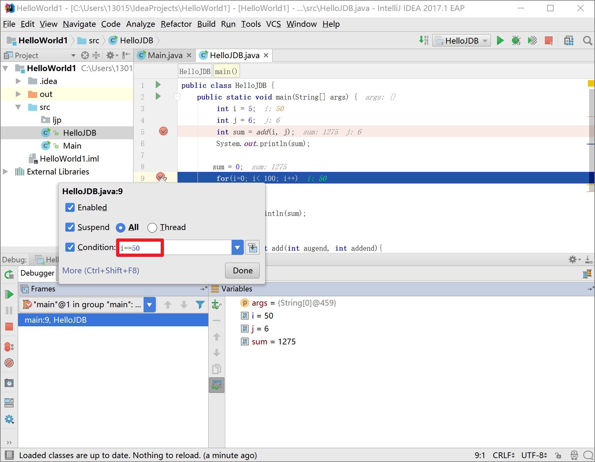
   按一下F9，我们可以查看i的是50了。如下图所示：
  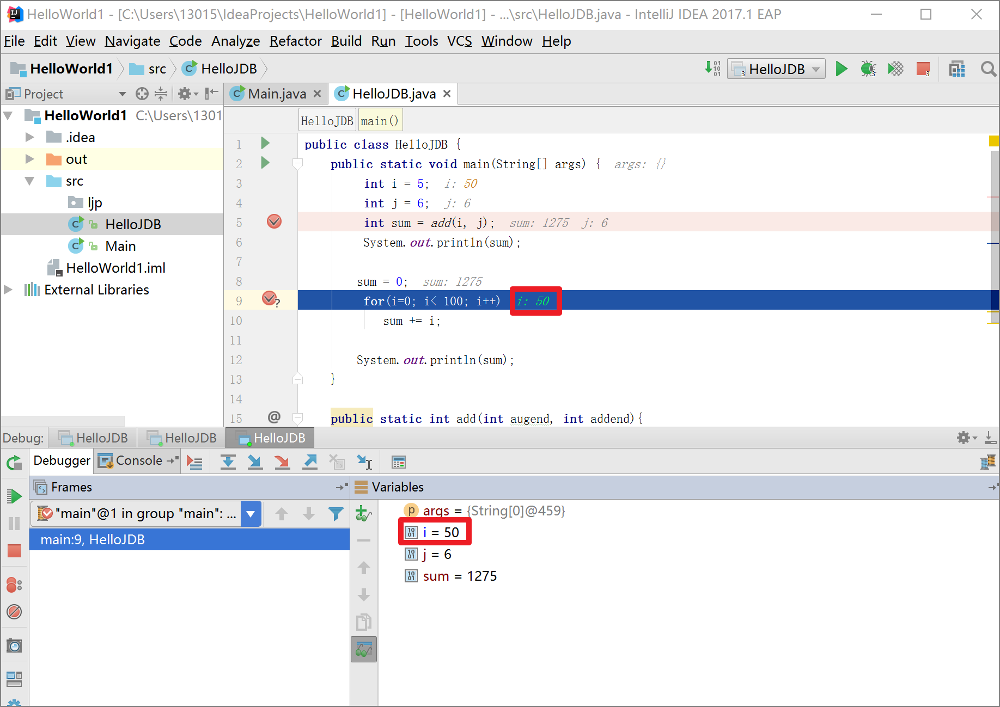
5. 临时断点,断点只中断一次，比如我们想把第9，10行的for循环一下子运行完，我们就需要在第12行设个条件断点。我们可以在第十二行设个断点，然后鼠标右击断点：
  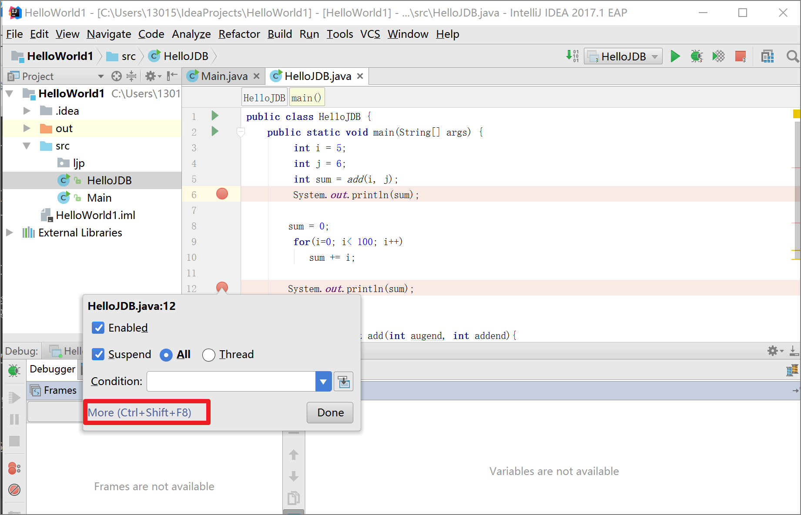
   然后点「More」或按快捷键`Ctrl+Shift+F8`打开断点设置窗口，选中「Remove Once hit」
  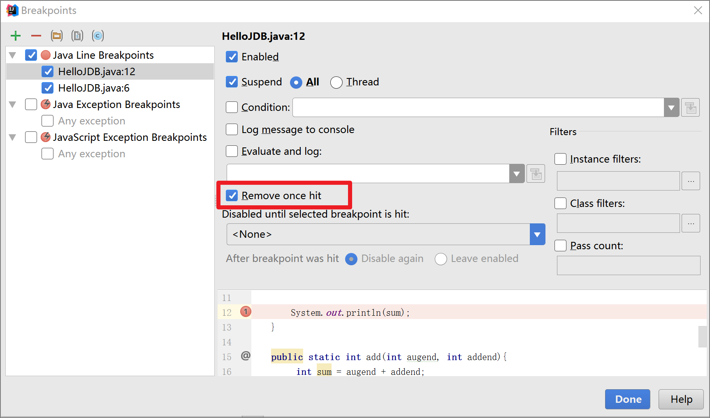
   也可以把光标移到第12行，两次按快捷键`Ctrl+Shift+F8`打开断点设置窗口，选中「Remove Once hit」;最简单的方法是把光标移到第12行,使用菜单「Run」->「Toggle Temporary Line Breakpoint」或使用快捷键`Ctrl+Alt+Shift+F8`;断点上面有个1，运行一次就消失了：
  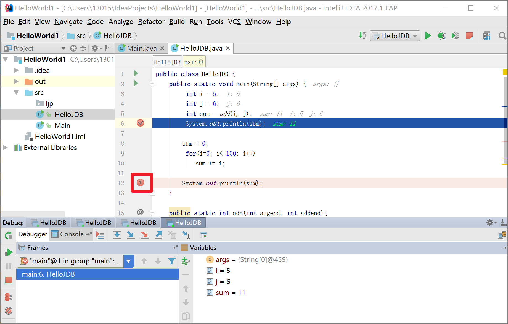
   解决问题的方法也可以不使用临时断点，把光标移到第12行，使用菜单「Run」->「Run to Cursor」或使用快捷键`Alt+F9`,如下图.
6. 方法断点：有时候我们怀疑某个方法出错了，就可以设置方法断点。把光标移到方法中的任一行，使用菜单「Run」->「Toggle Method Breakpoint」.
  
7. **重新执行方法 Drop frame**：如果在调试的时候你进入了一个方法(如f2())，觉得方法有问题, 但是在方法之中的过程没有看的很清楚, 需要重来一次, 所以就需要重新打一次断点运行一次, 但是有了Drop Frame, 只要我们不跳出一个方法, 那么久可以永远在这个函数之中重复执行, 但是如果跳出去了这个方法, 那就无法回退和重复执行了, 因为堆栈信息已经丢失.
  
8. 设置变量值：调试开始后，在红箭头指向的区域可以给指定的变量赋值（鼠标左键选择变量，右键弹出菜单选择setValue...）。这个功能可以更加快速的检测你的条件语句和循环语句。
  
9. 跨断点调试
  设置多个断点，开启调试。
  
  想移动到下一个断点，点击如下图：
  
  程序将运行一个断点到下一个断点之间需要执行的代码。如果后面代码没有断点，再次点击该按钮将会执行完程序。
10. 查看断点
  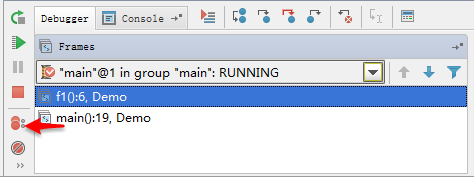
  点击箭头指向的按钮，可以查看你曾经设置过的断点并可设置断点的一些属性。
  
  箭头1指向的是你曾经设置过的断点，箭头2可以设置条件断点（满足某个条件的时候，暂停程序的执行，如 c==97）。结束调试后，应该在箭头1处把所设的断点删除(选择要删除的断点后，点击上方的红色减号）。
11. 设置变量值
   
   调试开始后，在红箭头指向的区域可以给指定的变量赋值（鼠标左键选择变量，右键弹出菜单选择setValue...）。这个功能可以更加快速的检测你的条件语句和循环语句。
12. Mute Breakpoints( **哑的断点**)
   1:**让所有的断点都无效, 都变哑**. 选择这个后，所有断点变为灰色，断点失效，按F9则可以直接运行完程序。再次点击，断点变为红色，有效。如果只想使某一个断点失效，可以在断点上右键取消Enabled，则该行断点失效。其实就是让某些断点不取消, 但是不去检测这些断点, 而出现的功能, 很好用。
   
   2:**让单个的断点变无效**. 让单个断点变哑, 只需要右键断点, 不勾选"Enabled", 就可以使得让此断点失效, 即可达到断点失效,但又不在此位置取消这个断点的效果.
   

以下是3种调试技术的示例gif, **重新执行方法 Drop frame**, **条件断点**, **一次性断点**和在断点时, 为变量设值的方法, 条件断点设值时候使用 a=100这种方式, 而不是a==100, 这就变成了判断了., 


#### 回调函数调试技术
1


#### 异步任务调试技术
2


#### 定时任务调试技术
3


#### 多线程调试技术
4


#### 堆栈信息使用和定位
5


#### 远程调试
1.远程端启动必须添加jvm参数
`-Xdebug -Xrunjdwp:transport=dt_socket,suspend=n,server=y,address=${debug_port}`
其中debug_port为自定义的调试端口

2.本地连接远程服务器debug端口
打开Intellij IDEA，在顶部靠右的地方选择”Edit Configurations…”，进去之后点击+号，选择”Remote”，按照下图的只是填写红框内的内容，其中host为远程代码运行的机器的ip/hostname，port为上一步指定的debug_port，本例是5555
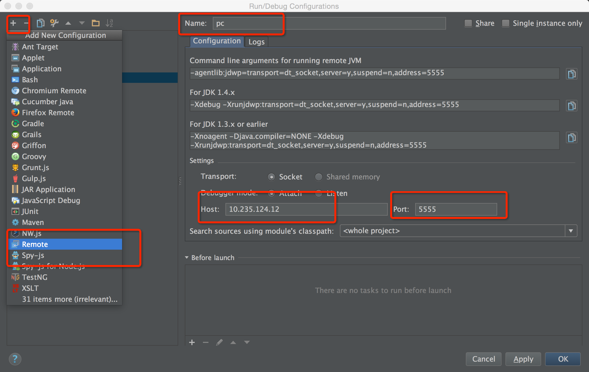
然后点击Apply，最后点击OK即可

3.启动debug模式
现在在上一步选择”Edit Configurations…”的下拉框的位置选择上一步创建的remote的名字，然后点击右边的debug按钮(长的像臭虫那个)，看控制台日志，如果出现类似**“Connected to the target VM, address: ‘xx.xx.xx.xx:5555’, transport: ‘socket’”**的字样，就表示连接成功过了。
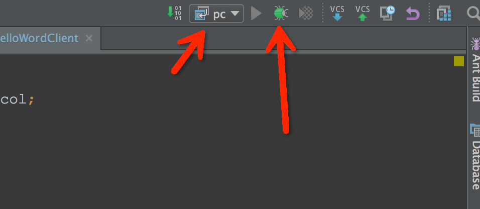

4.设置断点，开始调试
远程debug模式已经开启，现在可以在需要调试的代码中打断点了，比如：


如图中所示，如果断点内有√，则表示选取的断点正确。
现在在本地发送一个到远程服务器的请求，看本地控制台的bug界面，划到debugger这个标签，可以看到当前远程服务的内部状态（各种变量）已经全部显示出来了，并且在刚才设置了断点的地方，也显示了该行的变量值。

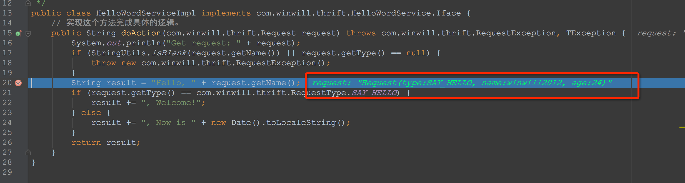

5.新增tomcat开启远程调试
tomcat已配置，启动方式为
`./catalina.sh  jpda start`


ref：
1.[Intellj IDEA 简易教程](https://www.cnblogs.com/rocedu/p/6371315.html),   2.[使用JDB调试Java程序](https://www.cnblogs.com/rocedu/p/6371262.html),   3.[java 调试](https://www.cnblogs.com/moveofgod/p/3784893.html),   4.[Java 断点调试总结](https://www.cnblogs.com/menghuizuotian/p/4177076.html),    5.[Java调试](https://www.cnblogs.com/damonzh/p/5112309.html),   6.[Java调试那点事](https://www.cnblogs.com/gotodsp/p/7294487.html),   7.[Java-note-调试小技巧](https://www.cnblogs.com/lingNote/p/3324247.html),   8.[Java breakPoints 调试](https://www.cnblogs.com/yinhaiming/articles/1866334.html),   9.[JAVA错误调试基础篇错误提示：](https://www.cnblogs.com/freeze44/articles/381915.html),   10.[java调试与排错](https://www.cnblogs.com/xyzq/p/5757692.html),   11.[Java调试那点事](https://www.cnblogs.com/leoncfor/p/5069265.html),   12.[Java 10个调试技巧](https://www.cnblogs.com/ykt8465279130/archive/2012/09/17/2688321.html),   13.[JAVA远程调试](https://www.cnblogs.com/wish5714/p/7527334.html),   14.[Java应用调试利器——BTrace教程](https://www.cnblogs.com/zengkefu/p/5720854.html),   15.[Intellij IDEA Debug调试技巧](https://blog.csdn.net/Victor_Cindy1/article/details/52336983),   16.[Intellij IDEA 2017 debug断点调试技巧与总结详解篇](https://blog.csdn.net/qq_27093465/article/details/64124330),   17.[在Intellij IDEA中使用Debug](https://www.cnblogs.com/chiangchou/p/idea-debug.html),   18.[IntelliJ中使用Drop Frame 回退到上一步](https://my.oschina.net/Cubicluo/blog/1819093),   19.[Intellij IDEA调试功能使用总结](https://www.cnblogs.com/Bowu/p/4026117.html),   20.[IntelliJ IDEA(十一) :Debug的使用](https://www.cnblogs.com/jajian/p/9410844.html),   21.[Eclipse的Debug调试技巧大全](https://blog.csdn.net/u011781521/article/details/55000066),   22.[在Intellij IDEA中使用Debug](https://www.cnblogs.com/chiangchou/p/idea-debug.html),   23.[java调试与排错](https://www.cnblogs.com/xyzq/p/5757692.html),   


