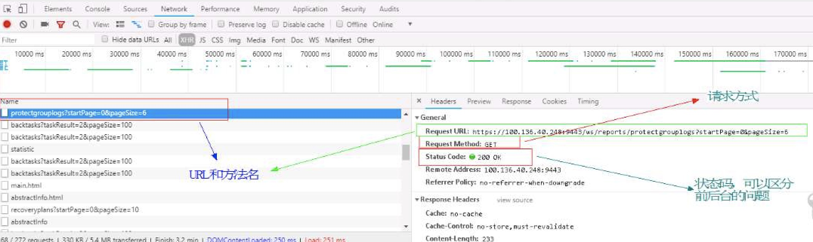
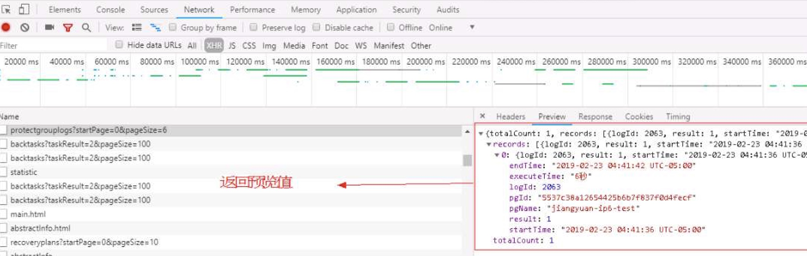

### 定位问题的心态和想法
***

#### 他山之石:
这个问题就和业务代码非业务代码相关，非业务代码定位起来要难一点，要深入到底层去，**其实主要根源就是找到报错点**，找到报错点了之后，根据那个报错原因，然后根据上下文。去判断一下，就是可能出现错误的是哪些地方，这个就需要经验，还有就是需要一个思维的扩展吧。

就你要思维，要打开一点，就不要局限在某个地方，像今天晚上这个问题就是。看起来是一个400的Rest的错误。然后就是在一直在思考，就是在找不同的点，就是思考跟以前的那些地方不同。然后就一直在那个代码里面看。寻找可疑的代码，一直来回转，然后又转到那个地方，然后就觉得那个是个可疑点，然后修改测试，果真就OK啦。

**我觉得你最大的问题就是你很容易聚焦在一个问题上，就是你不会扩展开。**

就你看到一个问题了之后，就感觉不知道是有畏难情绪还是说什么样，就感觉思维没有打开，就没有想办法多方面去解决，考虑怎么样去解决一个问题。就举个例子，就是那天那个配那个IPv6的那个环境，VMware环境，就感觉你要想嘛，你交给别人。别人可能也跟你一样的，他们也不一定懂，很多时候就是要百度一下，然后细心一点，然后思维扩展开一点，其实就可以了解决问题了。

其实按道理说有几种错误，一种是业务错误，就是可能是你的环境没有准备好或者是像今天这种ping不通的错误，这种就是就是跟业务代码没关系的错误。就是这种错误的话，其实按道理说，根据你的经验，还有你多做几次，这些都很快就会熟悉了，就知道该怎么做了。

还有一种就是代码上的错。代码上的错的话就是新开发，做需求的时候的那种错。那种的错的话就可能就需要你对代码了解，其实说白了像今天那种错，说直白一点的话，**可能就是因为你没有写这块的代码，你不知道为啥会错。你没有写，就导致你不会去熟悉这一块儿代码到底是怎么样的**。你就不知道这块儿代码是啥，你就不知道这个错到底是代码导致的还是业务导致的，这很正常，如果这个东西是你写的，或者说不说是你写的，就是这个东西是你自己看的，就比如说发现这一块儿，我也是上周五才看的，**就多看上下文，你要想办法解决问题的那种思路去的话就好一些**。

**其实我觉得你缺少一个刨根问底的那种态度**。

**多看代码，其他的都是虚的，无非就是对代码更熟悉一点就好了**。

**有的问题就算是别人帮你解决了，你要想办法知道这个是怎么解决的，为什么要这样解决。要多跟别人交流，就像以前我刚来的时候也不懂，就别人解决了问题就想办法去看，就问别人是怎么解决的，然后去看别人的代码。**

**你至少要保证你每一次做需求的时候，你那块儿覆盖的东西，涉及到的东西，你全部都要很熟**，需要知道，如果是别人写的代码，你要看看懂，不说要看100%看懂，至少要知道这个为什么要这么写吧，我觉得。

**就学习东西，就思维要发散一点。然后要做啥要有目标，然后就去针对性的去学就行了，花不了多少时间。**

#### 自我总结
0. 对于方法论不重视，不总结，导致有时候解决问题，没有提纲携领，无头苍蝇一样乱撞。

1. 遇到了问题, 首先要静下心来,不要担心, 坚定解决的信心才是最重要的;

2. 打开Chrome开发者的工具, 点击相关的功能的按钮, 查看URL之中包含的方法, 比如说:https://find.com/getstr?key=100, 比如说这个请求的url, getstr就是我们编写的方法, 那么我们就找到了需要修改的方法. 如下图之中, **protectgrouplogs就是我们需要寻找的方法, 后面的headers的request url就是访问的地址**.
  

3. 找到了方法之后, 就可以去修改, 然后需要再去看返回的状态码, 从状态码之中查看是前端还是后端的问题,比如说500, 就是后端的问题. 正常的话, 都是200就是正常的. 在上图之中那个Status Code也就是我们返回的状态码,一般200就是okay, 500的话就是服务器有问题, 就不是前端的事情了.下面可以看,简单分类如下:
  **1xx – 信息提示**
  **2xx – 成功**
  **3xx – 重定向**
  **4xx – 客户端错误**
  **5xx – 服务器错误**
  
  

4. 判断清楚了是前端还是后端的问题, 然后就找相关的日志, 前端的日志, 后端的日志, 基本上最后找出来, 搜索error, 基本上很快速就可以定位出出现问题的文件类,方法具体产生问题的行数.

5. 有的在数据库之中获取不到的相关的字段或者是标志位, 可以大胆的猜想, 是前端获取的问题.这个可以看返回值的情况
   
   

6. 定位问题的时候, *不能一下子就去开启debug调试, 这样往往费时费力, 而且很难快速定位到问题发生的地方*, 这种情况下, 只能跟进, 一步一步的调试, 费力而效果低下, 正确的方式应该是**在日志之中找到问题发生的地方, 然后在发生问题的地方的前后去判断和处理, 如果没有日志, 才去一步一步的调试**, 这也间接说明了日志真的很重要!

7. 如果日志之中没有太多的信息, 只有一小部分提示, 那么我们可以去找调用链.下面就是日志的调用链, 这个可以帮助我们看一些日志不多的情况.
   