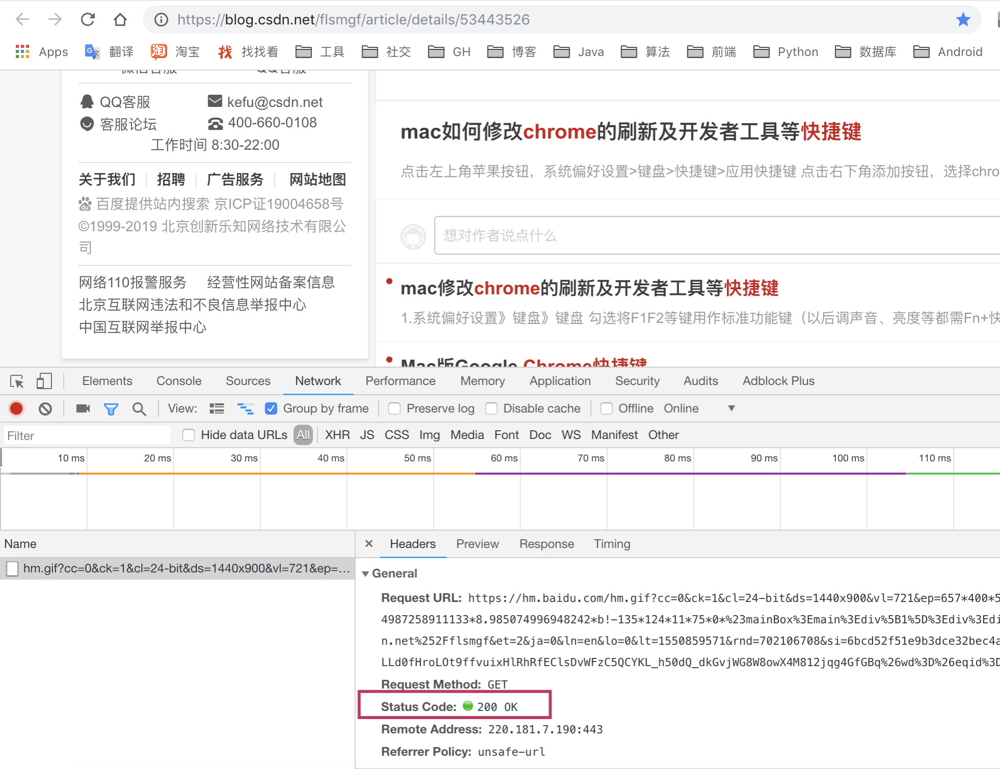

### 定位问题的方法和能力培养

***

##### 这指的是问题的定位的方法和找问题, 识别问题所在的位置, 问题发生的原因, 以及培养解决问题能力的一个经验的汇总

1. 对于方法论不重视，不总结，导致有时候解决问题，没有提纲携领，无头苍蝇一样乱撞。
2. 遇到了问题, 首先要静下心来,不要担心, 坚定解决的信心才是最重要的;

3. 打开Chrome开发者的工具, 点击相关的功能的按钮, 查看URL之中包含的方法, 比如说:https://find.com/getstr?key=100, 比如说这个请求的url, getstr就是我们编写的方法, 那么我们就找到了需要修改的方法.

4. 找到了方法之后, 就可以去修改, 然后需要再去看返回的状态码, 从状态码之中查看是前端还是后端的问题,比如说500, 就是后端的问题. 正常的话, 都是200就是正常的.
  

5. 判断清楚了是前端还是后端的问题, 然后就找相关的日志, 前端的日志, 后端的日志, 基本上最后找出来, 搜索error, 基本上很快速就可以定位出出现问题的文件类,方法具体产生问题的行数.

6. 有的在数据库之中获取不到的相关的字段或者是标志位, 可以大胆的猜想, 是前端获取的问题.

7. 定位问题的时候, *不能一下子就去开启debug调试, 这样往往费时费力, 而且很难快速定位到问题发生的地方*, 这种情况下, 只能跟进, 一步一步的调试, 费力而效果低下, 正确的方式应该是**在日志之中找到问题发生的地方, 然后在发生问题的地方的前后去判断和处理, 如果没有日志, 才去一步一步的调试**, 这也间接说明了日志真的很重要!